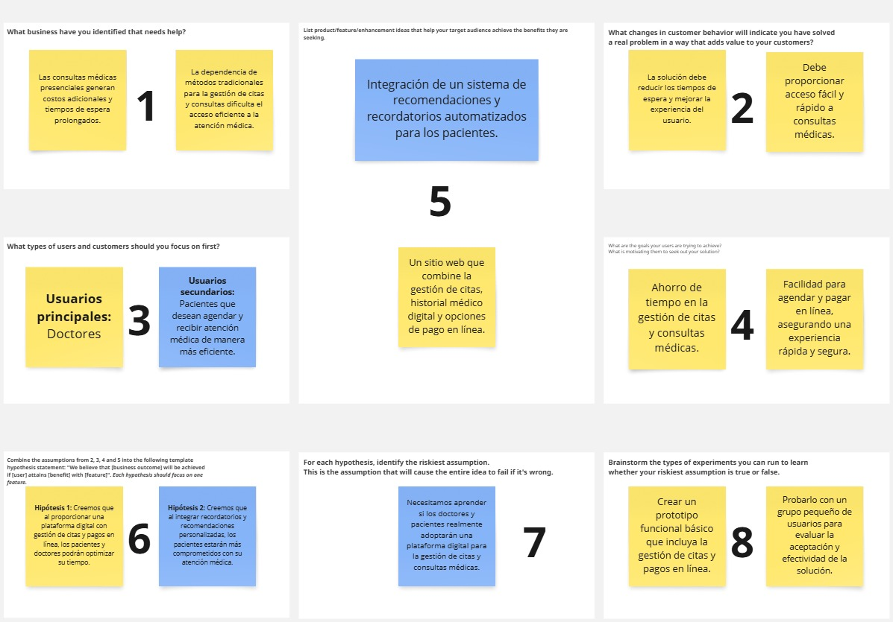

# COURSE PROJECT

---

    <strong>Universidad Peruana de Ciencias Aplicadas (UPC)</strong>     
    </img> 
    <strong>Carrera de Ingeniería de Software - Ciclo V</strong>  
    <strong>DISEÑO - 4370</strong> 
     <strong>Profesor: </strong> 
     <strong>INFORME DEL TRABAJO FINAL</strong> 

    <strong>Startup del Proyecto:ClinicCode </strong> 
    <strong>Producto:Dentify </strong> 

    <h3 align="center">Team Members:</h3>

    <table align="center">
        <tr>
            <th style="text-align:center;">Member</th>
            <th style="text-align:center;">Code</th>
        </tr>
        <tr>
            <td>Aponte Cruzado, Andrea Marielena</td>
            <td>U202224135</td>
        </tr>
        <tr>
            <td>Belahonia Miranda, Fabrisio  </td>
            <td>U202220219</td>
        </tr>
        <tr>
            <td>Bohorquez Lerzundi	Gerardo Sebastian</td>
            <td>U202224149</td>
        </tr>
        <tr>
            <td>Cutiri Agüero	Fabrizio Alexander</td>
            <td>U201914181</td>
        </tr>
        <tr>
            <td>Berrocal Ramirez	Omar Christian</td>
            <td>U20201B529</td>
        </tr>
    </table>
    

 <strong>2025-02</strong>

 

---

# Registro de Versiones del Informe

El objetivo de esta sección es resumir las modificaciones relevantes que se realizan al informe durante el ciclo de vida del proyecto. Esta sección inicia en una página nueva y se incluye un cuadro con la siguiente estructura:

| Versión | Fecha | Autor | Descripción de modificación |
|---------|-------|-------|-----------------------------|
| TB1 | 24/04/2025 | Belahonia Miranda, Fabrisio  | Realización de: - Capítulo I: Presentación - Capítulo II: Requirements Elicitation & Analysis - Capítulo III: Requirements Specification - Capítulo IV: Solution Software Design |

# Project Report Collaboration Insights
---

URL del repositorio para el reporte del proyecto:asdasdasd

TB1:

Para el desarrollo del informe perteneciente a la entrega TB1, se dividió la implementación de secciones de la siguiente forma para cada integrante del equipo:

| Integrante | Tareas Asignadas |
|------------|-----------------|
| Aponte Cruzado, Andrea Marielena | Analisis Competitivo y User Stories |
| Belahonia Miranda, Fabrisio | Entrevistas, Análisis de entrevistas y Needfinding, As to Be escenario, Elaboración de PPT |
| Bohorquez Lerzundi, Gerardo Sebastian | Lean UX, Entrevistas, Análisis de entrevistas y Needfinding, Impact Map |
| Cutiri Agüero, Fabrizio Alexander | Lean UX, User Stories, NeedFinding, Elaboración de PPT |
| Berrocal Ramirez, Omar Christian | Antecedentes y problemática, User and Technical Stories, Product Backlog, Capítulo IV: Solution Software Design, Elaboración de primera versión del BackEnd |

# GitHub Collaboration Insights

GitHub también presenta un timeline de las ramas principales y los procesos de merge a los que se han sometido. Todas las ramas se crearon tomando en cuenta el diseño de GitFlow para una buena organización cuando se usa un software de control de versiones.

Los integrantes son:

- Aponte Cruzado, Andrea Marielena
- Belahonia Miranda, Fabrisio
- Bohorquez Lerzundi, Gerardo Sebastian
- Cutiri Agüero, Fabrizio Alexander
- Berrocal Ramirez, Omar Christian

# Contenido
## Tabla de contenidos
- [**Registro de Versiones del Informe**](#registro-de-versiones-del-informe)
- [**Project Report Collaboration Insights**](#project-report-collaboration-insights)
- [**Contenido**](#contenido)
    - [Tabla de contenidos](#tabla-de-contenidos)
- [**Student Outcome**](#student-outcome)

- [**Capítulo I: Introducción**](#capítulo-i-introducción)
  - [**1.1. Startup Profile**](#11-startup-profile)
    - [**1.1.1. Descripción de la Startup**](#111-descripción-de-la-startup)
    - [**1.1.2. Perfiles de integrantes del equipo**](#112-perfiles-de-integrantes-del-equipo)
  - [**1.2. Solution Profile**](#12-solution-profile)
    - [**1.2.1 Antecedentes y problemática**](#121-antecedentes-y-problemática)
    - [**1.2.2 Lean UX Process**](#122-lean-ux-process)
      - [**1.2.2.1. Lean UX Problem Statements**](#1221-lean-ux-problem-statements)
      - [**1.2.2.2. Lean UX Assumptions**](#1222-lean-ux-assumptions)
      - [**1.2.2.3. Lean UX Hypothesis Statements**](#1223-lean-ux-hypothesis-statements)
      - [**1.2.2.4. Lean UX Canvas**](#1224-lean-ux-canvas)
  - [**1.3. Segmentos objetivo**](#13-segmentos-objetivo)

- [**Capítulo II: Requirements Elicitation & Analysis**](#capítulo-ii-requirements-elicitation--analysis)
  - [**2.1. Competidores**](#21-competidores)
    - [**2.1.1. Análisis competitivo**](#211-análisis-competitivo)
    - [**2.1.2. Estrategias y tácticas frente a competidores**](#212-estrategias-y-tácticas-frente-a-competidores)
  - [**2.2. Entrevistas**](#22-entrevistas)
    - [**2.2.1. Diseño de entrevistas**](#221-diseño-de-entrevistas)
    - [**2.2.2. Registro de entrevistas**](#222-registro-de-entrevistas)
    - [**2.2.3. Análisis de entrevistas**](#223-análisis-de-entrevistas)
  - [**2.3. Needfinding**](#23-needfinding)
    - [**2.3.1. User Personas**](#231-user-personas)
    - [**2.3.2. User Task Matrix**](#232-user-task-matrix)
    - [**2.3.3. User Journey Mapping**](#233-user-journey-mapping)
    - [**2.3.4. Empathy Mapping**](#234-empathy-mapping)
    - [**2.3.5. As-is Scenario Mapping**](#235-as-is-scenario-mapping)
  - [**2.4. Ubiquitous Language**](#24-ubiquitous-language)

- [**Capítulo III: Requirements Specification**](#capítulo-iii-requirements-specification)
  - [**3.1. To-Be Scenario Mapping**](#31-to-be-scenario-mapping)
  - [**3.2. User Stories**](#32-user-stories)
  - [**3.3. Product Backlog**](#33-product-backlog)
  - [**3.4. Impact Mapping**](#34-impact-mapping)
  - [Avance de Conclusiones, Bibliografía y Anexos](#avance-de-conclusiones-bibliografía-y-anexos)

- [**Capítulo IV: Product Design**](#capítulo-iv-product-design)
  - [**4.1. Style Guidelines**](#41-style-guidelines)
    - [**4.1.1. General Style Guidelines**](#411-general-style-guidelines)
    - [**4.1.2. Web Style Guidelines**](#412-web-style-guidelines)
    - [**4.1.3. Mobile Style Guidelines**](#413-mobile-style-guidelines)
      - [**4.1.3.1. iOS Mobile Style Guidelines**](#4131-ios-mobile-style-guidelines)
      - [**4.1.3.2. Android Mobile Style Guidelines**](#4132-android-mobile-style-guidelines)
  - [**4.2. Information Architecture**](#42-information-architecture)
    - [**4.2.1. Organization Systems**](#421-organization-systems)
    - [**4.2.2. Labeling Systems**](#422-labeling-systems)
    - [**4.2.3. SEO Tags and Meta Tags**](#423-seo-tags-and-meta-tags)
    - [**4.2.4. Searching Systems**](#424-searching-systems)
    - [**4.2.5. Navigation Systems**](#425-navigation-systems)
  - [**4.3. Landing Page UI Design**](#43-landing-page-ui-design)
    - [**4.3.1. Landing Page Wireframe**](#431-landing-page-wireframe)
    - [**4.3.2. Landing Page Mock-up**](#432-landing-page-mock-up)
  - [**4.4. Mobile Applications UX/UI Design**](#44-mobile-applications-uxui-design)
    - [**4.4.1. Mobile Applications Wireframes**](#441-mobile-applications-wireframes)
    - [**4.4.2. Mobile Applications Wireflow Diagrams**](#442-mobile-applications-wireflow-diagrams)
    - [**4.4.3. Mobile Applications Mock-ups**](#443-mobile-applications-mock-ups)
    - [**4.4.4. Mobile Applications User Flow Diagrams**](#444-mobile-applications-user-flow-diagrams)
  - [**4.5. Mobile Applications Prototyping**](#45-mobile-applications-prototyping)
    - [**4.5.1. Android Mobile Applications Prototyping**](#451-android-mobile-applications-prototyping)
    - [**4.5.2. iOS Mobile Applications Prototyping**](#452-ios-mobile-applications-prototyping)
  - [**4.6. Web Applications UX/UI Design**](#46-web-applications-uxui-design)
    - [**4.6.1. Web Applications Wireframes**](#461-web-applications-wireframes)
    - [**4.6.2. Web Applications Wireflow Diagrams**](#462-web-applications-wireflow-diagrams)
    - [**4.6.3. Web Applications Mock-ups**](#463-web-applications-mock-ups)
    - [**4.6.4. Web Applications User Flow Diagrams**](#464-web-applications-user-flow-diagrams)
  - [**4.7. Web Applications Prototyping**](#47-web-applications-prototyping)
  - [**4.8. Domain-Driven Software Architecture**](#48-domain-driven-software-architecture)
    - [**4.8.1. Software Architecture Context Diagram**](#481-software-architecture-context-diagram)
    - [**4.8.2. Software Architecture Container Diagrams**](#482-software-architecture-container-diagrams)
    - [**4.8.3. Software Architecture Components Diagrams**](#483-software-architecture-components-diagrams)
  - [**4.9. Software Object-Oriented Design**](#49-software-object-oriented-design)
    - [**4.9.1. Class Diagrams**](#491-class-diagrams)
    - [**4.9.2. Class Dictionary**](#492-class-dictionary)
  - [**4.10. Database Design**](#410-database-design)
    - [**4.10.1. Relational/Non-Relational Database Diagram**](#4101-relationalnon-relational-database-diagram)

- [**Capítulo V: Product Implementation**](#capítulo-v-product-implementation)
  - [**5.1. Software Configuration Management**](#51-software-configuration-management)
    - [**5.1.1. Software Development Environment Configuration**](#511-software-development-environment-configuration)
    - [**5.1.2. Source Code Management**](#512-source-code-management)
    - [**5.1.3. Source Code Style Guide & Conventions**](#513-source-code-style-guide--conventions)
    - [**5.1.4. Software Deployment Configuration**](#514-software-deployment-configuration)
  - [**5.2. Product Implementation & Deployment**](#52-product-implementation--deployment)
    - [**5.2.1. Sprint Backlogs**](#521-sprint-backlogs)
    - [**5.2.2. Implemented Landing Page Evidence**](#522-implemented-landing-page-evidence)
    - [**5.2.3. Implemented Frontend-Web Application Evidence**](#523-implemented-frontend-web-application-evidence)
    - [**5.2.4. Implemented Native-Mobile Application Evidence**](#524-implemented-native-mobile-application-evidence)
    - [**5.2.5. Implemented RESTful API and/or Serverless Backend Evidence**](#525-implemented-restful-api-andor-serverless-backend-evidence)
    - [**5.2.6. RESTful API documentation**](#526-restful-api-documentation)
    - [**5.2.7. Team Collaboration Insights**](#527-team-collaboration-insights)
  - [**5.3. Video About-the-Product**](#53-video-about-the-product)
  - [**Conclusiones**](#conclusiones)
  - [**Bibliografía**](#bibliografía)
  - [**Anexos**](#anexos)

    
# Student Outcome

| Criterio específico | Acciones realizadas                                                                                                                                                                                                                                                                                                                                                                                                                                                                                                                                                                                                                                                                                                                                                                                                                                                                                                                                                                                                                                                                                                                                      | Conclusiones |
|----|----------------------------------------------------------------------------------------------------------------------------------------------------------------------------------------------------------------------------------------------------------------------------------------------------------------------------------------------------------------------------------------------------------------------------------------------------------------------------------------------------------------------------------------------------------------------------------------------------------------------------------------------------------------------------------------------------------------------------------------------------------------------------------------------------------------------------------------------------------------------------------------------------------------------------------------------------------------------------------------------------------------------------------------------------------------------------------------------------------------------------------------------------------|----|
|4.c.1 Reconoce responsabilidad ética y profesional en situaciones de ingeniería de software | **Aponte Cruzado, Andrea Marielena** **Belahonia Miranda, Fabrisio** TB1:Como líder del equipo asumí la responsabilidad ética y profesional en el desarrollo del proyecto, asegurando el respeto a la privacidad de los usuarios, la accesibilidad en el diseño UX/UI y la transparencia en cada etapa del Lean UX. Guié al equipo con roles claros, fomentando la colaboración y el compromiso técnico para garantizar un producto de calidad y confiable.  **Bohorquez Lerzundi, Gerardo Sebastian** **Cutiri Agüero, Fabrizio Alexander** **TB1**    Redacté historias de usuario claras y realistas, asegurando que respondan a las necesidades de los usuarios finales, quienes son los odontólogos.   **Berrocal Ramirez, Omar Christian** **TB1** Procuré adaptar el diseño del landing page, la apliación web y mobile acorde a las necesidades de los usuarios finales para que se reflejen nuestras intenciones de manejar el proyecto de la forma más profesional posible.                                                                                                                                 | **TB1:** El proyecto se desarrolló bajo principios de responsabilidad ética y profesional, priorizando la privacidad y seguridad de los datos, la accesibilidad en el diseño UX/UI y la transparencia en los procesos mediante Lean UX. Además, se garantizó un trabajo organizado y colaborativo dentro del equipo, con roles claros y compromiso técnico, lo que permitió asegurar la calidad del producto y el respeto hacia los futuros usuarios de la aplicación. |
|4.c.2 Emite juicios informados considerando el impacto de las soluciones de ingeniería de software en contextos globales, económicos, ambientales y sociales| **Aponte Cruzado, Andrea Marielena** **Belahonia Miranda, Fabrisio** TB1:Como líder del equipo tomé decisiones considerando impactos sociales, económicos, globales y ambientales. Busqué que la solución generara beneficios reales para los usuarios, fuera sostenible y escalable económicamente, cumpliera estándares internacionales de diseño y contribuyera a reducir el uso de recursos físicos mediante procesos digitales, promoviendo así un desarrollo más responsable y con menor huella ambiental. **Bohorquez Lerzundi, Gerardo Sebastian**  **Cutiri Agüero, Fabrizio Alexander**  **TB1**     Organicé el product backlog de manera que se entreguen primero las funcionalidades de mayor impacto para los odontólogos. Para ello, me apoye de las entrevistas realizadas, con el objetivo de tomar desiciones bien informadas   **Berrocal Ramirez, Omar Christian** **TB1** Investigué los antecedente de la problemática para  plantear una solución acorde a nuestro entorno local. Para ello tuve que ver como se comporta el publico objetivo en un contexto global y un contexto local. | **TB1:** Las decisiones del proyecto se tomaron considerando impactos sociales, económicos, globales y ambientales. La solución busca mejorar la calidad de vida de los usuarios, promover la sostenibilidad y escalabilidad del modelo de negocio, cumplir con estándares internacionales de diseño y accesibilidad, y contribuir a la reducción de recursos físicos mediante la digitalización de procesos. De este modo, se asegura un desarrollo responsable que responde a las necesidades actuales y futuras de distintos contextos.|

# Capítulo I: Introducción

## 1.1. Startup Profile

En esta sección se presenta la descripción del startup y los perfiles de los miembros del equipo.

### 1.1.1. Descripción de la Startup

**ClinicCode**: es una startup tecnológica enfocada en revolucionar la forma en que los consultorios dentales administran sus actividades diarias. Su producto Dentify es una aplicación móvil completa, creada específicamente para cubrir todas las necesidades de gestión en el ámbito odontológico.

**Misión**: Simplificar y optimizar la administración de los consultorios dentales, permitiendo que los profesionales se enfoquen en lo más importante: la salud y el bienestar de sus pacientes.

**Visión**: Ser la plataforma de referencia en la gestión de consultorios dentales en Lima, liderando el proceso de digitalización en el sector odontológico.

**Valores**:

* Compromiso con la calidad y la excelencia

*  Innovación continua

* Responsabilidad social

### 1.1.2. Perfiles de integrantes del equipo

|                           Photo                           | Description                                                                                                                                                                                                                                                                                                                                                                                                                 |
|:---------------------------------------------------------:|:----------------------------------------------------------------------------------------------------------------------------------------------------------------------------------------------------------------------------------------------------------------------------------------------------------------------------------------------------------------------------------------------------------------------------|
|                | **Nombre y Apellido:**     **Carrera:** Ingeniería de Software (8vo ciclo)   **Acerca de:**  .                                                                                                                                                                                                                                                                                                                        |
|                                 | **Nombre y Apellido:** Fabrisio Belahonia Miranda   **Carrera:** Ingeniería de Software (7mo ciclo)   **Acerca de:** Voy cursando el 7to ciclo de mi carrera, y me considero una persona responsable, ordenado, empático. Me interesa el área de Ciberseguridad y tengo experiencia con Linux, Redes, Cloud, etc** .                                                                                                  |
|  | **Nombre y Apellido:** Fabrizio Alexander Cutiri Agüero    **Carrera:** Ingeniería de Software (8to ciclo)   **Acerca de:** Me considero una persona responsable, puntual y capaz de adaptarse a diferentes situaciones. Elegí esta carrera porque me apasiona la tecnología y disfruto diseñar y desarrollar aplicaciones innovadoras que ayuden a las personas y empresas a solucionar sus problemas.               |
|         | **Nombre y Apellido:** Sebastian Escobar Palomino    **Carrera:** Ingeniería de Software   **Acerca de:** Me como.                                                                                                                                                                                                                                                                                                    |
|                           | **Nombre y Apellido:** Omar Christian Berrocal Ramirez   **Carrera:** Ingeniería de Software   **Acerca de:** Me considero una persona capaz de lograr sus metas y objetivos con el enfoque correcto y mucha disciplina. Elegí esta carrera porque desde la infancia tuve intección con la tecnología y me gusta descubrir nuevas cosas respecto a esta. |

## 1.2. Solution Profile

### 1.2.1. Antecedentes y problemática

**Antecedentes:**

La adopción de tecnologías digitales ha transformado significativamente la gestión de pacientes en los consultorios dentales, mejorando procesos como la programación de citas, la actualización de historiales clínicos y la comunicación entre profesionales y pacientes. En el Perú, la salud digital aún no está plenamente consolidada, aunque muestra un avance sostenido.

De acuerdo con el INEI (2022), el 72.7 % de la población tenía acceso a internet en 2022, frente al 64.5 % en 2020. Este incremento refleja un escenario favorable para impulsar la digitalización en los consultorios dentales, facilitando una gestión más ágil, accesible y alineada con las necesidades actuales de los pacientes.

Por su parte, Osiptel (2022) indica que el uso de dispositivos móviles creció alrededor de un 10 % en 2021, considerando que en 2016 el 78 % de la población ya contaba con teléfono móvil. Estos datos evidencian una clara tendencia hacia la digitalización en la sociedad peruana y refuerzan la conexión entre el uso de dispositivos móviles y el acceso a internet.

**Problemática**

Pese a estos avances, muchos consultorios y clínicas dentales —sobre todo los más pequeños— continúan gestionando sus operaciones con métodos manuales o sistemas obsoletos. Esto provoca errores en la programación de citas, pérdida de información clínica y una experiencia deficiente para los pacientes. Además, la falta de capacitación en el uso de herramientas digitales y la percepción de que son costosas y difíciles de implementar limitan su adopción. Como resultado, la eficiencia operativa y la calidad del servicio se ven comprometidas.

**Análisis del problema (5W + 2H)**

**WHAT (Qué):**
El problema principal es la gestión ineficiente de los consultorios dentales, lo que ocasiona fallas en la programación de citas, pérdida de historiales médicos, extravío de documentos financieros y demoras en la atención, afectando la experiencia del paciente.

**WHEN (Cuándo):**
Este problema ocurre en todas las etapas de la atención, desde la reserva de la cita hasta el seguimiento posterior al tratamiento, siendo más crítico en periodos de alta demanda o con múltiples pacientes simultáneos.

**WHERE (Dónde):**
Surge en los consultorios dentales que aún dependen de procesos manuales o sistemas desactualizados para manejar la información y las operaciones diarias.

**WHO (Quién):**
Afecta a odontólogos y personal administrativo —que en muchos casos son los propios dueños—, quienes enfrentan dificultades en la organización y gestión de datos. Indirectamente impacta también a los pacientes, al recibir un servicio desordenado y poco eficiente.

**WHY (Por qué):**
La causa principal es la baja adopción de soluciones digitales modernas, motivada por la percepción de altos costos, la falta de capacitación y la resistencia al cambio de algunos profesionales.

**HOW (Cómo):**
La dependencia de métodos tradicionales, junto con la escasa inversión en tecnología y formación, ha dejado a muchos consultorios sin la capacidad de responder adecuadamente a las demandas actuales del sector.

**HOW MUCH (Cuánto):**
El impacto es significativo: disminuye la eficiencia operativa, reduce la satisfacción del paciente y afecta la rentabilidad del negocio. Los consultorios que operan con sistemas poco efectivos corren el riesgo de perder pacientes, reputación y asumir mayores costos derivados de errores y procesos ineficientes.

### 1.2.2. Lean UX Process

#### 1.2.2.1. Lean UX Problem Statements

Hoy en día, los consultorios dentales enfrentan el desafío de administrar de forma centralizada y eficiente sus operaciones cotidianas, como la programación de citas, la gestión de historiales clínicos y la implementación de pagos en línea. Este reto cobra mayor relevancia en un escenario donde la digitalización se ha convertido en un factor esencial para mejorar la experiencia del paciente y optimizar tanto el tiempo como los recursos de los profesionales odontológicos.

Sin embargo, gran parte de los consultorios continúa utilizando métodos tradicionales y desarticulados para organizar sus procesos, lo que provoca ineficiencias que afectan tanto a pacientes como a especialistas. La falta de una solución digital integral complica la coordinación de citas, el acceso rápido a historiales clínicos y la automatización de los pagos, generando un impacto negativo en la satisfacción del paciente y en la productividad del consultorio.

Ante ello, surge la pregunta: **¿Cómo diseñar una plataforma web integral, intuitiva y fácil de usar que optimice la gestión de los consultorios dentales, permitiendo a los profesionales enfocarse en brindar una atención de calidad mientras se eleva la experiencia del paciente gracias a la digitalización y automatización de tareas clave?**

#### 1.2.2.2. Lean UX Assumptions

**Business Assumptions**

Consideramos que nuestros clientes necesitan una solución más eficiente para la gestión de citas, historiales clínicos y pagos en línea.
Estas necesidades pueden atenderse mediante una aplicación móvil integral que permita administrar pacientes, registrar historiales clínicos, reservar citas y verificar pagos de manera centralizada.

Nuestros principales clientes son odontólogos que gestionan sus propios consultorios y que buscan ofrecer un servicio moderno, eficiente y cómodo a sus pacientes.
El valor fundamental que esperan de nuestro servicio es la efectividad en la gestión de su consultorio, utilizando herramientas que optimicen su experiencia.

Además, podrán acceder a beneficios adicionales a través de planes de suscripción con soporte continuo y especializado, que incluirán funciones avanzadas como el modo offline para mayor flexibilidad.

La captación de clientes se realizará principalmente mediante estrategias de marketing digital y alianzas estratégicas con asociaciones de odontólogos, lo que nos permitirá ampliar nuestra red de contactos y aumentar la visibilidad de la aplicación.

El modelo de negocio estará basado en suscripciones, que ofrecerán a los clientes mayores facilidades para organizar su consultorio de manera eficiente.

Nuestra competencia directa son otras aplicaciones móviles para la gestión de consultorios dentales; sin embargo, muchas de ellas carecen de integración completa o presentan interfaces poco intuitivas.
Superaremos a la competencia gracias al uso de tecnologías modernas, un enfoque en la mejora continua de la experiencia del usuario (dentistas y pacientes) y un servicio de soporte constante.

El principal riesgo identificado es la resistencia al cambio de parte de algunos dentistas que prefieren mantener métodos tradicionales de gestión.
Para mitigar este riesgo, ofreceremos demostraciones del software y un soporte cercano y personalizado, facilitando así una rápida adaptación a la plataforma.

**Assumptions Worksheet**

* **¿Quién es el usuario?** Dentistas que administran sus propios consultorios y buscan una aplicación moderna y eficiente para optimizar su gestión diaria.

* **¿Dónde encaja nuestro producto en su trabajo o vida?** La aplicación móvil se integra en la rutina de los odontólogos, permitiéndoles organizar citas, acceder a historiales clínicos y gestionar pagos. Además, ofrece la función offline, útil en situaciones sin conexión a internet.

* **¿Qué problemas tiene nuestro producto que debe resolver?** La principal dificultad es la adopción de nuevas tecnologías, ya que algunos profesionales muestran resistencia al uso de plataformas digitales para la gestión de información.

* **¿Cuándo y cómo se usa el producto?** Su uso es diario, en actividades como la programación de citas, la revisión de historiales médicos y la facturación de pagos.

* **¿Qué características son importantes?**

    * Accesibilidad desde distintos dispositivos móviles.

    * Integración con sistemas de pago.

    * Interfaz amigable e intuitiva.

* **¿Cómo debe verse y comportarse el producto?** La aplicación debe transmitir una imagen profesional, limpia y confiable, alineada con el sector salud. Además, debe ser rápida, intuitiva y sencilla de navegar, garantizando una experiencia fluida para el usuario.

#### 1.2.2.3. Lean UX Hypothesis Statements

* Creemos que, al incorporar nuevas herramientas para la gestión de citas, historiales clínicos y pagos en línea, se incrementará la eficiencia de los consultorios y mejorará la experiencia de los pacientes. Sabremos que hemos alcanzado este objetivo cuando logremos evidenciar una mejor organización en la programación de citas y en la facturación de pagos.

* Creemos que, al implementar la generación automática de facturas, el proceso de facturación será más ágil y sencillo. Sabremos que estamos cumpliendo con este propósito cuando logremos reducir en más de un 80 % el tiempo destinado a la emisión de facturas.

* Creemos que, al añadir un modo offline, se facilitará el uso de la aplicación para la visualización de estadísticas y la gestión de citas sin necesidad de conexión a internet. Sabremos que alcanzamos este objetivo cuando se reduzcan significativamente los problemas de conectividad, especialmente en zonas con acceso limitado a la red.

#### 1.2.2.4. Lean UX Canvas

## 1.3. Segmentos objetivo

En esta sección se describen los perfiles específicos del público objetivo de nuestro producto. Estos grupos comparten características demográficas, conductuales y motivacionales que los diferencian de otros segmentos del mercado, lo que permite diseñar estrategias más precisas para atender sus necesidades.

* **Segmento demográfico**: Odontólogos con ingresos medios, con la capacidad de invertir en herramientas y sistemas que optimicen la gestión de sus pacientes.

* **Segmento geográfico**: Profesionales que ejercen en zonas urbanas y cuentan con una base considerable de pacientes.

* **Segmento psicográfico**: Dentistas interesados en modernizar sus prácticas y ofrecer un servicio de mayor calidad a sus pacientes.

* **Segmento conductual**: Profesionales que buscan soluciones digitales que les permitan optimizar la programación y gestión de citas.

# Capítulo II: Requirements Elicitation & Analysis

## 2.1. Competidores

### 2.1.1. Análisis competitivo

### 2.1.2. Estrategias y tácticas frente a competidores

## 2.2. Entrevistas

### 2.2.1. Diseño de entrevistas

### 2.2.2. Registro de entrevistas

### 2.2.3. Análisis de entrevistas

## 2.3. Needfinding

### 2.3.1. User Personas

### 2.3.2. User Task Matrix

### 2.3.3. User Journey Mapping

### 2.3.4. Empathy Mapping

### 2.3.5. As-is Scenario Mapping

## 2.4. Ubiquitous Language

# Capítulo III: Requirements Specification

## 3.1. To-Be Scenario Mapping

## 3.2. User Stories

## 3.3. Product Backlog

## 3.4. Impact Mapping

# Capítulo IV: Product Design

## 4.1. Style Guidelines

### 4.1.1. General Style Guidelines

### 4.1.2. Web Style Guidelines

### 4.1.3. Mobile Style Guidelines

#### 4.1.3.1. iOS Mobile Style Guidelines

#### 4.1.3.2. Android Mobile Style Guidelines

## 4.2. Information Architecture

### 4.2.1. Organization Systems

### 4.2.2. Labeling Systems

### 4.2.3. SEO Tags and Meta Tags

### 4.2.4. Searching Systems

### 4.2.5. Navigation Systems

## 4.3. Landing Page UI Design

### 4.3.1. Landing Page Wireframe

### 4.3.2. Landing Page Mock-up

## 4.4. Mobile Applications UX/UI Design

### 4.4.1. Mobile Applications Wireframes

### 4.4.2. Mobile Applications Wireflow Diagrams

### 4.4.3. Mobile Applications Mock-ups

### 4.4.4. Mobile Applications User Flow Diagrams

## 4.5. Mobile Applications Prototyping

### 4.5.1. Android Mobile Applications Prototyping

### 4.5.2. iOS Mobile Applications Prototyping

## 4.6. Web Applications UX/UI Design

### 4.6.1. Web Applications Wireframes

### 4.6.2. Web Applications Wireflow Diagrams

### 4.6.3. Web Applications Mock-ups

### 4.6.4. Web Applications User Flow Diagrams

## 4.7. Web Applications Prototyping

## 4.8. Domain-Driven Software Architecture

### 4.8.1. Software Architecture Context Diagram

### 4.8.2. Software Architecture Container Diagrams

### 4.8.3. Software Architecture Components Diagrams

## 4.9. Software Object-Oriented Design

### 4.9.1. Class Diagrams

### 4.9.2. Class Dictionary

## 4.10. Database Design

### 4.10.1. Relational/Non-Relational Database Diagram

# Capítulo V: Product Implementation

## 5.1. Software Configuration Management

### 5.1.1. Software Development Environment Configuration

### 5.1.2. Source Code Management

### 5.1.3. Source Code Style Guide & Conventions

### 5.1.4. Software Deployment Configuration

## 5.2. Product Implementation & Deployment

### 5.2.1. Sprint Backlogs

### 5.2.2. Implemented Landing Page Evidence

### 5.2.3. Implemented Frontend-Web Application Evidence

### 5.2.4. Implemented Native-Mobile Application Evidence

### 5.2.5. Implemented RESTful API and/or Serverless Backend Evidence

### 5.2.6. RESTful API documentation

### 5.2.7. Team Collaboration Insights

## 5.3. Video About-the-Product

# Conclusiones

# Bibliografía

# Anexos
