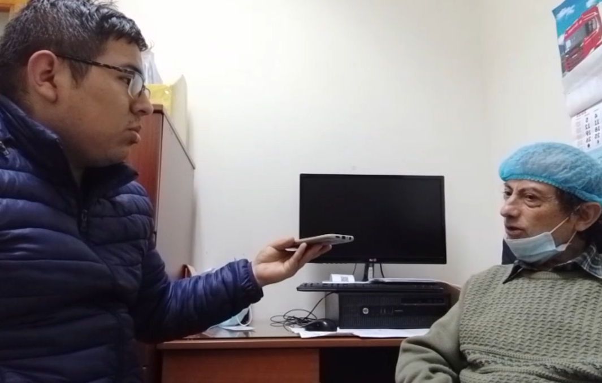
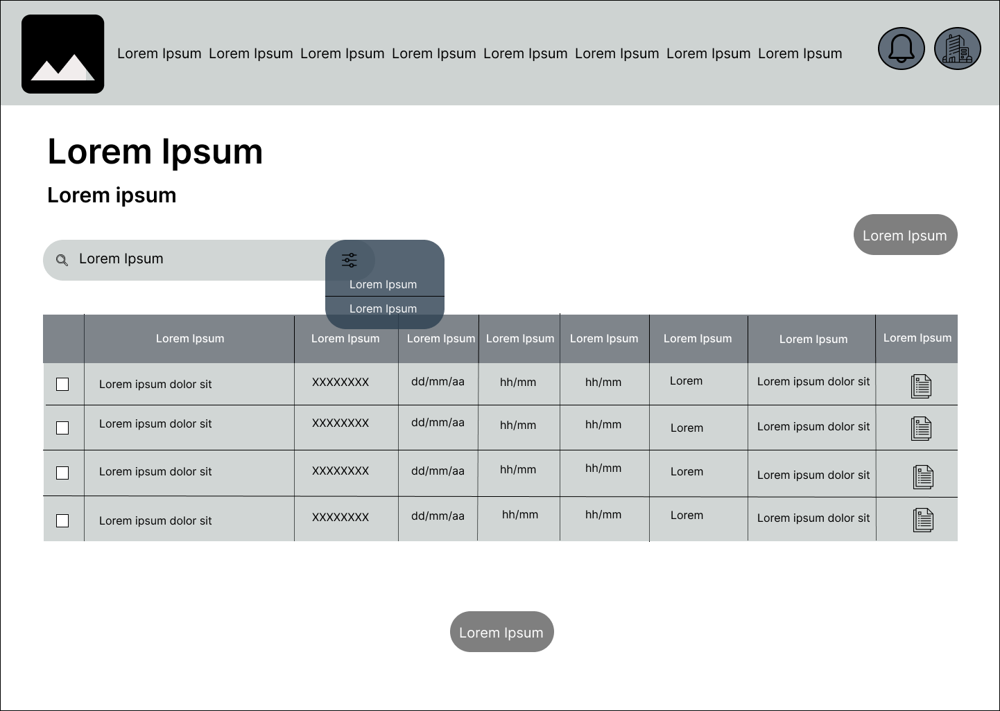
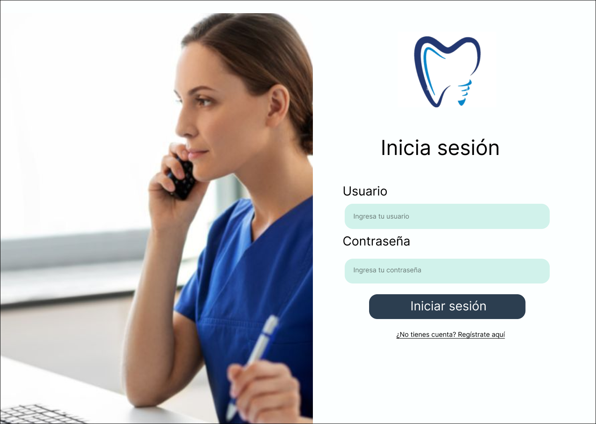
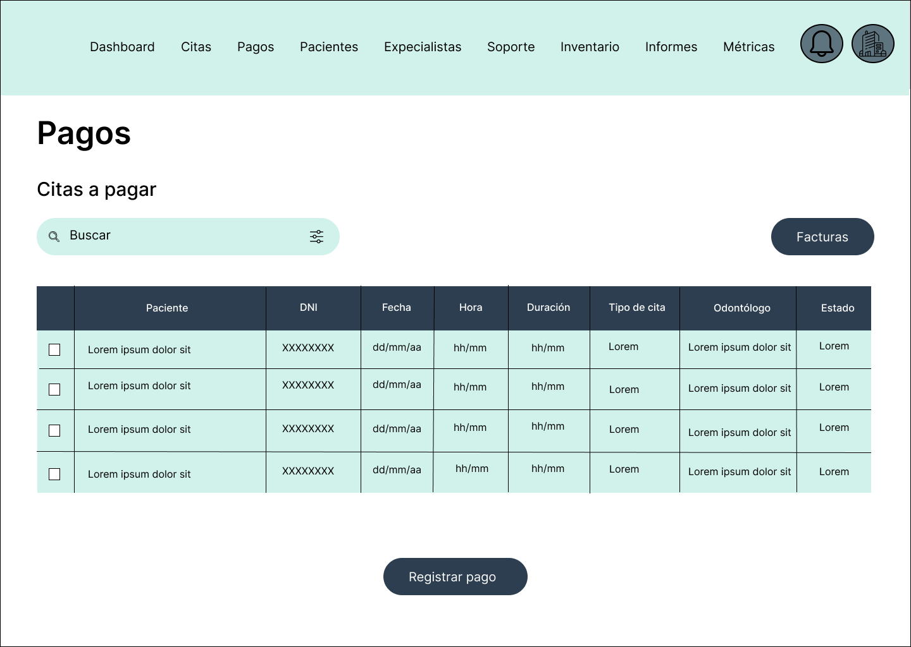

# COURSE PROJECT

---

<p align="center">
    <strong>Universidad Peruana de Ciencias Aplicadas (UPC)</strong><br>    
    </img><br>
    <strong>Carrera de Ingeniería de Software - Ciclo V</strong><br><br>
    <strong>DISEÑO - 4370</strong><br>
    <br><strong>Profesor: </strong><br>
    <br><strong>INFORME DEL TRABAJO FINAL</strong><br>
</p>

<p align="center">
    <strong>Startup del Proyecto:ClinicCode </strong><br>
    <strong>Producto:Dentify </strong><br>
</p>

<div>
    <h3 align="center">Team Members:</h3>
</div>

<div>
    <table align="center">
        <tr>
            <th style="text-align:center;">Member</th>
            <th style="text-align:center;">Code</th>
        </tr>
        <tr>
            <td>Aponte Cruzado, Andrea Marielena</td>
            <td>U202224135</td>
        </tr>
        <tr>
            <td>Belahonia Miranda, Fabrisio  </td>
            <td>U202220219</td>
        </tr>
        <tr>
            <td>Bohorquez Lerzundi	Gerardo Sebastian</td>
            <td>U202224149</td>
        </tr>
        <tr>
            <td>Cutiri Agüero	Fabrizio Alexander</td>
            <td>U201914181</td>
        </tr>
        <tr>
            <td>Berrocal Ramirez	Omar Christian</td>
            <td>U20201B529</td>
        </tr>
    </table>
    </div>

<p align="center">
<br><strong>2025-02</strong></p>
<br>

---

# Registro de Versiones del Informe

El objetivo de esta sección es resumir las modificaciones relevantes que se realizan al informe durante el ciclo de vida del proyecto. Esta sección inicia en una página nueva y se incluye un cuadro con la siguiente estructura:

| Versión | Fecha | Autor | Descripción de modificación |
|---------|-------|-------|-----------------------------|
| TB1 | 24/04/2025 | Belahonia Miranda, Fabrisio  | Realización de:<br>- Capítulo I: Presentación<br>- Capítulo II: Requirements Elicitation & Analysis<br>- Capítulo III: Requirements Specification<br>- Capítulo IV: Solution Software Design |

# Project Report Collaboration Insights
---

URL del repositorio para el reporte del proyecto:asdasdasd


TB1:

Para el desarrollo del informe perteneciente a la entrega TB1, se dividió la implementación de secciones de la siguiente forma para cada integrante del equipo:

| Integrante | Tareas Asignadas |
|------------|-----------------|
| Aponte Cruzado, Andrea Marielena | Analisis Competitivo y User Stories |
| Belahonia Miranda, Fabrisio | Entrevistas, Análisis de entrevistas y Needfinding, As to Be escenario, Elaboración de PPT |
| Bohorquez Lerzundi, Gerardo Sebastian | Lean UX, Entrevistas, Análisis de entrevistas y Needfinding, Impact Map |
| Cutiri Agüero, Fabrizio Alexander | Lean UX, User Stories, NeedFinding, Elaboración de PPT |
| Berrocal Ramirez, Omar Christian | Antecedentes y problemática, User and Technical Stories, Product Backlog, Capítulo IV: Solution Software Design, Elaboración de primera versión del BackEnd |

# GitHub Collaboration Insights

GitHub también presenta un timeline de las ramas principales y los procesos de merge a los que se han sometido. Todas las ramas se crearon tomando en cuenta el diseño de GitFlow para una buena organización cuando se usa un software de control de versiones.

Los integrantes son:

- Aponte Cruzado, Andrea Marielena
- Belahonia Miranda, Fabrisio
- Bohorquez Lerzundi, Gerardo Sebastian
- Cutiri Agüero, Fabrizio Alexander
- Berrocal Ramirez, Omar Christian

# Contenido
## Tabla de contenidos
- [COURSE PROJECT](#course-project)
- [Registro de Versiones del Informe](#registro-de-versiones-del-informe)
- [Project Report Collaboration Insights](#project-report-collaboration-insights)
- [GitHub Collaboration Insights](#github-collaboration-insights)
- [Contenido](#contenido)
  - [Tabla de contenidos](#tabla-de-contenidos)
- [Student Outcome](#student-outcome)
- [Capítulo I: Introducción](#capítulo-i-introducción)
  - [1.1. Startup Profile](#11-startup-profile)
    - [1.1.1. Descripción de la Startup](#111-descripción-de-la-startup)
    - [1.1.2. Perfiles de integrantes del equipo](#112-perfiles-de-integrantes-del-equipo)
  - [1.2. Solution Profile](#12-solution-profile)
    - [1.2.1. Antecedentes y problemática](#121-antecedentes-y-problemática)
    - [1.2.2. Lean UX Process](#122-lean-ux-process)
      - [1.2.2.1. Lean UX Problem Statements](#1221-lean-ux-problem-statements)
      - [1.2.2.2. Lean UX Assumptions](#1222-lean-ux-assumptions)
      - [1.2.2.3. Lean UX Hypothesis Statements](#1223-lean-ux-hypothesis-statements)
      - [1.2.2.4. Lean UX Canvas](#1224-lean-ux-canvas)
  - [1.3. Segmentos objetivo](#13-segmentos-objetivo)
- [Capítulo II: Requirements Elicitation \& Analysis](#capítulo-ii-requirements-elicitation--analysis)
  - [2.1. Competidores](#21-competidores)
    - [2.1.1. Análisis competitivo](#211-análisis-competitivo)
    - [2.1.2. Estrategias y tácticas frente a competidores](#212-estrategias-y-tácticas-frente-a-competidores)
  - [2.2. Entrevistas](#22-entrevistas)
    - [2.2.1. Diseño de entrevistas](#221-diseño-de-entrevistas)
    - [2.2.2. Registro de entrevistas](#222-registro-de-entrevistas)
    - [2.2.3. Análisis de entrevistas](#223-análisis-de-entrevistas)
  - [2.3. Needfinding](#23-needfinding)
    - [2.3.1. User Personas](#231-user-personas)
    - [2.3.2. User Task Matrix](#232-user-task-matrix)
    - [2.3.3. User Journey Mapping](#233-user-journey-mapping)
    - [2.3.4. Empathy Mapping](#234-empathy-mapping)
    - [2.3.5. As-is Scenario Mapping](#235-as-is-scenario-mapping)
  - [2.4. Ubiquitous Language](#24-ubiquitous-language)
- [Capítulo III: Requirements Specification](#capítulo-iii-requirements-specification)
  - [3.1. To-Be Scenario Mapping](#31-to-be-scenario-mapping)
  - [3.2. User Stories](#32-user-stories)
  - [3.3. Product Backlog](#33-product-backlog)
  - [3.4. Impact Mapping](#34-impact-mapping)
- [Capítulo IV: Product Design](#capítulo-iv-product-design)
  - [4.1. Style Guidelines](#41-style-guidelines)
    - [4.1.1. General Style Guidelines](#411-general-style-guidelines)
    - [4.1.2. Web Style Guidelines](#412-web-style-guidelines)
    - [4.1.3. Mobile Style Guidelines](#413-mobile-style-guidelines)
      - [4.1.3.1. iOS Mobile Style Guidelines](#4131-ios-mobile-style-guidelines)
      - [4.1.3.2. Android Mobile Style Guidelines](#4132-android-mobile-style-guidelines)
  - [4.2. Information Architecture](#42-information-architecture)
    - [4.2.1. Organization Systems](#421-organization-systems)
    - [4.2.2. Labeling Systems](#422-labeling-systems)
    - [4.2.3. SEO Tags and Meta Tags](#423-seo-tags-and-meta-tags)
    - [4.2.4. Searching Systems](#424-searching-systems)
    - [4.2.5. Navigation Systems](#425-navigation-systems)
  - [4.3. Landing Page UI Design](#43-landing-page-ui-design)
    - [4.3.1. Landing Page Wireframe](#431-landing-page-wireframe)
    - [4.3.2. Landing Page Mock-up](#432-landing-page-mock-up)
  - [4.4. Mobile Applications UX/UI Design](#44-mobile-applications-uxui-design)
    - [4.4.1. Mobile Applications Wireframes](#441-mobile-applications-wireframes)
  - [Autenticación](#autenticación)
  - [Menú principal](#menú-principal)
  - [Gestión de citas](#gestión-de-citas)
  - [Gestión de pacientes](#gestión-de-pacientes)
  - [Inventario](#inventario)
  - [Pagos](#pagos)
    - [4.4.2. Mobile Applications Wireflow Diagrams](#442-mobile-applications-wireflow-diagrams)
    - [4.4.3. Mobile Applications Mock-ups](#443-mobile-applications-mock-ups)
  - [Autenticación](#autenticación-1)
  - [Menú principal](#menú-principal-1)
  - [Gestión de Citas](#gestión-de-citas-1)
  - [Gestión de Pacientes](#gestión-de-pacientes-1)
  - [Gestión de Inventario](#gestión-de-inventario)
  - [Pagos](#pagos-1)
    - [4.4.4. Mobile Applications User Flow Diagrams](#444-mobile-applications-user-flow-diagrams)
  - [User Goal: Actualizar datos](#user-goal-actualizar-datos)
  - [User Goal: Cita](#user-goal-cita)
  - [User Goal: Inventario](#user-goal-inventario)
  - [User Goal: Paciente](#user-goal-paciente)
  - [User Goal: Pagos](#user-goal-pagos)
  - [User Goal: Registro](#user-goal-registro)
  - [4.5. Mobile Applications Prototyping](#45-mobile-applications-prototyping)
    - [4.5.1. Android Mobile Applications Prototyping](#451-android-mobile-applications-prototyping)
    - [4.5.2. iOS Mobile Applications Prototyping](#452-ios-mobile-applications-prototyping)
  - [4.6. Web Applications UX/UI Design](#46-web-applications-uxui-design)
    - [4.6.1. Web Applications Wireframes](#461-web-applications-wireframes)
    - [4.6.2. Web Applications Wireflow Diagrams](#462-web-applications-wireflow-diagrams)
    - [4.6.3. Web Applications Mock-ups](#463-web-applications-mock-ups)
    - [4.6.4. Web Applications User Flow Diagrams](#464-web-applications-user-flow-diagrams)
  - [User Goal: Actualizar datos](#user-goal-actualizar-datos-1)
  - [User Goal: Cita](#user-goal-cita-1)
  - [User Goal: Inventario](#user-goal-inventario-1)
  - [User Goal: Paciente](#user-goal-paciente-1)
  - [User Goal: Pagos](#user-goal-pagos-1)
  - [User Goal: Registro](#user-goal-registro-1)
  - [4.7. Web Applications Prototyping](#47-web-applications-prototyping)
  - [4.8. Domain-Driven Software Architecture](#48-domain-driven-software-architecture)
    - [4.8.1. Software Architecture Context Diagram](#481-software-architecture-context-diagram)
    - [4.8.2. Software Architecture Container Diagrams](#482-software-architecture-container-diagrams)
    - [4.8.3. Software Architecture Components Diagrams](#483-software-architecture-components-diagrams)
  - [4.9. Software Object-Oriented Design](#49-software-object-oriented-design)
    - [4.9.1. Class Diagrams](#491-class-diagrams)
    - [4.9.2. Class Dictionary](#492-class-dictionary)
  - [4.10. Database Design](#410-database-design)
    - [4.10.1. Relational/Non-Relational Database Diagram](#4101-relationalnon-relational-database-diagram)
- [Capítulo V: Product Implementation](#capítulo-v-product-implementation)
  - [5.1. Software Configuration Management](#51-software-configuration-management)
    - [5.1.1. Software Development Environment Configuration](#511-software-development-environment-configuration)
    - [5.1.2. Source Code Management](#512-source-code-management)
    - [5.1.3. Source Code Style Guide \& Conventions](#513-source-code-style-guide--conventions)
    - [5.1.4. Software Deployment Configuration](#514-software-deployment-configuration)
  - [5.2. Product Implementation \& Deployment](#52-product-implementation--deployment)
    - [5.2.1. Sprint Backlogs](#521-sprint-backlogs)
    - [5.2.2. Implemented Landing Page Evidence](#522-implemented-landing-page-evidence)
    - [5.2.3. Implemented Frontend-Web Application Evidence](#523-implemented-frontend-web-application-evidence)
    - [5.2.4. Implemented Native-Mobile Application Evidence](#524-implemented-native-mobile-application-evidence)
    - [5.2.5. Implemented RESTful API and/or Serverless Backend Evidence](#525-implemented-restful-api-andor-serverless-backend-evidence)
    - [5.2.6. RESTful API documentation](#526-restful-api-documentation)
    - [5.2.7. Team Collaboration Insights](#527-team-collaboration-insights)
  - [5.3. Video About-the-Product](#53-video-about-the-product)
- [Conclusiones](#conclusiones)
- [Bibliografía](#bibliografía)
- [Anexos](#anexos)


    
# Student Outcome

| Criterio específico | Acciones realizadas                                                                                                                                                                                                                                                                                                                                                                                                                                                                                                                                                                                                                                                                                                                                                                                                                                                                                                     | Conclusiones |
|----|-------------------------------------------------------------------------------------------------------------------------------------------------------------------------------------------------------------------------------------------------------------------------------------------------------------------------------------------------------------------------------------------------------------------------------------------------------------------------------------------------------------------------------------------------------------------------------------------------------------------------------------------------------------------------------------------------------------------------------------------------------------------------------------------------------------------------------------------------------------------------------------------------------------------------|----|
|4.c.1 Reconoce responsabilidad ética y profesional en situaciones de ingeniería de software | **Aponte Cruzado, Andrea Marielena**<br>**Belahonia Miranda, Fabrisio**<br>TB1:Como líder del equipo asumí la responsabilidad ética y profesional en el desarrollo del proyecto, asegurando el respeto a la privacidad de los usuarios, la accesibilidad en el diseño UX/UI y la transparencia en cada etapa del Lean UX. Guié al equipo con roles claros, fomentando la colaboración y el compromiso técnico para garantizar un producto de calidad y confiable. <br>**Bohorquez Lerzundi, Gerardo Sebastian**<br> **TB1**: En el proyecto mostré responsabilidad ética al aplicar Lean UX, entrevistas y análisis, asegurando un uso adecuado de la información de los usuarios. Además, en el despliegue del backend, base de datos y mobile, mantuve el compromiso profesional con la calidad y funcionamiento del sistema.  <br>**Cutiri Agüero, Fabrizio Alexander**<br>**TB1** <br><br> Redacté historias de usuario claras y realistas, asegurando que respondan a las necesidades de los usuarios finales, quienes son los odontólogos. <br><br>**Berrocal Ramirez, Omar Christian**                                                                                                                                             | **TB1:** El proyecto se desarrolló bajo principios de responsabilidad ética y profesional, priorizando la privacidad y seguridad de los datos, la accesibilidad en el diseño UX/UI y la transparencia en los procesos mediante Lean UX. Además, se garantizó un trabajo organizado y colaborativo dentro del equipo, con roles claros y compromiso técnico, lo que permitió asegurar la calidad del producto y el respeto hacia los futuros usuarios de la aplicación. |
|4.c.2 Emite juicios informados considerando el impacto de las soluciones de ingeniería de software en contextos globales, económicos, ambientales y sociales| **Aponte Cruzado, Andrea Marielena**<br>**Belahonia Miranda, Fabrisio**<br>TB1:Como líder del equipo tomé decisiones considerando impactos sociales, económicos, globales y ambientales. Busqué que la solución generara beneficios reales para los usuarios, fuera sostenible y escalable económicamente, cumpliera estándares internacionales de diseño y contribuyera a reducir el uso de recursos físicos mediante procesos digitales, promoviendo así un desarrollo más responsable y con menor huella ambiental.<br>**Bohorquez Lerzundi, Gerardo Sebastian**<br>**TB1:** Aporté en el repositorio colaborativo para integrar versiones web y mobile, tomando decisiones técnicas que optimizan recursos y favorecen el trabajo en equipo. Con ello, consideré el impacto de nuestras soluciones en la productividad y accesibilidad del sistema.<br>**Cutiri Agüero, Fabrizio Alexander**<br><br>**TB1** <br><br>  Organicé el product backlog de manera que se entreguen primero las funcionalidades de mayor impacto para los odontólogos. Para ello, me apoye de las entrevistas realizadas, con el objetivo de tomar desiciones bien informadas <br><br>**Berrocal Ramirez, Omar Christian** | **TB1:** Las decisiones del proyecto se tomaron considerando impactos sociales, económicos, globales y ambientales. La solución busca mejorar la calidad de vida de los usuarios, promover la sostenibilidad y escalabilidad del modelo de negocio, cumplir con estándares internacionales de diseño y accesibilidad, y contribuir a la reducción de recursos físicos mediante la digitalización de procesos. De este modo, se asegura un desarrollo responsable que responde a las necesidades actuales y futuras de distintos contextos.|

# Capítulo I: Introducción

## 1.1. Startup Profile

En esta sección se presenta la descripción del startup y los perfiles de los miembros del equipo.

### 1.1.1. Descripción de la Startup

**ClinicCode**: es una startup tecnológica enfocada en revolucionar la forma en que los consultorios dentales administran sus actividades diarias. Su producto Dentify es una aplicación móvil completa, creada específicamente para cubrir todas las necesidades de gestión en el ámbito odontológico.

**Misión**: Simplificar y optimizar la administración de los consultorios dentales, permitiendo que los profesionales se enfoquen en lo más importante: la salud y el bienestar de sus pacientes.

**Visión**: Ser la plataforma de referencia en la gestión de consultorios dentales en Lima, liderando el proceso de digitalización en el sector odontológico.

**Valores**:

* Compromiso con la calidad y la excelencia

*  Innovación continua

* Responsabilidad social

### 1.1.2. Perfiles de integrantes del equipo

|                       Photo                        | Description                                                                                                                                      |
|:--------------------------------------------------:|:-------------------------------------------------------------------------------------------------------------------------------------------------|
|  | **Nombre y Apellido:**   <br> **Carrera:** Ingeniería de Software (8vo ciclo) <br> **Acerca de:**  .                                             |
|  | **Nombre y Apellido:** Fabrisio Belahonia Miranda <br> **Carrera:** Ingeniería de Software (7mo ciclo) <br> **Acerca de:** Voy cursando el 7to ciclo de mi carrera, y me considero una persona responsable, ordenado, empático. Me interesa el área de Ciberseguridad y tengo experiencia con Linux, Redes, Cloud, etc** .                     |
|  | **Nombre y Apellido:** Fabrizio Alexander Cutiri Agüero  <br> **Carrera:** Ingeniería de Software (8to ciclo) <br> **Acerca de:** Me considero una persona responsable, puntual y capaz de adaptarse a diferentes situaciones. Elegí esta carrera porque me apasiona la tecnología y disfruto diseñar y desarrollar aplicaciones innovadoras que ayuden a las personas y empresas a solucionar sus problemas. |
|  | **Nombre y Apellido:** Sebastian Escobar Palomino  <br> **Carrera:** Ingeniería de Software <br> **Acerca de:** Me considero una persona responsable y organizada al trabajar en proyectos. Suelo colaborar activamente con mi grupo, aportando ideas y apoyando en lo que se necesite. Me adapto con facilidad y mantengo una actitud comprometida para alcanzar los objetivos en conjunto.                        |
|  | **Nombre y Apellido:** Percy Alonso Muñiz Huayanca <br> **Carrera:** Ingeniería de Software <br> **Acerca de:** SX.                              |

## 1.2. Solution Profile

### 1.2.1. Antecedentes y problemática

**Antecedentes:**

La adopción de tecnologías digitales ha transformado significativamente la gestión de pacientes en los consultorios dentales, mejorando procesos como la programación de citas, la actualización de historiales clínicos y la comunicación entre profesionales y pacientes. En el Perú, la salud digital aún no está plenamente consolidada, aunque muestra un avance sostenido.

De acuerdo con el INEI (2022), el 72.7 % de la población tenía acceso a internet en 2022, frente al 64.5 % en 2020. Este incremento refleja un escenario favorable para impulsar la digitalización en los consultorios dentales, facilitando una gestión más ágil, accesible y alineada con las necesidades actuales de los pacientes.

Por su parte, Osiptel (2022) indica que el uso de dispositivos móviles creció alrededor de un 10 % en 2021, considerando que en 2016 el 78 % de la población ya contaba con teléfono móvil. Estos datos evidencian una clara tendencia hacia la digitalización en la sociedad peruana y refuerzan la conexión entre el uso de dispositivos móviles y el acceso a internet.

**Problemática**

Pese a estos avances, muchos consultorios y clínicas dentales —sobre todo los más pequeños— continúan gestionando sus operaciones con métodos manuales o sistemas obsoletos. Esto provoca errores en la programación de citas, pérdida de información clínica y una experiencia deficiente para los pacientes. Además, la falta de capacitación en el uso de herramientas digitales y la percepción de que son costosas y difíciles de implementar limitan su adopción. Como resultado, la eficiencia operativa y la calidad del servicio se ven comprometidas.


**Análisis del problema (5W + 2H)**


**WHAT (Qué):**
El problema principal es la gestión ineficiente de los consultorios dentales, lo que ocasiona fallas en la programación de citas, pérdida de historiales médicos, extravío de documentos financieros y demoras en la atención, afectando la experiencia del paciente.

**WHEN (Cuándo):**
Este problema ocurre en todas las etapas de la atención, desde la reserva de la cita hasta el seguimiento posterior al tratamiento, siendo más crítico en periodos de alta demanda o con múltiples pacientes simultáneos.

**WHERE (Dónde):**
Surge en los consultorios dentales que aún dependen de procesos manuales o sistemas desactualizados para manejar la información y las operaciones diarias.

**WHO (Quién):**
Afecta a odontólogos y personal administrativo —que en muchos casos son los propios dueños—, quienes enfrentan dificultades en la organización y gestión de datos. Indirectamente impacta también a los pacientes, al recibir un servicio desordenado y poco eficiente.

**WHY (Por qué):**
La causa principal es la baja adopción de soluciones digitales modernas, motivada por la percepción de altos costos, la falta de capacitación y la resistencia al cambio de algunos profesionales.

**HOW (Cómo):**
La dependencia de métodos tradicionales, junto con la escasa inversión en tecnología y formación, ha dejado a muchos consultorios sin la capacidad de responder adecuadamente a las demandas actuales del sector.

**HOW MUCH (Cuánto):**
El impacto es significativo: disminuye la eficiencia operativa, reduce la satisfacción del paciente y afecta la rentabilidad del negocio. Los consultorios que operan con sistemas poco efectivos corren el riesgo de perder pacientes, reputación y asumir mayores costos derivados de errores y procesos ineficientes.


### 1.2.2. Lean UX Process

#### 1.2.2.1. Lean UX Problem Statements

Hoy en día, los consultorios dentales enfrentan el desafío de administrar de forma centralizada y eficiente sus operaciones cotidianas, como la programación de citas, la gestión de historiales clínicos y la implementación de pagos en línea. Este reto cobra mayor relevancia en un escenario donde la digitalización se ha convertido en un factor esencial para mejorar la experiencia del paciente y optimizar tanto el tiempo como los recursos de los profesionales odontológicos.

Sin embargo, gran parte de los consultorios continúa utilizando métodos tradicionales y desarticulados para organizar sus procesos, lo que provoca ineficiencias que afectan tanto a pacientes como a especialistas. La falta de una solución digital integral complica la coordinación de citas, el acceso rápido a historiales clínicos y la automatización de los pagos, generando un impacto negativo en la satisfacción del paciente y en la productividad del consultorio.

Ante ello, surge la pregunta: **¿Cómo diseñar una plataforma web integral, intuitiva y fácil de usar que optimice la gestión de los consultorios dentales, permitiendo a los profesionales enfocarse en brindar una atención de calidad mientras se eleva la experiencia del paciente gracias a la digitalización y automatización de tareas clave?**

#### 1.2.2.2. Lean UX Assumptions

**Business Assumptions**

Consideramos que nuestros clientes necesitan una solución más eficiente para la gestión de citas, historiales clínicos y pagos en línea.
Estas necesidades pueden atenderse mediante una aplicación móvil integral que permita administrar pacientes, registrar historiales clínicos, reservar citas y verificar pagos de manera centralizada.

Nuestros principales clientes son odontólogos que gestionan sus propios consultorios y que buscan ofrecer un servicio moderno, eficiente y cómodo a sus pacientes.
El valor fundamental que esperan de nuestro servicio es la efectividad en la gestión de su consultorio, utilizando herramientas que optimicen su experiencia.

Además, podrán acceder a beneficios adicionales a través de planes de suscripción con soporte continuo y especializado, que incluirán funciones avanzadas como el modo offline para mayor flexibilidad.

La captación de clientes se realizará principalmente mediante estrategias de marketing digital y alianzas estratégicas con asociaciones de odontólogos, lo que nos permitirá ampliar nuestra red de contactos y aumentar la visibilidad de la aplicación.

El modelo de negocio estará basado en suscripciones, que ofrecerán a los clientes mayores facilidades para organizar su consultorio de manera eficiente.

Nuestra competencia directa son otras aplicaciones móviles para la gestión de consultorios dentales; sin embargo, muchas de ellas carecen de integración completa o presentan interfaces poco intuitivas.
Superaremos a la competencia gracias al uso de tecnologías modernas, un enfoque en la mejora continua de la experiencia del usuario (dentistas y pacientes) y un servicio de soporte constante.

El principal riesgo identificado es la resistencia al cambio de parte de algunos dentistas que prefieren mantener métodos tradicionales de gestión.
Para mitigar este riesgo, ofreceremos demostraciones del software y un soporte cercano y personalizado, facilitando así una rápida adaptación a la plataforma.

**Assumptions Worksheet**

* **¿Quién es el usuario?** Dentistas que administran sus propios consultorios y buscan una aplicación moderna y eficiente para optimizar su gestión diaria.

* **¿Dónde encaja nuestro producto en su trabajo o vida?** La aplicación móvil se integra en la rutina de los odontólogos, permitiéndoles organizar citas, acceder a historiales clínicos y gestionar pagos. Además, ofrece la función offline, útil en situaciones sin conexión a internet.

* **¿Qué problemas tiene nuestro producto que debe resolver?** La principal dificultad es la adopción de nuevas tecnologías, ya que algunos profesionales muestran resistencia al uso de plataformas digitales para la gestión de información.

* **¿Cuándo y cómo se usa el producto?** Su uso es diario, en actividades como la programación de citas, la revisión de historiales médicos y la facturación de pagos.

* **¿Qué características son importantes?**

    * Accesibilidad desde distintos dispositivos móviles.

    * Integración con sistemas de pago.

    * Interfaz amigable e intuitiva.

* **¿Cómo debe verse y comportarse el producto?** La aplicación debe transmitir una imagen profesional, limpia y confiable, alineada con el sector salud. Además, debe ser rápida, intuitiva y sencilla de navegar, garantizando una experiencia fluida para el usuario.


#### 1.2.2.3. Lean UX Hypothesis Statements

* Creemos que, al incorporar nuevas herramientas para la gestión de citas, historiales clínicos y pagos en línea, se incrementará la eficiencia de los consultorios y mejorará la experiencia de los pacientes. Sabremos que hemos alcanzado este objetivo cuando logremos evidenciar una mejor organización en la programación de citas y en la facturación de pagos.

* Creemos que, al implementar la generación automática de facturas, el proceso de facturación será más ágil y sencillo. Sabremos que estamos cumpliendo con este propósito cuando logremos reducir en más de un 80 % el tiempo destinado a la emisión de facturas.

* Creemos que, al añadir un modo offline, se facilitará el uso de la aplicación para la visualización de estadísticas y la gestión de citas sin necesidad de conexión a internet. Sabremos que alcanzamos este objetivo cuando se reduzcan significativamente los problemas de conectividad, especialmente en zonas con acceso limitado a la red.

#### 1.2.2.4. Lean UX Canvas


## 1.3. Segmentos objetivo

En esta sección se describen los perfiles específicos del público objetivo de nuestro producto. Estos grupos comparten características demográficas, conductuales y motivacionales que los diferencian de otros segmentos del mercado, lo que permite diseñar estrategias más precisas para atender sus necesidades.

* **Segmento demográfico**: Odontólogos con ingresos medios, con la capacidad de invertir en herramientas y sistemas que optimicen la gestión de sus pacientes.

* **Segmento geográfico**: Profesionales que ejercen en zonas urbanas y cuentan con una base considerable de pacientes.

* **Segmento psicográfico**: Dentistas interesados en modernizar sus prácticas y ofrecer un servicio de mayor calidad a sus pacientes.

* **Segmento conductual**: Profesionales que buscan soluciones digitales que les permitan optimizar la programación y gestión de citas.

# Capítulo II: Requirements Elicitation & Analysis

## 2.1. Competidores

El objetivo de esta sección es identificar a los principales competidores directos que cuentan con modelos de negocio basados en productos digitales similares, así como a los competidores indirectos que brindan soluciones parcialmente comparables.

### 2.1.1. Análisis competitivo


<table border="1px">
        <thead>
            <th colspan="11">Competitive Analysis Landscepe</th>
        </thead>
        <tbody>
            <tr>
                <td rowspan="2" colspan="2">¿Por qué llevar a
                    cabo este análisis?</td>
                <td colspan="9">Escriba en el recuadro la pregunta que busca responder o el objetivo de
                    este análisis.</td>
            </tr>
            <tr>
                <td colspan="9">El objetivo de este análisis es comprender el funcionamiento y las características que presentan los productos de nuestros competidores, para posteriormente planificar estrategias y tácticas para aprovechar las fortalezas de nuestro producto y las debilidades de nuestros competidores.   </td> 
            </tr>
            <tr>
                <tr>
                    <td colspan="3">(En la cabecera colocar por cada competidor nombre y logo)</td>
                    <td colspan="2"><br>Dentify</td>
                    <td colspan="2"><br>iDentins</td>
                    <td colspan="2"><br>My Dental Clinic</td>
                    <td colspan="2"><br>Cusp Software Dental</td>
                </tr>
            </tr>
            <tr>
                <td rowspan="2" colspan="1">Perfil</td>
                <td colspan="2">Overview</td>
                <td colspan="2">App móvil para dentistas que facilita citas, pagos y seguimiento de pacientes en tiempo real.</td>
                <td colspan="2">App móvil para clínicas dentales con enfoque en automatización desde dispositivos móviles.</td>
                <td colspan="2">App móvil que digitaliza procesos clínicos y administrativos de forma simple.</td>
                <td colspan="2">App móvil con herramientas digitales enfocadas en tratamiento y contabilidad para clínicas dentales.</td>
            </tr>
            <tr>
                <td colspan="2"> Ventaja competitiva <br></br> ¿Qué valor ofrece a los clientes?</td>
                <td colspan="2">Gestión total del consultorio desde el móvil, con notificaciones push e interfaz optimizada para smartphones.</td>
                <td colspan="2">Multiplataforma (iOS, Android, Windows), modo offline, control de ingresos y gastos.</td>
                <td colspan="2">Facilidad de uso, integración con calendario y soporte multilenguaje.</td>
                <td colspan="2">Buen balance entre funciones clínicas y contables, acceso en múltiples dispositivos.</td>
            </tr>
            <tr>
                <td rowspan="2" colspan="1">Perfil de Marketing</td>
                <td colspan="2">Mercado Objetivo</td>
                <td colspan="2">Clínicas pequeñas y medianas en zonas urbanas del Perú.</td>
                <td colspan="2">Clínicas modernas que trabajan desde dispositivos móviles.</td>
                <td colspan="2">Consultorios que quieren digitalizar sin complicaciones técnicas.</td>
                <td colspan="2">Clínicas que quieren seguimiento visual y contable de tratamientos.</td>
            </tr>
            <tr>
                <td colspan="2">Estrategia de Marketing</td>
                <td colspan="2">Presencia digital, publicidad en redes, alianzas con gremios dentales.</td>
                <td colspan="2">App Store, Play Store, redes sociales, enfoque en movilidad y facilidad.</td>
                <td colspan="2">Enfocada en App Stores, recomendaciones y facilidad de uso.</td>
                <td colspan="2">Uso de redes sociales, beneficios de digitalización rápida y clara.</td>
            </tr>
            <tr>
                <td rowspan="3" colspan="1">Perfil de Producto</td>
                <td colspan="2">Producto & Servicio</td>
                <td colspan="2">Citas, historial, pagos, métricas, backup, dashboard, recordatorios, soporte técnico.</td>
                <td colspan="2">Citas, pacientes, diagnósticos, pagos, imágenes, gastos, recordatorios SMS, modo oscuro.</td>
                <td colspan="2">Citas, historial, notas dentales, gráficos dentales, imágenes, PDF, pagos. </td>
                <td colspan="2">Citas, pacientes, pagos, odontogramas, contabilidad, gráficos, historial, recordatorios SMS.</td>
            </tr>
            <tr>
                <td colspan="2">Precio & Costos  </td>
                <td colspan="2">Precio accesible mensual con prueba gratuita.</td>
                <td colspan="2">Plan de pago mensual/anual (varía según plataforma).</td>
                <td colspan="2">Costos bajos, con versiones gratuitas limitadas y planes premium.</td>
                <td colspan="2">Plan de pago mensual con acceso completo desde el inicio.</td>
            </tr>
            <tr>
                <td colspan="2">Canales de distribucion (web y/o Movil)</td>
                <td colspan="2">Aplicación web y Móvil</td>
                <td colspan="2">Móvil</td>
                <td colspan="2">Móvil</td>
                <td colspan="2">Móvil</td>
            </tr>
            <tr>
                <td rowspan="5">Analisis SWOT</td>
                <td colspan="10">Realice esto para su startup y sus competidores. Sus fortalezas deberían apoyar sus
                    oportunidades y contribuir a lo que ustedes definen como su posible ventaja
                    competitiva</td>
            </tr>
            <tr>
                <td colspan="2">Fortalezas</td>
                <td colspan="2">Solución local con soporte completo, adaptable y segura.</td>
                <td colspan="2"> Automatización, compatibilidad, almacenamiento en la nube.</td>
                <td colspan="2"> Facilidad, conexión con calendario, interfaz amigable.</td>
                <td colspan="2"> Funciones clínicas novedosas, sincronización entre dispositivos.</td>
            </tr>
            <tr>
                <td colspan="2">Debilidades</td>
                <td colspan="2">Nuevo en el mercado, falta de confianza inicial.</td>
                <td colspan="2">Puede no cubrir necesidades avanzadas de grandes clínicas.</td>
                <td colspan="2">Limitado a móviles, poco robusto para clínicas grandes.</td>
                <td colspan="2">Falta de personalización en algunos módulos, riesgo de estancamiento.</td>
            </tr>
            <tr>
                <td colspan="2">Oportunidades</td>
                <td colspan="2">Alta demanda de digitalización en clínicas del Perú.</td>
                <td colspan="2">Aumento de uso de móviles en el rubro médico.</td>
                <td colspan="2">Gran adopción de móviles en regiones con bajo acceso a PCs.</td>
                <td colspan="2">Interés en herramientas visuales y simples para contabilidad.</td>
            </tr>
            <tr>
                <td colspan="2">Amenazas</td>
                <td colspan="2">Al ser una aplicación nueva, si hay poca oferta o demanda en la aplicación, los usuarios no tendrán motivos para permanecer activos.</td>
                <td colspan="2">Introducción o demanda de soluciones personalizadas y necesidades más avanzadas al mercado. Podrían perder clientes.</td>
                <td colspan="2">Perdidas de grandes contratos por falta de integración con un sistema mayor.</td>
                <td colspan="2">Inclinación del público por aspectos más personalizados. </td>
            </tr>
        </tbody>
    </table>


### 2.1.2. Estrategias y tácticas frente a competidores

- Proporcionaremos una interfaz intuitiva que facilite el uso del software, con una navegación fluida y rápida, además de soporte personalizado para garantizar una adopción eficiente y una alta satisfacción del usuario.

- Ofreceremos planes de suscripción flexibles y escalonados, diseñados para ajustarse a distintos presupuestos y necesidades. Desde opciones básicas hasta funciones avanzadas, cada plan estará orientado a diferentes tipos de consultorios.

- Incorporaremos testimonios de clientes satisfechos en nuestra estrategia de marketing para reforzar la credibilidad. Estos testimonios serán resaltados en nuestro sitio web y materiales promocionales, contribuyendo a atraer nuevos usuarios y fortalecer la confianza en nuestra plataforma.

## 2.2. Entrevistas

Esta sección recopila la información obtenida a partir de entrevistas realizadas a odontólogos que gestionan sus propios consultorios. Se incluyen las preguntas formuladas, las entrevistas realizadas y un análisis comparativo. El objetivo es comprender sus necesidades y hábitos actuales para fundamentar el desarrollo de una solución digital adecuada a su entorno real.

### 2.2.1. Diseño de entrevistas

**Preguntas para los odontólogos independientes**

1. ¿Cuál es tu nombre?
2. ¿Qué edad tienes?
3. ¿A qué te dedicas actualmente?
4. ¿En qué lugar vives o trabajas?
5. ¿Podrías contarme un poco sobre ti? Por ejemplo, ¿cuántos pacientes sueles atender semanalmente?
6. ¿Dónde está ubicado tu consultorio?
7. ¿Cuánto tiempo lleva funcionando tu consultorio?
8. ¿Utilizas alguna app o software para organizar las tareas diarias en tu clínica? Si es así, ¿podrías contarme cómo funciona y qué te parece?
9. ¿Qué tan necesario es para ti que esa aplicación funcione sin conexión a internet (modo offline)?
10. ¿Qué dificultades enfrentas al organizar tu agenda y las citas de tus pacientes?
11. ¿Cómo manejas la comunicación con los pacientes, especialmente cuando hay cancelaciones o cambios en las citas?
12. Si pudieras añadir nuevas funciones al software que usas, ¿cuáles agregarías y por qué?
13. ¿Qué marcas, dispositivos o plataformas digitales prefieres para trabajar y mantenerte al día?
14. ¿Cómo organizas tu jornada diaria para asegurarte de que todas las citas se realicen sin inconvenientes?
15. ¿Qué tan complicado te resulta mantener actualizados los registros y tratamientos de tus pacientes? ¿Qué métodos usas para llevar el control de las historias clínicas?
16. ¿Cómo controlas los ingresos del consultorio y haces seguimiento de los pagos pendientes?
17. ¿Qué tan relevante es para ti recibir opiniones de tus pacientes? ¿Cómo sabes si recomiendan tus servicios?
18. ¿Qué tan importante es para ti que la información del consultorio esté segura y bien respaldada?
19. ¿Estarías dispuesto(a) a pagar por una aplicación que te ayude a gestionar tu consultorio? ¿Qué precio te parecería razonable?

### 2.2.2. Registro de entrevistas

**Segmento Objetivo:** Odontólogos

**Entrevista 1: Samuel Mendoza**



**Datos del entrevistado**
* **Nombre:** Samuel Mendoza
* **Edad:** 60 años
* **Distrito de Residencia:** Breña
* **Duración de la entrevista:** 15:20 min

**Resumen de la entrevista:**

El doctor Samuel Mendoza tiene 60 años, vive en Breña y trabaja en Chorrillos, donde cuenta con un consultorio en la Av. Huaylas que funciona desde hace 10 años. Atiende en promedio a 50 pacientes por semana y en su práctica diaria utiliza laptop, computadora y celular para revisar estadísticas y mantenerse al día con los datos de sus pacientes.

Actualmente emplea una aplicación básica que le permite registrar los procedimientos realizados a cada paciente, anotar lo que se hará en la siguiente cita y confirmar asistencia o inasistencia. Sin embargo, considera que esta herramienta es limitada, ya que carece de funciones importantes como la gestión de inventario, el manejo digital de historias clínicas y una mayor seguridad en los datos.

La solicitud de las citas en su consultorio se realiza tanto de manera presencial como por teléfono, a través de un personal encargado. No obstante, enfrenta dificultades frecuentes: pacientes que llegan tarde, que no asisten o que exigen citas inmediatas. Cuando hay cancelaciones o cambios, su equipo se comunica con los pacientes mediante llamadas, generalmente un día antes o, de ser el caso, el mismo día por la mañana.

El manejo de las historias clínicas todavía se realiza de forma manual y por escrito, lo que representa una tarea tediosa que desearía digitalizar por completo. En cuanto a los pagos, estos se gestionan en caja, con la posibilidad de hacerlo en efectivo o con tarjeta de débito o crédito.

El odontólogo también destaca la importancia de recibir críticas y recomendaciones de los pacientes, ya sean positivas o negativas, ya que considera que estas le permiten mejorar la gestión y el trato brindado en su consultorio. Asimismo, subraya que la seguridad de la información es un aspecto crucial, pues se trata de datos personales sensibles que deberían estar protegidos mediante filtros de acceso en cualquier software de gestión.

Finalmente, señala estar dispuesto a pagar por un sistema de gestión completo que le permita mejorar la administración de su consultorio. Aunque no tiene un rango de precio definido, menciona que en Estados Unidos conoce softwares que cuestan alrededor de 2000 dólares y ofrecen soluciones completas. Reconoce que en Perú todavía no es común el uso de estas herramientas, pero considera que deberían estar más extendidas en todos los consultorios.

### 2.2.3. Análisis de entrevistas

## 2.3. Needfinding

Es una técnica de diseño centrado en el usuario que busca descubrir necesidades reales de las personas, incluso aquellas que no expresan explícitamente. A través de entrevistas, observaciones y análisis del comportamiento, se identifican problemas, frustraciones, deseos y oportunidades que pueden guiar el desarrollo de soluciones más útiles y significativas.

### 2.3.1. User Personas


### 2.3.2. User Task Matrix

A continuación, se presenta una matriz de tareas enfocada en el odontólogo independiente Carlos Hijar Santa María. Esta herramienta permite identificar y clasificar las actividades clave que realiza en su día a día, considerando la frecuencia con la que las lleva a cabo y el nivel de importancia que representan dentro de su práctica profesional.</br></br>

<table border="1">
  <thead>
    <tr>
      <th rowspan="2">Tarea</th>
      <th colspan="2">Carlos Hijar Santa María</th>
    </tr>
    <tr>
      <th>Frecuencia</th>
      <th>Importancia</th>
    </tr>
  </thead>
  <tbody>
    <tr>
      <td>Agendar citas</td>
      <td>Alta</td>
      <td>Alta</td>
    </tr>
    <tr>
      <td>Registrar historia clínica</td>
      <td>Media</td>
      <td>Alta</td>
    </tr>
    <tr>
      <td>Hacer seguimiento de tratamientos</td>
      <td>Alta</td>
      <td>Alta</td>
    </tr>
    <tr>
      <td>Revisar y gestionar ingresos</td>
      <td>Alta</td>
      <td>Alta</td>
    </tr>
    <tr>
      <td>Revisar insumos y equipo</td>
      <td>Media</td>
      <td>Alta</td>
    </tr>
    <tr>
      <td>Recordar tratamientos periódicos</td>
      <td>Baja</td>
      <td>Alta</td>
    </tr>
    <tr>
      <td>Comunicarse con pacientes</td>
      <td>Alta</td>
      <td>Alta</td>
    </tr>
    <tr>
      <td>Revisar estado general del consultorio</td>
      <td>Baja</td>
      <td>Media</td>
    </tr>
  </tbody>
</table>


Del análisis de la matriz de tareas de Carlos Hijar Santa María, se destaca que las actividades más frecuentes y de mayor importancia están relacionadas directamente con la atención al paciente y la gestión financiera: agendar citas, hacer seguimiento de tratamientos, revisar ingresos y comunicarse con los pacientes. Estas tareas son claves en su rutina diaria y representan puntos críticos que una solución digital debe priorizar. Asimismo, aunque tareas como recordar tratamientos periódicos, revisar insumos y equipos, y revisar estado general del consultorio no se realizan con tanta frecuencia, sí tienen un nivel de importancia alto, lo que indica oportunidades para automatización o recordatorios que aumenten la eficiencia y reduzcan errores.


### 2.3.3. User Journey Mapping


### 2.3.4. Empathy Mapping

Utilizaremos esta herramienta visual que nos ayudará a comprender mejor a los usuarios que hemos escogido viendo desde una perspectiva más humana y emocional, en este caso para los odontólogos independientes.


### 2.3.5. As-is Scenario Mapping

El As-Is Scenario Mapping muestra cómo los odontólogos gestionan actualmente su consultorio sin una solución digital integrada. A partir de entrevistas realizadas, se identificaron procesos, herramientas, pensamientos y emociones relacionados con tareas clave como citas, pagos, historias clínicas e inventario. Esta información permite detectar puntos de mejora y fundamentar el desarrollo de una solución más eficiente y centrada en sus necesidades.


## 2.4. Ubiquitous Language

**Patient Record (Historia clínica):**
Conjunto estructurado de documentos e información relacionada con la salud del paciente, que incluye antecedentes médicos, diagnósticos, tratamientos realizados y procedimientos llevados a cabo en el consultorio dental.

**Appointment Scheduling (Programación de citas):**
Proceso mediante el cual se asigna una fecha y hora determinadas para que el paciente acuda al consultorio dental a recibir atención.

**Dental Charting (Odontograma):**
Representación gráfica detallada del estado bucodental del paciente, que registra las condiciones de los dientes y encías.

**Billing (Facturación):**
Procedimiento administrativo orientado a la elaboración y emisión de facturas dirigidas a los pacientes o a sus aseguradoras, detallando los costos asociados a los tratamientos y procedimientos realizados.

**Electronic Health Record – EHR (Registro Electrónico de Salud):**
Sistema digital que almacena y organiza la información médica del paciente, permitiendo un acceso ágil, seguro y centralizado a sus antecedentes, resultados de exámenes y tratamientos previos.

**Oral Hygiene Education (Educación en higiene oral):**
Estrategia de orientación dirigida a los pacientes, centrada en promover prácticas adecuadas de cuidado dental —como el cepillado correcto y el uso de hilo dental— con el fin de prevenir enfermedades y mantener una buena salud bucal.

**Radiographic Imaging (Imágenes radiográficas):**
Técnica diagnóstica basada en el uso de radiografías (rayos X) para visualizar las estructuras internas de la cavidad oral, como dientes, raíces y huesos maxilares.

**Patient Portal (Portal del paciente):**
Plataforma digital segura que permite al paciente interactuar con el consultorio dental, facilitando el acceso a su información clínica, la programación de citas, el pago de facturas y la comunicación con el profesional de salud.

**Revenue Cycle Management – RCM (Gestión del ciclo de ingresos):**
Proceso integral de gestión financiera que abarca desde la programación de citas hasta la facturación y el cobro, con el objetivo de optimizar los ingresos y reducir los costos operativos del consultorio.

**Compliance (Cumplimiento):**
Adopción y seguimiento riguroso de normativas legales, reglamentarias y éticas establecidas por organismos gubernamentales y profesionales que regulan el ejercicio de la odontología.

**Dental Practice Management Software (Software de gestión de consultorios dentales):**
Solución digital diseñada para asistir en la administración diaria del consultorio, incluyendo la gestión de citas, historiales clínicos, pagos, inventario y comunicaciones internas.

**Continuing Education (Educación continua):**
Programas formativos y cursos especializados orientados a que los profesionales odontológicos actualicen y amplíen sus conocimientos, asegurando la aplicación de técnicas modernas y el uso de tecnologías actuales en su práctica clínica.


# Capítulo III: Requirements Specification

## 3.1. To-Be Scenario Mapping

El To-Be Scenario Mapping muestra cómo los odontólogos podrán administrar su consultorio de manera más eficiente mediante aplicación web como aplicación móvil. Basándose en el As-Is Scenario Mapping, que permitió reconocer sus métodos de trabajo actuales y las dificultades que enfrentan, se planteó un escenario futuro optimizado. Esta comparación facilitó la identificación de oportunidades de mejora en procesos como la gestión de citas, pagos, historiales clínicos e inventario, y permitió diseñar una solución práctica, ajustada a sus necesidades y fácil de utilizar.


## 3.2. User Stories

**Epics**

| Epic ID | Title                   | Description                                                                                    |
|---------|-------------------------|------------------------------------------------------------------------------------------------|
| EP01    | Autenticación y Usuario | Gestiona el acceso seguro de los usuarios al sistema mediante inicio de sesión y logout.       |
| EP02    | Gestión de Citas        | Permite crear, modificar, eliminar y gestionar recordatorios de citas de manera eficiente.     |
| EP03    | Gestión de Pacientes    | Controla el registro, modificación, visualización y eliminación de pacientes e historiales.    |
| EP04    | Gestión de Inventario   | Administra los objetos médicos, registrando entradas, salidas, ajustes e identificación.       |
| EP05    | Pagos                   | Gestiona el registro, historial y control de los pagos relacionados con tratamientos dentales. |
| EP06    | Landing Page            | Componentes relacionados al Landing Page                                                       |

<table border="1" cellspacing="0" cellpadding="5">
  <tr>
    <td><b>Story ID</b></td>
    <td><b>User</b></td>
    <td><b>Priority</b></td>
    <td><b>Epic</b></td>
  </tr>
  <tr>
    <td>US01</td>
    <td>Odontólogo</td>
    <td>Baja</td>
    <td>EP01</td>
  </tr>
  <tr>
    <td><b>Title</b></td>
    <td colspan="3">Registrar usuario</td>
  </tr>
  <tr>
    <td colspan="4" align="center"><b>Description</b></td>
  </tr>
  <tr>
    <td colspan="4">Como odontólogo, quiero registrarme en la aplicación para acceder a los servicios.</td>
  </tr>
  <tr>
    <td colspan="4" align="center"><b>Acceptance Criteria</b></td>
  </tr>
  <tr>
    <td colspan="4">
    Escenario 1: Odontólogo se registra en la aplicación

Dado que el odontólogo se ha registrado en la aplicación
Cuando esté en registro
Y complete los datos solicitados en el formulario de registro
Y seleccione el botón Registrarme
Entonces la aplicación redirigirá al personal odontológico a la pantalla de inicio.
    </td>
  </tr>
</table>

<table border="1" cellspacing="0" cellpadding="5">
  <tr>
    <td><b>Story ID</b></td>
    <td><b>User</b></td>
    <td><b>Priority</b></td>
    <td><b>Epic</b></td>
  </tr>
  <tr>
    <td>US02</td>
    <td>Odontólogo</td>
    <td>Baja</td>
    <td>EP01</td>
  </tr>
  <tr>
    <td><b>Title</b></td>
    <td colspan="3">Iniciar Sesión</td>
  </tr>
  <tr>
    <td colspan="4" align="center"><b>Description</b></td>
  </tr>
  <tr>
    <td colspan="4">Como Odontólogo, quiero iniciar sesión en la aplicación para acceder a las funcionalidades.</td>
  </tr>
  <tr>
    <td colspan="4" align="center"><b>Acceptance Criteria</b></td>
  </tr>
  <tr>
    <td colspan="4">
      Escenario 1: Odontólogo inicia sesión correctamente

Dado que el personal del consultorio ya se encuentra registrado en la aplicación
Cuando ingrese su correo y contraseña en el formulario de inicio de sesión
Y seleccione el botón Iniciar Sesión
Entonces la aplicación lo redirigirá a la pantalla de inicio con acceso a sus funcionalidades.
    </td>
  </tr>
</table>

<table border="1" cellspacing="0" cellpadding="5">
  <tr>
    <td><b>Story ID</b></td>
    <td><b>User</b></td>
    <td><b>Priority</b></td>
    <td><b>Epic</b></td>
  </tr>
  <tr>
    <td>US03</td>
    <td>Odontólogo</td>
    <td>Medio</td>
    <td>EP02</td>
  </tr>
  <tr>
    <td><b>Title</b></td>
    <td colspan="3">Mostrar citas</td>
  </tr>
  <tr>
    <td colspan="4" align="center"><b>Description</b></td>
  </tr>
  <tr>
    <td colspan="4">Como odontólogo, quiero visualizar todas las citas registradas para poder gestionar los horarios de atención.</td>
  </tr>
  <tr>
    <td colspan="4" align="center"><b>Acceptance Criteria</b></td>
  </tr>
  <tr>
    <td colspan="4">
      Escenario 1: Visualización de citas registradas

Dado que el odontólogo ha iniciado sesión
Y accede a la sección de citas
Cuando se cargue la pantalla de citas
Entonces la aplicación mostrará una lista con todas las citas registradas, incluyendo la información del paciente, fecha y hora.
    </td>
  </tr>
</table>

<table border="1" cellspacing="0" cellpadding="5">
  <tr>
    <td><b>Story ID</b></td>
    <td><b>User</b></td>
    <td><b>Priority</b></td>
    <td><b>Epic</b></td>
  </tr>
  <tr>
    <td>US04</td>
    <td>Odontólogo</td>
    <td>Media</td>
    <td>EP02</td>
  </tr>
  <tr>
    <td><b>Title</b></td>
    <td colspan="3">Editar Cita</td>
  </tr>
  <tr>
    <td colspan="4" align="center"><b>Description</b></td>
  </tr>
  <tr>
    <td colspan="4">Como odontólogo, quiero poder editar la información de una cita ya registrada para corregir errores o adaptarla a cambios de disponibilidad.</td>
  </tr>
  <tr>
    <td colspan="4" align="center"><b>Acceptance Criteria</b></td>
  </tr>
  <tr>
    <td colspan="4">
      Escenario 1: Modificación exitosa de una cita

Dado que el odontólogo visualiza una cita futura
Cuando edite los campos permitidos (fecha, hora, tratamiento, profesional)
Entonces la información se actualizará correctamente en el sistema.

Escenario 2: Cita pasada no editable

Dado que una cita ya ha pasado
Cuando el asistente intente editarla
Entonces el sistema mostrará un mensaje indicando que no puede ser modificada.
    </td>
  </tr>
</table>

<table border="1" cellspacing="0" cellpadding="5">
  <tr>
    <td><b>Story ID</b></td>
    <td><b>User</b></td>
    <td><b>Priority</b></td>
    <td><b>Epic</b></td>
  </tr>
  <tr>
    <td>US05</td>
    <td>Odontólogo</td>
    <td>Alta</td>
    <td>EP02</td>
  </tr>
  <tr>
    <td><b>Title</b></td>
    <td colspan="3">Añadir citas</td>
  </tr>
  <tr>
    <td colspan="4" align="center"><b>Description</b></td>
  </tr>
  <tr>
    <td colspan="4">	Como odontólogo, quiero registrar nuevas citas para poder agendar la atención de los pacientes.</td>
  </tr>
  <tr>
    <td colspan="4" align="center"><b>Acceptance Criteria</b></td>
  </tr>
  <tr>
    <td colspan="4">
      Escenario 1: Registro de una nueva cita

Dado que el odontólogo ha iniciado sesión
Y se encuentra en la sección de citas
Cuando seleccione la opción para añadir nueva cita
Y complete los campos requeridos como paciente, fecha y hora
Y confirme el registro
Entonces la aplicación guardará la nueva cita y la mostrará en la lista de citas registradas.
    </td>
  </tr>
</table>

<table border="1" cellspacing="0" cellpadding="5">
  <tr>
    <td><b>Story ID</b></td>
    <td><b>User</b></td>
    <td><b>Priority</b></td>
    <td><b>Epic</b></td>
  </tr>
  <tr>
    <td>US06</td>
    <td>Odontólogo</td>
    <td>Alta</td>
    <td>EP02</td>
  </tr>
  <tr>
    <td><b>Title</b></td>
    <td colspan="3">Eliminar Cita</td>
  </tr>
  <tr>
    <td colspan="4" align="center"><b>Description</b></td>
  </tr>
  <tr>
    <td colspan="4">Como odontólogo, quiero eliminar una cita del sistema para evitar confusiones si un paciente cancela o reprograma.</td>
  </tr>
  <tr>
    <td colspan="4" align="center"><b>Acceptance Criteria</b></td>
  </tr>
  <tr>
    <td colspan="4">
      Escenario 1: Eliminación confirmada de cita futura

Dado que el odontólogo accede a la lista de citas
Cuando seleccione una cita futura y confirme la eliminación
Entonces la cita será eliminada del sistema y se notificará al paciente.

Escenario 2: Intento de eliminar cita pasada

Dado que la cita ya ocurrió
Cuando se intente eliminar
Entonces el sistema impedirá la acción y mostrará un mensaje de restricción.
    </td>
  </tr>
</table>

<table border="1" cellspacing="0" cellpadding="5">
  <tr>
    <td><b>Story ID</b></td>
    <td><b>User</b></td>
    <td><b>Priority</b></td>
    <td><b>Epic</b></td>
  </tr>
  <tr>
    <td>US07</td>
    <td>Odontólogo</td>
    <td>Media</td>
    <td>EP02</td>
  </tr>
  <tr>
    <td><b>Title</b></td>
    <td colspan="3">Buscar Citas</td>
  </tr>
  <tr>
    <td colspan="4" align="center"><b>Description</b></td>
  </tr>
  <tr>
    <td colspan="4">Como personal del consultorio, quiero buscar citas por fecha o mediante filtros para localizar rápidamente una cita específica.</td>
  </tr>
  <tr>
    <td colspan="4" align="center"><b>Acceptance Criteria</b></td>
  </tr>
  <tr>
    <td colspan="4">
Escenario 1: Búsqueda de cita por fecha

Dado que el odontólogo se encuentra en la sección de citas
Cuando ingrese una fecha en el campo de búsqueda
Y seleccione el botón Buscar
Entonces la aplicación mostrará las citas programadas para esa fecha.

Escenario 2: Busqueda de citas por DNI

Dado que el odontólogo se encuentra en la sección de citas
Cuando ingrese el DNI de un paciente en el campo de busqueda
Y seleccione el boton Buscar
Entonces la aplicación mostrará las citas que coincidan con el DNI correspondiente.</td>
  </tr>
</table>
<table border="1" cellspacing="0" cellpadding="5">
  <tr>
    <td><b>Story ID</b></td>
    <td><b>User</b></td>
    <td><b>Priority</b></td>
    <td><b>Epic</b></td>
  </tr>
  <tr>
    <td>US08</td>
    <td>Odontólogo</td>
    <td>Media</td>
    <td>EP02</td>
  </tr>
  <tr>
    <td><b>Title</b></td>
    <td colspan="3">Gestionar horarios de atención</td>
  </tr>
  <tr>
    <td colspan="4" align="center"><b>Description</b></td>
  </tr>
  <tr>
    <td colspan="4">Como odontólogo, quisiera gestionar los horarios de atención de mi consultorio con las citas ya agendadas para poder optimizar la disponibilidad de los especialistas.</td>
  </tr>
  <tr>
    <td colspan="4" align="center"><b>Acceptance Criteria</b></td>
  </tr>
  <tr>
    <td colspan="4">
      Escenario 1: Ver horarios de atención con citas agendadas

Dado que soy un odontólogo autenticado en el sistema
Cuando accedo a la sección de gestión de horarios de atención
Entonces debo poder ver los horarios disponibles y ocupados, con las citas agendadas reflejadas en la agenda.

Escenario 2: Editar horarios de atención

Dado que soy un odontólogo autenticado en el sistema
Cuando modifico los horarios de atención de un especialista
Entonces el sistema debe actualizar automáticamente la disponibilidad y bloquear esos horarios para nuevas reservas si ya están ocupados por citas.  
    </td>
  </tr>
</table>

<table border="1" cellspacing="0" cellpadding="5">
  <tr>
    <td><b>Story ID</b></td>
    <td><b>User</b></td>
    <td><b>Priority</b></td>
    <td><b>Epic</b></td>
  </tr>
  <tr>
    <td>US09</td>
    <td>Odontólogo</td>
    <td>Media</td>
    <td>EP05</td>
  </tr>
  <tr>
    <td><b>Title</b></td>
    <td colspan="3">Pagar tratamiento</td>
  </tr>
  <tr>
    <td colspan="4" align="center"><b>Description</b></td>
  </tr>
  <tr>
    <td colspan="4">Como paciente, quiero pagar mi tratamiento desde la plataforma para mayor comodidad y rapidez en el proceso de atención.</td>
  </tr>
  <tr>
    <td colspan="4" align="center"><b>Acceptance Criteria</b></td>
  </tr>
  <tr>
    <td colspan="4">
      Escenario 1: Pago exitoso desde la plataforma

Dado que el paciente ha iniciado sesión y tiene un tratamiento pendiente de pago
Cuando acceda a la sección de pagos y complete los datos de su tarjeta
Entonces el sistema procesará el pago y mostrará una confirmación.

Escenario 2: Error en el pago

Dado que el paciente intenta pagar
Cuando ocurra un error en la transacción (fondos insuficientes, datos inválidos, etc.)
Entonces el sistema mostrará un mensaje de error y permitirá reintentar el pago.

Escenario 3: Ver historial de pagos

Dado que el paciente ha realizado pagos anteriores
Cuando acceda a la sección de historial
Entonces podrá visualizar el detalle de los pagos realizados y sus estados.
    </td>
  </tr>
</table>

<table border="1" cellspacing="0" cellpadding="5">
  <tr>
    <td><b>Story ID</b></td>
    <td><b>User</b></td>
    <td><b>Priority</b></td>
    <td><b>Epic</b></td>
  </tr>
  <tr>
    <td>US10</td>
    <td>Odontólogo</td>
    <td>Media</td>
    <td>EP05</td>
  </tr>
  <tr>
    <td><b>Title</b></td>
    <td colspan="3">Historial de pagos</td>
  </tr>
  <tr>
    <td colspan="4" align="center"><b>Description</b></td>
  </tr>
  <tr>
    <td colspan="4">Como personal del consultorio, quiero visualizar el historial de pagos realizados para tener un control financiero detallado.</td>
  </tr>
  <tr>
    <td colspan="4" align="center"><b>Acceptance Criteria</b></td>
  </tr>
  <tr>
    <td colspan="4">
      Escenario 1: Visualización de historial de pagos

Dado que el personal accede al módulo de pagos
Cuando seleccione la opción "Historial de pagos"
Entonces la aplicación mostrará una lista de todos los pagos registrados con su fecha, monto y paciente asociado.
    </td>
  </tr>
</table>

<table border="1" cellspacing="0" cellpadding="5">
  <tr>
    <td><b>Story ID</b></td>
    <td><b>User</b></td>
    <td><b>Priority</b></td>
    <td><b>Epic</b></td>
  </tr>
  <tr>
    <td>US11</td>
    <td>Odontólogo</td>
    <td>Alta</td>
    <td>EP03</td>
  </tr>
  <tr>
    <td><b>Title</b></td>
    <td colspan="3">Mostrar pacientes</td>
  </tr>
  <tr>
    <td colspan="4" align="center"><b>Description</b></td>
  </tr>
  <tr>
    <td colspan="4">Como personal del consultorio, quiero visualizar la lista de pacientes registrados para consultar y gestionar sus datos.</td>
  </tr>
  <tr>
    <td colspan="4" align="center"><b>Acceptance Criteria</b></td>
  </tr>
  <tr>
    <td colspan="4">
      Escenario 1: Visualización de pacientes registrados

Dado que el personal ha iniciado sesión en la aplicación
Y accede a la sección de pacientes
Cuando se cargue la pantalla
Entonces la aplicación mostrará una lista con los datos de todos los pacientes registrados.
    </td>
  </tr>
</table>

<table border="1" cellspacing="0" cellpadding="5">
  <tr>
    <td><b>Story ID</b></td>
    <td><b>User</b></td>
    <td><b>Priority</b></td>
    <td><b>Epic</b></td>
  </tr>
  <tr>
    <td>US12</td>
    <td>Odontólogo</td>
    <td>Alta</td>
    <td>EP03</td>
  </tr>
  <tr>
    <td><b>Title</b></td>
    <td colspan="3">Añadir pacientes</td>
  </tr>
  <tr>
    <td colspan="4" align="center"><b>Description</b></td>
  </tr>
  <tr>
    <td colspan="4">Como personal del consultorio, quiero registrar nuevos pacientes para poder gestionarlos en las citas y tratamientos.</td>
  </tr>
  <tr>
    <td colspan="4" align="center"><b>Acceptance Criteria</b></td>
  </tr>
  <tr>
    <td colspan="4">
      Escenario 1: Registro de paciente

Dado que el personal accede a la sección de pacientes
Cuando complete el formulario con los datos del nuevo paciente
Y presione "Guardar"
Entonces la aplicación registrará al paciente y lo mostrará en la lista.
    </td>

  </tr>
</table>

<table border="1" cellspacing="0" cellpadding="5">
  <tr>
    <td><b>Story ID</b></td>
    <td><b>User</b></td>
    <td><b>Priority</b></td>
    <td><b>Epic</b></td>
  </tr>
  <tr>
    <td>US13</td>
    <td>Odontólogo</td>
    <td>Alta</td>
    <td>EP03</td>
  </tr>
  <tr>
    <td><b>Title</b></td>
    <td colspan="3">Editar paciente</td>
  </tr>
  <tr>
    <td colspan="4" align="center"><b>Description</b></td>
  </tr>
  <tr>
    <td colspan="4">Como personal del consultorio, quiero modificar los datos de un paciente para mantener su información actualizada.</td>
  </tr>
  <tr>
    <td colspan="4" align="center"><b>Acceptance Criteria</b></td>
  </tr>
  <tr>
    <td colspan="4">
      Escenario 1: Edición de datos exitosa

Dado que el personal accede a la sección de pacientes
Y selecciona a un paciente de la lista
Cuando actualice los datos en el formulario
Y presione el botón "Guardar cambios"
Entonces el sistema actualizará la información del paciente correctamente.
    </td>
  </tr>
</table>

<table border="1" cellspacing="0" cellpadding="5">
  <tr>
    <td><b>Story ID</b></td>
    <td><b>User</b></td>
    <td><b>Priority</b></td>
    <td><b>Epic</b></td>
  </tr>
  <tr>
    <td>US14</td>
    <td>Odontólogo</td>
    <td>Media</td>
    <td>EP03</td>
  </tr>
  <tr>
    <td><b>Title</b></td>
    <td colspan="3">Eliminar pacientes</td>
  </tr>
  <tr>
    <td colspan="4" align="center"><b>Description</b></td>
  </tr>
  <tr>
    <td colspan="4">Como personal del consultorio, quiero eliminar un paciente inactivo o registrado por error para mantener limpia la base de datos.</td>
  </tr>
  <tr>
    <td colspan="4" align="center"><b>Acceptance Criteria</b></td>
  </tr>
  <tr>
    <td colspan="4">
      Escenario 1: Eliminación de paciente

Dado que el personal accede a la lista de pacientes
Cuando seleccione un paciente
Y elija la opción de eliminar
Y confirme la acción
Entonces la aplicación eliminará dicho registro de la base de datos.
    </td>
  </tr>
</table>

<table border="1" cellspacing="0" cellpadding="5">
  <tr>
    <td><b>Story ID</b></td>
    <td><b>User</b></td>
    <td><b>Priority</b></td>
    <td><b>Epic</b></td>
  </tr>
  <tr>
    <td>US15</td>
    <td>Odontólogo</td>
    <td>Media</td>
    <td>EP03</td>
  </tr>
  <tr>
    <td><b>Title</b></td>
    <td colspan="3">Buscar Pacientes</td>
  </tr>
  <tr>
    <td colspan="4" align="center"><b>Description</b></td>
  </tr>
  <tr>
    <td colspan="4">Como personal del consultorio, quiero buscar pacientes por DNI para encontrarlos rápidamente en el sistema.</td>
  </tr>
  <tr>
    <td colspan="4" align="center"><b>Acceptance Criteria</b></td>
  </tr>
  <tr>
    <td colspan="4">
      Escenario 1: Búsqueda exitosa por DNI

Dado que existen pacientes registrados
Cuando el personal ingrese un número de DNI en el campo de búsqueda
Y seleccione el botón de buscar
Entonces la aplicación mostrará al paciente correspondiente en los resultados.
    </td>
  </tr>
</table>

<table border="1" cellspacing="0" cellpadding="5">
  <tr>
    <td><b>Story ID</b></td>
    <td><b>User</b></td>
    <td><b>Priority</b></td>
    <td><b>Epic</b></td>
  </tr>
  <tr>
    <td>US16</td>
    <td>Odontólog</td>
    <td>Alta</td>
    <td>EP03</td>
  </tr>
  <tr>
    <td><b>Title</b></td>
    <td colspan="3">Añadir historial clínico</td>
  </tr>
  <tr>
    <td colspan="4" align="center"><b>Description</b></td>
  </tr>
  <tr>
    <td colspan="4">Como personal del consultorio, quiero registrar un nuevo historial clínico para tener un seguimiento detallado del paciente.</td>
  </tr>
  <tr>
    <td colspan="4" align="center"><b>Acceptance Criteria</b></td>
  </tr>
  <tr>
    <td colspan="4">
      Escenario 1: Registro de historial clínico

Dado que el personal accede al perfil de un paciente
Cuando seleccione "Añadir historial clínico"
Y complete los campos requeridos
Y presione "Guardar"
Entonces la aplicación almacenará el nuevo historial vinculado al paciente.
    </td>
  </tr>
</table>

<table border="1" cellspacing="0" cellpadding="5">
  <tr>
    <td><b>Story ID</b></td>
    <td><b>User</b></td>
    <td><b>Priority</b></td>
    <td><b>Epic</b></td>
  </tr>
  <tr>
    <td>US17</td>
    <td>Odontólogo</td>
    <td>Media</td>
    <td>EP03</td>
  </tr>
  <tr>
    <td><b>Title</b></td>
    <td colspan="3">Eliminar historial clínico</td>
  </tr>
  <tr>
    <td colspan="4" align="center"><b>Description</b></td>
  </tr>
  <tr>
    <td colspan="4">Como personal del consultorio, quiero eliminar un historial clínico para mantener la información actualizada y precisa.</td>
  </tr>
  <tr>
    <td colspan="4" align="center"><b>Acceptance Criteria</b></td>
  </tr>
  <tr>
    <td colspan="4">
      Escenario 1: Eliminación de historial clínico

Dado que el personal accede al historial clínico de un paciente
Cuando seleccione la opción de eliminar historial
Y confirme la acción
Entonces la aplicación eliminará dicho historial y actualizará la vista.
    </td>
  </tr>
</table>

<table border="1" cellspacing="0" cellpadding="5">
  <tr>
    <td><b>Story ID</b></td>
    <td><b>User</b></td>
    <td><b>Priority</b></td>
    <td><b>Epic</b></td>
  </tr>
  <tr>
    <td>US18</td>
    <td>Odontólogo</td>
    <td>Media</td>
    <td>EP03</td>
  </tr>
  <tr>
    <td><b>Title</b></td>
    <td colspan="3">Mostrar historial clínico</td>
  </tr>
  <tr>
    <td colspan="4" align="center"><b>Description</b></td>
  </tr>
  <tr>
    <td colspan="4">Como personal del consultorio, quiero visualizar el historial clínico de un paciente para revisar sus antecedentes y tratamientos.</td>
  </tr>
  <tr>
    <td colspan="4" align="center"><b>Acceptance Criteria</b></td>
  </tr>
  <tr>
    <td colspan="4">
      Escenario 1: Visualización del historial clínico

Dado que el personal accede al perfil de un paciente
Cuando seleccione "Ver historial clínico"
Entonces la aplicación mostrará todos los registros clínicos asociados a dicho paciente.
    </td>
  </tr>
</table>

<table border="1" cellspacing="0" cellpadding="5">
  <tr>
    <td><b>Story ID</b></td>
    <td><b>User</b></td>
    <td><b>Priority</b></td>
    <td><b>Epic</b></td>
  </tr>
  <tr>
    <td>US19</td>
    <td>Odontólogo</td>
    <td>Alta</td>
    <td>EP04</td>
  </tr>
  <tr>
    <td><b>Title</b></td>
    <td colspan="3">Visualizar Inventario</td>
  </tr>
  <tr>
    <td colspan="4" align="center"><b>Description</b></td>
  </tr>
  <tr>
    <td colspan="4">Como personal del consultorio, quiero acceder al inventario general para revisar la disponibilidad de materiales y equipos.</td>
  </tr>
  <tr>
    <td colspan="4" align="center"><b>Acceptance Criteria</b></td>
  </tr>
  <tr>
    <td colspan="4">
      Escenario 1: Visualización del inventario

Dado que el personal se encuentra correctamente logueado en la apliacion.
Cuando acceda al módulo de inventario
Entonces la aplicación mostrará la lista de todos los objetos registrados con su stock disponible.
    </td>
  </tr>
</table>

<table border="1" cellspacing="0" cellpadding="5">
  <tr>
    <td><b>Story ID</b></td>
    <td><b>User</b></td>
    <td><b>Priority</b></td>
    <td><b>Epic</b></td>
  </tr>
  <tr>
    <td>US20</td>
    <td>Odontólogo</td>
    <td>Alta</td>
    <td>EP04</td>
  </tr>
  <tr>
    <td><b>Title</b></td>
    <td colspan="3">Añadir objeto al inventario</td>
  </tr>
  <tr>
    <td colspan="4" align="center"><b>Description</b></td>
  </tr>
  <tr>
    <td colspan="4">Como personal del consultorio, quiero añadir nuevos objetos al inventario para mantener actualizado el stock disponible.</td>
  </tr>
  <tr>
    <td colspan="4" align="center"><b>Acceptance Criteria</b></td>
  </tr>
  <tr>
    <td colspan="4">
      Escenario 1: Registro de nuevo objeto

Dado que el personal accede al módulo de inventario
Cuando seleccione "Añadir objeto"
Y complete los campos requeridos (nombre, tipo, cantidad)
Entonces la aplicación registrará el objeto en el inventario.
    </td>
  </tr>
</table>

<table border="1" cellspacing="0" cellpadding="5">
  <tr>
    <td><b>Story ID</b></td>
    <td><b>User</b></td>
    <td><b>Priority</b></td>
    <td><b>Epic</b></td>
  </tr>
  <tr>
    <td>US21</td>
    <td>Odontólogo</td>
    <td>Alta</td>
    <td>EP03</td>
  </tr>
  <tr>
    <td><b>Title</b></td>
    <td colspan="3">Editar objeto de inventario</td>
  </tr>
  <tr>
    <td colspan="4" align="center"><b>Description</b></td>
  </tr>
  <tr>
    <td colspan="4">Como personal del consultorio, quiero modificar los datos de un objeto del inventario para reflejar información correcta y actualizada.</td>
  </tr>
  <tr>
    <td colspan="4" align="center"><b>Acceptance Criteria</b></td>
  </tr>
  <tr>
    <td colspan="4">
      Escenario 1: Modificación de objeto del inventario

Dado que el personal accede a la sección de inventario
Cuando seleccione un objeto de la lista
Y actualice su información
Y presione "Guardar cambios"
Entonces la aplicación guardará la información modificada del objeto.
    </td>
  </tr>
</table>

<table border="1" cellspacing="0" cellpadding="5">
  <tr>
    <td><b>Story ID</b></td>
    <td><b>User</b></td>
    <td><b>Priority</b></td>
    <td><b>Epic</b></td>
  </tr>
  <tr>
    <td>US22</td>
    <td>Odontólogo</td>
    <td>Alta</td>
    <td>EP04</td>
  </tr>
  <tr>
    <td><b>Title</b></td>
    <td colspan="3">Eliminar objeto de inventario</td>
  </tr>
  <tr>
    <td colspan="4" align="center"><b>Description</b></td>
  </tr>
  <tr>
    <td colspan="4">Como personal del consultorio, quiero eliminar objetos del inventario.</td>
  </tr>
  <tr>
    <td colspan="4" align="center"><b>Acceptance Criteria</b></td>
  </tr>
  <tr>
    <td colspan="4">
      Escenario 1: Eliminación de objeto

Dado que el personal accede a la lista del inventario
Cuando seleccione un objeto
Y presione "Eliminar"
Y confirme la acción
Entonces la aplicación eliminará el objeto seleccionado.
    </td>
  </tr>
</table>

<table border="1" cellspacing="0" cellpadding="5">
  <tr>
    <td><b>Story ID</b></td>
    <td><b>User</b></td>
    <td><b>Priority</b></td>
    <td><b>Epic</b></td>
  </tr>
  <tr>
    <td>US23</td>
    <td>Odontólogo</td>
    <td>Media</td>
    <td>EP04</td>
  </tr>
  <tr>
    <td><b>Title</b></td>
    <td colspan="3">Dashboard de inventario</td>
  </tr>
  <tr>
    <td colspan="4" align="center"><b>Description</b></td>
  </tr>
  <tr>
    <td colspan="4">Como personal del consultorio, quiero visualizar un resumen del inventario para tomar decisiones sobre abastecimiento.</td>
  </tr>
  <tr>
    <td colspan="4" align="center"><b>Acceptance Criteria</b></td>
  </tr>
  <tr>
    <td colspan="4">
      Escenario 1: Visualización del dashboard

Dado que el personal accede a la seccion de inventario
Cuando seleccione la opción de "Dashboard"
Entonces la aplicación mostrará gráficos y métricas de stock, consumo y disponibilidad.
    </td>
  </tr>
</table>

<table border="1" cellspacing="0" cellpadding="5">
  <tr>
    <td><b>Story ID</b></td>
    <td><b>User</b></td>
    <td><b>Priority</b></td>
    <td><b>Epic</b></td>
  </tr>
  <tr>
    <td>US24</td>
    <td>Odontólogo</td>
    <td>Media</td>
    <td>EP04</td>
  </tr>
  <tr>
    <td><b>Title</b></td>
    <td colspan="3">Guardar fecha de ajuste</td>
  </tr>
  <tr>
    <td colspan="4" align="center"><b>Description</b></td>
  </tr>
  <tr>
    <td colspan="4">Como personal del consultorio, quiero que se guarde la fecha del ajuste del inventario para poder llevar un seguimiento de movimientos.</td>
  </tr>
  <tr>
    <td colspan="4" align="center"><b>Acceptance Criteria</b></td>
  </tr>
  <tr>
    <td colspan="4">
      Escenario 1: Registro de fecha de ajuste

Dado que se está registrando una acción de consumo o edición en el inventario
Cuando se complete el proceso
Entonces la aplicación registrará automáticamente la fecha del ajuste en el historial.
    </td>
  </tr>
</table>

<table border="1" cellspacing="0" cellpadding="5">
  <tr>
    <td><b>Story ID</b></td>
    <td><b>User</b></td>
    <td><b>Priority</b></td>
    <td><b>Epic</b></td>
  </tr>
  <tr>
    <td>US25</td>
    <td>Odontólogo</td>
    <td>Alta</td>
    <td>EP04</td>
  </tr>
  <tr>
    <td><b>Title</b></td>
    <td colspan="3">Registrar cantidad consumida de ítems</td>
  </tr>
  <tr>
    <td colspan="4" align="center"><b>Description</b></td>
  </tr>
  <tr>
    <td colspan="4">Como personal del consultorio, quiero registrar la cantidad de objetos usados en cada tratamiento para llevar un control detallado de insumos.</td>
  </tr>
  <tr>
    <td colspan="4" align="center"><b>Acceptance Criteria</b></td>
  </tr>
  <tr>
    <td colspan="4">Escenario 1: Registro de consumo de objetos

Dado que se realiza una facturación asociada a un tratamiento
Cuando se especifique la cantidad utilizada de cada objeto
Entonces el sistema almacenará dicha cantidad como parte del historial de consumo.</td>
  </tr>
</table>

<table border="1" cellspacing="0" cellpadding="5">
  <tr>
    <td><b>Story ID</b></td>
    <td><b>User</b></td>
    <td><b>Priority</b></td>
    <td><b>Epic</b></td>
  </tr>
  <tr>
    <td>US26</td>
    <td>Odontólogo</td>
    <td>Baja</td>
    <td>EP01</td>
  </tr>
  <tr>
    <td><b>Title</b></td>
    <td colspan="3">Gestión del Perfil</td>
  </tr>
  <tr>
    <td colspan="4" align="center"><b>Description</b></td>
  </tr>
  <tr>
    <td colspan="4">Como personal del consultorio, quiero acceder y editar mi perfil para mantener mi información personal actualizada.</td>
  </tr>
  <tr>
    <td colspan="4" align="center"><b>Acceptance Criteria</b></td>
  </tr>
  <tr>
    <td colspan="4">
      Escenario 1: Visualización y edición del perfil

Dado que el personal ha iniciado sesión
Cuando acceda a la sección de perfil
Entonces podrá visualizar su información registrada
Y si edita sus datos y guarda los cambios
Entonces la aplicación actualizará su perfil correctamente.
    </td>
  </tr>
</table>

<table border="1" cellspacing="0" cellpadding="5">
  <tr>
    <td><b>Story ID</b></td>
    <td><b>User</b></td>
    <td><b>Priority</b></td>
    <td><b>Epic</b></td>
  </tr>
  <tr>
    <td>US27</td>
    <td>Visitante</td>
    <td>Baja</td>
    <td>EP06</td>
  </tr>
  <tr>
    <td><b>Title</b></td>
    <td colspan="3">Visualización del menú principal</td>
  </tr>
  <tr>
    <td colspan="4" align="center"><b>Description</b></td>
  </tr>
  <tr>
    <td colspan="4">Como visitante del sitio, quiero ver un menú principal en la parte superior de la página para acceder fácilmente a otras secciones.</td>
  </tr>
  <tr>
    <td colspan="4" align="center"><b>Acceptance Criteria</b></td>
  </tr>
  <tr>
    <td colspan="4">
      Escenario 01: Menu visualizado
Dado que estoy en la landing page,
Cuando se carga el sitio,
Entonces el menú principal debe estar visible en la parte superior y mostrar enlaces a About Us, Services, Contact Us y Formulario.
    </td>
  </tr>
</table>

<table border="1" cellspacing="0" cellpadding="5">
  <tr>
    <td><b>Story ID</b></td>
    <td><b>User</b></td>
    <td><b>Priority</b></td>
    <td><b>Epic</b></td>
  </tr>
  <tr>
    <td>US28</td>
    <td>Visitante</td>
    <td>Baja</td>
    <td>EP06</td>
  </tr>
  <tr>
    <td><b>Title</b></td>
    <td colspan="3">Navegación por la barra principal</td>
  </tr>
  <tr>
    <td colspan="4" align="center"><b>Description</b></td>
  </tr>
  <tr>
    <td colspan="4">Como visitante del sitio, quiero poder hacer clic en los elementos del menú para navegar a las secciones correspondientes de la misma página.</td>
  </tr>
  <tr>
    <td colspan="4" align="center"><b>Acceptance Criteria</b></td>
  </tr>
  <tr>
    <td colspan="4">
       Escenario 01: Navegación sencilla
Dado que estoy en la landing page,
Cuando hago clic en "About Us",
Entonces la vista debe desplazarse suavemente a la sección "About Us".
Y lo mismo debe suceder con "Services", "Contact Us" y "Formulario".
    </td>
  </tr>
</table>

<table border="1" cellspacing="0" cellpadding="5">
  <tr>
    <td><b>Story ID</b></td>
    <td><b>User</b></td>
    <td><b>Priority</b></td>
    <td><b>Epic</b></td>
  </tr>
  <tr>
    <td>US29</td>
    <td>Visitante</td>
    <td>Baja</td>
    <td>EP06</td>
  </tr>
  <tr>
    <td><b>Title</b></td>
    <td colspan="3">Sección About Us</td>
  </tr>
  <tr>
    <td colspan="4" align="center"><b>Description</b></td>
  </tr>
  <tr>
    <td colspan="4">Como visitante del sitio, quiero ver información sobre la empresa en la sección About Us para conocer su misión y valores.</td>
  </tr>
  <tr>
    <td colspan="4" align="center"><b>Acceptance Criteria</b></td>
  </tr>
  <tr>
    <td colspan="4">Escenario 01: Contenido about us
Dado que he navegado a la sección About Us,
Entonces debo ver texto con información clara sobre la empresa,
Y un diseño consistente con el resto de la página.</td>
  </tr>
</table>

<table border="1" cellspacing="0" cellpadding="5">
  <tr>
    <td><b>Story ID</b></td>
    <td><b>User</b></td>
    <td><b>Priority</b></td>
    <td><b>Epic</b></td>
  </tr>
  <tr>
    <td>US30</td>
    <td>Visitante</td>
    <td>Baja</td>
    <td>EP06</td>
  </tr>
  <tr>
    <td><b>Title</b></td>
    <td colspan="3">Sección de Servicios</td>
  </tr>
  <tr>
    <td colspan="4" align="center"><b>Description</b></td>
  </tr>
  <tr>
    <td colspan="4">Como visitante del sitio, quiero conocer los servicios ofrecidos para saber si se ajustan a mis necesidades.</td>
  </tr>
  <tr>
    <td colspan="4" align="center"><b>Acceptance Criteria</b></td>
  </tr>
  <tr>
    <td colspan="4">
      Escenario 01: Visualizar información de servicios

Dado que estoy en la sección de Servicios,
Entonces debo ver una lista o tarjetas con los servicios ofrecidos,
Y cada servicio debe tener un título y una breve descripción.
    </td>
  </tr>
</table>

<table border="1" cellspacing="0" cellpadding="5">
  <tr>
    <td><b>Story ID</b></td>
    <td><b>User</b></td>
    <td><b>Priority</b></td>
    <td><b>Epic</b></td>
  </tr>
  <tr>
    <td>US31</td>
    <td>Visitante</td>
    <td>Baja</td>
    <td>EP06</td>
  </tr>
  <tr>
    <td><b>Title</b></td>
    <td colspan="3">Sección Contact Us</td>
  </tr>
  <tr>
    <td colspan="4" align="center"><b>Description</b></td>
  </tr>
  <tr>
    <td colspan="4">Como visitante del sitio, quiero tener acceso a datos de contacto para poder comunicarme con la empresa.</td>
  </tr>
  <tr>
    <td colspan="4" align="center"><b>Acceptance Criteria</b></td>
  </tr>
  <tr>
    <td colspan="4">Escenario 01: Visualizar datos de contacto
Dado que estoy en la sección de Contact Us,
Entonces debo ver una dirección, número de teléfono y correo electrónico válidos,
Y deben estar visibles y legibles
    </td>
  </tr>
</table>

<table border="1" cellspacing="0" cellpadding="5">
  <tr>
    <td><b>Story ID</b></td>
    <td><b>User</b></td>
    <td><b>Priority</b></td>
    <td><b>Epic</b></td>
  </tr>
  <tr>
    <td>US32</td>
    <td>Visitante</td>
    <td>Baja</td>
    <td>EP06</td>
  </tr>
  <tr>
    <td><b>Title</b></td>
    <td colspan="3">Formulario de contacto</td>
  </tr>
  <tr>
    <td colspan="4" align="center"><b>Description</b></td>
  </tr>
  <tr>
    <td colspan="4">Como visitante del sitio, quiero poder enviar un formulario de contacto con mis datos para recibir más información.</td>
  </tr>
  <tr>
    <td colspan="4" align="center"><b>Acceptance Criteria</b></td>
  </tr>
  <tr>
    <td colspan="4">
      Escenario 01: Envio de datos de contacto
Dado que estoy en la sección del formulario,
Cuando completo mis datos (nombre, email, mensaje),
Y presiono el botón enviar,
Entonces el sistema debe confirmar que el mensaje fue enviado correctamente o mostrar un mensaje de error en caso contrario.
    </td>
  </tr>
</table>

<table border="1" cellspacing="0" cellpadding="5">
  <tr>
    <td><b>Story ID</b></td>
    <td><b>User</b></td>
    <td><b>Priority</b></td>
    <td><b>Epic</b></td>
  </tr>
  <tr>
    <td>US33</td>
    <td>Visitante</td>
    <td>Baja</td>
    <td>EP06</td>
  </tr>
  <tr>
    <td><b>Title</b></td>
    <td colspan="3">Footer informativo</td>
  </tr>
  <tr>
    <td colspan="4" align="center"><b>Description</b></td>
  </tr>
  <tr>
    <td colspan="4">Como visitante del sitio, quiero ver información adicional en el pie de página para acceder a datos legales o complementarios.</td>
  </tr>
  <tr>
    <td colspan="4" align="center"><b>Acceptance Criteria</b></td>
  </tr>
  <tr>
    <td colspan="4">
      Escenario 01: Ver contenido del footer
Dado que estoy al final de la página,
Entonces debo ver un footer con información como derechos de autor,
Y enlaces a redes sociales o políticas del sitio si están disponibles.
    </td>
  </tr>
</table>

## 3.3. Product Backlog

| #Orden | ID   | User Story                            | Story Points |
|:-------|:-----|:--------------------------------------|:-------------|
| 01     | US05 | Añadir citas                          | 8            |
| 02     | US04 | Editar Citas                          | 8            |
| 03     | US06 | Eliminar Cita                         | 8            |
| 04     | US11 | Mostrar Pacientes                     | 8            |
| 05     | US12 | Añadir Pacientes                      | 8            |
| 06     | US13 | Editar Pacientes                      | 8            |
| 07     | US16 | Añadir Historial Clínico              | 8            |
| 08     | US19 | Visualizar Inventario                 | 8            |
| 09     | US20 | Añadir objeto al inventario           | 8            |
| 10     | US21 | Editar objeto del inventario          | 8            |
| 11     | US22 | Eliminar objeto del inventario        | 8            |
| 12     | US25 | Registrar cantidad consumida de ítems | 8            |
| 13     | US03 | Mostrar Citas                         | 5            |
| 14     | US07 | Buscar Citas                          | 5            |
| 15     | US08 | Gestionar horarios de atención        | 5            |
| 16     | US09 | Pagar tratamiento                     | 5            |
| 17     | US10 | Historial de pagos                    | 5            |
| 18     | US14 | Eliminar Pacientes                    | 5            |
| 19     | US15 | Buscar Pacientes                      | 5            |
| 20     | US17 | Eliminar historial clínico            | 5            |
| 21     | US18 | Mostrar historial clínico             | 5            |
| 22     | US23 | Dashboard de inventario               | 5            |
| 23     | US24 | Guardar fecha de ajuste de inventario | 5            |
| 24     | US26 | Gestión del Perfil                    | 3            |
| 25     | US27 | Visualización del menú principal      | 3            |
| 26     | US28 | Navegación por la barra principal     | 3            |
| 27     | US29 | Sección About Us                      | 3            |
| 28     | US30 | Sección de Servicios                  | 3            |
| 29     | US31 | Sección Contact Us                    | 3            |
| 30     | US32 | Formulario de contacto                | 3            |
| 31     | US33 | Footer informativo                    | 3            |
| 32     | US01 | Registrar Usuarios                    | 3            |
| 33     | US02 | Iniciar Sesión                        | 3            |

## 3.4. Impact Mapping

El Impact Mapping es una técnica visual que permite conectar los objetivos del proyecto con las necesidades y expectativas de los principales actores involucrados. En este caso, ayuda a comprender cómo cada decisión de diseño impacta tanto en la experiencia de los odontólogos como en la de sus pacientes. A través de este mapa se identifican los resultados que se esperan alcanzar, los comportamientos que se desean fomentar y las funcionalidades que aportan valor real al consultorio.


# Capítulo IV: Product Design

## 4.1. Style Guidelines

### 4.1.1. General Style Guidelines

### 4.1.2. Web Style Guidelines

### 4.1.3. Mobile Style Guidelines

#### 4.1.3.1. iOS Mobile Style Guidelines

#### 4.1.3.2. Android Mobile Style Guidelines

## 4.2. Information Architecture

### 4.2.1. Organization Systems

### 4.2.2. Labeling Systems

### 4.2.3. SEO Tags and Meta Tags

### 4.2.4. Searching Systems

### 4.2.5. Navigation Systems

## 4.3. Landing Page UI Design

### 4.3.1. Landing Page Wireframe

### 4.3.2. Landing Page Mock-up

## 4.4. Mobile Applications UX/UI Design

### 4.4.1. Mobile Applications Wireframes


## Autenticación
<div align="center">
  
  
</div>

<div align="center">
  
</div>

## Menú principal
<div align="center">
  
  
</div>

## Gestión de citas
<div align="center">
  
  
</div>

<div align="center">
  
</div>

## Gestión de pacientes
<div align="center">
  
  
</div>

<div align="center">
  
</div>

## Inventario
<div align="center">
  
  
</div>

## Pagos
<div align="center">
  
  
</div>

<div align="center">
  
</div>


### 4.4.2. Mobile Applications Wireflow Diagrams

**Enlace Figma**:https://www.figma.com/design/WRThFO0TXiuoNfXCPJvR26/Dise%C3%B1o-web?node-id=0-1&p=f&t=gM1Z07iNNkLSpL0t-0


**User Goal: Autentificación**
  

**User Goal: Gestión de Citas**
  

**User Goal: Gestión de Pacientes**
 

**User Goal: Gestión de Inventario**
  

**User Goal: Perfil**
  

**User Goal: Gestión de pagos**
  


### 4.4.3. Mobile Applications Mock-ups


## Autenticación
<div align="center">
  
  
  
</div>

<div align="center">
  
  
</div>

## Menú principal
<div align="center">
  
</div>

## Gestión de Citas
<div align="center">
  
  
  
</div>
<div align="center">
  
  
  
</div>
<div align="center">
  
  
  
</div>
<div align="center">
  
</div>

## Gestión de Pacientes
<div align="center">
  
  
  
</div>
<div align="center">
  
  
  
</div>
<div align="center">
  
  
  
</div>

## Gestión de Inventario
<div align="center">
  
  
  
</div>
<div align="center">
  
  
</div>

## Pagos
<div align="center">
  
  
  
</div>
<div align="center">
  
  
  
</div>
<div align="center">
  
  
</div>


### 4.4.4. Mobile Applications User Flow Diagrams

**Enlace Figma:**https://www.figma.com/design/WRThFO0TXiuoNfXCPJvR26/Dise%C3%B1o-web?node-id=0-1&p=f&t=gM1Z07iNNkLSpL0t-0


## User Goal: Actualizar datos
Cuando el usuario accede a Dentify, primero debe iniciar sesión. Una vez autenticado, puede ingresar a su perfil y modificar su información personal. Esto incluye actualizar nombre, correo electrónico o contraseña, así como añadir o editar datos adicionales como teléfono o dirección.  


---

## User Goal: Cita
Dentro de la aplicación, el usuario tiene acceso a la sección de citas. Allí puede revisar las citas programadas, registrar nuevas o modificar las ya existentes. También cuenta con la opción de cancelar citas en caso necesario.  


---

## User Goal: Inventario
El usuario puede entrar a la sección de inventario para gestionar los productos de la clínica. Desde este apartado, es posible consultar el stock, añadir nuevos artículos, actualizarlos o eliminarlos cuando dejen de ser necesarios.  


---

## User Goal: Paciente
En la sección de pacientes, el usuario puede visualizar la lista de pacientes registrados, incorporar nuevos registros o editar la información de los existentes. Además, es posible eliminar aquellos pacientes que ya no deban estar en la base de datos.  


---

## User Goal: Pagos
La sección de pagos permite al usuario visualizar las citas pendientes de cobro, registrar abonos y emitir facturas de manera sencilla. Asimismo, se puede acceder al historial completo de pagos realizados.  


---

## User Goal: Registro
Si el usuario no cuenta con una cuenta, puede registrarse proporcionando información básica como nombre, correo electrónico y contraseña. Una vez completado este proceso, podrá iniciar sesión y acceder a todas las funcionalidades de Dentify.  


## 4.5. Mobile Applications Prototyping

Para los prototipos de interfaz móvil seguimos tres principios: claridad, diseño mobile-first adaptable y presentación de información esencial. Priorizamos flujos cortos para registrar procesos y consultar reportes, navegación inferior y cuidamos legibilidad, manteniendo la experiencia rápida y consistente en distintos tamaños de pantalla.

### 4.5.1. Android Mobile Applications Prototyping


enlace video: https://upcedupe-my.sharepoint.com/:v:/g/personal/u202220219_upc_edu_pe/EbJoZdhwlExGrvIfSN5N46EBJRw4FjQdlb-FgEm34LfOlg?nav=eyJyZWZlcnJhbEluZm8iOnsicmVmZXJyYWxBcHAiOiJTdHJlYW1XZWJBcHAiLCJyZWZlcnJhbFZpZXciOiJTaGFyZURpYWxvZy1MaW5rIiwicmVmZXJyYWxBcHBQbGF0Zm9ybSI6IldlYiIsInJlZmVycmFsTW9kZSI6InZpZXcifX0%3D&e=7cCrz3


### 4.5.2. iOS Mobile Applications Prototyping


enlace video: https://upcedupe-my.sharepoint.com/:v:/g/personal/u202220219_upc_edu_pe/Ec_n0eCxhQVEkZFIHxqYhx0BZZof_YXNNdaZhlLz4DeuTQ?nav=eyJyZWZlcnJhbEluZm8iOnsicmVmZXJyYWxBcHAiOiJTdHJlYW1XZWJBcHAiLCJyZWZlcnJhbFZpZXciOiJTaGFyZURpYWxvZy1MaW5rIiwicmVmZXJyYWxBcHBQbGF0Zm9ybSI6IldlYiIsInJlZmVycmFsTW9kZSI6InZpZXcifX0%3D&e=WrSRqG

## 4.6. Web Applications UX/UI Design

### 4.6.1. Web Applications Wireframes

**Autenticación**
<div align="center">
  
  
</div>

**Dashboard (inicio)**
<div align="center">
  
</div>

**Inventario**
<div align="center">
  
</div>
<div align="center">
  
  
</div>
<div align="center">
  
</div>
<div align="center">
  
</div>

**Configuración & Perfil**
<div align="center">
  
  
</div>
<div align="center">
  
  
</div>

**Pagos & Facturación**
<div align="center">
  
  
</div>
<div align="center">
  
  
</div>
<div align="center">
  
  
</div>
<div align="center">
  
</div>

**Gestión de Citas de pacientes**
<div align="center">
  
</div>
<div align="center">
  
  
</div>
<div align="center">
  
  
</div>

**Notificaciones**
<div align="center">
  
</div>


### 4.6.2. Web Applications Wireflow Diagrams

**Enlace Figma:** <https://www.figma.com/design/WRThFO0TXiuoNfXCPJvR26/Dise%C3%B1o-web?node-id=0-1&p=f&t=gM1Z07iNNkLSpL0t-0>

**User Goal: Autenticación & Perfil**
<div align="center">
  
</div>
<div align="center">
  
</div>

**User Goal: Gestión de Citas (programar / modificar / cancelar)**
<div align="center">
  
</div>

**User Goal: Gestión de Pacientes (listar / crear / editar / eliminar)**
<div align="center">
  
</div>

**User Goal: Pagos & Facturación**
<div align="center">
  
</div>

**User Goal: Gestión de Inventario**
<div align="center">
  
</div>

### 4.6.3. Web Applications Mock-ups

**Autenticación**
<div align="center">
  
  
</div>

**Dashboard (inicio)**
<div align="center">
  
</div>

**Perfil**
<div align="center">
  
  
</div>
<div align="center">
  
  
</div>
<div align="center">
  
</div>

**Gestión de Citas**
<div align="center">
  
  
</div>
<div align="center">
  
  
</div>
<div align="center">
  
  
</div>

**Pagos & Facturación**
<div align="center">
  
  
</div>
<div align="center">
  
  
</div>
<div align="center">
  
  
</div>
<div align="center">
  
</div>

**Inventario**
<div align="center">
  
</div>
<div align="center">
  
  
</div>
<div align="center">
  
  
</div>

### 4.6.4. Web Applications User Flow Diagrams

**Enlace Figma:** <https://www.figma.com/design/WRThFO0TXiuoNfXCPJvR26/Dise%C3%B1o-web?node-id=0-1&p=f&t=gM1Z07iNNkLSpL0t-0>

## User Goal: Actualizar datos
Cuando el usuario accede a la app, inicia sesión y va a Perfil para modificar su información personal. Puede actualizar nombre, correo y contraseña, así como agregar o editar teléfono y dirección.  


---

## User Goal: Cita
El usuario ingresa a Citas para revisar, crear o modificar citas existentes. También puede cancelar una cita si es necesario.  


---

## User Goal: Inventario
Desde Inventario, el usuario consulta stock, añade nuevos productos, los actualiza o elimina cuando corresponde.  


---

## User Goal: Paciente
En **Pacientes**, el usuario visualiza la lista, registra nuevos pacientes o edita la información de los existentes; además, puede eliminarlos si ya no deben permanecer en el sistema.  


---

## User Goal: Pagos
En **Pagos**, el usuario ve citas pendientes de cobro, selecciona ítems, registra el pago y puede emitir/consultar facturas e historial.  


---

## User Goal: Registro
Si aún no tiene cuenta, el usuario se registra ingresando nombre, correo y contraseña; luego podrá iniciar sesión y acceder a todas las funciones.  


## 4.7. Web Applications Prototyping

Para los prototipos de interfaz web en escritorio seguimos tres principios: claridad, eficiencia y diseño adaptable. Utilizamos layouts de grilla y paneles que organizan funciones clave (registro de procesos y reportes), tablas filtrables y una jerarquía tipográfica limpia para comprender de inmediato. Aseguramos consistencia entre resoluciones, soporte de accesibilidad (navegación por teclado, estados de foco visibles) y mostramos solo los datos críticos para cada perfil, reduciendo ruido visual y mejorando la productividad.


## 4.8. Domain-Driven Software Architecture

### 4.8.1. Software Architecture Context Diagram

### 4.8.2. Software Architecture Container Diagrams

### 4.8.3. Software Architecture Components Diagrams

## 4.9. Software Object-Oriented Design

### 4.9.1. Class Diagrams

### 4.9.2. Class Dictionary

## 4.10. Database Design

### 4.10.1. Relational/Non-Relational Database Diagram

# Capítulo V: Product Implementation

## 5.1. Software Configuration Management

Con el fin de garantizar la consistencia, trazabilidad y calidad a lo largo del ciclo de vida de Dentify, en todos sus productos software, el equipo ha definido un conjunto de decisiones y convenciones orientadas a la gestión de configuraciones. Esta sección describe los mecanismos adoptados para controlar el código fuente, configurar los entornos de desarrollo y definir el proceso de despliegue de la aplicación web.

Estas prácticas permiten asegurar que las versiones del software se mantengan estables, que el trabajo colaborativo sea eficiente y que las implementaciones sean controladas y reproducibles.

### 5.1.1. Software Development Environment Configuration

Para asegurar una colaboración eficiente y mantener la calidad en el desarrollo de Eventify, se ha definido un entorno de desarrollo común para todos los miembros del equipo. A continuación, se listan los productos de software utilizados en las distintas etapas del ciclo de vida del producto digital, indicando su propósito y su enlace de referencia o descarga correspondiente.

**Requirements Management:**

**UxPressia:** Utilizamos esta herramienta para elaborar los distintos artefactos de Needfinding como son el User persona, Journey Map, Empathy Map e Impact Maps. 

Referencia: [https://uxpressia.com](https://uxpressia.com)


**Miro:** Esta plataforma en línea nos ayudó a desarrollar los cuadros de As-Is y To-Be Scenary Map 

Referencia: [https://miro.com/es/](https://miro.com/es/)


**Product UX/UI Design**

**Figma:** Se empleó para la creación de wireframes, mock-ups y prototipos de la aplicación web.

Referencia: [https://www.figma.com/es-es/](https://www.figma.com/es-es/)


**Software Development**

**WebStorm:** (Instalación local): Utilizado como entorno de desarrollo para trabajar con HTML, CSS y JavaScript. 

Referencia: [https://www.jetbrains.com/es-es/webstorm/](https://www.jetbrains.com/es-es/webstorm/)


**IntelliJ:** Este es un IDE de Jetbrains para desarrollar aplicaciones con Java. Para este proyecto lo utilizamos para desarrollar el backend de la aplicación

Referencia: [https://www.jetbrains.com/idea](https://www.jetbrains.com/idea)


**Android Studio:** Es un IDE oficial para el desarrollo de aplicaciones Android. Dicho software es gratuito y está basado en IntelliJ IDEA. Esta herramienta nos permite desarrollar la aplicación móvil planteada.

Referencia: [https://developer.android.com](https://developer.android.com)


**Visual Studio Code:** Este es un editor de código usado para desarrollo de software, ya sea con HTML, CSS y Javascript, asi como con frameworks (Vue, Angular, React, etc.)

Referencia: [https://code.visualstudio.com](https://code.visualstudio.com)


**Project Management and Collaboration**

En la gestión de proyectos y colaboración del equipo se utilizaron:

**Jira:** Esta es una plataforma especializada en la gestión de proyecto, la cual utilizamos para asignar tareas a realizar por cada integrante del equipo. 

Referencia: [https://www.atlassian.com/es/software/jira](https://www.atlassian.com/es/software/jira)


**GitHub:** Plataforma de repositorio remoto para la gestión de versiones del código, implementando el flujo GitFlow para garantizar un desarrollo organizado.

Referencia: [https://github.com/](https://github.com/)


**Git (Instalación local):** Empleado para gestionar los cambios de código de manera local mediante commits y ramas.

Referencia: [https://git-scm.com/](https://git-scm.com/)


**Software Documentation**

**GitHub:** Esta plataforma tambien fue utilizada para el desarrollo del informe mediante archivos MarkDown(.md) 

Referencia: [https://github.com/](https://github.com/)


**Vertabelo:** Herramienta utilizada para el diseño, creación y documentación colaborativa de bases de datos. 

Referencia: [https://vertabelo.com/](https://vertabelo.com/)


**Structurizr:** Herramienta usada para modelar la arquitectura de software mediante diagramas C4.

Referencia: [https://structurizr.com/](https://structurizr.com/)


**Software Deployment**

**Firebase:** Esta es una plataforma de Google para desarrollo de aplicaciones. Para este caso lo utilizamos para desplegar la aplicación móvil

Referencia: [https://firebase.google.com/?hl=es-419](https://firebase.google.com/?hl=es-419)


**Azure:** Este es un servicio en la nube de Microsoft, el cual usamos para desplegar el backend junto con la documentación en Swagger 

Referencia: [https://azure.microsoft.com/es-es](https://azure.microsoft.com/es-es)


**GithubPages:** Esta es una herramienta de GitHub para alojar sitios web estáticos. Lo utilizamos para desplegar el landing page. 

Referencia: [https://docs.github.com/es/pages](https://docs.github.com/es/pages)


### 5.1.2. Source Code Management

La gestión del código fuente es una parte fundamental en el desarrollo colaborativo de software, ya que permite un control eficiente sobre las modificaciones realizadas en el proyecto a lo largo de su ciclo de vida. En esta sección, se describe el sistema de control de versiones implementado en el proyecto Dentify, utilizando GitHub como plataforma principal. Además, se detallan las convenciones de trabajo adoptadas por el equipo, como el modelo GitFlow, el versionado semántico (Semantic Versioning) y las convenciones de commit mediante Conventional Commits. Estas prácticas aseguran un desarrollo ordenado y una integración continua efectiva entre los miembros del equipo.

**URL de los Repositorios:**
- Organización: [https://github.com/ClinicCode](https://github.com/ClinicCode)
- Reporte: [https://github.com/ClinicCode/Informe](https://github.com/ClinicCode/Informe)
- Landing Page: [https://github.com/ClinicCode/dentify-landing-page](https://github.com/ClinicCode/dentify-landing-page)
- FrontEnd: [https://github.com/ClinicCode/dentify-app-web](https://github.com/ClinicCode/dentify-app-web)
- Backend: [https://github.com/ClinicCode/dentify-backend](https://github.com/ClinicCode/dentify-backend)
- Mobile App: [https://github.com/ClinicCode/dentify-app-mobile](https://github.com/ClinicCode/dentify-app-mobile)

**Estructura de Ramas:**

Para mantener un flujo organizado en el desarrollo y facilitar la colaboración, se ha implementado el modelo GitFlow, creando las siguientes ramas:

- Master Branch: Rama principal (main) que contiene las versiones estables del proyecto. Todas las demás ramas derivan de esta.
- Develop: Rama secundaria donde se integran todas las características nuevas antes de fusionarse a la rama main.
- Feature Branches: Se crean a partir de develop para trabajar en nuevas funcionalidades específicas
- Release Branches: Se crean desde develop para preparar una nueva versión.
- Hotfix Branches: Se crean desde main para solucionar errores críticos detectados en producción.

**Convenciones de commits:**

Para la escritura de commits, se sigue la convención 'Conventional Commits', el cual cuenta con un formato estándar para facilitar la lectura y entendimiento del historial de cambios dentro del proyecto.
```
    <type>[optional scope]: <description>
    
    [optional body]
    
    [optional footer(s)]
```
- Type:
  - feat: Añadir una nueva característica.
  - fix: Correción de errores.
  - docs: Modificaciones en la documentación.
  - style: Cambios que no afectan la lógica del código.
  - refactor: Modificaciones que no añaden características y/o errores.
  - test: Adición/Modificación de pruebas.


- Scope: Brinda información extra acerca del área del código afectado.
```
   feat(auth): add register functionality.
```
**Ejemplos básicos de commits:**
```
   feat(login): add organizer authentication module.
```
```
   fix(payment): resolve payment security issue.
```
```
   docs(README): update index instructions.
```

### 5.1.3. Source Code Style Guide & Conventions

### 5.1.4. Software Deployment Configuration

## 5.2. Product Implementation & Deployment

### 5.2.1. Sprint Backlogs

### 5.2.2. Implemented Landing Page Evidence

### 5.2.3. Implemented Frontend-Web Application Evidence

### 5.2.4. Implemented Native-Mobile Application Evidence

### 5.2.5. Implemented RESTful API and/or Serverless Backend Evidence

### 5.2.6. RESTful API documentation

### 5.2.7. Team Collaboration Insights

## 5.3. Video About-the-Product

# Conclusiones

# Bibliografía

# Anexos
