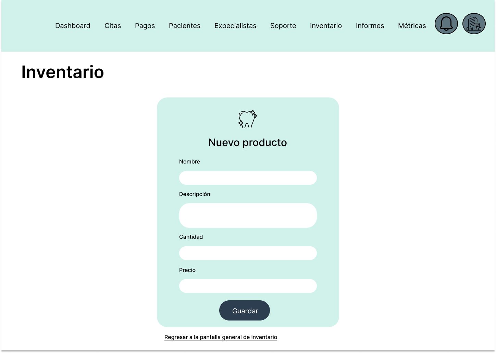

# COURSE PROJECT

---

    <strong>Universidad Peruana de Ciencias Aplicadas (UPC)</strong>     
    </img> 
    <strong>Carrera de Ingeniería de Software - Ciclo V</strong>  
    <strong>DISEÑO - 4370</strong> 
     <strong>Profesor: </strong> 
     <strong>INFORME DEL TRABAJO FINAL</strong> 

    <strong>Startup del Proyecto:ClinicCode </strong> 
    <strong>Producto:Dentify </strong> 

    <h3 align="center">Team Members:</h3>

    <table align="center">
        <tr>
            <th style="text-align:center;">Member</th>
            <th style="text-align:center;">Code</th>
        </tr>
        <tr>
            <td>Aponte Cruzado, Andrea Marielena</td>
            <td>U202224135</td>
        </tr>
        <tr>
            <td>Belahonia Miranda, Fabrisio  </td>
            <td>U202220219</td>
        </tr>
        <tr>
            <td>Bohorquez Lerzundi	Gerardo Sebastian</td>
            <td>U202224149</td>
        </tr>
        <tr>
            <td>Cutiri Agüero	Fabrizio Alexander</td>
            <td>U201914181</td>
        </tr>
        <tr>
            <td>Berrocal Ramirez	Omar Christian</td>
            <td>U20201B529</td>
        </tr>
    </table>
    

 <strong>2025-02</strong>

 

---

# Registro de Versiones del Informe

El objetivo de esta sección es resumir las modificaciones relevantes que se realizan al informe durante el ciclo de vida del proyecto. Esta sección inicia en una página nueva y se incluye un cuadro con la siguiente estructura:

| Versión | Fecha | Autor | Descripción de modificación |
|---------|-------|-------|-----------------------------|
| TB1 | 24/04/2025 | Belahonia Miranda, Fabrisio  | Realización de: - Capítulo I: Presentación - Capítulo II: Requirements Elicitation & Analysis - Capítulo III: Requirements Specification - Capítulo IV: Solution Software Design |

# Project Report Collaboration Insights
---

URL del repositorio para el reporte del proyecto:asdasdasd

TB1:

Para el desarrollo del informe perteneciente a la entrega TB1, se dividió la implementación de secciones de la siguiente forma para cada integrante del equipo:

| Integrante | Tareas Asignadas |
|------------|-----------------|
| Aponte Cruzado, Andrea Marielena | Analisis Competitivo y User Stories |
| Belahonia Miranda, Fabrisio | Entrevistas, Análisis de entrevistas y Needfinding, As to Be escenario, Elaboración de PPT |
| Bohorquez Lerzundi, Gerardo Sebastian | Lean UX, Entrevistas, Análisis de entrevistas y Needfinding, Impact Map |
| Cutiri Agüero, Fabrizio Alexander | Lean UX, User Stories, NeedFinding, Elaboración de PPT |
| Berrocal Ramirez, Omar Christian | Antecedentes y problemática, User and Technical Stories, Product Backlog, Capítulo IV: Solution Software Design, Elaboración de primera versión del BackEnd |

# GitHub Collaboration Insights

GitHub también presenta un timeline de las ramas principales y los procesos de merge a los que se han sometido. Todas las ramas se crearon tomando en cuenta el diseño de GitFlow para una buena organización cuando se usa un software de control de versiones.

Los integrantes son:

- Aponte Cruzado, Andrea Marielena
- Belahonia Miranda, Fabrisio
- Bohorquez Lerzundi, Gerardo Sebastian
- Cutiri Agüero, Fabrizio Alexander
- Berrocal Ramirez, Omar Christian

# Contenido
## Tabla de contenidos
- [**Registro de Versiones del Informe**](#registro-de-versiones-del-informe)
- [**Project Report Collaboration Insights**](#project-report-collaboration-insights)
- [**Contenido**](#contenido)
    - [Tabla de contenidos](#tabla-de-contenidos)
- [**Student Outcome**](#student-outcome)

- [**Capítulo I: Introducción**](#capítulo-i-introducción)
  - [**1.1. Startup Profile**](#11-startup-profile)
    - [**1.1.1. Descripción de la Startup**](#111-descripción-de-la-startup)
    - [**1.1.2. Perfiles de integrantes del equipo**](#112-perfiles-de-integrantes-del-equipo)
  - [**1.2. Solution Profile**](#12-solution-profile)
    - [**1.2.1 Antecedentes y problemática**](#121-antecedentes-y-problemática)
    - [**1.2.2 Lean UX Process**](#122-lean-ux-process)
      - [**1.2.2.1. Lean UX Problem Statements**](#1221-lean-ux-problem-statements)
      - [**1.2.2.2. Lean UX Assumptions**](#1222-lean-ux-assumptions)
      - [**1.2.2.3. Lean UX Hypothesis Statements**](#1223-lean-ux-hypothesis-statements)
      - [**1.2.2.4. Lean UX Canvas**](#1224-lean-ux-canvas)
  - [**1.3. Segmentos objetivo**](#13-segmentos-objetivo)

- [**Capítulo II: Requirements Elicitation & Analysis**](#capítulo-ii-requirements-elicitation--analysis)
  - [**2.1. Competidores**](#21-competidores)
    - [**2.1.1. Análisis competitivo**](#211-análisis-competitivo)
    - [**2.1.2. Estrategias y tácticas frente a competidores**](#212-estrategias-y-tácticas-frente-a-competidores)
  - [**2.2. Entrevistas**](#22-entrevistas)
    - [**2.2.1. Diseño de entrevistas**](#221-diseño-de-entrevistas)
    - [**2.2.2. Registro de entrevistas**](#222-registro-de-entrevistas)
    - [**2.2.3. Análisis de entrevistas**](#223-análisis-de-entrevistas)
  - [**2.3. Needfinding**](#23-needfinding)
    - [**2.3.1. User Personas**](#231-user-personas)
    - [**2.3.2. User Task Matrix**](#232-user-task-matrix)
    - [**2.3.3. User Journey Mapping**](#233-user-journey-mapping)
    - [**2.3.4. Empathy Mapping**](#234-empathy-mapping)
    - [**2.3.5. As-is Scenario Mapping**](#235-as-is-scenario-mapping)
  - [**2.4. Ubiquitous Language**](#24-ubiquitous-language)

- [**Capítulo III: Requirements Specification**](#capítulo-iii-requirements-specification)
  - [**3.1. To-Be Scenario Mapping**](#31-to-be-scenario-mapping)
  - [**3.2. User Stories**](#32-user-stories)
  - [**3.3. Product Backlog**](#33-product-backlog)
  - [**3.4. Impact Mapping**](#34-impact-mapping)
  - [Avance de Conclusiones, Bibliografía y Anexos](#avance-de-conclusiones-bibliografía-y-anexos)

- [**Capítulo IV: Product Design**](#capítulo-iv-product-design)
  - [**4.1. Style Guidelines**](#41-style-guidelines)
    - [**4.1.1. General Style Guidelines**](#411-general-style-guidelines)
    - [**4.1.2. Web Style Guidelines**](#412-web-style-guidelines)
    - [**4.1.3. Mobile Style Guidelines**](#413-mobile-style-guidelines)
      - [**4.1.3.1. iOS Mobile Style Guidelines**](#4131-ios-mobile-style-guidelines)
      - [**4.1.3.2. Android Mobile Style Guidelines**](#4132-android-mobile-style-guidelines)
  - [**4.2. Information Architecture**](#42-information-architecture)
    - [**4.2.1. Organization Systems**](#421-organization-systems)
    - [**4.2.2. Labeling Systems**](#422-labeling-systems)
    - [**4.2.3. SEO Tags and Meta Tags**](#423-seo-tags-and-meta-tags)
    - [**4.2.4. Searching Systems**](#424-searching-systems)
    - [**4.2.5. Navigation Systems**](#425-navigation-systems)
  - [**4.3. Landing Page UI Design**](#43-landing-page-ui-design)
    - [**4.3.1. Landing Page Wireframe**](#431-landing-page-wireframe)
    - [**4.3.2. Landing Page Mock-up**](#432-landing-page-mock-up)
  - [**4.4. Mobile Applications UX/UI Design**](#44-mobile-applications-uxui-design)
    - [**4.4.1. Mobile Applications Wireframes**](#441-mobile-applications-wireframes)
    - [**4.4.2. Mobile Applications Wireflow Diagrams**](#442-mobile-applications-wireflow-diagrams)
    - [**4.4.3. Mobile Applications Mock-ups**](#443-mobile-applications-mock-ups)
    - [**4.4.4. Mobile Applications User Flow Diagrams**](#444-mobile-applications-user-flow-diagrams)
  - [**4.5. Mobile Applications Prototyping**](#45-mobile-applications-prototyping)
    - [**4.5.1. Android Mobile Applications Prototyping**](#451-android-mobile-applications-prototyping)
    - [**4.5.2. iOS Mobile Applications Prototyping**](#452-ios-mobile-applications-prototyping)
  - [**4.6. Web Applications UX/UI Design**](#46-web-applications-uxui-design)
    - [**4.6.1. Web Applications Wireframes**](#461-web-applications-wireframes)
    - [**4.6.2. Web Applications Wireflow Diagrams**](#462-web-applications-wireflow-diagrams)
    - [**4.6.3. Web Applications Mock-ups**](#463-web-applications-mock-ups)
    - [**4.6.4. Web Applications User Flow Diagrams**](#464-web-applications-user-flow-diagrams)
  - [**4.7. Web Applications Prototyping**](#47-web-applications-prototyping)
  - [**4.8. Domain-Driven Software Architecture**](#48-domain-driven-software-architecture)
    - [**4.8.1. Software Architecture Context Diagram**](#481-software-architecture-context-diagram)
    - [**4.8.2. Software Architecture Container Diagrams**](#482-software-architecture-container-diagrams)
    - [**4.8.3. Software Architecture Components Diagrams**](#483-software-architecture-components-diagrams)
  - [**4.9. Software Object-Oriented Design**](#49-software-object-oriented-design)
    - [**4.9.1. Class Diagrams**](#491-class-diagrams)
    - [**4.9.2. Class Dictionary**](#492-class-dictionary)
  - [**4.10. Database Design**](#410-database-design)
    - [**4.10.1. Relational/Non-Relational Database Diagram**](#4101-relationalnon-relational-database-diagram)

- [**Capítulo V: Product Implementation**](#capítulo-v-product-implementation)
  - [**5.1. Software Configuration Management**](#51-software-configuration-management)
    - [**5.1.1. Software Development Environment Configuration**](#511-software-development-environment-configuration)
    - [**5.1.2. Source Code Management**](#512-source-code-management)
    - [**5.1.3. Source Code Style Guide & Conventions**](#513-source-code-style-guide--conventions)
    - [**5.1.4. Software Deployment Configuration**](#514-software-deployment-configuration)
  - [**5.2. Product Implementation & Deployment**](#52-product-implementation--deployment)
    - [**5.2.1. Sprint Backlogs**](#521-sprint-backlogs)
    - [**5.2.2. Implemented Landing Page Evidence**](#522-implemented-landing-page-evidence)
    - [**5.2.3. Implemented Frontend-Web Application Evidence**](#523-implemented-frontend-web-application-evidence)
    - [**5.2.4. Implemented Native-Mobile Application Evidence**](#524-implemented-native-mobile-application-evidence)
    - [**5.2.5. Implemented RESTful API and/or Serverless Backend Evidence**](#525-implemented-restful-api-andor-serverless-backend-evidence)
    - [**5.2.6. RESTful API documentation**](#526-restful-api-documentation)
    - [**5.2.7. Team Collaboration Insights**](#527-team-collaboration-insights)
  - [**5.3. Video About-the-Product**](#53-video-about-the-product)
  - [**Conclusiones**](#conclusiones)
  - [**Bibliografía**](#bibliografía)
  - [**Anexos**](#anexos)

    
# Student Outcome

| Criterio específico | Acciones realizadas | Conclusiones |
|----|----|----|
|Trabaja en equipo para proporcionar liderazgo en forma conjunta.| **Aponte Cruzado, Andrea Marielena** **Belahonia Miranda, Fabrisio** **Bohorquez Lerzundi, Gerardo Sebastian** **Cutiri Agüero, Fabrizio Alexander** **Berrocal Ramirez, Omar Christian**| |
|Crea un entorno colaborativo e inclusivo, establece metas, planifica tareas y cumple objetivos| **Aponte Cruzado, Andrea Marielena** **Belahonia Miranda, Fabrisio** **Bohorquez Lerzundi, Gerardo Sebastian** **Cutiri Agüero, Fabrizio Alexander** **Berrocal Ramirez, Omar Christian**| |

# Capítulo I: Introducción

## 1.1. Startup Profile

### 1.1.1. Descripción de la Startup

### 1.1.2. Perfiles de integrantes del equipo

## 1.2. Solution Profile

### 1.2.1. Antecedentes y problemática

### 1.2.2. Lean UX Process

#### 1.2.2.1. Lean UX Problem Statements

#### 1.2.2.2. Lean UX Assumptions

#### 1.2.2.3. Lean UX Hypothesis Statements

#### 1.2.2.4. Lean UX Canvas

## 1.3. Segmentos objetivo

# Capítulo II: Requirements Elicitation & Analysis

## 2.1. Competidores

### 2.1.1. Análisis competitivo

### 2.1.2. Estrategias y tácticas frente a competidores

## 2.2. Entrevistas

### 2.2.1. Diseño de entrevistas

### 2.2.2. Registro de entrevistas

### 2.2.3. Análisis de entrevistas

## 2.3. Needfinding

### 2.3.1. User Personas

### 2.3.2. User Task Matrix

### 2.3.3. User Journey Mapping

### 2.3.4. Empathy Mapping

### 2.3.5. As-is Scenario Mapping

## 2.4. Ubiquitous Language

# Capítulo III: Requirements Specification

## 3.1. To-Be Scenario Mapping

## 3.2. User Stories

## 3.3. Product Backlog

## 3.4. Impact Mapping

# Capítulo IV: Product Design

## 4.1. Style Guidelines

### 4.1.1. General Style Guidelines

#### Nombre y Logotipo

El nombre de la aplicación, Dentify, transmite innovación, profesionalismo y un enfoque claro en la gestión de consultorios odontológicos. El logotipo de Dentify está compuesto únicamente por un ícono de un diente sin acompañamiento de texto. Este símbolo representa de forma clara y directa el enfoque odontológico de la aplicación, transmitiendo profesionalismo, salud y confianza. Su diseño limpio y minimalista asegura una fácil identificación

#### Tono de comunicación

Para el tono de comunicación se optó por uno con un efoque profesional, consiso, claro y que transmita confianza sin perder calidez. El lenguaje técnico será evitado en su mayoría y se priorizará expresiones accesibles para facilitar la comprensión.

#### Colors

### 4.1.2. Web Style Guidelines

La paleta de colores se basa en tonos de celeste y azul, que transmiten confianza, profesionalismo y tranquilidad, ideales para el entorno de la salud dental. Como colores secundarios se utilizan blanco, negro y gris, que aportan equilibrio visual, legibilidad y una estética limpia y moderna. Esta combinación refuerza una imagen clara, ordenada y amigable para los usuarios.

#### Typography

La tipografía que se usará principalmente, dada su legibilidad, estilo y versatilidad, es Roboto. 

#### Spacing

En nuestra app móvil, aplicamos un sistema de spacing consistente para mantener una estructura visual ordenada y accesible. Utilizamos márgenes de 19.5px entre secciones principales, un padding interno de 18px en botones y componentes, y un interlineado de 1.5x en los textos largos para mejorar la lectura. Esta coherencia visual refuerza el branding y la experiencia de usuario.

#### Íconos de la aplicación

La aplicación utilizará íconos seleccionados para la mejor experiencia de usuario. Cada ícono cumple una función clara y está alineado con la identidad de la marca.

#### Lenguaje aplicado
Para el desarrollo de la aplicación móvil “Dentify” y su correspondiente landing page, se ha adoptado un lenguaje formal, serio y respetuoso, alineado con el propósito y los objetivos del producto. En el diseño y construcción tanto de la aplicación móvil como de la landing page, se han aplicado los principios fundamentales del diseño visual.

##### Consistencia
Mantenemos una estructura y estilo uniformes en todo el producto digital. Esto incluye el uso coherente de elementos de diseño como tipografías, tamaños de fuente, paleta de colores y patrones de interacción, permitiendo que el usuario se adapte fácilmente a la interfaz y navegue con mayor facilidad.

#### Simplicidad
Eliminamos los elementos innecesarios o que pueden complicar la interfaz con el fin de que los usuarios puedan realizar sus tareas de manera más sencilla y rápida.

#### Comunicación
Hemos incorporado confirmaciones visuales que se presentan cuando los usuarios realizan alguna acción. Este tipo de retroalimentación les permite identificar su ubicación dentro del proceso y, sobre todo, verificar que sus acciones se han llevado a cabo correctamente.

### 4.1.3. Mobile Style Guidelines

#### 4.1.3.1. iOS Mobile Style Guidelines

#### Nombre y Logotipo
El nombre Dentify comunica innovación y profesionalismo, con un enfoque específico en la gestión de clínicas odontológicas. El logotipo, representado únicamente por un ícono de diente sin texto, transmite de forma directa el propósito de la app. Su diseño limpio y minimalista está optimizado para entornos iOS, facilitando su reconocimiento en interfaces móviles y reforzando la confianza del usuario.

#### Tono de Comunicación en la App Móvil

La aplicación utiliza un tono profesional, claro y confiable, manteniendo una comunicación cálida y accesible. Se evita el uso excesivo de lenguaje técnico, priorizando expresiones simples que se adapten al estilo directo y fluido de iOS, facilitando la comprensión en pantallas pequeñas.

#### Colores

La paleta principal se compone de tonos celestes y azules, que transmiten tranquilidad y profesionalismo, ideales para el entorno de salud. Blanco, negro y gris se usan como colores secundarios para lograr una estética limpia, moderna y legible, en línea con las recomendaciones de diseño de Apple.

#### Tipografía

La fuente principal es Roboto, elegida por su excelente legibilidad y adaptabilidad en interfaces móviles. Aunque iOS utiliza por defecto San Francisco, Roboto se integra bien en entornos híbridos o personalizados, manteniendo una apariencia clara y profesional.

#### Spacing

Se aplica un sistema de espaciado coherente para mantener la interfaz ordenada:
- 19.5px entre secciones principales
- 18px de padding en botones y componentes
- Interlineado de 1.5x en textos extensos 

Este diseño mejora la legibilidad y la navegación en dispositivos iOS, respetando las guías de accesibilidad de Apple

#### Íconos

Los íconos están diseñados para cumplir funciones específicas y se alinean con la identidad visual de Dentify. Su estilo es simple y claro, optimizado para pantallas Retina, asegurando una experiencia fluida y coherente en iOS.

#### Lenguaje

Tanto en la app como en la landing page, se utiliza un lenguaje respetuoso y profesional, alineado con los objetivos del producto. Se prioriza la claridad para facilitar la interacción en dispositivos Apple, donde la simplicidad y la eficiencia son clave.

#### Consistencia

Se mantiene una estructura uniforme en toda la app: tipografías, tamaños, colores y patrones de interacción se aplican de forma coherente, permitiendo que el usuario se familiarice rápidamente con la interfaz.

#### Simplicidad

Se eliminan elementos innecesarios para que la interfaz sea clara y funcional, permitiendo que los usuarios completen sus tareas de forma rápida y sin distracciones, en línea con el principio de “menos es más” de Apple

#### Comunicación

La app incorpora confirmaciones visuales tras cada acción del usuario, ofreciendo retroalimentación inmediata y clara, lo que mejora la experiencia y refuerza la confianza en el uso de la aplicación.

#### 4.1.3.2. Android Mobile Style Guidelines

#### Nombre y Logotipo
El nombre Dentify comunica innovación, profesionalismo y un enfoque especializado en la gestión de consultorios odontológicos. Su logotipo, compuesto únicamente por un ícono de diente sin texto, representa de forma directa el ámbito odontológico. El diseño minimalista y limpio facilita su reconocimiento en entornos móviles, transmitiendo confianza y salud.

#### Tono de Comunicación en la App Móvil
Se ha definido un tono profesional, claro y confiable, manteniendo cercanía con el usuario. Se evita el uso excesivo de lenguaje técnico, priorizando expresiones accesibles que faciliten la comprensión en dispositivos móviles, donde la lectura debe ser rápida y efectiva.

#### Colores
La paleta principal se compone de tonos celestes y azules, ideales para transmitir tranquilidad y profesionalismo en el entorno de salud dental. Los colores secundarios —blanco, negro y gris— aportan equilibrio visual, buena legibilidad y una estética moderna, especialmente pensada para pantallas móviles.

#### Tipografía
Se utiliza Roboto como fuente principal por su alta legibilidad y versatilidad en interfaces móviles, adaptándose bien a distintos tamaños de pantalla.

#### Spacing
En la app móvil se aplica un sistema de espaciado coherente:

#### Íconos
La aplicación incorpora íconos funcionales y alineados con la identidad de marca. Cada ícono tiene un propósito específico, facilitando la navegación y mejorando la experiencia del usuario en pantallas pequeñas.

#### Lenguaje
Tanto en la app como en su landing page, se utiliza un lenguaje serio y respetuoso, alineado con los objetivos del producto. Se prioriza la claridad para facilitar la interacción en dispositivos móviles.

#### Consistencia
Se mantiene una estructura uniforme en toda la app: tipografías, tamaños, colores y patrones de interacción se aplican de forma coherente, ayudando al usuario a adaptarse rápidamente a la interfaz.

#### Simplicidad
Se eliminan elementos innecesarios para que la interfaz sea clara y funcional, permitiendo que los usuarios completen sus tareas de forma rápida y sin distracciones.

#### Comunicación
Se incluyen confirmaciones visuales tras cada acción del usuario, brindando retroalimentación clara sobre el estado del proceso y asegurando que sus acciones se han realizado correctamente.

## 4.2. Information Architecture

### 4.2.1. Organization Systems

**App Móvil (Dentify)**
La interfaz de Dentify organiza sus secciones principales —como “Reserva de Citas”, “Pagar Tratamiento” y “Historial”— mediante títulos visibles, botones destacados y elementos interactivos que guían al usuario de forma intuitiva. Por ejemplo, “Reservar Citas” se ubica en una posición prioritaria dentro de la pantalla principal o como botón flotante, lo que permite un acceso rápido y directo.

**Landing Page (ClinicCode)**
Las secciones como “Nosotros”, “Servicios”, “Información” y “Contáctenos” se presentan con encabezados grandes y llamados a la acción claros, facilitando la navegación del visitante. En “Servicios”, se utilizan íconos representativos y botones que conducen a más detalles sobre soluciones destacadas como Dentify.

#### Categorización del Contenido
**App Móvil (Dentify)**
Las funcionalidades están organizadas en categorías intuitivas como “Citas”, “Pagos” y “Historial”, lo que permite al usuario encontrar rápidamente lo que necesita. Por ejemplo, funciones específicas como “Gestión de Inventario” se agrupan en una sección administrativa, accesible únicamente para usuarios premium.

**Landing Page (ClinicCode)**
El contenido se distribuye en secciones informativas bien definidas. “Nosotros” reúne la historia y el equipo; “Servicios” detalla las soluciones ofrecidas; y en “Información”, los temas están organizados por áreas como eficiencia clínica o gestión de citas, lo que facilita su exploración.

#### Secuencia de Contenidos
**App Móvil (Dentify)**
La experiencia de uso sigue una secuencia lógica: tras iniciar sesión, el usuario accede al menú principal y luego a funciones frecuentes como reservas o consultas. Por ejemplo, al ingresar, se muestra en primer plano la opción “Reserva de Citas”, lo que permite una navegación fluida y enfocada.

**Landing Page (ClinicCode)**
La estructura del sitio sigue un orden progresivo: comienza con la presentación de la empresa, continúa con los servicios y finaliza en la sección de contacto. Esto permite que el visitante conozca primero las soluciones disponibles, luego acceda a información detallada y finalmente encuentre cómo comunicarse.

#### Agrupación de Funcionalidades
**App Móvil (Dentify)**
Las funciones están agrupadas por áreas de uso para mejorar la experiencia. Por ejemplo, “Perfil” incluye configuraciones personales; “Citas” reúne programación, recordatorios y seguimiento. Los métodos de pago y facturación se integran en “Pagos”, mientras que la información médica del paciente se organiza dentro de “Historial”.

**Landing Page (ClinicCode)**
Las secciones funcionales están estructuradas para facilitar la navegación. “Servicios” agrupa todas las soluciones que ofrece la empresa, y “Contáctenos” centraliza los medios de comunicación. Dentro de “Servicios”, se puede destacar una subsección dedicada a Dentify como propuesta innovadora.

### 4.2.2. Labeling Systems

**Aplicación Móvil (Dentify)**
Se han utilizado etiquetas claras y precisas que describen directamente la función de cada sección, lo que permite a los usuarios identificar fácilmente las acciones disponibles dentro de la app. Por ejemplo, en el menú principal se emplean términos como “Reservar Cita”, “Historial” y “Pagos”, que comunican de forma directa lo que el usuario encontrará al ingresar. En la sección “Perfil”, opciones como “Editar Información Personal” y “Modificar Contraseña” están nombradas de manera específica, lo que ayuda a guiar al usuario sin generar confusión.

**Landing Page (ClinicCode)**
Las secciones del sitio están etiquetadas con términos comprensibles y directos, como “Servicios” o “Información”, lo que facilita la navegación desde cualquier dispositivo. Un ejemplo claro se encuentra en la sección “Contáctenos”, donde se diferencian las vías de comunicación mediante etiquetas como “Formulario de Consulta”, “Llamada Telefónica” y “Atención por Chat”, permitiendo al usuario elegir fácilmente el canal que prefiera.

### 4.2.3. SEO Tags and Meta Tags

Se han aplicado estrategias de posicionamiento en tiendas de aplicaciones mediante técnicas de ASO (App Store Optimization), con el objetivo de que Dentify sea fácilmente encontrada por profesionales del área odontológica que buscan soluciones móviles para la gestión de sus consultorios.

Se han definido elementos clave como:

- **Título de la App:**
“Dentify - Gestión Dental Móvil por ClinicCode”

- **Descripción de la App:**
“Organiza tus citas, tratamientos y pacientes desde una sola app. Dentify optimiza la administración de tu consultorio dental desde cualquier lugar.”

- **Palabras Clave:**
“app dental, gestión de citas, consultorio móvil, odontología digital, Dentify ClinicCode”

### 4.2.4. Searching Systems

**Aplicación Móvil (Dentify)**

Se ha integrado una función de búsqueda optimizada que permite a los usuarios encontrar rápidamente información relevante dentro de la app, como citas programadas, registros de pacientes o tratamientos específicos.
Por ejemplo, la búsqueda incluye filtros por fecha, profesional de salud o tipo de procedimiento, lo que facilita el acceso ágil a los datos desde cualquier sección, incluso en dispositivos con pantallas pequeñas.

**Landing Page (ClinicCode)**

Se ha implementado una barra de búsqueda sencilla que ayuda a los visitantes a localizar contenidos específicos, como artículos informativos o detalles sobre los servicios ofrecidos.
Un ejemplo se encuentra en la sección “Información”, donde los usuarios pueden buscar temas concretos como “automatización de citas” o “eficiencia administrativa en consultorios dentales”.

### 4.2.5. Navigation Systems

Menú Principal:

**Aplicación Móvil (Dentify)**
- El menú principal ha sido diseñado para ser intuitivo y accesible desde cualquier pantalla mediante un botón desplegable (hamburger menu), que ofrece acceso directo a funciones clave como “Citas”, “Pagos” e “Historial”. Este menú se adapta a pantallas pequeñas y prioriza la facilidad de uso en movimiento.
- Ejemplo: Los usuarios premium pueden acceder rápidamente al soporte técnico desde cualquier sección, ya sea mediante un ícono fijo en el menú o accesos rápidos en la pantalla principal.

**Landing Page (ClinicCode)**
- Se utiliza un menú superior fijo que permanece visible al hacer scroll, con enlaces a las secciones principales del sitio. Está optimizado para dispositivos móviles, con íconos representativos y un diseño compacto.
- Ejemplo: En la vista móvil, el menú muestra íconos claros para acceder a “Nosotros”, “Servicios” y al chat de ayuda, mejorando la navegación desde smartphones.

## 4.3. Landing Page UI Design

### 4.3.1. Landing Page Wireframe
Nosotros

Servicios

Contáctenos

### 4.3.2. Landing Page Mock-up

Nosotros

Servicios

Contáctenos

## 4.4. Mobile Applications UX/UI Design

### 4.4.1. Mobile Applications Wireframes

## Autenticación

  
  

  

## Menú principal

  
  

## Gestión de citas

  
  

  

## Gestión de pacientes

  
  

  

## Inventario

  
  

## Pagos

  
  

  

### 4.4.2. Mobile Applications Wireflow Diagrams

**Enlace Figma**:https://www.figma.com/design/WRThFO0TXiuoNfXCPJvR26/Dise%C3%B1o-web?node-id=0-1&p=f&t=gM1Z07iNNkLSpL0t-0

**User Goal: Autentificación**
  

**User Goal: Gestión de Citas**
  

**User Goal: Gestión de Pacientes**
 

**User Goal: Gestión de Inventario**
  

**User Goal: Perfil**
  

**User Goal: Gestión de pagos**
  

### 4.4.3. Mobile Applications Mock-ups

## Autenticación

  
  
  

  
  

## Menú principal

  

## Gestión de Citas

  
  
  

  
  
  

  
  
  

  

## Gestión de Pacientes

  
  
  

  
  
  

  
  
  

## Gestión de Inventario

  
  
  

  
  

## Pagos

  
  
  

  
  
  

  
  

### 4.4.4. Mobile Applications User Flow Diagrams

**Enlace Figma:**https://www.figma.com/design/WRThFO0TXiuoNfXCPJvR26/Dise%C3%B1o-web?node-id=0-1&p=f&t=gM1Z07iNNkLSpL0t-0

## User Goal: Actualizar datos
Cuando el usuario accede a Dentify, primero debe iniciar sesión. Una vez autenticado, puede ingresar a su perfil y modificar su información personal. Esto incluye actualizar nombre, correo electrónico o contraseña, así como añadir o editar datos adicionales como teléfono o dirección.  

---

## User Goal: Cita
Dentro de la aplicación, el usuario tiene acceso a la sección de citas. Allí puede revisar las citas programadas, registrar nuevas o modificar las ya existentes. También cuenta con la opción de cancelar citas en caso necesario.  

---

## User Goal: Inventario
El usuario puede entrar a la sección de inventario para gestionar los productos de la clínica. Desde este apartado, es posible consultar el stock, añadir nuevos artículos, actualizarlos o eliminarlos cuando dejen de ser necesarios.  

---

## User Goal: Paciente
En la sección de pacientes, el usuario puede visualizar la lista de pacientes registrados, incorporar nuevos registros o editar la información de los existentes. Además, es posible eliminar aquellos pacientes que ya no deban estar en la base de datos.  

---

## User Goal: Pagos
La sección de pagos permite al usuario visualizar las citas pendientes de cobro, registrar abonos y emitir facturas de manera sencilla. Asimismo, se puede acceder al historial completo de pagos realizados.  

---

## User Goal: Registro
Si el usuario no cuenta con una cuenta, puede registrarse proporcionando información básica como nombre, correo electrónico y contraseña. Una vez completado este proceso, podrá iniciar sesión y acceder a todas las funcionalidades de Dentify.  

## 4.5. Mobile Applications Prototyping

Para los prototipos de interfaz móvil seguimos tres principios: claridad, diseño mobile-first adaptable y presentación de información esencial. Priorizamos flujos cortos para registrar procesos y consultar reportes, navegación inferior y cuidamos legibilidad, manteniendo la experiencia rápida y consistente en distintos tamaños de pantalla.

### 4.5.1. Android Mobile Applications Prototyping

enlace video: https://upcedupe-my.sharepoint.com/:v:/g/personal/u202220219_upc_edu_pe/EbJoZdhwlExGrvIfSN5N46EBJRw4FjQdlb-FgEm34LfOlg?nav=eyJyZWZlcnJhbEluZm8iOnsicmVmZXJyYWxBcHAiOiJTdHJlYW1XZWJBcHAiLCJyZWZlcnJhbFZpZXciOiJTaGFyZURpYWxvZy1MaW5rIiwicmVmZXJyYWxBcHBQbGF0Zm9ybSI6IldlYiIsInJlZmVycmFsTW9kZSI6InZpZXcifX0%3D&e=7cCrz3

### 4.5.2. iOS Mobile Applications Prototyping

enlace video: https://upcedupe-my.sharepoint.com/:v:/g/personal/u202220219_upc_edu_pe/Ec_n0eCxhQVEkZFIHxqYhx0BZZof_YXNNdaZhlLz4DeuTQ?nav=eyJyZWZlcnJhbEluZm8iOnsicmVmZXJyYWxBcHAiOiJTdHJlYW1XZWJBcHAiLCJyZWZlcnJhbFZpZXciOiJTaGFyZURpYWxvZy1MaW5rIiwicmVmZXJyYWxBcHBQbGF0Zm9ybSI6IldlYiIsInJlZmVycmFsTW9kZSI6InZpZXcifX0%3D&e=WrSRqG

## 4.6. Web Applications UX/UI Design

### 4.6.1. Web Applications Wireframes

**Autenticación**

  
  

**Dashboard (inicio)**

  

**Inventario**

  

  
  

  

  

**Configuración & Perfil**

  
  

  
  

**Pagos & Facturación**

  
  

  
  

  
  

  

**Gestión de Citas de pacientes**

  

  
  

  
  

**Notificaciones**

  

### 4.6.2. Web Applications Wireflow Diagrams

**Enlace Figma:** <https://www.figma.com/design/WRThFO0TXiuoNfXCPJvR26/Dise%C3%B1o-web?node-id=0-1&p=f&t=gM1Z07iNNkLSpL0t-0>

**User Goal: Autenticación & Perfil**

  

  

**User Goal: Gestión de Citas (programar / modificar / cancelar)**

  

**User Goal: Gestión de Pacientes (listar / crear / editar / eliminar)**

  

**User Goal: Pagos & Facturación**

  

**User Goal: Gestión de Inventario**

  

### 4.6.3. Web Applications Mock-ups

**Autenticación**

  
  

**Dashboard (inicio)**

  

**Perfil**

  
  

  
  

  

**Gestión de Citas**

  
  

  
  

  
  

**Pagos & Facturación**

  
  

  
  

  
  

  

**Inventario**

  

  
  

  
  

### 4.6.4. Web Applications User Flow Diagrams

**Enlace Figma:** <https://www.figma.com/design/WRThFO0TXiuoNfXCPJvR26/Dise%C3%B1o-web?node-id=0-1&p=f&t=gM1Z07iNNkLSpL0t-0>

## User Goal: Actualizar datos
Cuando el usuario accede a la app, inicia sesión y va a Perfil para modificar su información personal. Puede actualizar nombre, correo y contraseña, así como agregar o editar teléfono y dirección.  

---

## User Goal: Cita
El usuario ingresa a Citas para revisar, crear o modificar citas existentes. También puede cancelar una cita si es necesario.  

---

## User Goal: Inventario
Desde Inventario, el usuario consulta stock, añade nuevos productos, los actualiza o elimina cuando corresponde.  

---

## User Goal: Paciente
En **Pacientes**, el usuario visualiza la lista, registra nuevos pacientes o edita la información de los existentes; además, puede eliminarlos si ya no deben permanecer en el sistema.  

---

## User Goal: Pagos
En **Pagos**, el usuario ve citas pendientes de cobro, selecciona ítems, registra el pago y puede emitir/consultar facturas e historial.  

---

## User Goal: Registro
Si aún no tiene cuenta, el usuario se registra ingresando nombre, correo y contraseña; luego podrá iniciar sesión y acceder a todas las funciones.  

## 4.7. Web Applications Prototyping

Para los prototipos de interfaz web en escritorio seguimos tres principios: claridad, eficiencia y diseño adaptable. Utilizamos layouts de grilla y paneles que organizan funciones clave (registro de procesos y reportes), tablas filtrables y una jerarquía tipográfica limpia para comprender de inmediato. Aseguramos consistencia entre resoluciones, soporte de accesibilidad (navegación por teclado, estados de foco visibles) y mostramos solo los datos críticos para cada perfil, reduciendo ruido visual y mejorando la productividad.

## 4.8. Domain-Driven Software Architecture

### 4.8.1. Software Architecture Context Diagram

### 4.8.2. Software Architecture Container Diagrams

### 4.8.3. Software Architecture Components Diagrams

## 4.9. Software Object-Oriented Design

### 4.9.1. Class Diagrams

### 4.9.2. Class Dictionary

## 4.10. Database Design

### 4.10.1. Relational/Non-Relational Database Diagram

# Capítulo V: Product Implementation

## 5.1. Software Configuration Management

### 5.1.1. Software Development Environment Configuration

### 5.1.2. Source Code Management

### 5.1.3. Source Code Style Guide & Conventions

### 5.1.4. Software Deployment Configuration

## 5.2. Product Implementation & Deployment

### 5.2.1. Sprint Backlogs

### 5.2.2. Implemented Landing Page Evidence

### 5.2.3. Implemented Frontend-Web Application Evidence

### 5.2.4. Implemented Native-Mobile Application Evidence

### 5.2.5. Implemented RESTful API and/or Serverless Backend Evidence

### 5.2.6. RESTful API documentation

### 5.2.7. Team Collaboration Insights

## 5.3. Video About-the-Product

# Conclusiones

# Bibliografía

# Anexos
