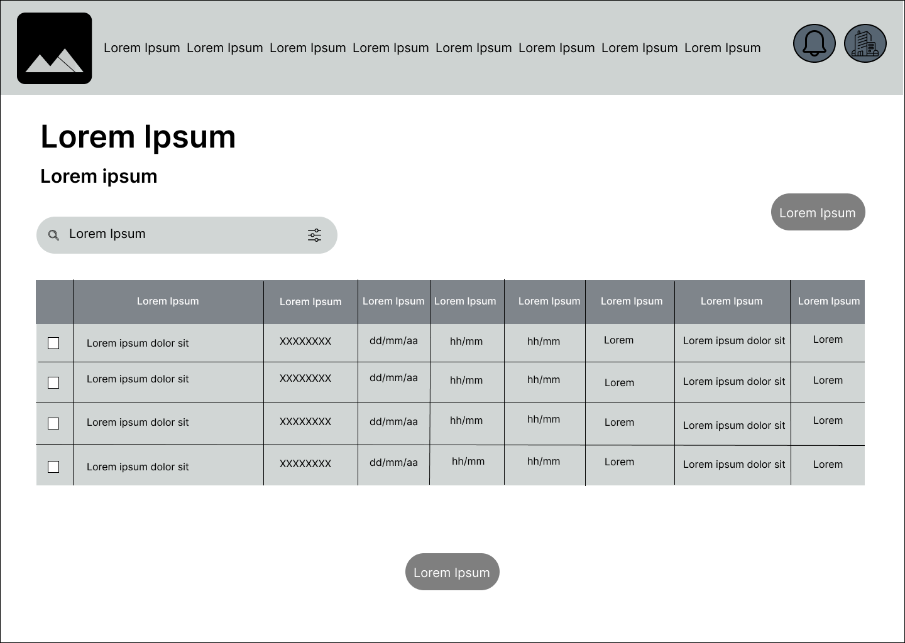
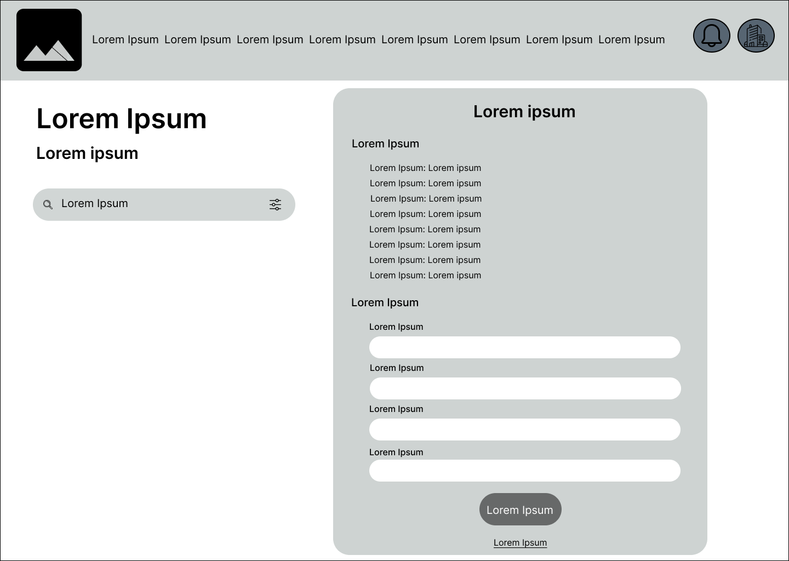
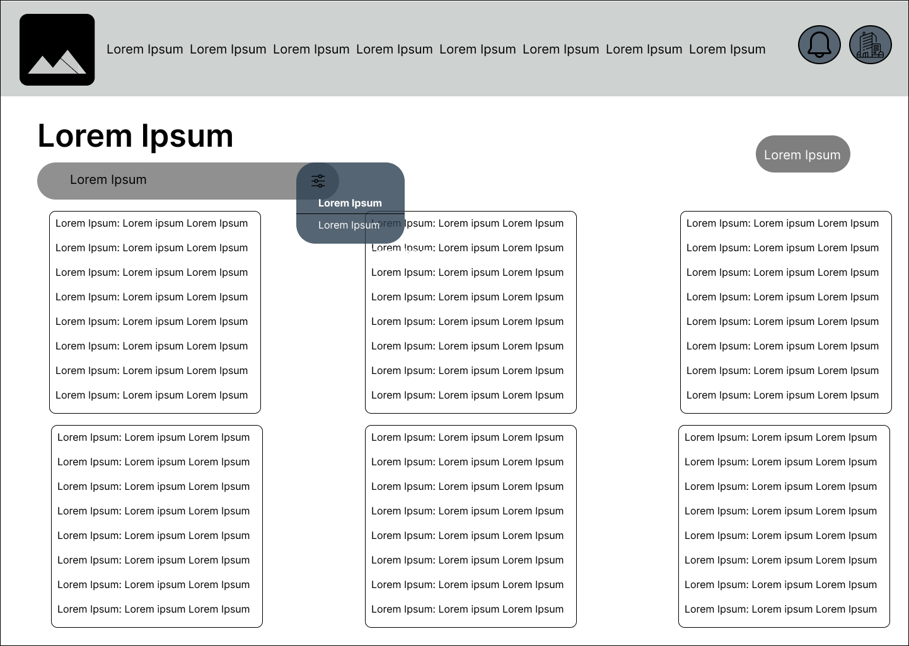
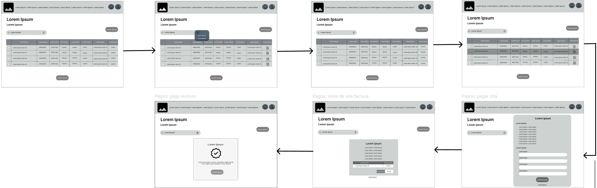
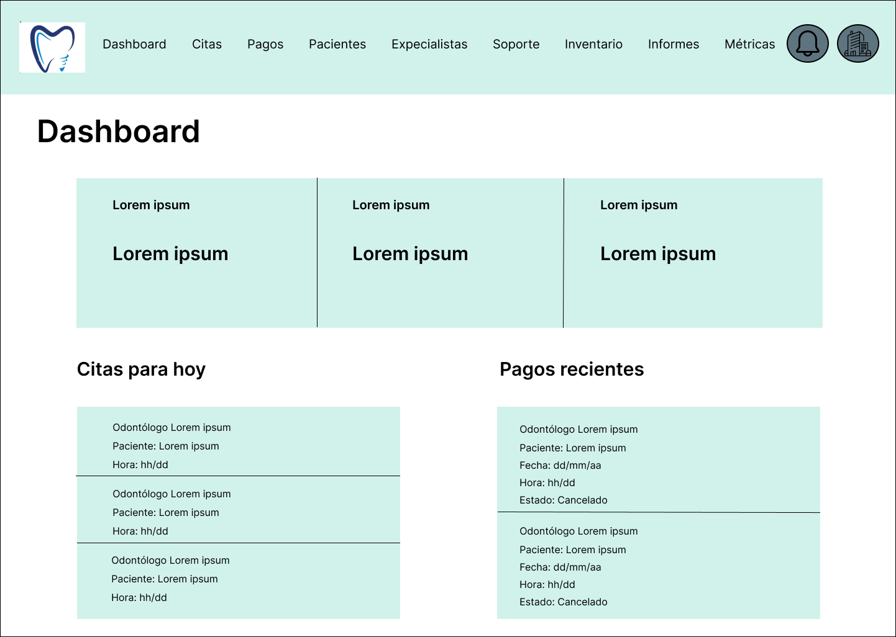
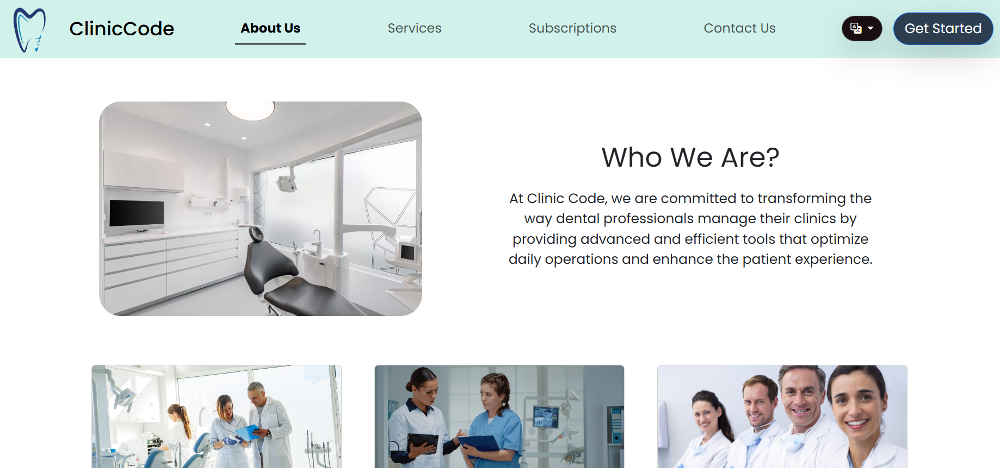

# COURSE PROJECT

---

<p align="center">
    <strong>Universidad Peruana de Ciencias Aplicadas (UPC)</strong><br>    
    </img><br>
    <strong>Carrera de Ingeniería de Software - Ciclo V</strong><br><br>
    <strong>DISEÑO - 4370</strong><br>
    <br><strong>Profesor:Juan Tinoco Licas </strong><br>
    <br><strong>INFORME DEL TRABAJO FINAL</strong><br>
</p>

<p align="center">
    <strong>Startup del Proyecto:ClinicCode </strong><br>
    <strong>Producto:Dentify </strong><br>
</p>

<div>
    <h3 align="center">Team Members:</h3>
</div>

<div>
    <table align="center">
        <tr>
            <th style="text-align:center;">Member</th>
            <th style="text-align:center;">Code</th>
        </tr>
        <tr>
            <td>Aponte Cruzado, Andrea Marielena</td>
            <td>U202224135</td>
        </tr>
        <tr>
            <td>Belahonia Miranda, Fabrisio  </td>
            <td>U202220219</td>
        </tr>
        <tr>
            <td>Bohorquez Lerzundi	Gerardo Sebastian</td>
            <td>U202224149</td>
        </tr>
        <tr>
            <td>Cutiri Agüero	Fabrizio Alexander</td>
            <td>U201914181</td>
        </tr>
        <tr>
            <td>Berrocal Ramirez	Omar Christian</td>
            <td>U20201B529</td>
        </tr>
    </table>
    </div>

<p align="center">
<br><strong>2025-02</strong></p>
<br>

---

# Registro de Versiones del Informe

El objetivo de esta sección es resumir las modificaciones relevantes que se realizan al informe durante el ciclo de vida del proyecto. Esta sección inicia en una página nueva y se incluye un cuadro con la siguiente estructura:

| Versión | Fecha | Autor | Descripción de modificación |
|---------|-------|-------|-----------------------------|
| TB1 | 24/04/2025 | Belahonia Miranda, Fabrisio | Realización de:<br>- Capítulo I: Presentación<br>- Capítulo II: Requirements Elicitation & Analysis<br>- Capítulo III: Requirements Specification<br>- Capítulo IV: Solution Software Design |
| TP1 | 08/10/2025 | Belahonia Miranda, Fabrisio | Actualización y ampliación de:<br>- Capítulo III: Requirements Specification (versión mejorada de To-Be Scenario, User Stories, Product Backlog e Impact Mapping).<br>- Capítulo V: Product Implementation & Deployment.<br>- Capítulo VI: Product Verification & Validation.|

# Project Report Collaboration Insights
---

URL del repositorio para el reporte del proyecto: **https://github.com/ClinicCode**


**TB1:**

Para el desarrollo del informe perteneciente a la entrega TB1, se dividió la implementación de secciones de la siguiente forma para cada integrante del equipo:

| Integrante | Tareas Asignadas |
|------------|-----------------|
| Aponte Cruzado, Andrea Marielena | Analisis Competitivo y User Stories |
| Belahonia Miranda, Fabrisio | Entrevistas, Análisis de entrevistas y Needfinding, As to Be escenario, Elaboración de PPT |
| Bohorquez Lerzundi, Gerardo Sebastian | Lean UX, Entrevistas, Análisis de entrevistas y Needfinding, Impact Map |
| Cutiri Agüero, Fabrizio Alexander | Lean UX, User Stories, NeedFinding, Elaboración de PPT |
| Berrocal Ramirez, Omar Christian | Antecedentes y problemática, User and Technical Stories, Product Backlog, Capítulo IV: Solution Software Design, Elaboración de primera versión del BackEnd |


**TB2:**

Para el desarrollo del informe perteneciente a la entrega TB2, se dividió la implementación de secciones de la siguiente forma para cada integrante del equipo:

| Integrante                            | Tareas Asignadas                                                                                                                 |
|---------------------------------------|----------------------------------------------------------------------------------------------------------------------------------|
| Aponte Cruzado, Andrea Marielena      | Correcion de errores del reporte, Implemented Native mobile application evidence, Tools and practices                            |
| Belahonia Miranda, Fabrisio           | Sprint Backlog, Core behavior-driver development, Product Backlog, Tools and Practices, Build and test suite, Elaboración de PPT |
| Bohorquez Lerzundi, Gerardo Sebastian | Acuerdo de servicios, Core integration tests, Stages development, Continuous development                                         |
| Cutiri Agüero, Fabrizio Alexander     | Application Evidence, Core entities unit test, tools and practices, production deployment pipeline                               |
| Berrocal Ramirez, Omar Christian      | Collaboration insights, Core system tests                                                                                        |


# GitHub Collaboration Insights

GitHub también presenta un timeline de las ramas principales y los procesos de merge a los que se han sometido. Todas las ramas se crearon tomando en cuenta el diseño de GitFlow para una buena organización cuando se usa un software de control de versiones.


Los integrantes son:

- Aponte Cruzado, Andrea Marielena(iconicmiau)
- Belahonia Miranda, Fabrisio(devfab17)
- Bohorquez Lerzundi, Gerardo Sebastian(Sebasbl562)
- Cutiri Agüero, Fabrizio Alexander(FabrizioCutiri)
- Berrocal Ramirez, Omar Christian(OmBRz)

# Contenido
## Tabla de contenidos
- [COURSE PROJECT](#course-project)
- [Registro de Versiones del Informe](#registro-de-versiones-del-informe)
- [Project Report Collaboration Insights](#project-report-collaboration-insights)
- [GitHub Collaboration Insights](#github-collaboration-insights)
- [Contenido](#contenido)
  - [Tabla de contenidos](#tabla-de-contenidos)
- [Student Outcome](#student-outcome)
- [Capítulo I: Introducción](#capítulo-i-introducción)
  - [1.1. Startup Profile](#11-startup-profile)
    - [1.1.1. Descripción de la Startup](#111-descripción-de-la-startup)
    - [1.1.2. Perfiles de integrantes del equipo](#112-perfiles-de-integrantes-del-equipo)
  - [1.2. Solution Profile](#12-solution-profile)
    - [1.2.1. Antecedentes y problemática](#121-antecedentes-y-problemática)
    - [1.2.2. Lean UX Process](#122-lean-ux-process)
      - [1.2.2.1. Lean UX Problem Statements](#1221-lean-ux-problem-statements)
      - [1.2.2.2. Lean UX Assumptions](#1222-lean-ux-assumptions)
      - [1.2.2.3. Lean UX Hypothesis Statements](#1223-lean-ux-hypothesis-statements)
      - [1.2.2.4. Lean UX Canvas](#1224-lean-ux-canvas)
  - [1.3. Segmentos objetivo](#13-segmentos-objetivo)
- [Capítulo II: Requirements Elicitation \& Analysis](#capítulo-ii-requirements-elicitation--analysis)
  - [2.1. Competidores](#21-competidores)
    - [2.1.1. Análisis competitivo](#211-análisis-competitivo)
    - [2.1.2. Estrategias y tácticas frente a competidores](#212-estrategias-y-tácticas-frente-a-competidores)
  - [2.2. Entrevistas](#22-entrevistas)
    - [2.2.1. Diseño de entrevistas](#221-diseño-de-entrevistas)
    - [2.2.2. Registro de entrevistas](#222-registro-de-entrevistas)
  - [Entrevista 1: Martín Salcedo](#entrevista-1-martín-salcedo)
    - [2.2.3. Análisis de entrevistas](#223-análisis-de-entrevistas)
  - [2.3. Needfinding](#23-needfinding)
    - [2.3.1. User Personas](#231-user-personas)
    - [2.3.2. User Task Matrix](#232-user-task-matrix)
    - [2.3.3. User Journey Mapping](#233-user-journey-mapping)
    - [2.3.4. Empathy Mapping](#234-empathy-mapping)
    - [2.3.5. As-is Scenario Mapping](#235-as-is-scenario-mapping)
  - [2.4. Ubiquitous Language](#24-ubiquitous-language)
- [Capítulo III: Requirements Specification](#capítulo-iii-requirements-specification)
  - [3.1. To-Be Scenario Mapping](#31-to-be-scenario-mapping)
  - [3.2. User Stories](#32-user-stories)
  - [3.3. Product Backlog](#33-product-backlog)
  - [3.4. Impact Mapping](#34-impact-mapping)
- [Capítulo IV: Product Design](#capítulo-iv-product-design)
  - [4.1. Style Guidelines](#41-style-guidelines)
    - [4.1.1. General Style Guidelines](#411-general-style-guidelines)
    - [4.1.2. Web Style Guidelines](#412-web-style-guidelines)
    - [4.1.3. Mobile Style Guidelines](#413-mobile-style-guidelines)
      - [4.1.3.1. iOS Mobile Style Guidelines](#4131-ios-mobile-style-guidelines)
      - [4.1.3.2. Android Mobile Style Guidelines](#4132-android-mobile-style-guidelines)
  - [4.2. Information Architecture](#42-information-architecture)
    - [4.2.1. Organization Systems](#421-organization-systems)
    - [4.2.2. Labeling Systems](#422-labeling-systems)
    - [4.2.3. SEO Tags and Meta Tags](#423-seo-tags-and-meta-tags)
    - [4.2.4. Searching Systems](#424-searching-systems)
    - [4.2.5. Navigation Systems](#425-navigation-systems)
  - [4.3. Landing Page UI Design](#43-landing-page-ui-design)
    - [4.3.1. Landing Page Wireframe](#431-landing-page-wireframe)
    - [4.3.2. Landing Page Mock-up](#432-landing-page-mock-up)
  - [4.4. Mobile Applications UX/UI Design](#44-mobile-applications-uxui-design)
    - [4.4.1. Mobile Applications Wireframes](#441-mobile-applications-wireframes)
    - [4.4.2. Mobile Applications Wireflow Diagrams](#442-mobile-applications-wireflow-diagrams)
    - [4.4.3. Mobile Applications Mock-ups](#443-mobile-applications-mock-ups)
    - [4.4.4. Mobile Applications User Flow Diagrams](#444-mobile-applications-user-flow-diagrams)
  - [4.5. Mobile Applications Prototyping](#45-mobile-applications-prototyping)
    - [4.5.1. Android Mobile Applications Prototyping](#451-android-mobile-applications-prototyping)
    - [4.5.2. iOS Mobile Applications Prototyping](#452-ios-mobile-applications-prototyping)
  - [4.6. Web Applications UX/UI Design](#46-web-applications-uxui-design)
    - [4.6.1. Web Applications Wireframes](#461-web-applications-wireframes)
    - [4.6.2. Web Applications Wireflow Diagrams](#462-web-applications-wireflow-diagrams)
    - [4.6.3. Web Applications Mock-ups](#463-web-applications-mock-ups)
    - [4.6.4. Web Applications User Flow Diagrams](#464-web-applications-user-flow-diagrams)
  - [4.7. Web Applications Prototyping](#47-web-applications-prototyping)
  - [4.8. Domain-Driven Software Architecture](#48-domain-driven-software-architecture)
    - [4.8.1. Software Architecture Context Diagram](#481-software-architecture-context-diagram)
    - [4.8.2. Software Architecture Container Diagrams](#482-software-architecture-container-diagrams)
    - [4.8.3. Software Architecture Components Diagrams](#483-software-architecture-components-diagrams)
  - [4.9. Software Object-Oriented Design](#49-software-object-oriented-design)
    - [4.9.1. Class Diagrams](#491-class-diagrams)
    - [4.9.2. Class Dictionary](#492-class-dictionary)
  - [4.10. Database Design](#410-database-design)
    - [4.10.1. Relational/Non-Relational Database Diagram](#4101-relationalnon-relational-database-diagram)
- [Capítulo V: Product Implementation](#capítulo-v-product-implementation)
  - [5.1. Software Configuration Management](#51-software-configuration-management)
    - [5.1.1. Software Development Environment Configuration](#511-software-development-environment-configuration)
    - [5.1.2. Source Code Management](#512-source-code-management)
    - [5.1.3. Source Code Style Guide \& Conventions](#513-source-code-style-guide--conventions)
    - [5.1.4. Software Deployment Configuration](#514-software-deployment-configuration)
  - [5.2. Product Implementation \& Deployment](#52-product-implementation--deployment)
    - [5.2.1. Sprint Backlogs](#521-sprint-backlogs)
    - [5.2.2. Implemented Landing Page Evidence](#522-implemented-landing-page-evidence)
    - [5.2.3. Implemented Frontend-Web Application Evidence](#523-implemented-frontend-web-application-evidence)
    - [5.2.4. Implemented Native-Mobile Application Evidence](#524-implemented-native-mobile-application-evidence)
    - [5.2.5. Implemented RESTful API and/or Serverless Backend Evidence](#525-implemented-restful-api-andor-serverless-backend-evidence)
    - [5.2.6. RESTful API documentation](#526-restful-api-documentation)
    - [5.2.7. Team Collaboration Insights](#527-team-collaboration-insights)
  - [5.3. Video About-the-Product](#53-video-about-the-product)
- [Capítulo VI: Product Verification \& Validation](#capítulo-vi-product-verification--validation)
  - [6.1. Testing Suites \& Validation](#61-testing-suites--validation)
    - [6.1.1. Core Entities Unit Tests.](#611-core-entities-unit-tests)
    - [6.1.2. Core Integration Tests.](#612-core-integration-tests)
    - [6.1.3. Core Behavior-Driven Development](#613-core-behavior-driven-development)
    - [6.1.4. Core System Tests.](#614-core-system-tests)
- [Capítulo VII: DevOps Practices](#capítulo-vii-devops-practices)
  - [7.1. Continuous Integration](#71-continuous-integration)
    - [7.1.1. Tools and Practices.](#711-tools-and-practices)
    - [6.1.4. Continuous Integration](#614-continuous-integration)
      - [Tools and Practices](#tools-and-practices)
      - [Control de versiones – Git + GitHub](#control-de-versiones--git--github)
      - [Orquestador CI – GitHub Actions](#orquestador-ci--github-actions)
      - [Build \& Dependency Management – Maven](#build--dependency-management--maven)
      - [Pruebas automatizadas – JUnit 5 + Mockito](#pruebas-automatizadas--junit-5--mockito)
      - [Análisis de código – SonarQube + Checkstyle](#análisis-de-código--sonarqube--checkstyle)
      - [Escaneo de dependencias](#escaneo-de-dependencias)
      - [Empaquetado y contenedores](#empaquetado-y-contenedores)
      - [Registro de artefactos](#registro-de-artefactos)
      - [Feedback y reporting](#feedback-y-reporting)
    - [7.1.2. Build \& Test Suite Pipeline Components.](#712-build--test-suite-pipeline-components)
  - [7.2. Continuous Delivery](#72-continuous-delivery)
    - [7.2.1. Tools and Practices.](#721-tools-and-practices)
    - [7.2.2. Stages Deployment Pipeline Components.](#722-stages-deployment-pipeline-components)
  - [7.3. Continuous deployment](#73-continuous-deployment)
    - [7.3.1. Tools and Practices.](#731-tools-and-practices)
    - [7.3.2. Production Deployment Pipeline Components.](#732-production-deployment-pipeline-components)
- [Conclusiones](#conclusiones)
- [Bibliografía](#bibliografía)
- [Anexos](#anexos)
  - [Recursos del Proyecto](#recursos-del-proyecto)
  - [Evidencias en Video](#evidencias-en-video)
- [Anexos](#anexos-1)


# ABET - EAC- Student Outcome 4 

| Criterio específico | Acciones realizadas | Conclusiones |
|----|----|----|
|4.c.1 Reconoce responsabilidad ética y profesional en situaciones de ingeniería de software | **Aponte Cruzado, Andrea Marielena**<br>**TB1:** Fui parte de la realización de las entrevistas al segmento objetivo y parte de la experimentación para adecuar el diseño gráfico a la web acorde con lo descrito por nuestros usuarios en las entrevistas.<br>**TP1:** Participé activamente en las etapas de validación y pruebas del sistema, asegurando que los datos de los usuarios fueran tratados con confidencialidad y que la información sensible se manejara bajo buenas prácticas de seguridad. Además, reforcé la colaboración del equipo durante la fase de despliegue, priorizando la ética profesional y la calidad del producto final.<br><br>**Belahonia Miranda, Fabrisio**<br>**TB1:** Como líder del equipo asumí la responsabilidad ética y profesional en el desarrollo del proyecto, asegurando el respeto a la privacidad de los usuarios, la accesibilidad en el diseño UX/UI y la transparencia en cada etapa del Lean UX. Guié al equipo con roles claros, fomentando la colaboración y el compromiso técnico para garantizar un producto de calidad y confiable.<br>**TP1:** Coordiné la validación de la arquitectura y las pruebas de integración, procurando que las decisiones técnicas mantuvieran el balance entre rendimiento, sostenibilidad y facilidad de mantenimiento. Se evaluaron riesgos económicos y se propusieron mejoras orientadas a la optimización de recursos tecnológicos y energéticos.<br><br>**Bohorquez Lerzundi, Gerardo Sebastian**<br>**TB1:** En el proyecto mostré responsabilidad ética al aplicar Lean UX, entrevistas y análisis, asegurando un uso adecuado de la información de los usuarios. Además, en el despliegue del backend, base de datos y mobile, mantuve el compromiso profesional con la calidad y funcionamiento del sistema.<br>**TP1:** Desarrollé componentes críticos del backend y participé en la validación funcional del sistema, garantizando transparencia en la gestión de datos y cumpliendo con principios éticos de desarrollo responsable.<br><br>**Cutiri Agüero, Fabrizio Alexander**<br>**TB1:** Redacté historias de usuario claras y realistas, asegurando que respondan a las necesidades de los usuarios finales, quienes son los odontólogos.<br>**TP1:** Contribuí a la organización del backlog y validación de historias implementadas, manteniendo la trazabilidad entre requisitos y entregables técnicos, para asegurar la calidad y la coherencia ética del desarrollo.<br><br>**Berrocal Ramirez, Omar Christian**<br>**TB1:** Procuré adaptar el diseño del landing page, la apliación web y mobile acorde a las necesidades de los usuarios finales para que se reflejen nuestras intenciones de manejar el proyecto de la forma más profesional posible.<br>**TP1:** Supervisé la integración visual y la accesibilidad de las interfaces durante las pruebas de validación, asegurando que el diseño cumpliera con estándares éticos de usabilidad y respeto hacia los usuarios. | **TB1:** El proyecto se desarrolló bajo principios de responsabilidad ética y profesional, priorizando la privacidad y seguridad de los datos, la accesibilidad en el diseño UX/UI y la transparencia en los procesos mediante Lean UX. Además, se garantizó un trabajo organizado y colaborativo dentro del equipo, con roles claros y compromiso técnico, lo que permitió asegurar la calidad del producto y el respeto hacia los futuros usuarios de la aplicación.<br>**TP1:** En la segunda fase del proyecto, el equipo mantuvo su compromiso ético y profesional, reforzando la calidad técnica y humana del producto. Se validaron los componentes del sistema garantizando la seguridad de la información, la colaboración transversal y el cumplimiento de los estándares de accesibilidad y transparencia definidos en el diseño original. |
|4.c.2 Emite juicios informados considerando el impacto de las soluciones de ingeniería de software en contextos globales, económicos, ambientales y sociales| **Aponte Cruzado, Andrea Marielena**<br> **TB1:** Participé en el análisis de las entrevistas, de manera que podamos adquirir los conocimientos necesarios para el desarrollo de las características de la aplicación web, integrando características importantes para concretar un proyecto más ordenado.<br>**TP1:** Durante el TP1 participé en la validación de las funcionalidades del sistema, evaluando cómo las decisiones de diseño y desarrollo influían en la experiencia de los usuarios y en la sostenibilidad del producto. Se propusieron mejoras que optimizan recursos tecnológicos y aseguran accesibilidad a largo plazo.<br><br> **Belahonia Miranda, Fabrisio**<br>**TB1:** Como líder del equipo tomé decisiones considerando impactos sociales, económicos, globales y ambientales. Busqué que la solución generara beneficios reales para los usuarios, fuera sostenible y escalable económicamente, cumpliera estándares internacionales de diseño y contribuyera a reducir el uso de recursos físicos mediante procesos digitales, promoviendo así un desarrollo más responsable y con menor huella ambiental.<br>**TP1:** Coordiné la validación de la arquitectura y los componentes técnicos, garantizando que las decisiones de despliegue y mantenimiento favorecieran la sostenibilidad, la escalabilidad del sistema y la reducción del impacto ambiental en entornos de uso real.<br><br>**Bohorquez Lerzundi, Gerardo Sebastian**<br>**TB1:** Aporté en el repositorio colaborativo para integrar versiones web y mobile, tomando decisiones técnicas que optimizan recursos y favorecen el trabajo en equipo. Con ello, consideré el impacto de nuestras soluciones en la productividad y accesibilidad del sistema.<br>**TP1:** Durante la fase de integración continua, analicé el impacto de las decisiones de desarrollo en el consumo de recursos del sistema, promoviendo prácticas sostenibles y de eficiencia energética.<br><br>**Cutiri Agüero, Fabrizio Alexander**<br>**TB1:** Organicé el product backlog de manera que se entreguen primero las funcionalidades de mayor impacto para los odontólogos. Para ello, me apoye de las entrevistas realizadas, con el objetivo de tomar desiciones bien informadas.<br>**TP1:** Evalué las dependencias técnicas y priorización del backlog considerando el impacto global y social de cada funcionalidad, garantizando que el desarrollo aporte valor medible a los usuarios y promueva la optimización de recursos.<br><br>**Berrocal Ramirez, Omar Christian**<br>**TB1:** Investigué los antecedente de la problemática para plantear una solución acorde a nuestro entorno local. Para ello tuve que ver como se comporta el publico objetivo en un contexto global y un contexto local.<br>**TP1:** Implementé mejoras visuales optimizando el rendimiento de carga y el consumo de datos en la aplicación, considerando el impacto ambiental y la sostenibilidad digital del sistema. | **TB1:** Las decisiones del proyecto se tomaron considerando impactos sociales, económicos, globales y ambientales. La solución busca mejorar la calidad de vida de los usuarios, promover la sostenibilidad y escalabilidad del modelo de negocio, cumplir con estándares internacionales de diseño y accesibilidad, y contribuir a la reducción de recursos físicos mediante la digitalización de procesos. De este modo, se asegura un desarrollo responsable que responde a las necesidades actuales y futuras de distintos contextos.<br>**TP1:** En esta nueva etapa se reforzó la evaluación del impacto global de la solución, garantizando un equilibrio entre sostenibilidad, eficiencia económica y beneficio social. Se tomaron decisiones informadas respecto a arquitectura, despliegue y mantenimiento, priorizando la optimización de recursos y la responsabilidad ambiental del sistema. |


# Capítulo I: Introducción

## 1.1. Startup Profile

En esta sección se presenta la descripción del startup y los perfiles de los miembros del equipo.

### 1.1.1. Descripción de la Startup

**ClinicCode**: es una startup tecnológica enfocada en revolucionar la forma en que los consultorios dentales administran sus actividades diarias. Su producto Dentify es una aplicación móvil completa, creada específicamente para cubrir todas las necesidades de gestión en el ámbito odontológico.

**Misión**: Simplificar y optimizar la administración de los consultorios dentales, permitiendo que los profesionales se enfoquen en lo más importante: la salud y el bienestar de sus pacientes.

**Visión**: Ser la plataforma de referencia en la gestión de consultorios dentales en Lima, liderando el proceso de digitalización en el sector odontológico.

**Valores**:

* Compromiso con la calidad y la excelencia

*  Innovación continua

* Responsabilidad social

### 1.1.2. Perfiles de integrantes del equipo

|                           Photo                           | Description                                                                                                                                                                                                                                                                                                                                                                                                                 |
|:---------------------------------------------------------:|:----------------------------------------------------------------------------------------------------------------------------------------------------------------------------------------------------------------------------------------------------------------------------------------------------------------------------------------------------------------------------------------------------------------------------|
|                | **Nombre y Apellido:** Andrea Aponte Cruzado  <br> **Carrera:** Ingeniería de Software (6to ciclo) <br> **Acerca de:** Estoy cursando el sexto ciclo de la carrera y me considero una persona apasionada por los proyectos tecnológicos y a gran escala. Tengo experiencia en algunos lenguajes de programación y la realización de prpuyectos ágiles.                                                                                                                                                                                |
|                                 | **Nombre y Apellido:** Fabrisio Belahonia Miranda <br> **Carrera:** Ingeniería de Software (7mo ciclo) <br> **Acerca de:** Voy cursando el 7to ciclo de mi carrera, y me considero una persona responsable, ordenado, empático. Me interesa el área de Ciberseguridad y tengo experiencia con Linux, Redes, Cloud, etc** .                                                                                                  |
|  | **Nombre y Apellido:** Fabrizio Alexander Cutiri Agüero  <br> **Carrera:** Ingeniería de Software (8to ciclo) <br> **Acerca de:** Me considero una persona responsable, puntual y capaz de adaptarse a diferentes situaciones. Elegí esta carrera porque me apasiona la tecnología y disfruto diseñar y desarrollar aplicaciones innovadoras que ayuden a las personas y empresas a solucionar sus problemas.               |
|         | **Nombre y Apellido:** Sebastian Bohorquez Lerzundi <br> **Carrera:** Ingeniería de Software  <br> **Acerca de:** Me considero una persona responsable y organizada al trabajar en proyectos. Suelo colaborar activamente con mi grupo, aportando ideas y apoyando en lo que se necesite. Me adapto con facilidad y mantengo una actitud comprometida para alcanzar los objetivos en conjunto.                                                                                                                                                                                                                                                                                                 |
|                           | **Nombre y Apellido:** Omar Christian Berrocal Ramirez <br> **Carrera:** Ingeniería de Software <br> **Acerca de:** Me considero una persona capaz de lograr sus metas y objetivos con el enfoque correcto y mucha disciplina. Elegí esta carrera porque desde la infancia tuve intección con la tecnología y me gusta descubrir nuevas cosas respecto a esta. |

## 1.2. Solution Profile

### 1.2.1. Antecedentes y problemática

**Antecedentes:**

La adopción de tecnologías digitales ha transformado significativamente la gestión de pacientes en los consultorios dentales, mejorando procesos como la programación de citas, la actualización de historiales clínicos y la comunicación entre profesionales y pacientes. En el Perú, la salud digital aún no está plenamente consolidada, aunque muestra un avance sostenido.

De acuerdo con el INEI (2022), el 72.7 % de la población tenía acceso a internet en 2022, frente al 64.5 % en 2020. Este incremento refleja un escenario favorable para impulsar la digitalización en los consultorios dentales, facilitando una gestión más ágil, accesible y alineada con las necesidades actuales de los pacientes.

Por su parte, Osiptel (2022) indica que el uso de dispositivos móviles creció alrededor de un 10 % en 2021, considerando que en 2016 el 78 % de la población ya contaba con teléfono móvil. Estos datos evidencian una clara tendencia hacia la digitalización en la sociedad peruana y refuerzan la conexión entre el uso de dispositivos móviles y el acceso a internet.

**Problemática**

Pese a estos avances, muchos consultorios y clínicas dentales —sobre todo los más pequeños— continúan gestionando sus operaciones con métodos manuales o sistemas obsoletos. Esto provoca errores en la programación de citas, pérdida de información clínica y una experiencia deficiente para los pacientes. Además, la falta de capacitación en el uso de herramientas digitales y la percepción de que son costosas y difíciles de implementar limitan su adopción. Como resultado, la eficiencia operativa y la calidad del servicio se ven comprometidas.


**Análisis del problema (5W + 2H)**


**WHAT (Qué):**
El problema principal es la gestión ineficiente de los consultorios dentales, lo que ocasiona fallas en la programación de citas, pérdida de historiales médicos, extravío de documentos financieros y demoras en la atención, afectando la experiencia del paciente.

**WHEN (Cuándo):**
Este problema ocurre en todas las etapas de la atención, desde la reserva de la cita hasta el seguimiento posterior al tratamiento, siendo más crítico en periodos de alta demanda o con múltiples pacientes simultáneos.

**WHERE (Dónde):**
Surge en los consultorios dentales que aún dependen de procesos manuales o sistemas desactualizados para manejar la información y las operaciones diarias.

**WHO (Quién):**
Afecta a odontólogos y personal administrativo —que en muchos casos son los propios dueños—, quienes enfrentan dificultades en la organización y gestión de datos. Indirectamente impacta también a los pacientes, al recibir un servicio desordenado y poco eficiente.

**WHY (Por qué):**
La causa principal es la baja adopción de soluciones digitales modernas, motivada por la percepción de altos costos, la falta de capacitación y la resistencia al cambio de algunos profesionales.

**HOW (Cómo):**
La dependencia de métodos tradicionales, junto con la escasa inversión en tecnología y formación, ha dejado a muchos consultorios sin la capacidad de responder adecuadamente a las demandas actuales del sector.

**HOW MUCH (Cuánto):**
El impacto es significativo: disminuye la eficiencia operativa, reduce la satisfacción del paciente y afecta la rentabilidad del negocio. Los consultorios que operan con sistemas poco efectivos corren el riesgo de perder pacientes, reputación y asumir mayores costos derivados de errores y procesos ineficientes.


### 1.2.2. Lean UX Process

#### 1.2.2.1. Lean UX Problem Statements

Hoy en día, los consultorios dentales enfrentan el desafío de administrar de forma centralizada y eficiente sus operaciones cotidianas, como la programación de citas, la gestión de historiales clínicos y la implementación de pagos en línea. Este reto cobra mayor relevancia en un escenario donde la digitalización se ha convertido en un factor esencial para mejorar la experiencia del paciente y optimizar tanto el tiempo como los recursos de los profesionales odontológicos.

Sin embargo, gran parte de los consultorios continúa utilizando métodos tradicionales y desarticulados para organizar sus procesos, lo que provoca ineficiencias que afectan tanto a pacientes como a especialistas. La falta de una solución digital integral complica la coordinación de citas, el acceso rápido a historiales clínicos y la automatización de los pagos, generando un impacto negativo en la satisfacción del paciente y en la productividad del consultorio.

Ante ello, surge la pregunta: **¿Cómo diseñar una plataforma web integral, intuitiva y fácil de usar que optimice la gestión de los consultorios dentales, permitiendo a los profesionales enfocarse en brindar una atención de calidad mientras se eleva la experiencia del paciente gracias a la digitalización y automatización de tareas clave?**

#### 1.2.2.2. Lean UX Assumptions

**Business Assumptions**

Consideramos que nuestros clientes necesitan una solución más eficiente para la gestión de citas, historiales clínicos y pagos en línea.
Estas necesidades pueden atenderse mediante una aplicación móvil integral que permita administrar pacientes, registrar historiales clínicos, reservar citas y verificar pagos de manera centralizada.

Nuestros principales clientes son odontólogos que gestionan sus propios consultorios y que buscan ofrecer un servicio moderno, eficiente y cómodo a sus pacientes.
El valor fundamental que esperan de nuestro servicio es la efectividad en la gestión de su consultorio, utilizando herramientas que optimicen su experiencia.

Además, podrán acceder a beneficios adicionales a través de planes de suscripción con soporte continuo y especializado, que incluirán funciones avanzadas como el modo offline para mayor flexibilidad.

La captación de clientes se realizará principalmente mediante estrategias de marketing digital y alianzas estratégicas con asociaciones de odontólogos, lo que nos permitirá ampliar nuestra red de contactos y aumentar la visibilidad de la aplicación.

El modelo de negocio estará basado en suscripciones, que ofrecerán a los clientes mayores facilidades para organizar su consultorio de manera eficiente.

Nuestra competencia directa son otras aplicaciones móviles para la gestión de consultorios dentales; sin embargo, muchas de ellas carecen de integración completa o presentan interfaces poco intuitivas.
Superaremos a la competencia gracias al uso de tecnologías modernas, un enfoque en la mejora continua de la experiencia del usuario (dentistas y pacientes) y un servicio de soporte constante.

El principal riesgo identificado es la resistencia al cambio de parte de algunos dentistas que prefieren mantener métodos tradicionales de gestión.
Para mitigar este riesgo, ofreceremos demostraciones del software y un soporte cercano y personalizado, facilitando así una rápida adaptación a la plataforma.

**Assumptions Worksheet**

* **¿Quién es el usuario?** Dentistas que administran sus propios consultorios y buscan una aplicación moderna y eficiente para optimizar su gestión diaria.

* **¿Dónde encaja nuestro producto en su trabajo o vida?** La aplicación móvil se integra en la rutina de los odontólogos, permitiéndoles organizar citas, acceder a historiales clínicos y gestionar pagos. Además, ofrece la función offline, útil en situaciones sin conexión a internet.

* **¿Qué problemas tiene nuestro producto que debe resolver?** La principal dificultad es la adopción de nuevas tecnologías, ya que algunos profesionales muestran resistencia al uso de plataformas digitales para la gestión de información.

* **¿Cuándo y cómo se usa el producto?** Su uso es diario, en actividades como la programación de citas, la revisión de historiales médicos y la facturación de pagos.

* **¿Qué características son importantes?**

    * Accesibilidad desde distintos dispositivos móviles.

    * Integración con sistemas de pago.

    * Interfaz amigable e intuitiva.

* **¿Cómo debe verse y comportarse el producto?** La aplicación debe transmitir una imagen profesional, limpia y confiable, alineada con el sector salud. Además, debe ser rápida, intuitiva y sencilla de navegar, garantizando una experiencia fluida para el usuario.


#### 1.2.2.3. Lean UX Hypothesis Statements

* Creemos que, al incorporar nuevas herramientas para la gestión de citas, historiales clínicos y pagos en línea, se incrementará la eficiencia de los consultorios y mejorará la experiencia de los pacientes. Sabremos que hemos alcanzado este objetivo cuando logremos evidenciar una mejor organización en la programación de citas y en la facturación de pagos.

* Creemos que, al implementar la generación automática de facturas, el proceso de facturación será más ágil y sencillo. Sabremos que estamos cumpliendo con este propósito cuando logremos reducir en más de un 80 % el tiempo destinado a la emisión de facturas.

* Creemos que, al añadir un modo offline, se facilitará el uso de la aplicación para la visualización de estadísticas y la gestión de citas sin necesidad de conexión a internet. Sabremos que alcanzamos este objetivo cuando se reduzcan significativamente los problemas de conectividad, especialmente en zonas con acceso limitado a la red.

#### 1.2.2.4. Lean UX Canvas


## 1.3. Segmentos objetivo

En esta sección se describen los perfiles específicos del público objetivo de nuestro producto. Estos grupos comparten características demográficas, conductuales y motivacionales que los diferencian de otros segmentos del mercado, lo que permite diseñar estrategias más precisas para atender sus necesidades.

* **Segmento demográfico**: Odontólogos con ingresos medios, con la capacidad de invertir en herramientas y sistemas que optimicen la gestión de sus pacientes.

* **Segmento geográfico**: Profesionales que ejercen en zonas urbanas y cuentan con una base considerable de pacientes.

* **Segmento psicográfico**: Dentistas interesados en modernizar sus prácticas y ofrecer un servicio de mayor calidad a sus pacientes.

* **Segmento conductual**: Profesionales que buscan soluciones digitales que les permitan optimizar la programación y gestión de citas.

# Capítulo II: Requirements Elicitation & Analysis

## 2.1. Competidores

El objetivo de esta sección es identificar a los principales competidores directos que cuentan con modelos de negocio basados en productos digitales similares, así como a los competidores indirectos que brindan soluciones parcialmente comparables.

### 2.1.1. Análisis competitivo


<table border="1px">
        <thead>
            <th colspan="11">Competitive Analysis Landscepe</th>
        </thead>
        <tbody>
            <tr>
                <td rowspan="2" colspan="2">¿Por qué llevar a
                    cabo este análisis?</td>
                <td colspan="9">Escriba en el recuadro la pregunta que busca responder o el objetivo de
                    este análisis.</td>
            </tr>
            <tr>
                <td colspan="9">El objetivo de este análisis es comprender el funcionamiento y las características que presentan los productos de nuestros competidores, para posteriormente planificar estrategias y tácticas para aprovechar las fortalezas de nuestro producto y las debilidades de nuestros competidores.   </td> 
            </tr>
            <tr>
                <tr>
                    <td colspan="3">(En la cabecera colocar por cada competidor nombre y logo)</td>
                    <td colspan="2"><br>Dentify</td>
                    <td colspan="2"><br>iDentins</td>
                    <td colspan="2"><br>My Dental Clinic</td>
                    <td colspan="2"><br>Cusp Software Dental</td>
                </tr>
            </tr>
            <tr>
                <td rowspan="2" colspan="1">Perfil</td>
                <td colspan="2">Overview</td>
                <td colspan="2">App móvil para dentistas que facilita citas, pagos y seguimiento de pacientes en tiempo real.</td>
                <td colspan="2">App móvil para clínicas dentales con enfoque en automatización desde dispositivos móviles.</td>
                <td colspan="2">App móvil que digitaliza procesos clínicos y administrativos de forma simple.</td>
                <td colspan="2">App móvil con herramientas digitales enfocadas en tratamiento y contabilidad para clínicas dentales.</td>
            </tr>
            <tr>
                <td colspan="2"> Ventaja competitiva <br></br> ¿Qué valor ofrece a los clientes?</td>
                <td colspan="2">Gestión total del consultorio desde el móvil, con notificaciones push e interfaz optimizada para smartphones.</td>
                <td colspan="2">Multiplataforma (iOS, Android, Windows), modo offline, control de ingresos y gastos.</td>
                <td colspan="2">Facilidad de uso, integración con calendario y soporte multilenguaje.</td>
                <td colspan="2">Buen balance entre funciones clínicas y contables, acceso en múltiples dispositivos.</td>
            </tr>
            <tr>
                <td rowspan="2" colspan="1">Perfil de Marketing</td>
                <td colspan="2">Mercado Objetivo</td>
                <td colspan="2">Clínicas pequeñas y medianas en zonas urbanas del Perú.</td>
                <td colspan="2">Clínicas modernas que trabajan desde dispositivos móviles.</td>
                <td colspan="2">Consultorios que quieren digitalizar sin complicaciones técnicas.</td>
                <td colspan="2">Clínicas que quieren seguimiento visual y contable de tratamientos.</td>
            </tr>
            <tr>
                <td colspan="2">Estrategia de Marketing</td>
                <td colspan="2">Presencia digital, publicidad en redes, alianzas con gremios dentales.</td>
                <td colspan="2">App Store, Play Store, redes sociales, enfoque en movilidad y facilidad.</td>
                <td colspan="2">Enfocada en App Stores, recomendaciones y facilidad de uso.</td>
                <td colspan="2">Uso de redes sociales, beneficios de digitalización rápida y clara.</td>
            </tr>
            <tr>
                <td rowspan="3" colspan="1">Perfil de Producto</td>
                <td colspan="2">Producto & Servicio</td>
                <td colspan="2">Citas, historial, pagos, métricas, backup, dashboard, recordatorios, soporte técnico.</td>
                <td colspan="2">Citas, pacientes, diagnósticos, pagos, imágenes, gastos, recordatorios SMS, modo oscuro.</td>
                <td colspan="2">Citas, historial, notas dentales, gráficos dentales, imágenes, PDF, pagos. </td>
                <td colspan="2">Citas, pacientes, pagos, odontogramas, contabilidad, gráficos, historial, recordatorios SMS.</td>
            </tr>
            <tr>
                <td colspan="2">Precio & Costos  </td>
                <td colspan="2">Precio accesible mensual con prueba gratuita.</td>
                <td colspan="2">Plan de pago mensual/anual (varía según plataforma).</td>
                <td colspan="2">Costos bajos, con versiones gratuitas limitadas y planes premium.</td>
                <td colspan="2">Plan de pago mensual con acceso completo desde el inicio.</td>
            </tr>
            <tr>
                <td colspan="2">Canales de distribucion (web y/o Movil)</td>
                <td colspan="2">Aplicación web y Móvil</td>
                <td colspan="2">Móvil</td>
                <td colspan="2">Móvil</td>
                <td colspan="2">Móvil</td>
            </tr>
            <tr>
                <td rowspan="5">Analisis SWOT</td>
                <td colspan="10">Realice esto para su startup y sus competidores. Sus fortalezas deberían apoyar sus
                    oportunidades y contribuir a lo que ustedes definen como su posible ventaja
                    competitiva</td>
            </tr>
            <tr>
                <td colspan="2">Fortalezas</td>
                <td colspan="2">Solución local con soporte completo, adaptable y segura.</td>
                <td colspan="2"> Automatización, compatibilidad, almacenamiento en la nube.</td>
                <td colspan="2"> Facilidad, conexión con calendario, interfaz amigable.</td>
                <td colspan="2"> Funciones clínicas novedosas, sincronización entre dispositivos.</td>
            </tr>
            <tr>
                <td colspan="2">Debilidades</td>
                <td colspan="2">Nuevo en el mercado, falta de confianza inicial.</td>
                <td colspan="2">Puede no cubrir necesidades avanzadas de grandes clínicas.</td>
                <td colspan="2">Limitado a móviles, poco robusto para clínicas grandes.</td>
                <td colspan="2">Falta de personalización en algunos módulos, riesgo de estancamiento.</td>
            </tr>
            <tr>
                <td colspan="2">Oportunidades</td>
                <td colspan="2">Alta demanda de digitalización en clínicas del Perú.</td>
                <td colspan="2">Aumento de uso de móviles en el rubro médico.</td>
                <td colspan="2">Gran adopción de móviles en regiones con bajo acceso a PCs.</td>
                <td colspan="2">Interés en herramientas visuales y simples para contabilidad.</td>
            </tr>
            <tr>
                <td colspan="2">Amenazas</td>
                <td colspan="2">Al ser una aplicación nueva, si hay poca oferta o demanda en la aplicación, los usuarios no tendrán motivos para permanecer activos.</td>
                <td colspan="2">Introducción o demanda de soluciones personalizadas y necesidades más avanzadas al mercado. Podrían perder clientes.</td>
                <td colspan="2">Perdidas de grandes contratos por falta de integración con un sistema mayor.</td>
                <td colspan="2">Inclinación del público por aspectos más personalizados. </td>
            </tr>
        </tbody>
    </table>


### 2.1.2. Estrategias y tácticas frente a competidores

- Proporcionaremos una interfaz intuitiva que facilite el uso del software, con una navegación fluida y rápida, además de soporte personalizado para garantizar una adopción eficiente y una alta satisfacción del usuario.

- Ofreceremos planes de suscripción flexibles y escalonados, diseñados para ajustarse a distintos presupuestos y necesidades. Desde opciones básicas hasta funciones avanzadas, cada plan estará orientado a diferentes tipos de consultorios.

- Incorporaremos testimonios de clientes satisfechos en nuestra estrategia de marketing para reforzar la credibilidad. Estos testimonios serán resaltados en nuestro sitio web y materiales promocionales, contribuyendo a atraer nuevos usuarios y fortalecer la confianza en nuestra plataforma.

## 2.2. Entrevistas

Esta sección recopila la información obtenida a partir de entrevistas realizadas a odontólogos que gestionan sus propios consultorios. Se incluyen las preguntas formuladas, las entrevistas realizadas y un análisis comparativo. El objetivo es comprender sus necesidades y hábitos actuales para fundamentar el desarrollo de una solución digital adecuada a su entorno real.

### 2.2.1. Diseño de entrevistas

**Preguntas para los odontólogos independientes**

1. ¿Cuál es tu nombre?
2. ¿Qué edad tienes?
3. ¿A qué te dedicas actualmente?
4. ¿En qué lugar vives o trabajas?
5. ¿Podrías contarme un poco sobre ti? Por ejemplo, ¿cuántos pacientes sueles atender semanalmente?
6. ¿Dónde está ubicado tu consultorio?
7. ¿Cuánto tiempo lleva funcionando tu consultorio?
8. ¿Utilizas alguna app o software para organizar las tareas diarias en tu clínica? Si es así, ¿podrías contarme cómo funciona y qué te parece?
9. ¿Qué tan necesario es para ti que esa aplicación funcione sin conexión a internet (modo offline)?
10. ¿Qué dificultades enfrentas al organizar tu agenda y las citas de tus pacientes?
11. ¿Cómo manejas la comunicación con los pacientes, especialmente cuando hay cancelaciones o cambios en las citas?
12. Si pudieras añadir nuevas funciones al software que usas, ¿cuáles agregarías y por qué?
13. ¿Qué marcas, dispositivos o plataformas digitales prefieres para trabajar y mantenerte al día?
14. ¿Cómo organizas tu jornada diaria para asegurarte de que todas las citas se realicen sin inconvenientes?
15. ¿Qué tan complicado te resulta mantener actualizados los registros y tratamientos de tus pacientes? ¿Qué métodos usas para llevar el control de las historias clínicas?
16. ¿Cómo controlas los ingresos del consultorio y haces seguimiento de los pagos pendientes?
17. ¿Qué tan relevante es para ti recibir opiniones de tus pacientes? ¿Cómo sabes si recomiendan tus servicios?
18. ¿Qué tan importante es para ti que la información del consultorio esté segura y bien respaldada?
19. ¿Estarías dispuesto(a) a pagar por una aplicación que te ayude a gestionar tu consultorio? ¿Qué precio te parecería razonable?

### 2.2.2. Registro de entrevistas

**Segmento Objetivo:** Odontólogos

## Entrevista 1: Martín Salcedo


[Ver video](https://upcedupe-my.sharepoint.com/:v:/g/personal/u202224135_upc_edu_pe/EZYisY-jQ1BNq9ATwS-hVu0BsUCxZC_t448gftlV-aQPFg?e=uAfZnm&nav=eyJyZWZlcnJhbEluZm8iOnsicmVmZXJyYWxBcHAiOiJTdHJlYW1XZWJBcHAiLCJyZWZlcnJhbFZpZXciOiJTaGFyZURpYWxvZy1MaW5rIiwicmVmZXJyYWxBcHBQbGF0Zm9ybSI6IldlYiIsInJlZmVycmFsTW9kZSI6InZpZXcifSwicGxheWJhY2tPcHRpb25zIjp7InN0YXJ0VGltZUluU2Vjb25kcyI6MC41MX19)

**Datos del entrevistado**
- **Nombre:** Martín Salcedo
- **Edad:** 25 años
- **Distrito:** San Juan de Lurigancho (SJL)
- **Timestamp** 00:00 - 10:34

**Resumen de la entrevista**  
Martín trabaja en un consultorio con 10 años de operación. La agenda la maneja el personal administrativo; él recibe los turnos en Google Calendar. Reporta problemas en reprogramaciones y cancelaciones de último minuto, que dejan huecos o generan solapamientos si el cambio no se refleja a tiempo. Combina registros manuales con herramientas básicas, una vista centralizada (paciente, procedimiento, insumos y pagos) y alertas útiles antes de cada atención. Quiere recordatorios automatizados para el paciente y sincronización inmediata con su calendario.

**Entrevista 2: Samuel Mendoza**


[Ver video](https://upcedupe-my.sharepoint.com/:v:/g/personal/u202224135_upc_edu_pe/EZYisY-jQ1BNq9ATwS-hVu0BsUCxZC_t448gftlV-aQPFg?e=8vS1tO&nav=eyJyZWZlcnJhbEluZm8iOnsicmVmZXJyYWxBcHAiOiJTdHJlYW1XZWJBcHAiLCJyZWZlcnJhbFZpZXciOiJTaGFyZURpYWxvZy1MaW5rIiwicmVmZXJyYWxBcHBQbGF0Zm9ybSI6IldlYiIsInJlZmVycmFsTW9kZSI6InZpZXcifSwicGxheWJhY2tPcHRpb25zIjp7InN0YXJ0VGltZUluU2Vjb25kcyI6NjM0LjEyfX0%3D)


**Datos del entrevistado**
* **Nombre:** Samuel Mendoza
* **Edad:** 60 años
* **Distrito de Residencia:** Breña
* **Timestamp:** 10:35 - 25:55

**Resumen de la entrevista:**

El doctor Samuel Mendoza tiene 60 años, vive en Breña y trabaja en Chorrillos, donde cuenta con un consultorio en la Av. Huaylas que funciona desde hace 10 años. Atiende en promedio a 50 pacientes por semana y en su práctica diaria utiliza laptop, computadora y celular para revisar estadísticas y mantenerse al día con los datos de sus pacientes.

Actualmente emplea una aplicación básica que le permite registrar los procedimientos realizados a cada paciente, anotar lo que se hará en la siguiente cita y confirmar asistencia o inasistencia. Sin embargo, considera que esta herramienta es limitada, ya que carece de funciones importantes como la gestión de inventario, el manejo digital de historias clínicas y una mayor seguridad en los datos.

La solicitud de las citas en su consultorio se realiza tanto de manera presencial como por teléfono, a través de un personal encargado. No obstante, enfrenta dificultades frecuentes: pacientes que llegan tarde, que no asisten o que exigen citas inmediatas. Cuando hay cancelaciones o cambios, su equipo se comunica con los pacientes mediante llamadas, generalmente un día antes o, de ser el caso, el mismo día por la mañana.

El manejo de las historias clínicas todavía se realiza de forma manual y por escrito, lo que representa una tarea tediosa que desearía digitalizar por completo. En cuanto a los pagos, estos se gestionan en caja, con la posibilidad de hacerlo en efectivo o con tarjeta de débito o crédito.

El odontólogo también destaca la importancia de recibir críticas y recomendaciones de los pacientes, ya sean positivas o negativas, ya que considera que estas le permiten mejorar la gestión y el trato brindado en su consultorio. Asimismo, subraya que la seguridad de la información es un aspecto crucial, pues se trata de datos personales sensibles que deberían estar protegidos mediante filtros de acceso en cualquier software de gestión.

Finalmente, señala estar dispuesto a pagar por un sistema de gestión completo que le permita mejorar la administración de su consultorio. Aunque no tiene un rango de precio definido, menciona que en Estados Unidos conoce softwares que cuestan alrededor de 2000 dólares y ofrecen soluciones completas. Reconoce que en Perú todavía no es común el uso de estas herramientas, pero considera que deberían estar más extendidas en todos los consultorios.

**Entrevista 2: Elizabeth Huanaco**


[Ver video](https://upcedupe-my.sharepoint.com/:v:/g/personal/u202224135_upc_edu_pe/EZYisY-jQ1BNq9ATwS-hVu0BsUCxZC_t448gftlV-aQPFg?e=Pkl74K&nav=eyJyZWZlcnJhbEluZm8iOnsicmVmZXJyYWxBcHAiOiJTdHJlYW1XZWJBcHAiLCJyZWZlcnJhbFZpZXciOiJTaGFyZURpYWxvZy1MaW5rIiwicmVmZXJyYWxBcHBQbGF0Zm9ybSI6IldlYiIsInJlZmVycmFsTW9kZSI6InZpZXcifSwicGxheWJhY2tPcHRpb25zIjp7InN0YXJ0VGltZUluU2Vjb25kcyI6MTU2MS4wNn19)


**Datos del entrevistado**
- **Nombre:** Elizabeth Huanaco
- **Edad:** 25 años
- **Distrito:** San Juan de Lurigancho (SJL)
- **Timestamp** 25:55 - 34:24


**Resumen**:
Es ortodoncista y atiende en un consultorio propio con poco más de un año de operación, ubicado en una zona céntrica y de fácil acceso. Atiende entre 20 y 25 pacientes por semana. Maneja su agenda con una aplicación, aunque le resulta poco intuitiva y le gustaría que funcionara también sin conexión. El principal problema son las cancelaciones de último momento, que desorganizan la jornada. La comunicación con pacientes suele ser por WhatsApp y considera útil centralizarla.

Combina registros digitales con algunos documentos impresos y controla ingresos con Excel, lo que le resulta engorroso. Le gustaría contar con funciones como recordatorios automáticos por WhatsApp/SMS, historias clínicas digitales integradas y un sistema de pagos en la misma plataforma. Usa iPad, laptop y Google Workspace para organizarse. Respalda la información en la nube y considera fundamental la seguridad de los datos. Estaría dispuesto a pagar entre 15 y 25 dólares mensuales por una solución que realmente le optimice el trabajo.


### 2.2.3. Análisis de entrevistas

1. **Resumen**  
Profesionales que atienden en consultorios con operación estable. La agenda suele ser gestionada por personal administrativo; parte de la programación llega al odontólogo por Google Calendar (según el caso). Buscan reducir no-shows y solapes, centralizar información clínica/operativa y contar con reportes simples. Valoran seguridad y permisos por rol.

2. **Edad**  
Rango observado: 25–60. Valor representativo: 43 (media aritmética).

| Entrevistado     | Edad |
|---|---:|
| Martín Salcedo   | 25 |
| Samuel Mendoza   | 60 |
| **Valor representativo** | **43** |

3. **Personalidad (arquetipo UX)**  
Distribución mixta entre **Rational** (eficiencia/automatización) y **Guardián** (orden/seguridad). Valor representativo: **Mixto (Rational–Guardián)**.

| Entrevistado    | Personalidad |
|---|---|
| Martín Salcedo  | Rational (eficiencia, automatización) |
| Samuel Mendoza  | Guardián (cumplimiento, seguridad) |
| **Representativo** | **Mixto Rational–Guardián** |

4. **Dispositivos y canales**

| Ítem        | Cobertura |
|---|---|
| Smartphone  | 100% |
| Laptop/PC   | 100% |
| Tablet      | 0–50% |
| WhatsApp    | 100% |
| Teléfono    | 100% |
| Email       | 100% |

5. **Herramientas actuales**

| Herramienta / Práctica                   | Presencia |
|---|---|
| Agenda por administrativo                | 100% |
| Google Calendar (sincronización directa) | 50% |
| App básica de registro/agenda            | 50% |
| Historias clínicas digitales completas   | 0–50% |
| Inventario integrado por procedimiento   | 0% |

6. **Dolores representativos**  
1) Reprogramaciones tardías.  
2) Falta de sincronización inmediata con calendario.  
3) Ausencia de vista unificada (paciente–procedimiento–insumos–pago).  
4) Permisos/seguridad y trazabilidad de cambios limitados.  
5) Reportes operativos básicos o inexistentes.

7. **Requisitos prioritarios**  
- Integración con Google Calendar.  
- Recordatorios/confirmaciones automáticas (WhatsApp/SMS/email).  
- Historia clínica + checklist de insumos por procedimiento en una sola vista.  
- Roles y permisos: con auditoría.  
- Reportes: utilización de agenda, tiempos muertos, productividad.

## 2.3. Needfinding

Es una técnica de diseño centrado en el usuario que busca descubrir necesidades reales de las personas, incluso aquellas que no expresan explícitamente. A través de entrevistas, observaciones y análisis del comportamiento, se identifican problemas, frustraciones, deseos y oportunidades que pueden guiar el desarrollo de soluciones más útiles y significativas.

### 2.3.1. User Personas


### 2.3.2. User Task Matrix

A continuación, se presenta una matriz de tareas enfocada en el odontólogo independiente Carlos Hijar Santa María. Esta herramienta permite identificar y clasificar las actividades clave que realiza en su día a día, considerando la frecuencia con la que las lleva a cabo y el nivel de importancia que representan dentro de su práctica profesional.</br></br>

<table border="1">
  <thead>
    <tr>
      <th rowspan="2">Tarea</th>
      <th colspan="2">Carlos Hijar Santa María</th>
    </tr>
    <tr>
      <th>Frecuencia</th>
      <th>Importancia</th>
    </tr>
  </thead>
  <tbody>
    <tr>
      <td>Agendar citas</td>
      <td>Alta</td>
      <td>Alta</td>
    </tr>
    <tr>
      <td>Registrar historia clínica</td>
      <td>Media</td>
      <td>Alta</td>
    </tr>
    <tr>
      <td>Hacer seguimiento de tratamientos</td>
      <td>Alta</td>
      <td>Alta</td>
    </tr>
    <tr>
      <td>Revisar y gestionar ingresos</td>
      <td>Alta</td>
      <td>Alta</td>
    </tr>
    <tr>
      <td>Revisar insumos y equipo</td>
      <td>Media</td>
      <td>Alta</td>
    </tr>
    <tr>
      <td>Recordar tratamientos periódicos</td>
      <td>Baja</td>
      <td>Alta</td>
    </tr>
    <tr>
      <td>Comunicarse con pacientes</td>
      <td>Alta</td>
      <td>Alta</td>
    </tr>
    <tr>
      <td>Revisar estado general del consultorio</td>
      <td>Baja</td>
      <td>Media</td>
    </tr>
  </tbody>
</table>


Del análisis de la matriz de tareas de Carlos Hijar Santa María, se destaca que las actividades más frecuentes y de mayor importancia están relacionadas directamente con la atención al paciente y la gestión financiera: agendar citas, hacer seguimiento de tratamientos, revisar ingresos y comunicarse con los pacientes. Estas tareas son claves en su rutina diaria y representan puntos críticos que una solución digital debe priorizar. Asimismo, aunque tareas como recordar tratamientos periódicos, revisar insumos y equipos, y revisar estado general del consultorio no se realizan con tanta frecuencia, sí tienen un nivel de importancia alto, lo que indica oportunidades para automatización o recordatorios que aumenten la eficiencia y reduzcan errores.


### 2.3.3. User Journey Mapping


### 2.3.4. Empathy Mapping

Utilizaremos esta herramienta visual que nos ayudará a comprender mejor a los usuarios que hemos escogido viendo desde una perspectiva más humana y emocional, en este caso para los odontólogos independientes.


### 2.3.5. As-is Scenario Mapping

El As-Is Scenario Mapping muestra cómo los odontólogos gestionan actualmente su consultorio sin una solución digital integrada. A partir de entrevistas realizadas, se identificaron procesos, herramientas, pensamientos y emociones relacionados con tareas clave como citas, pagos, historias clínicas e inventario. Esta información permite detectar puntos de mejora y fundamentar el desarrollo de una solución más eficiente y centrada en sus necesidades.


## 2.4. Ubiquitous Language

**Patient Record (Historia clínica):**
Conjunto estructurado de documentos e información relacionada con la salud del paciente, que incluye antecedentes médicos, diagnósticos, tratamientos realizados y procedimientos llevados a cabo en el consultorio dental.

**Appointment Scheduling (Programación de citas):**
Proceso mediante el cual se asigna una fecha y hora determinadas para que el paciente acuda al consultorio dental a recibir atención.

**Dental Charting (Odontograma):**
Representación gráfica detallada del estado bucodental del paciente, que registra las condiciones de los dientes y encías.

**Billing (Facturación):**
Procedimiento administrativo orientado a la elaboración y emisión de facturas dirigidas a los pacientes o a sus aseguradoras, detallando los costos asociados a los tratamientos y procedimientos realizados.

**Electronic Health Record – EHR (Registro Electrónico de Salud):**
Sistema digital que almacena y organiza la información médica del paciente, permitiendo un acceso ágil, seguro y centralizado a sus antecedentes, resultados de exámenes y tratamientos previos.

**Oral Hygiene Education (Educación en higiene oral):**
Estrategia de orientación dirigida a los pacientes, centrada en promover prácticas adecuadas de cuidado dental —como el cepillado correcto y el uso de hilo dental— con el fin de prevenir enfermedades y mantener una buena salud bucal.

**Radiographic Imaging (Imágenes radiográficas):**
Técnica diagnóstica basada en el uso de radiografías (rayos X) para visualizar las estructuras internas de la cavidad oral, como dientes, raíces y huesos maxilares.

**Patient Portal (Portal del paciente):**
Plataforma digital segura que permite al paciente interactuar con el consultorio dental, facilitando el acceso a su información clínica, la programación de citas, el pago de facturas y la comunicación con el profesional de salud.

**Revenue Cycle Management – RCM (Gestión del ciclo de ingresos):**
Proceso integral de gestión financiera que abarca desde la programación de citas hasta la facturación y el cobro, con el objetivo de optimizar los ingresos y reducir los costos operativos del consultorio.

**Compliance (Cumplimiento):**
Adopción y seguimiento riguroso de normativas legales, reglamentarias y éticas establecidas por organismos gubernamentales y profesionales que regulan el ejercicio de la odontología.

**Dental Practice Management Software (Software de gestión de consultorios dentales):**
Solución digital diseñada para asistir en la administración diaria del consultorio, incluyendo la gestión de citas, historiales clínicos, pagos, inventario y comunicaciones internas.

**Continuing Education (Educación continua):**
Programas formativos y cursos especializados orientados a que los profesionales odontológicos actualicen y amplíen sus conocimientos, asegurando la aplicación de técnicas modernas y el uso de tecnologías actuales en su práctica clínica.


# Capítulo III: Requirements Specification

## 3.1. To-Be Scenario Mapping

El To-Be Scenario Mapping muestra cómo los odontólogos podrán administrar su consultorio de manera más eficiente mediante aplicación web como aplicación móvil. Basándose en el As-Is Scenario Mapping, que permitió reconocer sus métodos de trabajo actuales y las dificultades que enfrentan, se planteó un escenario futuro optimizado. Esta comparación facilitó la identificación de oportunidades de mejora en procesos como la gestión de citas, pagos, historiales clínicos e inventario, y permitió diseñar una solución práctica, ajustada a sus necesidades y fácil de utilizar.


## 3.2. User Stories

**Epics**

| Epic ID | Title                   | Description                                                                                    |
|---------|-------------------------|------------------------------------------------------------------------------------------------|
| EP01    | Autenticación y Usuario | Gestiona el acceso seguro de los usuarios al sistema mediante inicio de sesión y logout.       |
| EP02    | Gestión de Citas        | Permite crear, modificar, eliminar y gestionar recordatorios de citas de manera eficiente.     |
| EP03    | Gestión de Pacientes    | Controla el registro, modificación, visualización y eliminación de pacientes e historiales.    |
| EP04    | Gestión de Inventario   | Administra los objetos médicos, registrando entradas, salidas, ajustes e identificación.       |
| EP05    | Pagos                   | Gestiona el registro, historial y control de los pagos relacionados con tratamientos dentales. |
| EP06    | Landing Page            | Componentes relacionados al Landing Page                                                       |

<table border="1" cellspacing="0" cellpadding="5">
  <tr>
    <td><b>Story ID</b></td>
    <td><b>User</b></td>
    <td><b>Priority</b></td>
    <td><b>Epic</b></td>
  </tr>
  <tr>
    <td>US01</td>
    <td>Odontólogo</td>
    <td>Baja</td>
    <td>EP01</td>
  </tr>
  <tr>
    <td><b>Title</b></td>
    <td colspan="3">Registrar usuario</td>
  </tr>
  <tr>
    <td colspan="4" align="center"><b>Description</b></td>
  </tr>
  <tr>
    <td colspan="4">Como odontólogo, <br>quiero registrarme en la aplicación <br>para acceder a los servicios.</td>
  </tr>
  <tr>
    <td colspan="4" align="center"><b>Acceptance Criteria</b></td>
  </tr>
  <tr>
    <td colspan="4">
    Escenario 1: Odontólogo se registra en la aplicación<br><br>
Dado que el odontólogo se ha registrado en la aplicación<br>
Cuando esté en registro<br>
Y complete los datos solicitados en el formulario de registro<br>
Y seleccione el botón Registrarme<br>
Entonces la aplicación redirigirá al personal odontológico a la pantalla de inicio.<br>
    </td>
  </tr>
</table>

<table border="1" cellspacing="0" cellpadding="5">
  <tr>
    <td><b>Story ID</b></td>
    <td><b>User</b></td>
    <td><b>Priority</b></td>
    <td><b>Epic</b></td>
  </tr>
  <tr>
    <td>US02</td>
    <td>Odontólogo</td>
    <td>Baja</td>
    <td>EP01</td>
  </tr>
  <tr>
    <td><b>Title</b></td>
    <td colspan="3">Iniciar Sesión</td>
  </tr>
  <tr>
    <td colspan="4" align="center"><b>Description</b></td>
  </tr>
  <tr>
    <td colspan="4">Como Odontólogo, <br>quiero iniciar sesión en la aplicación <br>para acceder a las funcionalidades.</td>
  </tr>
  <tr>
    <td colspan="4" align="center"><b>Acceptance Criteria</b></td>
  </tr>
  <tr>
    <td colspan="4">
      Escenario 1: Odontólogo inicia sesión correctamente<br><br>
Dado que el personal del consultorio ya se encuentra registrado en la aplicación<br>
Cuando ingrese su correo y contraseña en el formulario de inicio de sesión<br>
Y seleccione el botón Iniciar Sesión<br>
Entonces la aplicación lo redirigirá a la pantalla de inicio con acceso a sus funcionalidades.<br>
    </td>
  </tr>
</table>

<table border="1" cellspacing="0" cellpadding="5">
  <tr>
    <td><b>Story ID</b></td>
    <td><b>User</b></td>
    <td><b>Priority</b></td>
    <td><b>Epic</b></td>
  </tr>
  <tr>
    <td>US03</td>
    <td>Odontólogo</td>
    <td>Medio</td>
    <td>EP02</td>
  </tr>
  <tr>
    <td><b>Title</b></td>
    <td colspan="3">Mostrar citas</td>
  </tr>
  <tr>
    <td colspan="4" align="center"><b>Description</b></td>
  </tr>
  <tr>
    <td colspan="4">Como odontólogo, <br>quiero visualizar todas las citas registradas <br>para poder gestionar los horarios de atención.</td>
  </tr>
  <tr>
    <td colspan="4" align="center"><b>Acceptance Criteria</b></td>
  </tr>
  <tr>
    <td colspan="4">
      Escenario 1: Visualización de citas registradas<br><br>
Dado que el odontólogo ha iniciado sesión<br>
Y accede a la sección de citas<br>
Cuando se cargue la pantalla de citas<br>
Entonces la aplicación mostrará una lista con todas las citas registradas, incluyendo la información del paciente, fecha y hora.<br>
    </td>
  </tr>
</table>

<table border="1" cellspacing="0" cellpadding="5">
  <tr>
    <td><b>Story ID</b></td>
    <td><b>User</b></td>
    <td><b>Priority</b></td>
    <td><b>Epic</b></td>
  </tr>
  <tr>
    <td>US04</td>
    <td>Odontólogo</td>
    <td>Media</td>
    <td>EP02</td>
  </tr>
  <tr>
    <td><b>Title</b></td>
    <td colspan="3">Editar Cita</td>
  </tr>
  <tr>
    <td colspan="4" align="center"><b>Description</b></td>
  </tr>
  <tr>
    <td colspan="4">Como odontólogo, <br>quiero poder editar la información de una cita ya registrada <br>para corregir errores o adaptarla a cambios de disponibilidad.</td>
  </tr>
  <tr>
    <td colspan="4" align="center"><b>Acceptance Criteria</b></td>
  </tr>
  <tr>
    <td colspan="4">
      Escenario 1: Modificación exitosa de una cita<br><br>
Dado que el odontólogo visualiza una cita futura<br>
Cuando edite los campos permitidos (fecha, hora, tratamiento, profesional)<br>
Entonces la información se actualizará correctamente en el sistema.<br>
Escenario 2: Cita pasada no editable<br><br>
Dado que una cita ya ha pasado<br>
Cuando el asistente intente editarla<br>
Entonces el sistema mostrará un mensaje indicando que no puede ser modificada.<br>
    </td>
  </tr>
</table>

<table border="1" cellspacing="0" cellpadding="5">
  <tr>
    <td><b>Story ID</b></td>
    <td><b>User</b></td>
    <td><b>Priority</b></td>
    <td><b>Epic</b></td>
  </tr>
  <tr>
    <td>US05</td>
    <td>Odontólogo</td>
    <td>Alta</td>
    <td>EP02</td>
  </tr>
  <tr>
    <td><b>Title</b></td>
    <td colspan="3">Añadir citas</td>
  </tr>
  <tr>
    <td colspan="4" align="center"><b>Description</b></td>
  </tr>
  <tr>
    <td colspan="4">	Como odontólogo, <br>quiero registrar nuevas citas <br>para poder agendar la atención de los pacientes.</td>
  </tr>
  <tr>
    <td colspan="4" align="center"><b>Acceptance Criteria</b></td>
  </tr>
  <tr>
    <td colspan="4">
      Escenario 1: Registro de una nueva cita<br><br>
Dado que el odontólogo ha iniciado sesión<br>
Y se encuentra en la sección de citas<br>
Cuando seleccione la opción para añadir nueva cita<br>
Y complete los campos requeridos como paciente, fecha y hora<br>
Y confirme el registro<br>
Entonces la aplicación guardará la nueva cita y la mostrará en la lista de citas registradas.<br>
    </td>
  </tr>
</table>

<table border="1" cellspacing="0" cellpadding="5">
  <tr>
    <td><b>Story ID</b></td>
    <td><b>User</b></td>
    <td><b>Priority</b></td>
    <td><b>Epic</b></td>
  </tr>
  <tr>
    <td>US06</td>
    <td>Odontólogo</td>
    <td>Alta</td>
    <td>EP02</td>
  </tr>
  <tr>
    <td><b>Title</b></td>
    <td colspan="3">Eliminar Cita</td>
  </tr>
  <tr>
    <td colspan="4" align="center"><b>Description</b></td>
  </tr>
  <tr>
    <td colspan="4">Como odontólogo, <br>quiero eliminar una cita del sistema <br>para evitar confusiones si un paciente cancela o reprograma.</td>
  </tr>
  <tr>
    <td colspan="4" align="center"><b>Acceptance Criteria</b></td>
  </tr>
  <tr>
    <td colspan="4">
      Escenario 1: Eliminación confirmada de cita futura<br><br>
Dado que el odontólogo accede a la lista de citas<br>
Cuando seleccione una cita futura y confirme la eliminación<br>
Entonces la cita será eliminada del sistema y se notificará al paciente.<br><br>
Escenario 2: Intento de eliminar cita pasada<br><br>
Dado que la cita ya ocurrió<br>
Cuando se intente eliminar<br>
Entonces el sistema impedirá la acción y mostrará un mensaje de restricción.<br>
    </td>
  </tr>
</table>

<table border="1" cellspacing="0" cellpadding="5">
  <tr>
    <td><b>Story ID</b></td>
    <td><b>User</b></td>
    <td><b>Priority</b></td>
    <td><b>Epic</b></td>
  </tr>
  <tr>
    <td>US07</td>
    <td>Odontólogo</td>
    <td>Media</td>
    <td>EP02</td>
  </tr>
  <tr>
    <td><b>Title</b></td>
    <td colspan="3">Buscar Citas</td>
  </tr>
  <tr>
    <td colspan="4" align="center"><b>Description</b></td>
  </tr>
  <tr>
    <td colspan="4">Como personal del consultorio, <br>quiero buscar citas por fecha o mediante filtros <br>para localizar rápidamente una cita específica.</td>
  </tr>
  <tr>
    <td colspan="4" align="center"><b>Acceptance Criteria</b></td>
  </tr>
  <tr>
    <td colspan="4">
Escenario 1: Búsqueda de cita por fecha<br><br>
Dado que el odontólogo se encuentra en la sección de citas<br>
Cuando ingrese una fecha en el campo de búsqueda<br>
Y seleccione el botón Buscar<br>
Entonces la aplicación mostrará las citas programadas para esa fecha.<br><br>
Escenario 2: Busqueda de citas por DNI<br>
Dado que el odontólogo se encuentra en la sección de citas<br>
Cuando ingrese el DNI de un paciente en el campo de busqueda<br>
Y seleccione el boton Buscar<br>
Entonces la aplicación mostrará las citas que coincidan con el DNI correspondiente.<br></td>
  </tr>
</table>
<table border="1" cellspacing="0" cellpadding="5">
  <tr>
    <td><b>Story ID</b></td>
    <td><b>User</b></td>
    <td><b>Priority</b></td>
    <td><b>Epic</b></td>
  </tr>
  <tr>
    <td>US08</td>
    <td>Odontólogo</td>
    <td>Media</td>
    <td>EP02</td>
  </tr>
  <tr>
    <td><b>Title</b></td>
    <td colspan="3">Gestionar horarios de atención</td>
  </tr>
  <tr>
    <td colspan="4" align="center"><b>Description</b></td>
  </tr>
  <tr>
    <td colspan="4">Como odontólogo, <br>quisiera gestionar los horarios de atención de mi consultorio con las citas ya agendadas <br>para poder optimizar la disponibilidad de los especialistas.</td>
  </tr>
  <tr>
    <td colspan="4" align="center"><b>Acceptance Criteria</b></td>
  </tr>
  <tr>
    <td colspan="4">
      Escenario 1: Ver horarios de atención con citas agendadas<br><br>
Dado que soy un odontólogo autenticado en el sistema<br>
Cuando accedo a la sección de gestión de horarios de atención<br>
Entonces debo poder ver los horarios disponibles y ocupados, con las citas agendadas reflejadas en la agenda.<br><br>
Escenario 2: Editar horarios de atención<br><br>
Dado que soy un odontólogo autenticado en el sistema<br>
Cuando modifico los horarios de atención de un especialista<br>
Entonces el sistema debe actualizar automáticamente la disponibilidad y bloquear esos horarios para nuevas reservas si ya están ocupados por citas.<br>  
    </td>
  </tr>
</table>

<table border="1" cellspacing="0" cellpadding="5">
  <tr>
    <td><b>Story ID</b></td>
    <td><b>User</b></td>
    <td><b>Priority</b></td>
    <td><b>Epic</b></td>
  </tr>
  <tr>
    <td>US09</td>
    <td>Odontólogo</td>
    <td>Media</td>
    <td>EP05</td>
  </tr>
  <tr>
    <td><b>Title</b></td>
    <td colspan="3">Pagar tratamiento</td>
  </tr>
  <tr>
    <td colspan="4" align="center"><b>Description</b></td>
  </tr>
  <tr>
    <td colspan="4">Como paciente, <br>quiero pagar mi tratamiento desde la plataforma <br>para mayor comodidad y rapidez en el proceso de atención.</td>
  </tr>
  <tr>
    <td colspan="4" align="center"><b>Acceptance Criteria</b></td>
  </tr>
  <tr>
    <td colspan="4">
      Escenario 1: Pago exitoso desde la plataforma<br><br>
Dado que el paciente ha iniciado sesión y tiene un tratamiento pendiente de pago<br>
Cuando acceda a la sección de pagos y complete los datos de su tarjeta<br>
Entonces el sistema procesará el pago y mostrará una confirmación.<br><br>
Escenario 2: Error en el pago<br><br>
Dado que el paciente intenta pagar<br>
Cuando ocurra un error en la transacción (fondos insuficientes, datos inválidos, etc.)<br>
Entonces el sistema mostrará un mensaje de error y permitirá reintentar el pago.<br><br>
Escenario 3: Ver historial de pagos<br><br>
Dado que el paciente ha realizado pagos anteriores<br>
Cuando acceda a la sección de historial<br>
Entonces podrá visualizar el detalle de los pagos realizados y sus estados.<br>
    </td>
  </tr>
</table>

<table border="1" cellspacing="0" cellpadding="5">
  <tr>
    <td><b>Story ID</b></td>
    <td><b>User</b></td>
    <td><b>Priority</b></td>
    <td><b>Epic</b></td>
  </tr>
  <tr>
    <td>US10</td>
    <td>Odontólogo</td>
    <td>Media</td>
    <td>EP05</td>
  </tr>
  <tr>
    <td><b>Title</b></td>
    <td colspan="3">Historial de pagos</td>
  </tr>
  <tr>
    <td colspan="4" align="center"><b>Description</b></td>
  </tr>
  <tr>
    <td colspan="4">Como personal del consultorio, <br>quiero visualizar el historial de pagos realizados <br>para tener un control financiero detallado.</td>
  </tr>
  <tr>
    <td colspan="4" align="center"><b>Acceptance Criteria</b></td>
  </tr>
  <tr>
    <td colspan="4">
      Escenario 1: Visualización de historial de pagos<br><br>
Dado que el personal accede al módulo de pagos
Cuando seleccione la opción "Historial de pagos"
Entonces la aplicación mostrará una lista de todos los pagos registrados con su fecha, monto y paciente asociado.
    </td>
  </tr>
</table>

<table border="1" cellspacing="0" cellpadding="5">
  <tr>
    <td><b>Story ID</b></td>
    <td><b>User</b></td>
    <td><b>Priority</b></td>
    <td><b>Epic</b></td>
  </tr>
  <tr>
    <td>US11</td>
    <td>Odontólogo</td>
    <td>Alta</td>
    <td>EP03</td>
  </tr>
  <tr>
    <td><b>Title</b></td>
    <td colspan="3">Mostrar pacientes</td>
  </tr>
  <tr>
    <td colspan="4" align="center"><b>Description</b></td>
  </tr>
  <tr>
    <td colspan="4">Como personal del consultorio, <br>quiero visualizar la lista de pacientes registrados <br>para consultar y gestionar sus datos.</td>
  </tr>
  <tr>
    <td colspan="4" align="center"><b>Acceptance Criteria</b></td>
  </tr>
  <tr>
    <td colspan="4">
      Escenario 1: Visualización de pacientes registrados<br><br>
Dado que el personal ha iniciado sesión en la aplicación
Y accede a la sección de pacientes
Cuando se cargue la pantalla
Entonces la aplicación mostrará una lista con los datos de todos los pacientes registrados.
    </td>
  </tr>
</table>

<table border="1" cellspacing="0" cellpadding="5">
  <tr>
    <td><b>Story ID</b></td>
    <td><b>User</b></td>
    <td><b>Priority</b></td>
    <td><b>Epic</b></td>
  </tr>
  <tr>
    <td>US12</td>
    <td>Odontólogo</td>
    <td>Alta</td>
    <td>EP03</td>
  </tr>
  <tr>
    <td><b>Title</b></td>
    <td colspan="3">Añadir pacientes</td>
  </tr>
  <tr>
    <td colspan="4" align="center"><b>Description</b></td>
  </tr>
  <tr>
    <td colspan="4">Como personal del consultorio, <br>quiero registrar nuevos pacientes <br>para poder gestionarlos en las citas y tratamientos.</td>
  </tr>
  <tr>
    <td colspan="4" align="center"><b>Acceptance Criteria</b></td>
  </tr>
  <tr>
    <td colspan="4">
      Escenario 1: Registro de paciente<br><br>
Dado que el personal accede a la sección de pacientes
Cuando complete el formulario con los datos del nuevo paciente
Y presione "Guardar"
Entonces la aplicación registrará al paciente y lo mostrará en la lista.
    </td>

  </tr>
</table>

<table border="1" cellspacing="0" cellpadding="5">
  <tr>
    <td><b>Story ID</b></td>
    <td><b>User</b></td>
    <td><b>Priority</b></td>
    <td><b>Epic</b></td>
  </tr>
  <tr>
    <td>US13</td>
    <td>Odontólogo</td>
    <td>Alta</td>
    <td>EP03</td>
  </tr>
  <tr>
    <td><b>Title</b></td>
    <td colspan="3">Editar paciente</td>
  </tr>
  <tr>
    <td colspan="4" align="center"><b>Description</b></td>
  </tr>
  <tr>
    <td colspan="4">Como personal del consultorio, <br>quiero modificar los datos de un paciente <br>para mantener su información actualizada.</td>
  </tr>
  <tr>
    <td colspan="4" align="center"><b>Acceptance Criteria</b></td>
  </tr>
  <tr>
    <td colspan="4">
      Escenario 1: Edición de datos exitosa<br><br>
Dado que el personal accede a la sección de pacientes
Y selecciona a un paciente de la lista
Cuando actualice los datos en el formulario
Y presione el botón "Guardar cambios"
Entonces el sistema actualizará la información del paciente correctamente.
    </td>
  </tr>
</table>

<table border="1" cellspacing="0" cellpadding="5">
  <tr>
    <td><b>Story ID</b></td>
    <td><b>User</b></td>
    <td><b>Priority</b></td>
    <td><b>Epic</b></td>
  </tr>
  <tr>
    <td>US14</td>
    <td>Odontólogo</td>
    <td>Media</td>
    <td>EP03</td>
  </tr>
  <tr>
    <td><b>Title</b></td>
    <td colspan="3">Eliminar pacientes</td>
  </tr>
  <tr>
    <td colspan="4" align="center"><b>Description</b></td>
  </tr>
  <tr>
    <td colspan="4">Como personal del consultorio, <br>quiero eliminar un paciente inactivo o registrado por error <br>para mantener limpia la base de datos.</td>
  </tr>
  <tr>
    <td colspan="4" align="center"><b>Acceptance Criteria</b></td>
  </tr>
  <tr>
    <td colspan="4">
      Escenario 1: Eliminación de paciente<br><br>
Dado que el personal accede a la lista de pacientes
Cuando seleccione un paciente
Y elija la opción de eliminar
Y confirme la acción
Entonces la aplicación eliminará dicho registro de la base de datos.
    </td>
  </tr>
</table>

<table border="1" cellspacing="0" cellpadding="5">
  <tr>
    <td><b>Story ID</b></td>
    <td><b>User</b></td>
    <td><b>Priority</b></td>
    <td><b>Epic</b></td>
  </tr>
  <tr>
    <td>US15</td>
    <td>Odontólogo</td>
    <td>Media</td>
    <td>EP03</td>
  </tr>
  <tr>
    <td><b>Title</b></td>
    <td colspan="3">Buscar Pacientes</td>
  </tr>
  <tr>
    <td colspan="4" align="center"><b>Description</b></td>
  </tr>
  <tr>
    <td colspan="4">Como personal del consultorio, <br>quiero buscar pacientes por DNI <br>para encontrarlos rápidamente en el sistema.</td>
  </tr>
  <tr>
    <td colspan="4" align="center"><b>Acceptance Criteria</b></td>
  </tr>
  <tr>
    <td colspan="4">
      Escenario 1: Búsqueda exitosa por DNI<br><br>
Dado que existen pacientes registrados
Cuando el personal ingrese un número de DNI en el campo de búsqueda
Y seleccione el botón de buscar
Entonces la aplicación mostrará al paciente correspondiente en los resultados.
    </td>
  </tr>
</table>

<table border="1" cellspacing="0" cellpadding="5">
  <tr>
    <td><b>Story ID</b></td>
    <td><b>User</b></td>
    <td><b>Priority</b></td>
    <td><b>Epic</b></td>
  </tr>
  <tr>
    <td>US16</td>
    <td>Odontólog</td>
    <td>Alta</td>
    <td>EP03</td>
  </tr>
  <tr>
    <td><b>Title</b></td>
    <td colspan="3">Añadir historial clínico</td>
  </tr>
  <tr>
    <td colspan="4" align="center"><b>Description</b></td>
  </tr>
  <tr>
    <td colspan="4">Como personal del consultorio, <br>quiero registrar un nuevo historial clínico <br>para tener un seguimiento detallado del paciente.</td>
  </tr>
  <tr>
    <td colspan="4" align="center"><b>Acceptance Criteria</b></td>
  </tr>
  <tr>
    <td colspan="4">
      Escenario 1: Registro de historial clínico<br><br>
Dado que el personal accede al perfil de un paciente
Cuando seleccione "Añadir historial clínico"
Y complete los campos requeridos
Y presione "Guardar"
Entonces la aplicación almacenará el nuevo historial vinculado al paciente.
    </td>
  </tr>
</table>

<table border="1" cellspacing="0" cellpadding="5">
  <tr>
    <td><b>Story ID</b></td>
    <td><b>User</b></td>
    <td><b>Priority</b></td>
    <td><b>Epic</b></td>
  </tr>
  <tr>
    <td>US17</td>
    <td>Odontólogo</td>
    <td>Media</td>
    <td>EP03</td>
  </tr>
  <tr>
    <td><b>Title</b></td>
    <td colspan="3">Eliminar historial clínico</td>
  </tr>
  <tr>
    <td colspan="4" align="center"><b>Description</b></td>
  </tr>
  <tr>
    <td colspan="4">Como personal del consultorio, <br>quiero eliminar un historial clínico <br>para mantener la información actualizada y precisa.</td>
  </tr>
  <tr>
    <td colspan="4" align="center"><b>Acceptance Criteria</b></td>
  </tr>
  <tr>
    <td colspan="4">
      Escenario 1: Eliminación de historial clínico<br><br>
Dado que el personal accede al historial clínico de un paciente
Cuando seleccione la opción de eliminar historial
Y confirme la acción
Entonces la aplicación eliminará dicho historial y actualizará la vista.
    </td>
  </tr>
</table>

<table border="1" cellspacing="0" cellpadding="5">
  <tr>
    <td><b>Story ID</b></td>
    <td><b>User</b></td>
    <td><b>Priority</b></td>
    <td><b>Epic</b></td>
  </tr>
  <tr>
    <td>US18</td>
    <td>Odontólogo</td>
    <td>Media</td>
    <td>EP03</td>
  </tr>
  <tr>
    <td><b>Title</b></td>
    <td colspan="3">Mostrar historial clínico</td>
  </tr>
  <tr>
    <td colspan="4" align="center"><b>Description</b></td>
  </tr>
  <tr>
    <td colspan="4">Como personal del consultorio, <br>quiero visualizar el historial clínico de un paciente <br>para revisar sus antecedentes y tratamientos.</td>
  </tr>
  <tr>
    <td colspan="4" align="center"><b>Acceptance Criteria</b></td>
  </tr>
  <tr>
    <td colspan="4">
      Escenario 1: Visualización del historial clínico<br><br>
Dado que el personal accede al perfil de un paciente
Cuando seleccione "Ver historial clínico"
Entonces la aplicación mostrará todos los registros clínicos asociados a dicho paciente.
    </td>
  </tr>
</table>

<table border="1" cellspacing="0" cellpadding="5">
  <tr>
    <td><b>Story ID</b></td>
    <td><b>User</b></td>
    <td><b>Priority</b></td>
    <td><b>Epic</b></td>
  </tr>
  <tr>
    <td>US19</td>
    <td>Odontólogo</td>
    <td>Alta</td>
    <td>EP04</td>
  </tr>
  <tr>
    <td><b>Title</b></td>
    <td colspan="3">Visualizar Inventario</td>
  </tr>
  <tr>
    <td colspan="4" align="center"><b>Description</b></td>
  </tr>
  <tr>
    <td colspan="4">Como personal del consultorio, <br>quiero acceder al inventario general <br>para revisar la disponibilidad de materiales y equipos.</td>
  </tr>
  <tr>
    <td colspan="4" align="center"><b>Acceptance Criteria</b></td>
  </tr>
  <tr>
    <td colspan="4">
      Escenario 1: Visualización del inventario<br><br>
Dado que el personal se encuentra correctamente logueado en la apliacion.
Cuando acceda al módulo de inventario
Entonces la aplicación mostrará la lista de todos los objetos registrados con su stock disponible.
    </td>
  </tr>
</table>

<table border="1" cellspacing="0" cellpadding="5">
  <tr>
    <td><b>Story ID</b></td>
    <td><b>User</b></td>
    <td><b>Priority</b></td>
    <td><b>Epic</b></td>
  </tr>
  <tr>
    <td>US20</td>
    <td>Odontólogo</td>
    <td>Alta</td>
    <td>EP04</td>
  </tr>
  <tr>
    <td><b>Title</b></td>
    <td colspan="3">Añadir objeto al inventario</td>
  </tr>
  <tr>
    <td colspan="4" align="center"><b>Description</b></td>
  </tr>
  <tr>
    <td colspan="4">Como personal del consultorio, <br>quiero añadir nuevos objetos al inventario <br>para mantener actualizado el stock disponible.</td>
  </tr>
  <tr>
    <td colspan="4" align="center"><b>Acceptance Criteria</b></td>
  </tr>
  <tr>
    <td colspan="4">
      Escenario 1: Registro de nuevo objeto<br><br>
Dado que el personal accede al módulo de inventario
Cuando seleccione "Añadir objeto"
Y complete los campos requeridos (nombre, tipo, cantidad)
Entonces la aplicación registrará el objeto en el inventario.
    </td>
  </tr>
</table>

<table border="1" cellspacing="0" cellpadding="5">
  <tr>
    <td><b>Story ID</b></td>
    <td><b>User</b></td>
    <td><b>Priority</b></td>
    <td><b>Epic</b></td>
  </tr>
  <tr>
    <td>US21</td>
    <td>Odontólogo</td>
    <td>Alta</td>
    <td>EP03</td>
  </tr>
  <tr>
    <td><b>Title</b></td>
    <td colspan="3">Editar objeto de inventario</td>
  </tr>
  <tr>
    <td colspan="4" align="center"><b>Description</b></td>
  </tr>
  <tr>
    <td colspan="4">Como personal del consultorio, <br>quiero modificar los datos de un objeto del inventario <br>para reflejar información correcta y actualizada.</td>
  </tr>
  <tr>
    <td colspan="4" align="center"><b>Acceptance Criteria</b></td>
  </tr>
  <tr>
    <td colspan="4">
      Escenario 1: Modificación de objeto del inventario<br><br>
Dado que el personal accede a la sección de inventario
Cuando seleccione un objeto de la lista
Y actualice su información
Y presione "Guardar cambios"
Entonces la aplicación guardará la información modificada del objeto.
    </td>
  </tr>
</table>

<table border="1" cellspacing="0" cellpadding="5">
  <tr>
    <td><b>Story ID</b></td>
    <td><b>User</b></td>
    <td><b>Priority</b></td>
    <td><b>Epic</b></td>
  </tr>
  <tr>
    <td>US22</td>
    <td>Odontólogo</td>
    <td>Alta</td>
    <td>EP04</td>
  </tr>
  <tr>
    <td><b>Title</b></td>
    <td colspan="3">Eliminar objeto de inventario</td>
  </tr>
  <tr>
    <td colspan="4" align="center"><b>Description</b></td>
  </tr>
  <tr>
    <td colspan="4">Como personal del consultorio, <br>quiero eliminar objetos del inventario. <br>para mantener mis registros actualizados</td>
  </tr>
  <tr>
    <td colspan="4" align="center"><b>Acceptance Criteria</b></td>
  </tr>
  <tr>
    <td colspan="4">
      Escenario 1: Eliminación de objeto<br><br>
Dado que el personal accede a la lista del inventario
Cuando seleccione un objeto
Y presione "Eliminar"
Y confirme la acción
Entonces la aplicación eliminará el objeto seleccionado.
    </td>
  </tr>
</table>

<table border="1" cellspacing="0" cellpadding="5">
  <tr>
    <td><b>Story ID</b></td>
    <td><b>User</b></td>
    <td><b>Priority</b></td>
    <td><b>Epic</b></td>
  </tr>
  <tr>
    <td>US23</td>
    <td>Odontólogo</td>
    <td>Media</td>
    <td>EP04</td>
  </tr>
  <tr>
    <td><b>Title</b></td>
    <td colspan="3">Dashboard de inventario</td>
  </tr>
  <tr>
    <td colspan="4" align="center"><b>Description</b></td>
  </tr>
  <tr>
    <td colspan="4">Como personal del consultorio, <br>quiero visualizar un resumen del inventario <br>para tomar decisiones sobre abastecimiento.</td>
  </tr>
  <tr>
    <td colspan="4" align="center"><b>Acceptance Criteria</b></td>
  </tr>
  <tr>
    <td colspan="4">
      Escenario 1: Visualización del dashboard<br><br>
Dado que el personal accede a la seccion de inventario
Cuando seleccione la opción de "Dashboard"
Entonces la aplicación mostrará gráficos y métricas de stock, consumo y disponibilidad.
    </td>
  </tr>
</table>

<table border="1" cellspacing="0" cellpadding="5">
  <tr>
    <td><b>Story ID</b></td>
    <td><b>User</b></td>
    <td><b>Priority</b></td>
    <td><b>Epic</b></td>
  </tr>
  <tr>
    <td>US24</td>
    <td>Odontólogo</td>
    <td>Media</td>
    <td>EP04</td>
  </tr>
  <tr>
    <td><b>Title</b></td>
    <td colspan="3">Guardar fecha de ajuste</td>
  </tr>
  <tr>
    <td colspan="4" align="center"><b>Description</b></td>
  </tr>
  <tr>
    <td colspan="4">Como personal del consultorio, <br>quiero que se guarde la fecha del ajuste del inventario <br>para poder llevar un seguimiento de movimientos.</td>
  </tr>
  <tr>
    <td colspan="4" align="center"><b>Acceptance Criteria</b></td>
  </tr>
  <tr>
    <td colspan="4">
      Escenario 1: Registro de fecha de ajuste<br><br>
Dado que se está registrando una acción de consumo o edición en el inventario
Cuando se complete el proceso
Entonces la aplicación registrará automáticamente la fecha del ajuste en el historial.
    </td>
  </tr>
</table>

<table border="1" cellspacing="0" cellpadding="5">
  <tr>
    <td><b>Story ID</b></td>
    <td><b>User</b></td>
    <td><b>Priority</b></td>
    <td><b>Epic</b></td>
  </tr>
  <tr>
    <td>US25</td>
    <td>Odontólogo</td>
    <td>Alta</td>
    <td>EP04</td>
  </tr>
  <tr>
    <td><b>Title</b></td>
    <td colspan="3">Registrar cantidad consumida de ítems</td>
  </tr>
  <tr>
    <td colspan="4" align="center"><b>Description</b></td>
  </tr>
  <tr>
    <td colspan="4">Como personal del consultorio, <br>quiero registrar la cantidad de objetos usados en cada tratamiento <br>para llevar un control detallado de insumos.</td>
  </tr>
  <tr>
    <td colspan="4" align="center"><b>Acceptance Criteria</b></td>
  </tr>
  <tr>
    <td colspan="4">Escenario 1: Registro de consumo de objetos<br><br>
Dado que se realiza una facturación asociada a un tratamiento
Cuando se especifique la cantidad utilizada de cada objeto
Entonces el sistema almacenará dicha cantidad como parte del historial de consumo.</td>
  </tr>
</table>

<table border="1" cellspacing="0" cellpadding="5">
  <tr>
    <td><b>Story ID</b></td>
    <td><b>User</b></td>
    <td><b>Priority</b></td>
    <td><b>Epic</b></td>
  </tr>
  <tr>
    <td>US26</td>
    <td>Odontólogo</td>
    <td>Baja</td>
    <td>EP01</td>
  </tr>
  <tr>
    <td><b>Title</b></td>
    <td colspan="3">Gestión del Perfil</td>
  </tr>
  <tr>
    <td colspan="4" align="center"><b>Description</b></td>
  </tr>
  <tr>
    <td colspan="4">Como personal del consultorio, <br>quiero acceder y editar mi perfil <br>para mantener mi información personal actualizada.</td>
  </tr>
  <tr>
    <td colspan="4" align="center"><b>Acceptance Criteria</b></td>
  </tr>
  <tr>
    <td colspan="4">
      Escenario 1: Visualización y edición del perfil<br><br>
Dado que el personal ha iniciado sesión
Cuando acceda a la sección de perfil
Entonces podrá visualizar su información registrada
Y si edita sus datos y guarda los cambios
Entonces la aplicación actualizará su perfil correctamente.
    </td>
  </tr>
</table>

<table border="1" cellspacing="0" cellpadding="5">
  <tr>
    <td><b>Story ID</b></td>
    <td><b>User</b></td>
    <td><b>Priority</b></td>
    <td><b>Epic</b></td>
  </tr>
  <tr>
    <td>US27</td>
    <td>Visitante</td>
    <td>Baja</td>
    <td>EP06</td>
  </tr>
  <tr>
    <td><b>Title</b></td>
    <td colspan="3">Visualización del menú principal</td>
  </tr>
  <tr>
    <td colspan="4" align="center"><b>Description</b></td>
  </tr>
  <tr>
    <td colspan="4">Como visitante del sitio, <br>quiero ver un menú principal en la parte superior de la página <br>para acceder fácilmente a otras secciones.</td>
  </tr>
  <tr>
    <td colspan="4" align="center"><b>Acceptance Criteria</b></td>
  </tr>
  <tr>
    <td colspan="4">
      Escenario 01: Menu visualizado
Dado que estoy en la landing page,
Cuando se carga el sitio,
Entonces el menú principal debe estar visible en la parte superior y mostrar enlaces a About Us, Services, Contact Us y Formulario.
    </td>
  </tr>
</table>

<table border="1" cellspacing="0" cellpadding="5">
  <tr>
    <td><b>Story ID</b></td>
    <td><b>User</b></td>
    <td><b>Priority</b></td>
    <td><b>Epic</b></td>
  </tr>
  <tr>
    <td>US28</td>
    <td>Visitante</td>
    <td>Baja</td>
    <td>EP06</td>
  </tr>
  <tr>
    <td><b>Title</b></td>
    <td colspan="3">Navegación por la barra principal</td>
  </tr>
  <tr>
    <td colspan="4" align="center"><b>Description</b></td>
  </tr>
  <tr>
    <td colspan="4">Como visitante del sitio, <br>quiero poder hacer clic en los elementos del menú <br>para navegar a las secciones correspondientes de la misma página.</td>
  </tr>
  <tr>
    <td colspan="4" align="center"><b>Acceptance Criteria</b></td>
  </tr>
  <tr>
    <td colspan="4">
       Escenario 01: Navegación sencilla
Dado que estoy en la landing page,
Cuando hago clic en "About Us",
Entonces la vista debe desplazarse suavemente a la sección "About Us".
Y lo mismo debe suceder con "Services", "Contact Us" y "Formulario".
    </td>
  </tr>
</table>

<table border="1" cellspacing="0" cellpadding="5">
  <tr>
    <td><b>Story ID</b></td>
    <td><b>User</b></td>
    <td><b>Priority</b></td>
    <td><b>Epic</b></td>
  </tr>
  <tr>
    <td>US29</td>
    <td>Visitante</td>
    <td>Baja</td>
    <td>EP06</td>
  </tr>
  <tr>
    <td><b>Title</b></td>
    <td colspan="3">Sección About Us</td>
  </tr>
  <tr>
    <td colspan="4" align="center"><b>Description</b></td>
  </tr>
  <tr>
    <td colspan="4">Como visitante del sitio, <br>quiero ver información sobre la empresa en la sección About Us <br>para conocer su misión y valores.</td>
  </tr>
  <tr>
    <td colspan="4" align="center"><b>Acceptance Criteria</b></td>
  </tr>
  <tr>
    <td colspan="4">Escenario 01: Contenido about us<br><br>
Dado que he navegado a la sección About Us,
Entonces debo ver texto con información clara sobre la empresa,
Y un diseño consistente con el resto de la página.</td>
  </tr>
</table>

<table border="1" cellspacing="0" cellpadding="5">
  <tr>
    <td><b>Story ID</b></td>
    <td><b>User</b></td>
    <td><b>Priority</b></td>
    <td><b>Epic</b></td>
  </tr>
  <tr>
    <td>US30</td>
    <td>Visitante</td>
    <td>Baja</td>
    <td>EP06</td>
  </tr>
  <tr>
    <td><b>Title</b></td>
    <td colspan="3">Sección de Servicios</td>
  </tr>
  <tr>
    <td colspan="4" align="center"><b>Description</b></td>
  </tr>
  <tr>
    <td colspan="4">Como visitante del sitio, <br>quiero conocer los servicios ofrecidos <br>para saber si se ajustan a mis necesidades.</td>
  </tr>
  <tr>
    <td colspan="4" align="center"><b>Acceptance Criteria</b></td>
  </tr>
  <tr>
    <td colspan="4">
      Escenario 01: Visualizar información de servicios<br><br>
Dado que estoy en la sección de Servicios,
Entonces debo ver una lista o tarjetas con los servicios ofrecidos,
Y cada servicio debe tener un título y una breve descripción.
    </td>
  </tr>
</table>

<table border="1" cellspacing="0" cellpadding="5">
  <tr>
    <td><b>Story ID</b></td>
    <td><b>User</b></td>
    <td><b>Priority</b></td>
    <td><b>Epic</b></td>
  </tr>
  <tr>
    <td>US31</td>
    <td>Visitante</td>
    <td>Baja</td>
    <td>EP06</td>
  </tr>
  <tr>
    <td><b>Title</b></td>
    <td colspan="3">Sección Contact Us</td>
  </tr>
  <tr>
    <td colspan="4" align="center"><b>Description</b></td>
  </tr>
  <tr>
    <td colspan="4">Como visitante del sitio, <br>quiero tener acceso a datos de contacto <br>para poder comunicarme con la empresa.</td>
  </tr>
  <tr>
    <td colspan="4" align="center"><b>Acceptance Criteria</b></td>
  </tr>
  <tr>
    <td colspan="4">Escenario 01: Visualizar datos de contacto
Dado que estoy en la sección de Contact Us,
Entonces debo ver una dirección, número de teléfono y correo electrónico válidos,
Y deben estar visibles y legibles
    </td>
  </tr>
</table>

<table border="1" cellspacing="0" cellpadding="5">
  <tr>
    <td><b>Story ID</b></td>
    <td><b>User</b></td>
    <td><b>Priority</b></td>
    <td><b>Epic</b></td>
  </tr>
  <tr>
    <td>US32</td>
    <td>Visitante</td>
    <td>Baja</td>
    <td>EP06</td>
  </tr>
  <tr>
    <td><b>Title</b></td>
    <td colspan="3">Formulario de contacto</td>
  </tr>
  <tr>
    <td colspan="4" align="center"><b>Description</b></td>
  </tr>
  <tr>
    <td colspan="4">Como visitante del sitio,<br> quiero poder enviar un formulario de contacto con mis datos <br>para recibir más información.</td>
  </tr>
  <tr>
    <td colspan="4" align="center"><b>Acceptance Criteria</b></td>
  </tr>
  <tr>
    <td colspan="4">
      Escenario 01: Envio de datos de contacto
Dado que estoy en la sección del formulario,
Cuando completo mis datos (nombre, email, mensaje),
Y presiono el botón enviar,
Entonces el sistema debe confirmar que el mensaje fue enviado correctamente o mostrar un mensaje de error en caso contrario.
    </td>
  </tr>
</table>

<table border="1" cellspacing="0" cellpadding="5">
  <tr>
    <td><b>Story ID</b></td>
    <td><b>User</b></td>
    <td><b>Priority</b></td>
    <td><b>Epic</b></td>
  </tr>
  <tr>
    <td>US33</td>
    <td>Visitante</td>
    <td>Baja</td>
    <td>EP06</td>
  </tr>
  <tr>
    <td><b>Title</b></td>
    <td colspan="3">Footer informativo</td>
  </tr>
  <tr>
    <td colspan="4" align="center"><b>Description</b></td>
  </tr>
  <tr>
    <td colspan="4">Como visitante del sitio,<br> quiero ver información adicional en el pie de página <br>para acceder a datos legales o complementarios.</td>
  </tr>
  <tr>
    <td colspan="4" align="center"><b>Acceptance Criteria</b></td>
  </tr>
  <tr>
    <td colspan="4">
      Escenario 01: Ver contenido del footer
      Dado que estoy al final de la página,
      Entonces debo ver un footer con información como derechos de autor,
      Y enlaces a redes sociales o políticas del sitio si están disponibles.
    </td>
  </tr>
</table>

**Technical Stories**

<table border="1" cellspacing="0" cellpadding="5">
  <tr>
    <td><b>Story ID</b></td>
    <td><b>User</b></td>
    <td><b>Priority</b></td>
    <td><b>Epic</b></td>
  </tr>
  <tr>
    <td>TS01</td>
    <td>Desarrollador</td>
    <td>Alta</td>
    <td>EP04</td>
  </tr>
  <tr>
    <td><b>Title</b></td>
    <td colspan="3">Implementar endpoint para crear un ítem de inventario</td>
  </tr>
  <tr>
    <td colspan="4" align="center"><b>Description</b></td>
  </tr>
  <tr>
    <td colspan="4">Como desarrollador<br>
Quiero implementar el endpoint POST /api/v1/items<br>
Para que los usuarios puedan registrar nuevos ítems en el inventario.</td>
  </tr>
  <tr>
    <td colspan="4" align="center"><b>Acceptance Criteria</b></td>
  </tr>
  <tr>
    <td colspan="4">
      Escenario 1:Creación exitosa<br><br>
      Dado que el cuerpo de la solicitud contiene datos válidos<br>
      Cuando se consuma POST /api/v1/items<br>
      Entonces el sistema debe responder con 201 Created y devolver el ítem creado en formato JSON.<br><br>
      Escenario 2:Error de validación<br><br>
      Dado que el cuerpo de la solicitud contiene datos inválidos o incompletos<br>
      Cuando se consuma POST /api/v1/items<br>
      Entonces el sistema debe responder con 400 Bad Request.<br>
    </td>
  </tr>
</table>

<table border="1" cellspacing="0" cellpadding="5">
  <tr>
    <td><b>Story ID</b></td>
    <td><b>User</b></td>
    <td><b>Priority</b></td>
    <td><b>Epic</b></td>
  </tr>
  <tr>
    <td>TS02</td>
    <td>Desarrollador</td>
    <td>Alta</td>
    <td>EP04</td>
  </tr>
  <tr>
    <td><b>Title</b></td>
    <td colspan="3">Implementar endpoint para actualizar un ítem de inventario</td>
  </tr>
  <tr>
    <td colspan="4" align="center"><b>Description</b></td>
  </tr>
  <tr>
    <td colspan="4">Como desarrollador<br>
Quiero implementar el endpoint PUT /api/v1/items/{id}<br>
Para que se pueda modificar un ítem existente del inventario</td>
  </tr>
  <tr>
    <td colspan="4" align="center"><b>Acceptance Criteria</b></td>
  </tr>
  <tr>
    <td colspan="4">
      Escenario 1 – Actualización exitosa:<br><br>
      Dado que el ID corresponde a un ítem existente<br>
      Y el cuerpo de la solicitud contiene datos válidos<br>
      Cuando se consuma PUT /api/v1/items/{id}<br>
      Entonces el sistema debe responder con 200 OK y devolver los datos actualizados.<br><br>
      Escenario 2 – Error de validación:<br><br>
      Dado que el cuerpo de la solicitud contiene datos inválidos o faltantes<br>
      Cuando se consuma PUT /api/v1/items/{id}<br>
      Entonces el sistema debe responder con 400 Bad Request.<br>
    </td>
  </tr>
</table>

<table border="1" cellspacing="0" cellpadding="5">
  <tr>
    <td><b>Story ID</b></td>
    <td><b>User</b></td>
    <td><b>Priority</b></td>
    <td><b>Epic</b></td>
  </tr>
  <tr>
    <td>TS03</td>
    <td>Desarrollador</td>
    <td>Alta</td>
    <td>EP04</td>
  </tr>
  <tr>
    <td><b>Title</b></td>
    <td colspan="3">Implementar endpoint para eliminar un ítem de inventario</td>
  </tr>
  <tr>
    <td colspan="4" align="center"><b>Description</b></td>
  </tr>
  <tr>
    <td colspan="4">Como desarrollador<br>
Quiero implementar el endpoint DELETE /api/v1/items/{id}<br>
Para que se pueda eliminar un ítem del inventario mediante su identificador.</td>
  </tr>
  <tr>
    <td colspan="4" align="center"><b>Acceptance Criteria</b></td>
  </tr>
  <tr>
    <td colspan="4">
      Escenario 1 – Eliminación exitosa:<br><br>
      Dado que el ID corresponde a un ítem existente<br>
      Cuando se consuma DELETE /api/v1/items/{id}<br>
      Entonces el sistema debe responder con 204 No Content.<br><br>
      Escenario 2 – Error en la eliminación:<br><br>
      Dado que el ID es inválido o el ítem no puede eliminarse<br>
      Cuando se consuma DELETE /api/v1/items/{id}<br>
      Entonces el sistema debe responder con 400 Bad Request.<br>
    </td>
  </tr>
</table>

<table border="1" cellspacing="0" cellpadding="5">
  <tr>
    <td><b>Story ID</b></td>
    <td><b>User</b></td>
    <td><b>Priority</b></td>
    <td><b>Epic</b></td>
  </tr>
  <tr>
    <td>TS04</td>
    <td>Desarrollador</td>
    <td>Alta</td>
    <td>EP04</td>
  </tr>
  <tr>
    <td><b>Title</b></td>
    <td colspan="3">Implementar endpoint para obtener un ítem de inventario por ID </td>
  </tr>
  <tr>
    <td colspan="4" align="center"><b>Description</b></td>
  </tr>
  <tr>
    <td colspan="4">Como desarrollador<br>
Quiero implementar el endpoint GET /api/v1/items/{id}<br>
Para que se pueda recuperar un ítem específico del inventario mediante su ID.</td>
  </tr>
  <tr>
    <td colspan="4" align="center"><b>Acceptance Criteria</b></td>
  </tr>
  <tr>
    <td colspan="4">
      Escenario 1 – Ítem encontrado:<br><br>
      Dado que existe un ítem con un ID válido en la base de datos<br>
      Cuando se consuma GET /api/v1/items/{id}<br>
      Entonces el sistema debe responder con 200 OK y devolver el objeto en formato JSON.<br><br>
      Escenario 2 – Ítem no encontrado:<br><br>
      Dado que el ID no corresponde a ningún registro<br>
      Cuando se consuma GET /api/v1/items/{id}<br>
      Entonces el sistema debe responder con 404 Not Found.<br>
    </td>
  </tr>
</table>

<table border="1" cellspacing="0" cellpadding="5">
  <tr>
    <td><b>Story ID</b></td>
    <td><b>User</b></td>
    <td><b>Priority</b></td>
    <td><b>Epic</b></td>
  </tr>
  <tr>
    <td>TS05</td>
    <td>Desarrollador</td>
    <td>Alta</td>
    <td>EP04</td>
  </tr>
  <tr>
    <td><b>Title</b></td>
    <td colspan="3">Implementar endpoint para obtener todos los ítems de inventario de un usuario</td>
  </tr>
  <tr>
    <td colspan="4" align="center"><b>Description</b></td>
  </tr>
  <tr>
    <td colspan="4">Como desarrollador<br>
Quiero implementar el endpoint GET /api/v1/items<br>
Para que se puedan recuperar todos los ítems de inventario registrados por un usuario.</td>
  </tr>
  <tr>
    <td colspan="4" align="center"><b>Acceptance Criteria</b></td>
  </tr>
  <tr>
    <td colspan="4">
      Escenario 1 – Inventario encontrado:<br><br>
      Dado que el usuario tiene ítems registrados en el sistema<br>
      Cuando se consuma GET /api/v1/items con un parámetro de usuario válido<br>
      Entonces el sistema debe responder con 200 OK y devolver la lista de ítems en formato JSON.<br><br>
      Escenario 2 – Inventario vacío:<br><br>
      Dado que el usuario no tiene ítems registrados<br>
      Cuando se consuma GET /api/v1/items<br>
      Entonces el sistema debe responder con 404 Not Found.<br>
    </td>
  </tr>
</table>

<table border="1" cellspacing="0" cellpadding="5">
  <tr>
    <td><b>Story ID</b></td>
    <td><b>User</b></td>
    <td><b>Priority</b></td>
    <td><b>Epic</b></td>
  </tr>
  <tr>
    <td>TS06</td>
    <td>Desarrollador</td>
    <td>Alta</td>
    <td>EP03</td>
  </tr>
  <tr>
    <td><b>Title</b></td>
    <td colspan="3">Implementar endpoint para crear un paciente</td>
  </tr>
  <tr>
    <td colspan="4" align="center"><b>Description</b></td>
  </tr>
  <tr>
    <td colspan="4">Como desarrollador<br>
Quiero implementar el endpoint POST /api/v1/patients<br>
Para permitir el registro de nuevos pacientes en el sistema.</td>
  </tr>
  <tr>
    <td colspan="4" align="center"><b>Acceptance Criteria</b></td>
  </tr>
  <tr>
    <td colspan="4">
      Escenario 1: Creación exitosa:<br><br>
Dado que el cuerpo de la solicitud contiene datos válidos<br>
Cuando se consuma POST /api/v1/patients<br>
Entonces el sistema debe responder con 201 Created y devolver el paciente registrado en formato JSON.<br><br>
Escenario 2: Error de validación:<br><br>
Dado que el cuerpo de la solicitud contiene datos inválidos o incompletos<br>
Cuando se consuma POST /api/v1/patients<br>
Entonces el sistema debe responder con 400 Bad Request.<br>
    </td>
  </tr>
</table>

<table border="1" cellspacing="0" cellpadding="5">
  <tr>
    <td><b>Story ID</b></td>
    <td><b>User</b></td>
    <td><b>Priority</b></td>
    <td><b>Epic</b></td>
  </tr>
  <tr>
    <td>TS07</td>
    <td>Desarrollador</td>
    <td>Alta</td>
    <td>EP03</td>
  </tr>
  <tr>
    <td><b>Title</b></td>
    <td colspan="3">Implementar endpoint para actualizar un paciente</td>
  </tr>
  <tr>
    <td colspan="4" align="center"><b>Description</b></td>
  </tr>
  <tr>
    <td colspan="4">Como desarrollador<br>
Quiero implementar el endpoint PUT /api/v1/patients/{id}<br>
Para que se pueda modificar la información de un paciente existente.</td>
  </tr>
  <tr>
    <td colspan="4" align="center"><b>Acceptance Criteria</b></td>
  </tr>
  <tr>
    <td colspan="4">
      Escenario 1 – Actualización exitosa:<br><br>
Dado que el ID corresponde a un paciente existente<br>
Y el cuerpo de la solicitud contiene datos válidos<br>
Cuando se consuma PUT /api/v1/patients/{id}<br>
Entonces el sistema debe responder con 200 OK y devolver los datos actualizados.<br><br>
Escenario 2 – Error de validación:<br><br>
Dado que el cuerpo de la solicitud contiene datos inválidos o faltantes<br>
Cuando se consuma PUT /api/v1/patients/{id}<br>
Entonces el sistema debe responder con 400 Bad Request.<br>
    </td>
  </tr>
</table>

<table border="1" cellspacing="0" cellpadding="5">
  <tr>
    <td><b>Story ID</b></td>
    <td><b>User</b></td>
    <td><b>Priority</b></td>
    <td><b>Epic</b></td>
  </tr>
  <tr>
    <td>TS08</td>
    <td>Desarrollador</td>
    <td>Media</td>
    <td>EP03</td>
  </tr>
  <tr>
    <td><b>Title</b></td>
    <td colspan="3">Implementar endpoint para eliminar un paciente</td>
  </tr>
  <tr>
    <td colspan="4" align="center"><b>Description</b></td>
  </tr>
  <tr>
    <td colspan="4">Como desarrollador<br>
Quiero implementar el endpoint DELETE /api/v1/patients/{id}<br>
Para que se pueda eliminar un paciente del sistema mediante su identificador.</td>
  </tr>
  <tr>
    <td colspan="4" align="center"><b>Acceptance Criteria</b></td>
  </tr>
  <tr>
    <td colspan="4">
      Escenario 1 – Eliminación exitosa:<br><br>
Dado que el ID corresponde a un paciente existente<br>
Cuando se consuma DELETE /api/v1/patients/{id}<br>
Entonces el sistema debe responder con 204 No Content.<br><br>
Escenario 2 – Error en la eliminación:<br><br>
Dado que el ID es inválido o el paciente no puede eliminarse<br>
Cuando se consuma DELETE /api/v1/patients/{id}<br>
Entonces el sistema debe responder con 400 Bad Request.<br>
    </td>
  </tr>
</table>

<table border="1" cellspacing="0" cellpadding="5">
  <tr>
    <td><b>Story ID</b></td>
    <td><b>User</b></td>
    <td><b>Priority</b></td>
    <td><b>Epic</b></td>
  </tr>
  <tr>
    <td>TS09</td>
    <td>Desarrollador</td>
    <td>Media</td>
    <td>EP03</td>
  </tr>
  <tr>
    <td><b>Title</b></td>
    <td colspan="3">Implementar endpoint para obtener un paciente por ID</td>
  </tr>
  <tr>
    <td colspan="4" align="center"><b>Description</b></td>
  </tr>
  <tr>
    <td colspan="4">Como desarrollador<br>
Quiero implementar el endpoint GET /api/v1/patients/{id}<br>
Para recuperar la información de un paciente mediante su identificador único.</td>
  </tr>
  <tr>
    <td colspan="4" align="center"><b>Acceptance Criteria</b></td>
  </tr>
  <tr>
    <td colspan="4">
      Escenario 1 – Paciente encontrado:<br><br>
Dado que existe un paciente con un ID válido en la base de datos<br>
Cuando se consuma GET /api/v1/patients/{id}<br>
Entonces el sistema debe responder con 200 OK <br>
Y devolver la información del paciente en formato JSON.<br><br>
Escenario 2 – Paciente no encontrado:<br><br>
Dado que el ID no corresponde a ningún paciente registrado<br>
Cuando se consuma GET /api/v1/patients/{id}<br>
Entonces el sistema debe responder con 404 Not Found.<br>
    </td>
  </tr>
</table>

<table border="1" cellspacing="0" cellpadding="5">
  <tr>
    <td><b>Story ID</b></td>
    <td><b>User</b></td>
    <td><b>Priority</b></td>
    <td><b>Epic</b></td>
  </tr>
  <tr>
    <td>TS10</td>
    <td>Desarrollador</td>
    <td>Media</td>
    <td>EP03</td>
  </tr>
  <tr>
    <td><b>Title</b></td>
    <td colspan="3">Implementar endpoint para obtener todos los pacientes de un usuario autenticado</td>
  </tr>
  <tr>
    <td colspan="4" align="center"><b>Description</b></td>
  </tr>
  <tr>
    <td colspan="4">Como desarrollador<br>
Quiero implementar el endpoint GET /api/v1/patients<br>
Para recuperar la lista de pacientes vinculados al usuario autenticado.</td>
  </tr>
  <tr>
    <td colspan="4" align="center"><b>Acceptance Criteria</b></td>
  </tr>
  <tr>
    <td colspan="4">
      Escenario 1 – Pacientes encontrados:<br><br>
      Dado que el usuario tiene pacientes registrados<br>
      Cuando se consuma GET /api/v1/patients<br>
      Entonces el sistema debe responder con 200 OK<br> 
      Y devolver la lista de pacientes en formato JSON.<br><br>
      Escenario 2 – Ningún paciente encontrado:<br><br>
      Dado que el usuario autenticado no tiene pacientes registrados<br>
      Cuando se consuma GET /api/v1/patients<br>
      Entonces el sistema debe responder con 404 Not Found.<br>
    </td>
  </tr>
</table>

<table border="1" cellspacing="0" cellpadding="5">
  <tr>
    <td><b>Story ID</b></td>
    <td><b>User</b></td>
    <td><b>Priority</b></td>
    <td><b>Epic</b></td>
  </tr>
  <tr>
    <td>TS11</td>
    <td>Desarrollador</td>
    <td>Alta</td>
    <td>EP03</td>
  </tr>
  <tr>
    <td><b>Title</b></td>
    <td colspan="3">Implementar endpoint para añadir una historia clínica a un paciente</td>
  </tr>
  <tr>
    <td colspan="4" align="center"><b>Description</b></td>
  </tr>
  <tr>
    <td colspan="4">Como desarrollador<br>
Quiero implementar el endpoint POST /api/v1/patients/{patientId}/medical-histories<br>
Para registrar una nueva historia clínica vinculada a un paciente específico.</td>
  </tr>
  <tr>
    <td colspan="4" align="center"><b>Acceptance Criteria</b></td>
  </tr>
  <tr>
    <td colspan="4">
      Escenario 1 – Creación exitosa:<br><br>
Dado que el patientId corresponde a un paciente existente<br>
Y el cuerpo de la solicitud contiene datos válidos<br>
Cuando se consuma POST /api/v1/patients/{patientId}/medical-histories<br>
Entonces el sistema debe responder con 201 Created y devolver la historia clínica creada.<br><br>
Escenario 2 – Error de validación:<br><br>
Dado que el cuerpo de la solicitud contiene datos inválidos o incompletos<br>
Cuando se consuma POST /api/v1/patients/{patientId}/medical-histories<br>
Entonces el sistema debe responder con 400 Bad Request.<br>
    </td>
  </tr>
</table>

<table border="1" cellspacing="0" cellpadding="5">
  <tr>
    <td><b>Story ID</b></td>
    <td><b>User</b></td>
    <td><b>Priority</b></td>
    <td><b>Epic</b></td>
  </tr>
  <tr>
    <td>TS12</td>
    <td>Desarrollador</td>
    <td>Alta</td>
    <td>EP04</td>
  </tr>
  <tr>
    <td><b>Title</b></td>
    <td colspan="3">Implementar endpoint para obtener historias clínicas por ID de paciente</td>
  </tr>
  <tr>
    <td colspan="4" align="center"><b>Description</b></td>
  </tr>
  <tr>
    <td colspan="4">Como desarrollador<br>
Quiero implementar el endpoint GET /api/v1/patients/{patientId}/medical-histories<br>
Para recuperar todas las historias clínicas registradas para un paciente específico.</td>
  </tr>
  <tr>
    <td colspan="4" align="center"><b>Acceptance Criteria</b></td>
  </tr>
  <tr>
    <td colspan="4">
      Escenario 1 – Historias clínicas encontradas:<br><br>
      Dado que el paciente con ID válido tiene historias clínicas registradas<br>
      Cuando se consuma GET /api/v1/patients/{patientId}/medical-histories<br>
      Entonces el sistema debe responder con 200 OK<br> 
      Y devolver la lista de historias en formato JSON.<br><br>
      Escenario 2 – Ninguna historia clínica encontrada:<br><br>
      Dado que el paciente no tiene historias clínicas registradas<br>
      Cuando se consuma GET /api/v1/patients/{patientId}/medical-histories<br>
      Entonces el sistema debe responder con 404 Not Found.<br>
    </td>
  </tr>
</table>

<table border="1" cellspacing="0" cellpadding="5">
  <tr>
    <td><b>Story ID</b></td>
    <td><b>User</b></td>
    <td><b>Priority</b></td>
    <td><b>Epic</b></td>
  </tr>
  <tr>
    <td>TS13</td>
    <td>Desarrollador</td>
    <td>Alta</td>
    <td>EP02</td>
  </tr>
  <tr>
    <td><b>Title</b></td>
    <td colspan="3">Implementar endpoint para crear una cita</td>
  </tr>
  <tr>
    <td colspan="4" align="center"><b>Description</b></td>
  </tr>
  <tr>
    <td colspan="4">Como desarrollador<br>
Quiero implementar el endpoint POST /api/v1/appointments<br>
Para permitir el registro de nuevas citas médicas.</td>
  </tr>
  <tr>
    <td colspan="4" align="center"><b>Acceptance Criteria</b></td>
  </tr>
  <tr>
    <td colspan="4">
      Escenario 1 – Creación exitosa:<br><br>
Dado que el cuerpo de la solicitud contiene datos válidos<br>
Cuando se consuma POST /api/v1/appointments<br>
Entonces el sistema debe responder con 201 Created y devolver la cita registrada.<br><br>
Escenario 2 – Error de validación:<br><br>
Dado que el cuerpo de la solicitud contiene datos inválidos o incompletos<br>
Cuando se consuma POST /api/v1/appointments<br>
Entonces el sistema debe responder con 400 Bad Request.<br>
    </td>
  </tr>
</table>

<table border="1" cellspacing="0" cellpadding="5">
  <tr>
    <td><b>Story ID</b></td>
    <td><b>User</b></td>
    <td><b>Priority</b></td>
    <td><b>Epic</b></td>
  </tr>
  <tr>
    <td>TS14</td>
    <td>Desarrollador</td>
    <td>Alta</td>
    <td>EP02</td>
  </tr>
  <tr>
    <td><b>Title</b></td>
    <td colspan="3">Implementar endpoint para actualizar una cita</td>
  </tr>
  <tr>
    <td colspan="4" align="center"><b>Description</b></td>
  </tr>
  <tr>
    <td colspan="4">Como desarrollador<br>
Quiero implementar el endpoint PUT /api/v1/appointments/{appointmentId}<br>
Para que se pueda modificar una cita existente.</td>
  </tr>
  <tr>
    <td colspan="4" align="center"><b>Acceptance Criteria</b></td>
  </tr>
  <tr>
    <td colspan="4">
      Escenario 1 – Actualización exitosa:<br><br>
Dado que el appointmentId corresponde a una cita existente<br>
Y el cuerpo de la solicitud contiene datos válidos<br>
Cuando se consuma PUT /api/v1/appointments/{appointmentId}<br>
Entonces el sistema debe responder con 200 OK y devolver los datos actualizados de la cita.<br><br>
Escenario 2 – Error de validación:<br><br>
Dado que el cuerpo de la solicitud contiene datos inválidos o incompletos<br>
Cuando se consuma PUT /api/v1/appointments/{appointmentId}<br>
Entonces el sistema debe responder con 400 Bad Request.<br><br>
Escenario 3 – Cita no encontrada:<br><br>
Dado que el appointmentId no corresponde a ninguna cita registrada<br>
Cuando se consuma PUT /api/v1/appointments/{appointmentId}<br>
Entonces el sistema debe responder con 404 Not Found.<br>
    </td>
  </tr>
</table>

<table border="1" cellspacing="0" cellpadding="5">
  <tr>
    <td><b>Story ID</b></td>
    <td><b>User</b></td>
    <td><b>Priority</b></td>
    <td><b>Epic</b></td>
  </tr>
  <tr>
    <td>TS15</td>
    <td>Desarrollador</td>
    <td>Alta</td>
    <td>EP02</td>
  </tr>
  <tr>
    <td><b>Title</b></td>
    <td colspan="3">Implementar endpoint para eliminar una cita</td>
  </tr>
  <tr>
    <td colspan="4" align="center"><b>Description</b></td>
  </tr>
  <tr>
    <td colspan="4">Como desarrollador<br>
Quiero implementar el endpoint DELETE /api/v1/appointments/{appointmentId}<br>
Para que se pueda eliminar una cita registrada.</td>
  </tr>
  <tr>
    <td colspan="4" align="center"><b>Acceptance Criteria</b></td>
  </tr>
  <tr>
    <td colspan="4">
      Escenario 1 – Eliminación exitosa:<br><br>
Dado que el appointmentId corresponde a una cita existente<br>
Cuando se consuma DELETE /api/v1/appointments/{appointmentId}<br>
Entonces el sistema debe responder con 200 OK confirmando la eliminación.<br><br>
Escenario 2 – Cita no encontrada:<br><br>
Dado que el appointmentId no corresponde a ninguna cita registrada<br>
Cuando se consuma DELETE /api/v1/appointments/{appointmentId}<br>
Entonces el sistema debe responder con 404 Not Found.<br>
    </td>
  </tr>
</table>

<table border="1" cellspacing="0" cellpadding="5">
  <tr>
    <td><b>Story ID</b></td>
    <td><b>User</b></td>
    <td><b>Priority</b></td>
    <td><b>Epic</b></td>
  </tr>
  <tr>
    <td>TS16</td>
    <td>Desarrollador</td>
    <td>Media</td>
    <td>EP02</td>
  </tr>
  <tr>
    <td><b>Title</b></td>
    <td colspan="3">Implementar endpoint para obtener todas las citas del usuario autenticado</td>
  </tr>
  <tr>
    <td colspan="4" align="center"><b>Description</b></td>
  </tr>
  <tr>
    <td colspan="4">Como desarrollador<br>
Quiero implementar el endpoint GET /api/v1/appointments<br>
Para recuperar todas las citas médicas asociadas al usuario autenticado.</td>
  </tr>
  <tr>
    <td colspan="4" align="center"><b>Acceptance Criteria</b></td>
  </tr>
  <tr>
    <td colspan="4">
      Escenario 1 – Citas encontradas:<br><br>
Dado que el usuario autenticado tiene citas registradas<br>
Cuando se consuma GET /api/v1/appointments<br>
Entonces el sistema debe responder con 200 OK y devolver la lista de citas en formato JSON.<br><br>
Escenario 2 – Ninguna cita encontrada:<br><br>
Dado que el usuario autenticado no tiene citas registradas<br>
Cuando se consuma GET /api/v1/appointments<br>
Entonces el sistema debe responder con 404 Not Found.<br>
    </td>
  </tr>
</table>

<table border="1" cellspacing="0" cellpadding="5">
  <tr>
    <td><b>Story ID</b></td>
    <td><b>User</b></td>
    <td><b>Priority</b></td>
    <td><b>Epic</b></td>
  </tr>
  <tr>
    <td>TS17</td>
    <td>Desarrollador</td>
    <td>Media</td>
    <td>EP02</td>
  </tr>
  <tr>
    <td><b>Title</b></td>
    <td colspan="3">Implementar endpoint para obtener todas las citas de un paciente</td>
  </tr>
  <tr>
    <td colspan="4" align="center"><b>Description</b></td>
  </tr>
  <tr>
    <td colspan="4">Como desarrollador<br>
Quiero implementar el endpoint GET /api/v1/appointments/{patientId}<br>
Para recuperar todas las citas asociadas a un paciente específico del usuario autenticado.</td>
  </tr>
  <tr>
    <td colspan="4" align="center"><b>Acceptance Criteria</b></td>
  </tr>
  <tr>
    <td colspan="4">
      Escenario 1 – Citas encontradas:<br><br>
Dado que el paciente con patientId válido tiene citas registradas<br>
Cuando se consuma GET /api/v1/appointments/{patientId}<br>
Entonces el sistema debe responder con 200 OK y devolver la lista de citas.<br><br>
Escenario 2 – Ninguna cita encontrada:<br><br>
Dado que el paciente con patientId no tiene citas registradas<br>
Cuando se consuma GET /api/v1/appointments/{patientId}<br>
Entonces el sistema debe responder con 404 Not Found.<br>
    </td>
  </tr>
</table>

<table border="1" cellspacing="0" cellpadding="5">
  <tr>
    <td><b>Story ID</b></td>
    <td><b>User</b></td>
    <td><b>Priority</b></td>
    <td><b>Epic</b></td>
  </tr>
  <tr>
    <td>TS18</td>
    <td>Desarrollador</td>
    <td>Alta</td>
    <td>EP02</td>
  </tr>
  <tr>
    <td><b>Title</b></td>
    <td colspan="3">Implementar endpoint para obtener una cita por ID</td>
  </tr>
  <tr>
    <td colspan="4" align="center"><b>Description</b></td>
  </tr>
  <tr>
    <td colspan="4">Como desarrollador<br>
Quiero implementar el endpoint GET /api/v1/appointments/appointment/{id}<br>
Para recuperar los detalles de una cita específica del usuario autenticado.</td>
  </tr>
  <tr>
    <td colspan="4" align="center"><b>Acceptance Criteria</b></td>
  </tr>
  <tr>
    <td colspan="4">
      Escenario 1 – Cita encontrada:<br><br>
      Dado que existe una cita con el id proporcionado para el usuario autenticado<br>
      Cuando se consuma GET /api/v1/appointments/appointment/{id}<br>
      Entonces el sistema debe responder con 200 OK y devolver los detalles de la cita.<br><br>
      Escenario 2 – Cita no encontrada:<br><br>
      Dado que el id no corresponde a ninguna cita registrada del usuario autenticado<br>
      Cuando se consuma GET /api/v1/appointments/appointment/{id}<br>
      Entonces el sistema debe responder con 404 Not Found.<br>
    </td>
  </tr>
</table>

<table border="1" cellspacing="0" cellpadding="5">
  <tr>
    <td><b>Story ID</b></td>
    <td><b>User</b></td>
    <td><b>Priority</b></td>
    <td><b>Epic</b></td>
  </tr>
  <tr>
    <td>TS19</td>
    <td>Desarrollador</td>
    <td>Media</td>
    <td>EP05</td>
  </tr>
  <tr>
    <td><b>Title</b></td>
    <td colspan="3">Implementar endpoint para crear una factura</td>
  </tr>
  <tr>
    <td colspan="4" align="center"><b>Description</b></td>
  </tr>
  <tr>
    <td colspan="4">Como desarrollador<br>
Quiero implementar el endpoint POST /api/v1/invoices<br>
Para permitir la creación de nuevas facturas en el sistema.</td>
  </tr>
  <tr>
    <td colspan="4" align="center"><b>Acceptance Criteria</b></td>
  </tr>
  <tr>
    <td colspan="4">
      Escenario 1 – Creación exitosa:<br><br>
Dado que el cuerpo de la solicitud contiene datos válidos<br>
Cuando se consuma POST /api/v1/invoices<br>
Entonces el sistema debe responder con 201 Created y devolver la factura registrada en formato JSON.<br><br>
Escenario 2 – Error de validación:<br><br>
Dado que el cuerpo de la solicitud contiene datos inválidos o incompletos<br>
Cuando se consuma POST /api/v1/invoices<br>
Entonces el sistema debe responder con 400 Bad Request.<br>
    </td>
  </tr>
</table>

<table border="1" cellspacing="0" cellpadding="5">
  <tr>
    <td><b>Story ID</b></td>
    <td><b>User</b></td>
    <td><b>Priority</b></td>
    <td><b>Epic</b></td>
  </tr>
  <tr>
    <td>TS20</td>
    <td>Desarrollador</td>
    <td>Media</td>
    <td>EP05</td>
  </tr>
  <tr>
    <td><b>Title</b></td>
    <td colspan="3">Implementar endpoint para obtener todas las facturas del usuario autenticado</td>
  </tr>
  <tr>
    <td colspan="4" align="center"><b>Description</b></td>
  </tr>
  <tr>
    <td colspan="4">Como desarrollador<br>
Quiero implementar el endpoint GET /api/v1/invoices<br>
Para recuperar todas las facturas asociadas al usuario autenticado.</td>
  </tr>
  <tr>
    <td colspan="4" align="center"><b>Acceptance Criteria</b></td>
  </tr>
  <tr>
    <td colspan="4">
      Escenario 1 – Facturas encontradas:<br><br>
Dado que el usuario autenticado tiene facturas registradas<br>
Cuando se consuma GET /api/v1/invoices<br>
Entonces el sistema debe responder con 200 OK y devolver la lista de facturas en formato JSON.<br>
Escenario 2 – Ninguna factura encontrada:<br><br>
Dado que el usuario autenticado no tiene facturas registradas<br>
Cuando se consuma GET /api/v1/invoices<br>
Entonces el sistema debe responder con 404 Not Found.<br>
    </td>
  </tr>
</table>

<table border="1" cellspacing="0" cellpadding="5">
  <tr>
    <td><b>Story ID</b></td>
    <td><b>User</b></td>
    <td><b>Priority</b></td>
    <td><b>Epic</b></td>
  </tr>
  <tr>
    <td>TS21</td>
    <td>Desarrollador</td>
    <td>Media</td>
    <td>EP05</td>
  </tr>
  <tr>
    <td><b>Title</b></td>
    <td colspan="3">Implementar endpoint para obtener una factura por ID de cita</td>
  </tr>
  <tr>
    <td colspan="4" align="center"><b>Description</b></td>
  </tr>
  <tr>
    <td colspan="4">Como desarrollador<br>
Quiero implementar el endpoint GET /api/v1/invoices/{appointmentId}<br>
Para recuperar la factura asociada a una cita específica.</td>
  </tr>
  <tr>
    <td colspan="4" align="center"><b>Acceptance Criteria</b></td>
  </tr>
  <tr>
    <td colspan="4">
      Escenario 1 – Factura encontrada:<br><br>
      Dado que existe una factura registrada para el appointmentId proporcionado<br>
      Cuando se consuma GET /api/v1/invoices/{appointmentId}<br>
      Entonces el sistema debe responder con 200 OK y devolver la factura en formato JSON.<br><br>
      Escenario 2 – Factura no encontrada:<br><br>
      Dado que el appointmentId no tiene facturas asociadas<br>
      Cuando se consuma GET /api/v1/invoices/{appointmentId}<br>
      Entonces el sistema debe responder con 404 Not Found.<br>
    </td>
  </tr>
</table>

<table border="1" cellspacing="0" cellpadding="5">
  <tr>
    <td><b>Story ID</b></td>
    <td><b>User</b></td>
    <td><b>Priority</b></td>
    <td><b>Epic</b></td>
  </tr>
  <tr>
    <td>TS22</td>
    <td>Desarrollador</td>
    <td>Baja</td>
    <td>EP01</td>
  </tr>
  <tr>
    <td><b>Title</b></td>
    <td colspan="3">Implementar endpoint para registrar un usuario</td>
  </tr>
  <tr>
    <td colspan="4" align="center"><b>Description</b></td>
  </tr>
  <tr>
    <td colspan="4">Como desarrollador<br>
Quiero implementar el endpoint POST /api/auth/register<br>
Para que los nuevos usuarios puedan registrarse en el sistema.</td>
  </tr>
  <tr>
    <td colspan="4" align="center"><b>Acceptance Criteria</b></td>
  </tr>
  <tr>
    <td colspan="4">
      Escenario 1 – Registro exitoso:<br><br>
Dado que el cuerpo de la solicitud contiene datos válidos (ej. nombre, correo, contraseña)<br>
Cuando se consuma POST /api/auth/register<br>
Entonces el sistema debe responder con 200 OK y registrar al nuevo usuario.<br><br>
Escenario 2 – Error de validación:<br><br>
Dado que el cuerpo de la solicitud contiene datos inválidos, incompletos o un correo ya registrado<br>
Cuando se consuma POST /api/auth/register<br>
Entonces el sistema debe responder con 400 Bad Request.<br>
    </td>
  </tr>
</table>

<table border="1" cellspacing="0" cellpadding="5">
  <tr>
    <td><b>Story ID</b></td>
    <td><b>User</b></td>
    <td><b>Priority</b></td>
    <td><b>Epic</b></td>
  </tr>
  <tr>
    <td>TS23</td>
    <td>Desarrollador</td>
    <td>Baja</td>
    <td>EP01</td>
  </tr>
  <tr>
    <td><b>Title</b></td>
    <td colspan="3">Implementar endpoint para iniciar sesión</td>
  </tr>
  <tr>
    <td colspan="4" align="center"><b>Description</b></td>
  </tr>
  <tr>
    <td colspan="4">Como desarrollador<br>
Quiero implementar el endpoint POST /api/auth/login<br>
Para que los usuarios registrados puedan autenticarse en el sistema.</td>
  </tr>
  <tr>
    <td colspan="4" align="center"><b>Acceptance Criteria</b></td>
  </tr>
  <tr>
    <td colspan="4">
      Escenario 1 – Inicio de sesión exitoso:<br><br>
Dado que las credenciales proporcionadas (correo y contraseña) son válidas<br>
Cuando se consuma POST /api/auth/login<br>
Entonces el sistema debe responder con 200 OK y devolver el token de autenticación.<br><br>
Escenario 2 – Usuario no encontrado o credenciales inválidas:<br><br>
Dado que las credenciales no corresponden a ningún usuario registrado<br>
Cuando se consuma POST /api/auth/login<br>
Entonces el sistema debe responder con 404 Not Found.<br>
    </td>
  </tr>
</table>

**Spike Stories**

<table border="1" cellspacing="0" cellpadding="5">
  <tr>
    <td><b>Story ID</b></td>
    <td><b>User</b></td>
    <td><b>Priority</b></td>
    <td><b>Epic</b></td>
  </tr>
  <tr>
    <td>SS01</td>
    <td>Desarrollador</td>
    <td>Alta</td>
    <td>EP02</td>
  </tr>
  <tr>
    <td><b>Title</b></td>
    <td colspan="3">Investigar uso de Mockito para pruebas unitarias</td>
  </tr>
  <tr>
    <td colspan="4" align="center"><b>Description</b></td>
  </tr>
  <tr>
    <td colspan="4">Como desarrollador<br>
Quiero investigar cómo integrar y usar Mockito en el proyecto<br>
Para facilitar la creación de pruebas unitarias más efectivas.</td>
  </tr>
  <tr>
    <td colspan="4" align="center"><b>Acceptance Criteria</b></td>
  </tr>
  <tr>
    <td colspan="4">
      Escenario 1 – Configuración de entorno:<br><br>
Dado que el proyecto tiene un módulo de pruebas unitarias<br>
Cuando se agregue la librería de Mockito a la configuración del build (Maven)<br>
Entonces el entorno debe permitir la creación de mocks en las clases de prueba.<br><br>
Escenario 2 – Verificación de un mock:<br><br>
Dado que existe un servicio con dependencias<br>
Cuando se escriba una prueba unitaria usando Mockito<br>
Entonces debe ser posible simular la respuesta de la dependencia<br> 
Y validar la lógica del servicio sin llamar a implementaciones reales.
    </td>
  </tr>
</table>

<table border="1" cellspacing="0" cellpadding="5">
  <tr>
    <td><b>Story ID</b></td>
    <td><b>User</b></td>
    <td><b>Priority</b></td>
    <td><b>Epic</b></td>
  </tr>
  <tr>
    <td>SS02</td>
    <td>Desarrollador</td>
    <td>Baja</td>
    <td>EP02</td>
  </tr>
  <tr>
    <td><b>Title</b></td>
    <td colspan="3">Investigar el uso de Selenium para pruebas automatizadas</td>
  </tr>
  <tr>
    <td colspan="4" align="center"><b>Description</b></td>
  </tr>
  <tr>
    <td colspan="4">Como desarrollador
Quiero investigar cómo implementar pruebas automatizadas con Selenium
Para validar el correcto funcionamiento de la interfaz de usuario y los flujos principales de la aplicación.</td>
  </tr>
  <tr>
    <td colspan="4" align="center"><b>Acceptance Criteria</b></td>
  </tr>
  <tr>
    <td colspan="4">
      Escenario 1 – Configuración de Selenium:<br><br>
Dado que se prepara un entorno de pruebas funcionales<br>
Cuando se agregue Selenium WebDriver a la configuración del proyecto<br>
Entonces se debe poder lanzar un navegador automatizado y abrir la aplicación.<br><br>
Escenario 2 – Prueba de flujo básico:<br><br>
Dado que un usuario ficticio accede a la aplicación<br>
Cuando el script de Selenium simule el login con credenciales válidas<br>
Entonces el sistema debe mostrar la página principal de la aplicación, validando que el flujo funciona correctamente.<br>
    </td>
  </tr>
</table>

## 3.3. Product Backlog

| #Orden | ID   | Descripción  | Story Points |
|:-------|:-----|:--------------------------------------------------|:-------------|
| 01 | SS01 | Como desarrollador, deseo investigar el uso de **Mockito** para implementar pruebas unitarias efectivas y asegurar la calidad del código. | 8 |
| 02 | SS02 | Como desarrollador, deseo investigar el uso de **Selenium** para automatizar pruebas de interfaz y garantizar la correcta interacción del usuario con la aplicación. | 8 |
| 03 | US05 | Como odontólogo, deseo **añadir nuevas citas** al sistema para gestionar mi agenda de atención. | 8 |
| 04 | US04 | Como odontólogo, deseo **editar la información de una cita existente** para corregir o actualizar datos de mis pacientes. | 8 |
| 05 | US06 | Como odontólogo, deseo **eliminar una cita** para mantener la agenda libre de registros cancelados o duplicados. | 8 |
| 06 | US11 | Como recepcionista, deseo **visualizar la lista de pacientes** registrados para gestionar sus atenciones. | 8 |
| 07 | US12 | Como recepcionista, deseo **añadir nuevos pacientes** al sistema para llevar un control adecuado de sus datos. | 8 |
| 08 | US13 | Como recepcionista, deseo **editar la información de los pacientes** para mantener los registros actualizados. | 8 |
| 09 | US16 | Como odontólogo, deseo **añadir el historial clínico de un paciente** para registrar diagnósticos y tratamientos realizados. | 8 |
| 10 | US19 | Como administrador, deseo **visualizar el inventario general** para conocer el stock disponible de insumos y materiales. | 8 |
| 11 | US20 | Como administrador, deseo **añadir nuevos objetos al inventario** para mantener actualizado el registro de materiales. | 8 |
| 12 | US21 | Como administrador, deseo **editar los datos de los objetos del inventario** para reflejar cambios o correcciones. | 8 |
| 13 | US22 | Como administrador, deseo **eliminar objetos del inventario** cuando ya no estén disponibles o sean obsoletos. | 8 |
| 14 | US25 | Como odontólogo, deseo **registrar la cantidad consumida de insumos** en cada tratamiento para controlar el uso de materiales. | 8 |
| 15 | TS01 | Como desarrollador, deseo **implementar el endpoint POST /api/v1/items** para crear nuevos ítems en el inventario. | 8 |
| 16 | TS02 | Como desarrollador, deseo **implementar el endpoint PUT /api/v1/items/{id}** para actualizar ítems existentes en el inventario. | 8 |
| 17 | TS03 | Como desarrollador, deseo **implementar el endpoint DELETE /api/v1/items/{id}** para eliminar ítems del inventario. | 8 |
| 18 | TS04 | Como desarrollador, deseo **implementar el endpoint GET /api/v1/items/{id}** para obtener información de un ítem específico. | 8 |
| 19 | TS05 | Como desarrollador, deseo **implementar el endpoint GET /api/v1/items** para listar todos los ítems de inventario de un usuario. | 8 |
| 20 | TS06 | Como desarrollador, deseo **implementar el endpoint POST /api/v1/patients** para registrar nuevos pacientes. | 8 |
| 21 | TS07 | Como desarrollador, deseo **implementar el endpoint PUT /api/v1/patients/{id}** para actualizar la información de un paciente. | 8 |
| 22 | TS08 | Como desarrollador, deseo **implementar el endpoint DELETE /api/v1/patients/{id}** para eliminar pacientes inactivos. | 8 |
| 23 | TS11 | Como desarrollador, deseo **implementar el endpoint POST /api/v1/patients/{patientId}/medical-histories** para añadir historiales clínicos. | 8 |
| 24 | TS12 | Como desarrollador, deseo **implementar el endpoint GET /api/v1/patients/{patientId}/medical-histories** para obtener los historiales clínicos de un paciente. | 8 |
| 25 | TS13 | Como desarrollador, deseo **implementar el endpoint POST /api/v1/appointments** para crear nuevas citas. | 8 |
| 26 | TS14 | Como desarrollador, deseo **implementar el endpoint PUT /api/v1/appointments/{appointmentId}** para actualizar citas existentes. | 8 |
| 27 | TS15 | Como desarrollador, deseo **implementar el endpoint DELETE /api/v1/appointments/{appointmentId}** para eliminar citas registradas. | 8 |
| 28 | TS18 | Como desarrollador, deseo **implementar el endpoint GET /api/v1/appoi**


## 3.4. Impact Mapping

El Impact Mapping es una técnica visual que permite conectar los objetivos del proyecto con las necesidades y expectativas de los principales actores involucrados. En este caso, ayuda a comprender cómo cada decisión de diseño impacta tanto en la experiencia de los odontólogos como en la de sus pacientes. A través de este mapa se identifican los resultados que se esperan alcanzar, los comportamientos que se desean fomentar y las funcionalidades que aportan valor real al consultorio.


# Capítulo IV: Product Design

## 4.1. Style Guidelines

### 4.1.1. General Style Guidelines

**Nombre y Logotipo**

El nombre de la aplicación, Dentify, transmite innovación, profesionalismo y un enfoque claro en la gestión de consultorios odontológicos. El logotipo de Dentify está compuesto únicamente por un ícono de un diente sin acompañamiento de texto. Este símbolo representa de forma clara y directa el enfoque odontológico de la aplicación, transmitiendo profesionalismo, salud y confianza. Su diseño limpio y minimalista asegura una fácil identificación


**Tono de comunicación**

Para el tono de comunicación se optó por uno con un efoque profesional, consiso, claro y que transmita confianza sin perder calidez. El lenguaje técnico será evitado en su mayoría y se priorizará expresiones accesibles para facilitar la comprensión.

**Colors**

La paleta de colores se basa en tonos de celeste y azul, que transmiten confianza, profesionalismo y tranquilidad, ideales para el entorno de la salud dental. Como colores secundarios se utilizan blanco, negro y gris, que aportan equilibrio visual, legibilidad y una estética limpia y moderna. Esta combinación refuerza una imagen clara, ordenada y amigable para los usuarios.


**Typography**

La tipografía que se usará principalmente, dada su legibilidad, estilo y versatilidad, es Roboto.


### 4.1.2. Web Style Guidelines

**Spacing**

En nuestra aplicación web, se utilizarán márgenes de 19.5px entre las secciones principales para mantener una separación adecuada, padding interno de 18px en botones y componentes para mejorar la interacción, y un interlineado de 1.5x en textos extensos que facilita la lectura en pantalla. Esta consistencia en el diseño contribuye a reforzar la identidad visual de la plataforma y mejora la experiencia del usuario en entornos web.

**Íconos de la aplicación**

La aplicación utilizará íconos seleccionados para la mejor experiencia de usuario. Cada ícono cumple una función clara y está alineado con la identidad de la marca.


**Lenguaje aplicado**

Para el desarrollo de la aplicación web “Dentify” y su correspondiente landing page, se ha adoptado un lenguaje formal, serio y respetuoso, alineado con el propósito y los objetivos del producto. En el diseño y construcción tanto de la aplicación web como de la landing page, se han aplicado los principios fundamentales del diseño visual.

**Consistencia**
Mantenemos una estructura y estilo uniformes en todo el producto digital. Esto incluye el uso coherente de elementos de diseño como tipografías, tamaños de fuente, paleta de colores y patrones de interacción, permitiendo que el usuario se adapte fácilmente a la interfaz y navegue con mayor facilidad.

**Simplicidad**
Eliminamos los elementos innecesarios o que pueden complicar la interfaz con el fin de que los usuarios puedan realizar sus tareas de manera más sencilla y rápida.

**Comunicación**
Hemos incorporado confirmaciones visuales que se presentan cuando los usuarios realizan alguna acción. Este tipo de retroalimentación les permite identificar su ubicación dentro del proceso y, sobre todo, verificar que sus acciones se han llevado a cabo correctamente.

### 4.1.3. Mobile Style Guidelines

#### 4.1.3.1. iOS Mobile Style Guidelines

**Nombre y Logotipo**

El nombre Dentify comunica innovación y profesionalismo, con un enfoque específico en la gestión de clínicas odontológicas. El logotipo, representado únicamente por un ícono de diente sin texto, transmite de forma directa el propósito de la app. Su diseño limpio y minimalista está optimizado para entornos iOS, facilitando su reconocimiento en interfaces móviles y reforzando la confianza del usuario.


**Tono de Comunicación en la App Móvil**

La aplicación utiliza un tono profesional, claro y confiable, manteniendo una comunicación cálida y accesible. Se evita el uso excesivo de lenguaje técnico, priorizando expresiones simples que se adapten al estilo directo y fluido de iOS, facilitando la comprensión en pantallas pequeñas.


**Spacing**

Se aplica un sistema de espaciado coherente para mantener la interfaz ordenada:
- 19.5px entre secciones principales
- 18px de padding en botones y componentes
- Interlineado de 1.5x en textos extensos 

Este diseño mejora la legibilidad y la navegación en dispositivos iOS, respetando las guías de accesibilidad de Apple


**Íconos**

Los íconos están diseñados para cumplir funciones específicas y se alinean con la identidad visual de Dentify. Su estilo es simple y claro, optimizado para pantallas Retina, asegurando una experiencia fluida y coherente en iOS.


**Consistencia**

Se mantiene una estructura uniforme en toda la app: tipografías, tamaños, colores y patrones de interacción se aplican de forma coherente, permitiendo que el usuario se familiarice rápidamente con la interfaz.

**Simplicidad**

Se eliminan elementos innecesarios para que la interfaz sea clara y funcional, permitiendo que los usuarios completen sus tareas de forma rápida y sin distracciones, en línea con el principio de “menos es más” de Apple

**Comunicación**

La app incorpora confirmaciones visuales tras cada acción del usuario, ofreciendo retroalimentación inmediata y clara, lo que mejora la experiencia y refuerza la confianza en el uso de la aplicación.

#### 4.1.3.2. Android Mobile Style Guidelines

**Nombre y Logotipo**

El nombre Dentify comunica innovación, profesionalismo y un enfoque especializado en la gestión de consultorios odontológicos. Su logotipo, compuesto únicamente por un ícono de diente sin texto, representa de forma directa el ámbito odontológico. El diseño minimalista y limpio facilita su reconocimiento en entornos móviles, transmitiendo confianza y salud.


**Tono de Comunicación en la App Móvil**
Se ha definido un tono profesional, claro y confiable, manteniendo cercanía con el usuario. Se evita el uso excesivo de lenguaje técnico, priorizando expresiones accesibles que faciliten la comprensión en dispositivos móviles, donde la lectura debe ser rápida y efectiva.


**Spacing**
En la app móvil se aplica un sistema de espaciado coherente:

**Íconos**
La aplicación incorpora íconos funcionales y alineados con la identidad de marca. Cada ícono tiene un propósito específico, facilitando la navegación y mejorando la experiencia del usuario en pantallas pequeñas.


**Lenguaje**
Tanto en la app como en su landing page, se utiliza un lenguaje serio y respetuoso, alineado con los objetivos del producto. Se prioriza la claridad para facilitar la interacción en dispositivos móviles.

**Consistencia**
Se mantiene una estructura uniforme en toda la app: tipografías, tamaños, colores y patrones de interacción se aplican de forma coherente, ayudando al usuario a adaptarse rápidamente a la interfaz.

**Simplicidad**
Se eliminan elementos innecesarios para que la interfaz sea clara y funcional, permitiendo que los usuarios completen sus tareas de forma rápida y sin distracciones.

**Comunicación**
Se incluyen confirmaciones visuales tras cada acción del usuario, brindando retroalimentación clara sobre el estado del proceso y asegurando que sus acciones se han realizado correctamente.


## 4.2. Information Architecture

### 4.2.1. Organization Systems

**App Móvil (Dentify)**
La interfaz de Dentify organiza sus secciones principales —como “Reserva de Citas”, “Pagar Tratamiento” y “Historial”— mediante títulos visibles, botones destacados y elementos interactivos que guían al usuario de forma intuitiva. Por ejemplo, “Reservar Citas” se ubica en una posición prioritaria dentro de la pantalla principal o como botón flotante, lo que permite un acceso rápido y directo.

**Landing Page (ClinicCode)**
Las secciones como “Nosotros”, “Servicios”, “Información” y “Contáctenos” se presentan con encabezados grandes y llamados a la acción claros, facilitando la navegación del visitante. En “Servicios”, se utilizan íconos representativos y botones que conducen a más detalles sobre soluciones destacadas como Dentify.

#### Categorización del Contenido
**App Móvil (Dentify)**
Las funcionalidades están organizadas en categorías intuitivas como “Citas”, “Pagos” y “Historial”, lo que permite al usuario encontrar rápidamente lo que necesita. Por ejemplo, funciones específicas como “Gestión de Inventario” se agrupan en una sección administrativa, accesible únicamente para usuarios premium.

**Landing Page (ClinicCode)**
El contenido se distribuye en secciones informativas bien definidas. “Nosotros” reúne la historia y el equipo; “Servicios” detalla las soluciones ofrecidas; y en “Información”, los temas están organizados por áreas como eficiencia clínica o gestión de citas, lo que facilita su exploración.

#### Secuencia de Contenidos
**App Móvil (Dentify)**
La experiencia de uso sigue una secuencia lógica: tras iniciar sesión, el usuario accede al menú principal y luego a funciones frecuentes como reservas o consultas. Por ejemplo, al ingresar, se muestra en primer plano la opción “Reserva de Citas”, lo que permite una navegación fluida y enfocada.

**Landing Page (ClinicCode)**
La estructura del sitio sigue un orden progresivo: comienza con la presentación de la empresa, continúa con los servicios y finaliza en la sección de contacto. Esto permite que el visitante conozca primero las soluciones disponibles, luego acceda a información detallada y finalmente encuentre cómo comunicarse.

#### Agrupación de Funcionalidades
**App Móvil (Dentify)**
Las funciones están agrupadas por áreas de uso para mejorar la experiencia. Por ejemplo, “Perfil” incluye configuraciones personales; “Citas” reúne programación, recordatorios y seguimiento. Los métodos de pago y facturación se integran en “Pagos”, mientras que la información médica del paciente se organiza dentro de “Historial”.

**Landing Page (ClinicCode)**
Las secciones funcionales están estructuradas para facilitar la navegación. “Servicios” agrupa todas las soluciones que ofrece la empresa, y “Contáctenos” centraliza los medios de comunicación. Dentro de “Servicios”, se puede destacar una subsección dedicada a Dentify como propuesta innovadora.

### 4.2.2. Labeling Systems

**Aplicación Móvil (Dentify)**
Se han utilizado etiquetas claras y precisas que describen directamente la función de cada sección, lo que permite a los usuarios identificar fácilmente las acciones disponibles dentro de la app. Por ejemplo, en el menú principal se emplean términos como “Reservar Cita”, “Historial” y “Pagos”, que comunican de forma directa lo que el usuario encontrará al ingresar. En la sección “Perfil”, opciones como “Editar Información Personal” y “Modificar Contraseña” están nombradas de manera específica, lo que ayuda a guiar al usuario sin generar confusión.

**Landing Page (ClinicCode)**
Las secciones del sitio están etiquetadas con términos comprensibles y directos, como “Servicios” o “Información”, lo que facilita la navegación desde cualquier dispositivo. Un ejemplo claro se encuentra en la sección “Contáctenos”, donde se diferencian las vías de comunicación mediante etiquetas como “Formulario de Consulta”, “Llamada Telefónica” y “Atención por Chat”, permitiendo al usuario elegir fácilmente el canal que prefiera.

### 4.2.3. SEO Tags and Meta Tags

Se han aplicado estrategias de posicionamiento en tiendas de aplicaciones mediante técnicas de ASO (App Store Optimization), con el objetivo de que Dentify sea fácilmente encontrada por profesionales del área odontológica que buscan soluciones móviles para la gestión de sus consultorios.

Se han definido elementos clave como:

- **Título de la App:**
“Dentify - Gestión Dental Móvil por ClinicCode”

- **Descripción de la App:**
“Organiza tus citas, tratamientos y pacientes desde una sola app. Dentify optimiza la administración de tu consultorio dental desde cualquier lugar.”

- **Palabras Clave:**
“app dental, gestión de citas, consultorio móvil, odontología digital, Dentify ClinicCode”

### 4.2.4. Searching Systems

**Aplicación Móvil (Dentify)**

Se ha integrado una función de búsqueda optimizada que permite a los usuarios encontrar rápidamente información relevante dentro de la app, como citas programadas, registros de pacientes o tratamientos específicos.
Por ejemplo, la búsqueda incluye filtros por fecha, profesional de salud o tipo de procedimiento, lo que facilita el acceso ágil a los datos desde cualquier sección, incluso en dispositivos con pantallas pequeñas.

**Landing Page (ClinicCode)**

Se ha implementado una barra de búsqueda sencilla que ayuda a los visitantes a localizar contenidos específicos, como artículos informativos o detalles sobre los servicios ofrecidos.
Un ejemplo se encuentra en la sección “Información”, donde los usuarios pueden buscar temas concretos como “automatización de citas” o “eficiencia administrativa en consultorios dentales”.

### 4.2.5. Navigation Systems

Menú Principal:

**Aplicación Móvil (Dentify)**
- El menú principal ha sido diseñado para ser intuitivo y accesible desde cualquier pantalla mediante un botón desplegable (hamburger menu), que ofrece acceso directo a funciones clave como “Citas”, “Pagos” e “Historial”. Este menú se adapta a pantallas pequeñas y prioriza la facilidad de uso en movimiento.
- Ejemplo: Los usuarios premium pueden acceder rápidamente al soporte técnico desde cualquier sección, ya sea mediante un ícono fijo en el menú o accesos rápidos en la pantalla principal.

**Landing Page (ClinicCode)**
- Se utiliza un menú superior fijo que permanece visible al hacer scroll, con enlaces a las secciones principales del sitio. Está optimizado para dispositivos móviles, con íconos representativos y un diseño compacto.
- Ejemplo: En la vista móvil, el menú muestra íconos claros para acceder a “Nosotros”, “Servicios” y al chat de ayuda, mejorando la navegación desde smartphones.

## 4.3. Landing Page UI Design

### 4.3.1. Landing Page Wireframe
Nosotros


Servicios


Contáctenos


### 4.3.2. Landing Page Mock-up

Nosotros


Servicios


Contáctenos


## 4.4. Mobile Applications UX/UI Design

### 4.4.1. Mobile Applications Wireframes


**Autenticación**
<div align="center">
  
  
</div>

<div align="center">
  
</div>

**Menú principal**
<div align="center">
  
  
</div>

**Gestión de citas**
<div align="center">
  
  
</div>

<div align="center">
  
</div>

**Gestión de pacientes**
<div align="center">
  
  
</div>

<div align="center">
  
</div>

**Inventario**
<div align="center">
  
  
</div>

**Pagos**
<div align="center">
  
  
</div>

<div align="center">
  
</div>


### 4.4.2. Mobile Applications Wireflow Diagrams

**Enlace Figma**:https://www.figma.com/design/WRThFO0TXiuoNfXCPJvR26/Dise%C3%B1o-web?node-id=0-1&p=f&t=gM1Z07iNNkLSpL0t-0


**User Goal: Autentificación**
  

**User Goal: Gestión de Citas**
  

**User Goal: Gestión de Pacientes**
 

**User Goal: Gestión de Inventario**
  

**User Goal: Perfil**
  

**User Goal: Gestión de pagos**
  


### 4.4.3. Mobile Applications Mock-ups


**Autenticación**
<div align="center">
  
  
  
</div>

<div align="center">
  
  
</div>

**Menú principal**
<div align="center">
  
</div>

**Gestión de Citas**
<div align="center">
  
  
  
</div>
<div align="center">
  
  
  
</div>
<div align="center">
  
  
  
</div>
<div align="center">
  
</div>

**Gestión de Pacientes**
<div align="center">
  
  
  
</div>
<div align="center">
  
  
  
</div>
<div align="center">
  
  
  
</div>

**Gestión de Inventario**
<div align="center">
  
  
  
</div>
<div align="center">
  
  
</div>

**Pagos**
<div align="center">
  
  
  
</div>
<div align="center">
  
  
  
</div>
<div align="center">
  
  
</div>


### 4.4.4. Mobile Applications User Flow Diagrams

**Enlace Figma:**https://www.figma.com/design/WRThFO0TXiuoNfXCPJvR26/Dise%C3%B1o-web?node-id=0-1&p=f&t=gM1Z07iNNkLSpL0t-0


**User Goal: Actualizar datos**
Cuando el usuario accede a Dentify, primero debe iniciar sesión. Una vez autenticado, puede ingresar a su perfil y modificar su información personal. Esto incluye actualizar nombre, correo electrónico o contraseña, así como añadir o editar datos adicionales como teléfono o dirección.  


---

**User Goal: Cita**
Dentro de la aplicación, el usuario tiene acceso a la sección de citas. Allí puede revisar las citas programadas, registrar nuevas o modificar las ya existentes. También cuenta con la opción de cancelar citas en caso necesario.  


---

**User Goal: Inventario**
El usuario puede entrar a la sección de inventario para gestionar los productos de la clínica. Desde este apartado, es posible consultar el stock, añadir nuevos artículos, actualizarlos o eliminarlos cuando dejen de ser necesarios.  


---

**User Goal: Paciente**
En la sección de pacientes, el usuario puede visualizar la lista de pacientes registrados, incorporar nuevos registros o editar la información de los existentes. Además, es posible eliminar aquellos pacientes que ya no deban estar en la base de datos.  


---

**User Goal: Pagos**
La sección de pagos permite al usuario visualizar las citas pendientes de cobro, registrar abonos y emitir facturas de manera sencilla. Asimismo, se puede acceder al historial completo de pagos realizados.  


---

**User Goal: Registro**
Si el usuario no cuenta con una cuenta, puede registrarse proporcionando información básica como nombre, correo electrónico y contraseña. Una vez completado este proceso, podrá iniciar sesión y acceder a todas las funcionalidades de Dentify.  


## 4.5. Mobile Applications Prototyping

Para los prototipos de interfaz móvil seguimos tres principios: claridad, diseño mobile-first adaptable y presentación de información esencial. Priorizamos flujos cortos para registrar procesos y consultar reportes, navegación inferior y cuidamos legibilidad, manteniendo la experiencia rápida y consistente en distintos tamaños de pantalla.

### 4.5.1. Android Mobile Applications Prototyping


enlace video: https://upcedupe-my.sharepoint.com/:v:/g/personal/u202220219_upc_edu_pe/EbJoZdhwlExGrvIfSN5N46EBJRw4FjQdlb-FgEm34LfOlg?nav=eyJyZWZlcnJhbEluZm8iOnsicmVmZXJyYWxBcHAiOiJTdHJlYW1XZWJBcHAiLCJyZWZlcnJhbFZpZXciOiJTaGFyZURpYWxvZy1MaW5rIiwicmVmZXJyYWxBcHBQbGF0Zm9ybSI6IldlYiIsInJlZmVycmFsTW9kZSI6InZpZXcifX0%3D&e=7cCrz3


### 4.5.2. iOS Mobile Applications Prototyping


enlace video: https://upcedupe-my.sharepoint.com/:v:/g/personal/u202220219_upc_edu_pe/Ec_n0eCxhQVEkZFIHxqYhx0BZZof_YXNNdaZhlLz4DeuTQ?nav=eyJyZWZlcnJhbEluZm8iOnsicmVmZXJyYWxBcHAiOiJTdHJlYW1XZWJBcHAiLCJyZWZlcnJhbFZpZXciOiJTaGFyZURpYWxvZy1MaW5rIiwicmVmZXJyYWxBcHBQbGF0Zm9ybSI6IldlYiIsInJlZmVycmFsTW9kZSI6InZpZXcifX0%3D&e=WrSRqG

## 4.6. Web Applications UX/UI Design

### 4.6.1. Web Applications Wireframes

**Autenticación**
<div align="center">
  
  
</div>

**Dashboard (inicio)**
<div align="center">
  
</div>

**Inventario**
<div align="center">
  
</div>
<div align="center">
  
  
</div>
<div align="center">
  
</div>
<div align="center">
  
</div>

**Configuración & Perfil**
<div align="center">
  
  
</div>
<div align="center">
  
  
</div>

**Pagos & Facturación**
<div align="center">
  
  
</div>
<div align="center">
  
  
</div>
<div align="center">
  
  
</div>
<div align="center">
  
</div>

**Gestión de Citas de pacientes**
<div align="center">
  
</div>
<div align="center">
  
  
</div>
<div align="center">
  
  
</div>

**Notificaciones**
<div align="center">
  
</div>


### 4.6.2. Web Applications Wireflow Diagrams

**Enlace Figma:** <https://www.figma.com/design/WRThFO0TXiuoNfXCPJvR26/Dise%C3%B1o-web?node-id=0-1&p=f&t=gM1Z07iNNkLSpL0t-0>

**User Goal: Autenticación & Perfil**
<div align="center">
  
</div>
<div align="center">
  
</div>

**User Goal: Gestión de Citas (programar / modificar / cancelar)**
<div align="center">
  
</div>

**User Goal: Gestión de Pacientes (listar / crear / editar / eliminar)**
<div align="center">
  
</div>

**User Goal: Pagos & Facturación**
<div align="center">
  
</div>

**User Goal: Gestión de Inventario**
<div align="center">
  
</div>

### 4.6.3. Web Applications Mock-ups

**Autenticación**
<div align="center">
  
  
</div>

**Dashboard (inicio)**
<div align="center">
  
</div>

**Perfil**
<div align="center">
  
  
</div>
<div align="center">
  
  
</div>
<div align="center">
  
</div>

**Gestión de Citas**
<div align="center">
  
  
</div>
<div align="center">
  
  
</div>
<div align="center">
  
  
</div>

**Pagos & Facturación**
<div align="center">
  
  
</div>
<div align="center">
  
  
</div>
<div align="center">
  
  
</div>
<div align="center">
  
</div>

**Inventario**
<div align="center">
  
</div>
<div align="center">
  
  
</div>
<div align="center">
  
  
</div>

### 4.6.4. Web Applications User Flow Diagrams

**Enlace Figma:** <https://www.figma.com/design/WRThFO0TXiuoNfXCPJvR26/Dise%C3%B1o-web?node-id=0-1&p=f&t=gM1Z07iNNkLSpL0t-0>

**User Goal: Actualizar datos**
Cuando el usuario accede a la app, inicia sesión y va a Perfil para modificar su información personal. Puede actualizar nombre, correo y contraseña, así como agregar o editar teléfono y dirección.  


---

**User Goal: Cita**
El usuario ingresa a Citas para revisar, crear o modificar citas existentes. También puede cancelar una cita si es necesario.  


---

**User Goal: Inventario**
Desde Inventario, el usuario consulta stock, añade nuevos productos, los actualiza o elimina cuando corresponde.  


---

**User Goal: Paciente**
En **Pacientes**, el usuario visualiza la lista, registra nuevos pacientes o edita la información de los existentes; además, puede eliminarlos si ya no deben permanecer en el sistema.  


---

**User Goal: Pagos**
En **Pagos**, el usuario ve citas pendientes de cobro, selecciona ítems, registra el pago y puede emitir/consultar facturas e historial.  


---

**User Goal: Registro**
Si aún no tiene cuenta, el usuario se registra ingresando nombre, correo y contraseña; luego podrá iniciar sesión y acceder a todas las funciones.  


**4.7. Web Applications Prototyping**

Para los prototipos de interfaz web en escritorio seguimos tres principios: claridad, eficiencia y diseño adaptable. Utilizamos layouts de grilla y paneles que organizan funciones clave (registro de procesos y reportes), tablas filtrables y una jerarquía tipográfica limpia para comprender de inmediato. Aseguramos consistencia entre resoluciones, soporte de accesibilidad (navegación por teclado, estados de foco visibles) y mostramos solo los datos críticos para cada perfil, reduciendo ruido visual y mejorando la productividad.


## 4.8. Domain-Driven Software Architecture

### 4.8.1. Software Architecture Context Diagram

En nuestro diagrama de contexto se puede visualizar a nuestro Actor, que representa a nuestro segmento objetivo.

Dentify es una plataforma de gestión clínica odontológica que centraliza la administración de citas, pacientes, facturación, inventario e identidad de usuarios, accedida por el personal clínico desde la aplicación móvil.

<div align="center">

</div>


### 4.8.2. Software Architecture Container Diagrams

El diagrama de contenedores de Dentify representa los principales componentes del sistema y cómo interactúan entre sí. Este nivel de abstracción permite visualizar cómo se organiza la aplicación en distintos contenedores (como aplicaciones web, móviles, backend y base de datos), mostrando tanto la tecnología empleada como las relaciones entre ellos. El objetivo es ofrecer una visión clara de la arquitectura técnica y de las responsabilidades de cada parte del sistema desde una perspectiva de alto nivel.<br><br>

<div align="center">

</div>

**Dentify - Containers Overview:**

| Container        | Propósito                                                             | Tecnología         | Interacciones clave                                                                                    |
| ---------------- | --------------------------------------------------------------------- | ------------------ | ------------------------------------------------------------------------------------------------------ |
| **Landing Page** | Proporciona información general sobre la app móvil                    | React.js           | - Los usuarios la visitan para conocer la app <br> - Redirige a los usuarios a la aplicación móvil     |
| **Mobile App**   | Ofrece experiencia nativa para odontólogos en Android e iOS           | Kotlin & Flutter   | - Los usuarios acceden directamente o desde la landing page <br> - Se comunica con el backend por HTTP |
| **API Backend**  | Implementa lógica de negocio y servicios vía API REST                 | Java y Spring MVC  | - Recibe solicitudes de la app móvil <br> - Lee y escribe datos en la base de datos                    |
| **Database**     | Almacena datos personales, citas, pacientes, facturación e inventario | MySQL (relacional) | - Gestiona consultas y actualizaciones desde el backend                                                |

### 4.8.3. Software Architecture Components Diagrams

Los diagramas de componentes de arquitectura de software son representaciones visuales que muestran cómo se organiza un sistema de software en términos de sus componentes o módulos. Estos diagramas son esenciales para comprender la estructura interna de un sistema y cómo interactúan los diferentes componentes entre sí.

**Diagrama de componentes de la API de Dentify:**

En esta presente imagen se detalla la descripción y funcionalidad de los componentes clave dentro de la arquitectura del sistema Dentify, un software que permite a los dentistas gestionar su clínica. Los componentes son partes fundamentales de la solución, y cada uno juega un papel crucial en el sistema global.

---

<div align="center">

</div>

---

 1. **BillingService (Servicio de Facturación)**

- **Descripción**: Este componente maneja todo lo relacionado con la facturación dentro del sistema. Procesa las facturas generadas en función de los servicios prestados en la clínica dental.
- **Responsabilidades**:
  - Procesar las facturas generadas por los tratamientos y servicios realizados.
  - Actualizar el stock de productos en el inventario luego de que se registre una factura.
  - Escribir los datos de la factura en la base de datos.
- **Interacciones**:
  - Interactúa con el **InventoryService** para actualizar el stock después de generar una factura.
  - Comunica los datos a la **Database** para almacenamiento de la información.
  - Registra las acciones de consumo en el **LogInventoryService**.

---

 2. **InventoryService (Servicio de Inventario)**

- **Descripción**: Este componente administra el inventario de la clínica dental, controlando los productos y su disponibilidad.
- **Responsabilidades**:
  - Gestionar los artículos en el inventario de la clínica (agregar, eliminar y modificar productos).
  - Mantener el estado actualizado del stock de productos.
  - Escribir y leer información relacionada con el inventario en la base de datos.
- **Interacciones**:
  - Comunica con la **Database** para leer y escribir datos sobre el inventario.
  - Envía datos al **LogInventoryService** para registrar los cambios en el inventario debido a consumos o ventas.

---

 3. **IAMService (Servicio de Gestión de Autenticación e Identidad)**

- **Descripción**: El componente IAMService gestiona la autenticación y autorización de usuarios dentro de la plataforma.
- **Responsabilidades**:
  - Verificar la identidad del usuario y autorizar el acceso a la aplicación.
  - Gestionar la creación, actualización y validación de cuentas de usuario.
- **Interacciones**:
  - Interactúa con la **Database** para validar y verificar las credenciales del usuario.
  - Proporciona servicios de autenticación a los **iamController** para procesar solicitudes de autenticación de los usuarios.

---

 4. **ManagementService (Servicio de Gestión de Pacientes y Citas)**

- **Descripción**: Este componente gestiona los datos de las citas y pacientes dentro de la clínica dental.
- **Responsabilidades**:
  - Gestionar la creación, actualización y eliminación de citas de pacientes.
  - Gestionar la información personal de los pacientes.
  - Escribir y leer datos de citas y pacientes en la base de datos.
- **Interacciones**:
  - Se comunica con la **Database** para manejar datos relacionados con citas y pacientes.

---

 5. **LogInventoryService (Servicio de Registro de Inventario)**

- **Descripción**: Este componente registra las acciones que afectan el inventario, tales como la venta de productos o el consumo dentro de la clínica.
- **Responsabilidades**:
  - Registrar cada cambio de inventario en el sistema.
  - Proporcionar un historial completo de los movimientos de inventario, para auditar y analizar las tendencias.
  - Escribir los registros en la base de datos.
- **Interacciones**:
  - Se comunica con el **InventoryController** para proporcionar datos relacionados con los cambios en el inventario.
  - Envía datos a la **Database** para registrar la información de los movimientos de inventario.

---

 6. **InventoryController (Controlador de Inventario)**

- **Descripción**: Este componente expone los puntos finales (endpoints) de la API REST relacionados con el inventario.
- **Responsabilidades**:
  - Proporcionar acceso a los datos del inventario a través de la API.
  - Exponer servicios para consultar y actualizar el inventario.
- **Interacciones**:
  - Se comunica con el **InventoryService** para obtener datos del inventario.
  - Usa el **LogInventoryService** para registrar los movimientos del inventario.

---

 7. **ManagementController (Controlador de Gestión de Pacientes y Citas)**

- **Descripción**: Este componente expone los puntos finales (endpoints) de la API REST relacionados con la gestión de citas y pacientes.
- **Responsabilidades**:
  - Proporcionar acceso a los datos de citas y pacientes a través de la API.
  - Permitir la creación, actualización y consulta de citas y pacientes.
- **Interacciones**:
  - Se comunica con el **ManagementService** para gestionar las operaciones sobre pacientes y citas.

---

 8. **IAMController (Controlador de Gestión de Autenticación)**

- **Descripción**: Este componente expone los puntos finales (endpoints) de la API REST responsables de la autenticación y registro de usuarios.
- **Responsabilidades**:
  - Gestionar las solicitudes de autenticación y registro de nuevos usuarios.
  - Verificar las credenciales de usuario y permitir el acceso a la aplicación.
- **Interacciones**:
  - Se comunica con el **IAMService** para procesar las solicitudes de autenticación.
  - Interactúa con la **Database** para validar las credenciales de los usuarios.

---

 9. **BillingController (Controlador de Facturación)**

- **Descripción**: Este componente expone los puntos finales (endpoints) de la API REST relacionados con la facturación.
- **Responsabilidades**:
  - Proveer los servicios para la creación y consulta de facturas.
  - Gestionar la interacción entre el frontend y el servicio de facturación.
- **Interacciones**:
  - Se comunica con el **BillingService** para procesar las solicitudes de facturación.
    <br>

## 4.9. Software Object-Oriented Design

### 4.9.1. Class Diagrams

<div align="center">

</div>

### 4.9.2. Class Dictionary

| Clase                  | Descripción                                   | Atributos principales |
|-------------------------|-----------------------------------------------|-----------------------|
| **BillingController**   | Expone endpoints de facturación.              | Métodos: `createInvoice()`, `getInvoice()` |
| **InventoryController** | Maneja endpoints de inventario.               | Métodos: `getInventory()`, `updateInventory()` |
| **ManagementController**| Endpoints para pacientes y citas.             | Métodos: `createAppointment()`, `managePatients()` |
| **IAMController**       | Controlador para autenticación.               | Métodos: `login()`, `register()` |
| **BillingService**      | Lógica de facturación.                        | Métodos: `processInvoice()`, `updateStock()` |
| **InventoryService**    | Lógica de inventario.                         | Métodos: `manageProducts()`, `updateStock()` |
| **ManagementService**   | Manejo de pacientes y citas.                  | Métodos: `manageAppointments()`, `managePatients()` |
| **IAMService**          | Autenticación y usuarios.                     | Métodos: `authenticateUser()`, `manageAccounts()` |
| **LogInventoryService** | Registro de movimientos de inventario.        | Métodos: `registerChange()`, `getLog()` |
| **Invoice**             | Representa una factura.                       | `id`, `date`, `total` |
| **Patient**             | Representa un paciente.                       | `id`, `name`, `email`, `phone` |
| **Appointment**         | Representa una cita.                          | `id`, `date`, `status` |
| **Product**             | Producto de inventario.                       | `id`, `name`, `stock`, `price` |
| **User**                | Usuario autenticado.                          | `id`, `name`, `email`, `password` |
| **LogInventory**        | Registro de inventario.                       | `id`, `action`, `date` |


## 4.10. Database Design
### 4.10.1. Relational/Non-Relational Database Diagram

<div align="center">

</div>

# Capítulo V: Product Implementation

## 5.1. Software Configuration Management

Con el fin de garantizar la consistencia, trazabilidad y calidad a lo largo del ciclo de vida de Dentify, en todos sus productos software, el equipo ha definido un conjunto de decisiones y convenciones orientadas a la gestión de configuraciones. Esta sección describe los mecanismos adoptados para controlar el código fuente, configurar los entornos de desarrollo y definir el proceso de despliegue de la aplicación web.

Estas prácticas permiten asegurar que las versiones del software se mantengan estables, que el trabajo colaborativo sea eficiente y que las implementaciones sean controladas y reproducibles.

### 5.1.1. Software Development Environment Configuration

Para asegurar una colaboración eficiente y mantener la calidad en el desarrollo de Eventify, se ha definido un entorno de desarrollo común para todos los miembros del equipo. A continuación, se listan los productos de software utilizados en las distintas etapas del ciclo de vida del producto digital, indicando su propósito y su enlace de referencia o descarga correspondiente.

**Requirements Management:**

**UxPressia:** Utilizamos esta herramienta para elaborar los distintos artefactos de Needfinding como son el User persona, Journey Map, Empathy Map e Impact Maps. 

Referencia: [https://uxpressia.com](https://uxpressia.com)


**Miro:** Esta plataforma en línea nos ayudó a desarrollar los cuadros de As-Is y To-Be Scenary Map 

Referencia: [https://miro.com/es/](https://miro.com/es/)


**Product UX/UI Design**

**Figma:** Se empleó para la creación de wireframes, mock-ups y prototipos de la aplicación web.

Referencia: [https://www.figma.com/es-es/](https://www.figma.com/es-es/)


**Software Development**

**WebStorm:** (Instalación local): Utilizado como entorno de desarrollo para trabajar con HTML, CSS y JavaScript. 

Referencia: [https://www.jetbrains.com/es-es/webstorm/](https://www.jetbrains.com/es-es/webstorm/)


**IntelliJ:** Este es un IDE de Jetbrains para desarrollar aplicaciones con Java. Para este proyecto lo utilizamos para desarrollar el backend de la aplicación

Referencia: [https://www.jetbrains.com/idea](https://www.jetbrains.com/idea)


**Android Studio:** Es un IDE oficial para el desarrollo de aplicaciones Android. Dicho software es gratuito y está basado en IntelliJ IDEA. Esta herramienta nos permite desarrollar la aplicación móvil planteada.

Referencia: [https://developer.android.com](https://developer.android.com)


**Visual Studio Code:** Este es un editor de código usado para desarrollo de software, ya sea con HTML, CSS y Javascript, asi como con frameworks (Vue, Angular, React, etc.)

Referencia: [https://code.visualstudio.com](https://code.visualstudio.com)


**Project Management and Collaboration**

En la gestión de proyectos y colaboración del equipo se utilizaron:

**Jira:** Esta es una plataforma especializada en la gestión de proyecto, la cual utilizamos para asignar tareas a realizar por cada integrante del equipo. 

Referencia: [https://www.atlassian.com/es/software/jira](https://www.atlassian.com/es/software/jira)


**GitHub:** Plataforma de repositorio remoto para la gestión de versiones del código, implementando el flujo GitFlow para garantizar un desarrollo organizado.

Referencia: [https://github.com/](https://github.com/)


**Git (Instalación local):** Empleado para gestionar los cambios de código de manera local mediante commits y ramas.

Referencia: [https://git-scm.com/](https://git-scm.com/)


**Software Documentation**

**GitHub:** Esta plataforma tambien fue utilizada para el desarrollo del informe mediante archivos MarkDown(.md) 

Referencia: [https://github.com/](https://github.com/)


**Vertabelo:** Herramienta utilizada para el diseño, creación y documentación colaborativa de bases de datos. 

Referencia: [https://vertabelo.com/](https://vertabelo.com/)


**Structurizr:** Herramienta usada para modelar la arquitectura de software mediante diagramas C4.

Referencia: [https://structurizr.com/](https://structurizr.com/)


**Software Deployment**

**Firebase:** Esta es una plataforma de Google para desarrollo de aplicaciones. Para este caso lo utilizamos para desplegar la aplicación móvil

Referencia: [https://firebase.google.com/?hl=es-419](https://firebase.google.com/?hl=es-419)


**Azure:** Este es un servicio en la nube de Microsoft, el cual usamos para desplegar el backend junto con la documentación en Swagger 

Referencia: [https://azure.microsoft.com/es-es](https://azure.microsoft.com/es-es)


**GithubPages:** Esta es una herramienta de GitHub para alojar sitios web estáticos. Lo utilizamos para desplegar el landing page. 

Referencia: [https://docs.github.com/es/pages](https://docs.github.com/es/pages)


### 5.1.2. Source Code Management

La gestión del código fuente es una parte fundamental en el desarrollo colaborativo de software, ya que permite un control eficiente sobre las modificaciones realizadas en el proyecto a lo largo de su ciclo de vida. En esta sección, se describe el sistema de control de versiones implementado en el proyecto Dentify, utilizando GitHub como plataforma principal. Además, se detallan las convenciones de trabajo adoptadas por el equipo, como el modelo GitFlow, el versionado semántico (Semantic Versioning) y las convenciones de commit mediante Conventional Commits. Estas prácticas aseguran un desarrollo ordenado y una integración continua efectiva entre los miembros del equipo.

**URL de los Repositorios:**
- Organización: [https://github.com/ClinicCode](https://github.com/ClinicCode)
- Reporte: [https://github.com/ClinicCode/Informe](https://github.com/ClinicCode/Informe)
- Landing Page: [https://github.com/ClinicCode/dentify-landing-page](https://github.com/ClinicCode/dentify-landing-page)
- FrontEnd: [https://github.com/ClinicCode/dentify-app-web](https://github.com/ClinicCode/dentify-app-web)
- Backend: [https://github.com/ClinicCode/dentify-backend](https://github.com/ClinicCode/dentify-backend)
- Mobile App: [https://github.com/ClinicCode/dentify-app-mobile](https://github.com/ClinicCode/dentify-app-mobile)

**Estructura de Ramas:**

Para mantener un flujo organizado en el desarrollo y facilitar la colaboración, se ha implementado el modelo GitFlow, creando las siguientes ramas:

- Master Branch: Rama principal (main) que contiene las versiones estables del proyecto. Todas las demás ramas derivan de esta.
- Develop: Rama secundaria donde se integran todas las características nuevas antes de fusionarse a la rama main.
- Feature Branches: Se crean a partir de develop para trabajar en nuevas funcionalidades específicas
- Release Branches: Se crean desde develop para preparar una nueva versión.
- Hotfix Branches: Se crean desde main para solucionar errores críticos detectados en producción.

**Convenciones de commits:**

Para la escritura de commits, se sigue la convención 'Conventional Commits', el cual cuenta con un formato estándar para facilitar la lectura y entendimiento del historial de cambios dentro del proyecto.
```
    <type>[optional scope]: <description>
    
    [optional body]
    
    [optional footer(s)]
```
- Type:
  - feat: Añadir una nueva característica.
  - fix: Correción de errores.
  - docs: Modificaciones en la documentación.
  - style: Cambios que no afectan la lógica del código.
  - refactor: Modificaciones que no añaden características y/o errores.
  - test: Adición/Modificación de pruebas.


- Scope: Brinda información extra acerca del área del código afectado.
```
   feat(auth): add register functionality.
```
**Ejemplos básicos de commits:**
```
   feat(login): add organizer authentication module.
```
```
   fix(payment): resolve payment security issue.
```
```
   docs(README): update index instructions.
```

### 5.1.3. Source Code Style Guide & Conventions

Para el desarrollo de Dentify se emplearon distintos lenguajes y frameworks, aplicando convenciones de codificación y buenas prácticas en cada caso:

**HTML**

En la implementación de HTML se siguieron las Convenciones de Codificación correspondientes. Los aspectos más relevantes fueron:

Uso de etiquetas semánticas: Se incorporaron elementos como header, nav, main y footer para mejorar tanto la accesibilidad como la interpretación del documento.

Indentación y consistencia: Aunque HTML admite mayúsculas y minúsculas en elementos y atributos, se optó exclusivamente por el uso de minúsculas con la convención kebab-case, priorizando la legibilidad y el orden.

**CSS**

El código CSS se desarrolló bajo la convención BEM y lineamientos de estilo para mantener claridad y organización. Algunos puntos destacados:

* Clases descriptivas y en inglés, siempre en formato kebab-case, lo que facilita su comprensión.

* Transiciones en botones, añadiendo efectos suaves que enriquecen la experiencia del usuario.

* Fuentes personalizadas, integradas mediante @font-face siguiendo las recomendaciones para la gestión tipográfica en CSS.

**JavaScript**

Para la interactividad y los componentes dinámicos de la interfaz se utilizó Bootstrap, incluyendo únicamente sus archivos oficiales. Esto permitió aprovechar sus funcionalidades avanzadas sin necesidad de programar desde cero.

**Bootstrap**

En el uso de Bootstrap se respetaron las buenas prácticas, empleando clases predefinidas para garantizar un diseño responsive. Además, se realizaron personalizaciones sin modificar directamente el código base, asegurando compatibilidad y facilidad de actualización.

**Java (Spring Boot)**

En la construcción de la API Restful se siguió la convención Google Java Style Guide.

**Nomenclatura:** Se aplicó PascalCase en clases y métodos, y lowerCamelCase en atributos.

**Estructura del proyecto:** Se adoptaron los principios de Clean Architecture y Domain Driven Design, organizando el sistema por Bounded Contexts y capas (Aplicación, Infraestructura, Dominio e Interfaces).

**Kotlin (Android Studio)**

Para la aplicación móvil se empleó la guía de estilo oficial de Kotlin (Google Kotlin Style Guide).

**Nomenclatura:** Clases y métodos en PascalCase, atributos en lowerCamelCase.

**Arquitectura:** Se aplicaron Clean Architecture y Domain Driven Design, estructurando el proyecto en Repositorios, UI, Casos de Uso y Dominios.

### 5.1.4. Software Deployment Configuration

**Landing Page**

El despliegue del landing page se realizó en GitHub Pages, siguiendo los siguientes pasos:

1. **Dirigirse a Settings:** Una vez todos los cambios realizados esten en la rama **main**, debemos dirigirnos a la sección **Settings**


2. **Dirigirse a la opción Pages:** Dentro de **Settings** buscamos la opción **Pages**


3. **Seleccinar la rama y carpeta para el despliegue:** Por último, seleccionar la rama main y la carpeta por defecto **(root)** para realizar el despliegue. 


## 5.2. Product Implementation & Deployment

### 5.2.1. Sprint Backlogs


El objetivo principal de este Sprint es desarrollar la primera versión funcional de **Dentify**, priorizando la implementación del **Landing Page**, la **estructura inicial del Frontend Web y Mobile Apps**, y la **integración básica del Backend**. Este Sprint busca validar las funcionalidades esenciales, garantizar la consistencia del diseño UX/UI y establecer la base para iteraciones futuras.

| ID   | Tipo       | User Story / Task                               | Descripción (“Como... deseo... para...”)                                                                                                                | Estimación (Horas) | Assigned To                           | Status |
| ---- | ---------- | ----------------------------------------------- | -------------------------------------------------------------------------------------------------------------------------------------------------------- | ------------------ | ------------------------------------- | ------ |
| SS01 | Spike      | Investigar uso de Mockito                       | Como desarrollador, deseo investigar el uso de **Mockito** para crear pruebas unitarias efectivas y asegurar la calidad del código.                     | 8 | Aponte Cruzado, Andrea Marielena | Done |
| SS02 | Spike      | Investigar uso de Selenium                      | Como desarrollador, deseo explorar **Selenium** para automatizar pruebas de interfaz y validar el flujo de usuario.                                      | 8 | Belahonia Miranda, Fabrisio | Done |
| US05 | User Story | Añadir Citas                                    | Como odontólogo, deseo **añadir nuevas citas** al sistema para gestionar mi agenda de atención.                                                          | 8 | Bohorquez Lerzundi, Gerardo Sebastian | Done |
| US04 | User Story | Editar Citas                                    | Como odontólogo, deseo **editar la información de una cita existente** para corregir o actualizar datos de mis pacientes.                                | 8 | Cutiri Agüero, Fabrizio Alexander | Done |
| US06 | User Story | Eliminar Cita                                   | Como odontólogo, deseo **eliminar una cita** para mantener la agenda libre de registros cancelados o duplicados.                                         | 8 | Berrocal Ramirez, Omar Christian | Done |
| US11 | User Story | Mostrar Pacientes                               | Como recepcionista, deseo **visualizar la lista de pacientes registrados** para gestionar sus atenciones.                                                | 8 | Aponte Cruzado, Andrea Marielena | Done |
| US12 | User Story | Añadir Pacientes                                | Como recepcionista, deseo **añadir nuevos pacientes** al sistema para llevar un control adecuado de sus datos.                                           | 8 | Belahonia Miranda, Fabrisio | Done |
| US13 | User Story | Editar Pacientes                                | Como recepcionista, deseo **editar la información de los pacientes** para mantener los registros actualizados.                                           | 8 | Bohorquez Lerzundi, Gerardo Sebastian | Done |
| US16 | User Story | Añadir Historial Clínico                        | Como odontólogo, deseo **añadir el historial clínico de un paciente** para registrar diagnósticos y tratamientos realizados.                             | 8 | Cutiri Agüero, Fabrizio Alexander | Done |
| US19 | User Story | Visualizar Inventario                           | Como administrador, deseo **visualizar el inventario general** para conocer el stock disponible de insumos y materiales.                                 | 8 | Berrocal Ramirez, Omar Christian | Done |
| US20 | User Story | Añadir objeto al inventario                     | Como administrador, deseo **añadir nuevos objetos al inventario** para mantener actualizado el registro de materiales.                                   | 8 | Aponte Cruzado, Andrea Marielena | Done |
| US21 | User Story | Editar objeto del inventario                    | Como administrador, deseo **editar los datos de los objetos del inventario** para reflejar cambios o correcciones.                                       | 8 | Belahonia Miranda, Fabrisio | Done |
| US22 | User Story | Eliminar objeto del inventario                  | Como administrador, deseo **eliminar objetos del inventario** cuando ya no estén disponibles o sean obsoletos.                                           | 8 | Bohorquez Lerzundi, Gerardo Sebastian | Done |
| US25 | User Story | Registrar cantidad consumida de ítems           | Como odontólogo, deseo **registrar la cantidad consumida de insumos** en cada tratamiento para controlar el uso de materiales.                           | 8 | Cutiri Agüero, Fabrizio Alexander | Done |
| TS01 | Technical  | Endpoint crear ítem inventario                  | Como desarrollador, deseo **implementar el endpoint POST /api/v1/items** para permitir la creación de nuevos ítems en el inventario.                     | 8 | Berrocal Ramirez, Omar Christian | Done |
| TS02 | Technical  | Endpoint actualizar ítem inventario             | Como desarrollador, deseo **implementar el endpoint PUT /api/v1/items/{id}** para actualizar la información de un ítem existente.                        | 8 | Aponte Cruzado, Andrea Marielena | Done |
| TS03 | Technical  | Endpoint eliminar ítem inventario               | Como desarrollador, deseo **implementar el endpoint DELETE /api/v1/items/{id}** para eliminar ítems del inventario.                                      | 8 | Belahonia Miranda, Fabrisio | Done |
| TS04 | Technical  | Endpoint obtener ítem por ID                    | Como desarrollador, deseo **implementar el endpoint GET /api/v1/items/{id}** para obtener la información de un ítem específico.                          | 8 | Bohorquez Lerzundi, Gerardo Sebastian | Done |
| TS05 | Technical  | Endpoint obtener todos ítems de usuario         | Como desarrollador, deseo **implementar el endpoint GET /api/v1/items** para listar todos los ítems del inventario de un usuario autenticado.            | 8 | Cutiri Agüero, Fabrizio Alexander | Done |
| TS06 | Technical  | Endpoint crear paciente                         | Como desarrollador, deseo **implementar el endpoint POST /api/v1/patients** para registrar nuevos pacientes en el sistema.                               | 8 | Berrocal Ramirez, Omar Christian | Done |
| TS07 | Technical  | Endpoint actualizar paciente                    | Como desarrollador, deseo **implementar el endpoint PUT /api/v1/patients/{id}** para actualizar la información de un paciente existente.                 | 8 | Aponte Cruzado, Andrea Marielena | Done |
| TS08 | Technical  | Endpoint eliminar paciente                      | Como desarrollador, deseo **implementar el endpoint DELETE /api/v1/patients/{id}** para eliminar pacientes inactivos.                                   | 8 | Belahonia Miranda, Fabrisio | Done |
| TS11 | Technical  | Endpoint añadir historial clínico               | Como desarrollador, deseo **implementar el endpoint POST /api/v1/patients/{patientId}/medical-histories** para añadir historiales clínicos.              | 8 | Bohorquez Lerzundi, Gerardo Sebastian | To-do |
| TS12 | Technical  | Endpoint obtener historial clínico por paciente | Como desarrollador, deseo **implementar el endpoint GET /api/v1/patients/{patientId}/medical-histories** para obtener los historiales clínicos.          | 8 | Cutiri Agüero, Fabrizio Alexander | Done |
| TS13 | Technical  | Endpoint crear cita                             | Como desarrollador, deseo **implementar el endpoint POST /api/v1/appointments** para registrar nuevas citas.                                             | 8 | Berrocal Ramirez, Omar Christian | Done |
| TS14 | Technical  | Endpoint actualizar cita                        | Como desarrollador, deseo **implementar el endpoint PUT /api/v1/appointments/{appointmentId}** para actualizar citas existentes.                         | 8 | Aponte Cruzado, Andrea Marielena | Done |
| TS15 | Technical  | Endpoint eliminar cita                          | Como desarrollador, deseo **implementar el endpoint DELETE /api/v1/appointments/{appointmentId}** para eliminar citas registradas.                       | 8 | Belahonia Miranda, Fabrisio | Done |
| TS18 | Technical  | Endpoint obtener cita por ID                    | Como desarrollador, deseo **implementar el endpoint GET /api/v1/appointments/appointment/{id}** para obtener citas por ID.                               | 8 | Bohorquez Lerzundi, Gerardo Sebastian | Done |
| US03 | User Story | Mostrar Citas                                   | Como odontólogo, deseo **visualizar todas las citas registradas** para tener una vista general de mi agenda.                                            | 5 | Cutiri Agüero, Fabrizio Alexander | Done |
| US07 | User Story | Buscar Citas                                    | Como odontólogo, deseo **buscar citas por fecha o DNI** para localizar rápidamente una cita específica.                                                 | 5 | Berrocal Ramirez, Omar Christian | Done |
| US08 | User Story | Gestionar horarios de atención                  | Como odontólogo, deseo **gestionar mis horarios de atención** para definir mi disponibilidad.                                                           | 5 | Aponte Cruzado, Andrea Marielena | Done |
| US09 | User Story | Pagar tratamiento                               | Como paciente, deseo **pagar mi tratamiento** para completar el proceso de atención odontológica.                                                       | 5 | Belahonia Miranda, Fabrisio | Done |
| US10 | User Story | Historial de pagos                              | Como paciente, deseo **ver el historial de mis pagos** para llevar un control de mis transacciones.                                                     | 5 | Bohorquez Lerzundi, Gerardo Sebastian | To-do |
| US14 | User Story | Eliminar Pacientes                              | Como recepcionista, deseo **eliminar pacientes inactivos** para mantener limpia la base de datos.                                                      | 5 | Cutiri Agüero, Fabrizio Alexander | Done |
| US15 | User Story | Buscar Pacientes                                | Como recepcionista, deseo **buscar pacientes por DNI** para encontrarlos rápidamente en el sistema.                                                    | 5 | Berrocal Ramirez, Omar Christian | Done |
| US17 | User Story | Eliminar historial clínico                      | Como odontólogo, deseo **eliminar historiales clínicos** cuando sea necesario corregir información.                                                    | 5 | Aponte Cruzado, Andrea Marielena | Done |
| US18 | User Story | Mostrar historial clínico                       | Como odontólogo, deseo **visualizar los historiales clínicos** de mis pacientes para consultar tratamientos previos.                                   | 5 | Belahonia Miranda, Fabrisio | Done |
| US23 | User Story | Dashboard de inventario                         | Como administrador, deseo **ver un dashboard de inventario** para monitorear métricas de stock y consumo.                                              | 5 | Bohorquez Lerzundi, Gerardo Sebastian | Done |
| US24 | User Story | Guardar fecha de ajuste de inventario           | Como administrador, deseo **registrar la fecha de ajuste del inventario** para llevar trazabilidad de movimientos.                                     | 5 | Cutiri Agüero, Fabrizio Alexander | Done |
| TS09 | Technical  | Endpoint obtener paciente por ID                | Como desarrollador, deseo **implementar el endpoint GET /api/v1/patients/{id}** para obtener los datos de un paciente específico.                       | 5 | Berrocal Ramirez, Omar Christian | Done |
| TS10 | Technical  | Endpoint obtener todos pacientes de usuario     | Como desarrollador, deseo **implementar el endpoint GET /api/v1/patients** para listar todos los pacientes de un usuario autenticado.                   | 5 | Aponte Cruzado, Andrea Marielena | Done |
| TS16 | Technical  | Endpoint obtener todas citas de usuario         | Como desarrollador, deseo **implementar el endpoint GET /api/v1/appointments** para listar todas las citas del usuario autenticado.                     | 5 | Belahonia Miranda, Fabrisio | Done |
| TS17 | Technical  | Endpoint obtener todas citas de paciente        | Como desarrollador, deseo **implementar el endpoint GET /api/v1/appointments/{patientId}** para listar todas las citas de un paciente.                  | 5 | Bohorquez Lerzundi, Gerardo Sebastian | Done |
| TS19 | Technical  | Endpoint crear factura                          | Como desarrollador, deseo **implementar el endpoint POST /api/v1/invoices** para crear facturas asociadas a tratamientos.                               | 5 | Cutiri Agüero, Fabrizio Alexander | Done |
| TS20 | Technical  | Endpoint obtener todas facturas de usuario      | Como desarrollador, deseo **implementar el endpoint GET /api/v1/invoices** para obtener todas las facturas del usuario autenticado.                     | 5 | Berrocal Ramirez, Omar Christian | Done |
| TS21 | Technical  | Endpoint obtener factura por ID de cita         | Como desarrollador, deseo **implementar el endpoint GET /api/v1/invoices/{appointmentId}** para obtener facturas por ID de cita.                        | 5 | Aponte Cruzado, Andrea Marielena | Done |
| US26 | User Story | Gestión del Perfil                              | Como usuario, deseo **gestionar mi perfil personal** para actualizar mi información y mantenerla actualizada.                                           | 3 | Belahonia Miranda, Fabrisio | Done |
| US27 | User Story | Visualización del menú principal                | Como visitante, deseo **visualizar el menú principal** para navegar de forma intuitiva por el sitio.                                                   | 3 | Bohorquez Lerzundi, Gerardo Sebastian | Done |
| US28 | User Story | Navegación por la barra principal               | Como usuario, deseo **navegar entre las secciones del sitio** mediante la barra principal.                                                             | 3 | Cutiri Agüero, Fabrizio Alexander | Done |
| US29 | User Story | Sección About Us                                | Como visitante, deseo **ver la sección “About Us”** para conocer más sobre la empresa.                                                                 | 3 | Berrocal Ramirez, Omar Christian | Done |
| US30 | User Story | Sección de Servicios                            | Como visitante, deseo **visualizar los servicios ofrecidos** para conocer las soluciones que brinda Dentify.                                            | 3 | Aponte Cruzado, Andrea Marielena | Done |
| US31 | User Story | Sección Contact Us                              | Como visitante, deseo **visualizar la sección de contacto** para comunicarme con la clínica.                                                           | 3 | Belahonia Miranda, Fabrisio | Done |
| US32 | User Story | Formulario de contacto                          | Como visitante, deseo **enviar el formulario de contacto** para realizar consultas o solicitudes.                                                       | 3 | Bohorquez Lerzundi, Gerardo Sebastian | Done |
| US33 | User Story | Footer informativo                              | Como visitante, deseo **visualizar el footer informativo** con datos legales y enlaces complementarios.                                                | 3 | Cutiri Agüero, Fabrizio Alexander | Done |
| US01 | User Story | Registrar Usuarios                              | Como usuario, deseo **registrarme en la aplicación** para acceder a los servicios personalizados.                                                      | 3 | Berrocal Ramirez, Omar Christian | Done |
| US02 | User Story | Iniciar Sesión                                  | Como usuario, deseo **iniciar sesión** para acceder a mi cuenta y funcionalidades personalizadas.                                                      | 3 | Aponte Cruzado, Andrea Marielena | Done |
| TS22 | Technical  | Endpoint registrar usuario                      | Como desarrollador, deseo **implementar el endpoint POST /api/auth/register** para permitir el registro de nuevos usuarios.                             | 3 | Belahonia Miranda, Fabrisio | Done |
| TS23 | Technical  | Endpoint iniciar sesión                         | Como desarrollador, deseo **implementar el endpoint POST /api/auth/login** para permitir el inicio de sesión de usuarios registrados.                   | 3 | Bohorquez Lerzundi, Gerardo Sebastian | Done |


### 5.2.2. Implemented Landing Page Evidence

En esta sección mostraremos evidencias del landing page desplegado.

**Link de Landing Page:** https://cliniccode.github.io/dentify-landing-page




### 5.2.3. Implemented Frontend-Web Application Evidence

En esta sección mostraremos evidencias del Frontend desplegado.


**Link del Frontend:** https://dentify-frontend.web.app/login

  


### 5.2.4. Implemented Native-Mobile Application Evidence

En esta sección mostraremos evidencias del Mobile Application desplegado.

**Evidencias:**  
  
 

### 5.2.5. Implemented RESTful API and/or Serverless Backend Evidence

En esta sección mostraremos evidencias del Mobile Application desplegado.

**Link del Backend:** https://dentify-f0gdbubtaafmdfg9.canadacentral-01.azurewebsites.net/swagger-ui/index.html

**Evidencias:**  
  
  
  
  
 


### 5.2.6. RESTful API documentation

En esta sección se incluyen capturas de la **documentación de la API RESTful**.  

**Evidencias:**  
  
 


### 5.2.7. Team Collaboration Insights


| Alumno                              | Actividad                                                                                       |
|-------------------------------------|-------------------------------------------------------------------------------------------------|
| Aponte Cruzado, Andrea Marielena    | Capítulo I: Startup Profile (1.1, 1.2 y 1.3).                                                   |
| Belahonia Miranda, Fabrisio         | Capítulo II: Requirements Elicitation & Analysis (2.1 – 2.4).                                   |
| Bohorquez Lerzundi, Gerardo Sebastian | Capítulo IV: Product Design (Documentación y elaboración de Landing Page y Mobile Applications UX/UI Design). |
| Cutiri Agüero, Fabrizio Alexander   | Capítulo V: Product Implementation & Deployment (5.1 – 5.2).                                    |
| Berrocal Ramirez, Omar Christian    | Capítulo IV: Domain-Driven Software Architecture y Database Design (4.8 – 4.10).                |

## 5.3. Video About-the-Product

## 5.4  Acuerdo de Servicio SaaS 

**Términos y Condiciones de Uso - Plataforma Dentify**

1. Aceptación de los Términos
El acceso y uso de la plataforma Dentify, desarrollada por la startup Dentify Technologies, implica la aceptación plena y sin reservas de los presentes términos y condiciones.
 Si el usuario no está de acuerdo con estos términos, deberá abstenerse de utilizar la plataforma.<br><br>

 2. Naturaleza del Servicio
Dentify es una solución tecnológica ofrecida bajo el modelo Software as a Service (SaaS), que permite a clínicas y consultorios odontológicos gestionar pacientes, citas, historiales clínicos, tratamientos, pagos e inventario médico en tiempo real, a través de una plataforma web y aplicaciones móviles seguras y fáciles de usar.<br><br>

3. Derechos de los Usuarios
Los usuarios de Dentify tienen derecho a:
- Acceder al sistema mediante credenciales válidas y personalizadas.
- Utilizar las funcionalidades contratadas de acuerdo con el plan de suscripción activo (por ejemplo, versiones freemium o premium).
- Recibir soporte técnico dentro de los canales y horarios establecidos por Dentify Technologies.
- Mantener la propiedad, integridad y confidencialidad de los datos registrados en la plataforma, conforme a la Política de Privacidad vigente y la legislación aplicable sobre protección de datos personales.

<br><br>

4. Obligaciones del Usuario
Al utilizar la plataforma, los usuarios se comprometen a:
- Proporcionar información veraz, completa y actualizada durante el registro y uso de la plataforma.


- Hacer un uso responsable del sistema, evitando prácticas que comprometan la integridad, disponibilidad o seguridad del servicio.


- No compartir sus credenciales de acceso con terceros ni permitir accesos no autorizados.


- Utilizar Dentify únicamente para fines profesionales y conforme a la legislación vigente y a los presentes términos.


5. Restricciones de Uso
Se prohíbe expresamente:
- Realizar ingeniería inversa, descompilación, extracción o modificación del software.


- Utilizar la plataforma para actividades ilegales, fraudulentas o que afecten a otros usuarios o al funcionamiento del sistema.


- Exceder los límites de uso definidos por el plan contratado, incluyendo número de usuarios, pacientes o consultas simultáneas.


- Utilizar los servicios de Dentify con fines distintos a los autorizados por la empresa.


6. Suspensión y Terminación del Servicio
Dentify Technologies se reserva el derecho de suspender temporal o permanentemente el acceso del usuario en los siguientes casos:
- Incumplimiento de los presentes términos y condiciones.


- Uso indebido o que comprometa la seguridad o estabilidad del sistema.


- Solicitud expresa del titular de la cuenta.<br><br>
  
  En caso de suspensión o cancelación, Dentify podrá conservar los datos del usuario por el período que determine la normativa vigente o la política de retención de datos.

7. Propiedad Intelectual
Todos los derechos sobre el software, interfaces, código fuente, diseño, logotipos, marca comercial y contenidos de Dentify pertenecen exclusivamente a Dentify Technologies.
 Queda prohibida su reproducción, distribución o uso no autorizado bajo cualquier forma o medio.<br><br>

8. Modificaciones de los Términos
Dentify Technologies se reserva el derecho de modificar o actualizar los presentes términos en cualquier momento.
 Las modificaciones serán comunicadas a los usuarios a través del portal web, notificaciones dentro de la plataforma o por correo electrónico.
 El uso continuado del servicio después de dichos cambios implica la aceptación de los nuevos términos.<br><br>

9. Legislación Aplicable
El presente acuerdo se rige por las leyes de la República del Perú.
 Cualquier controversia relacionada con el uso de la plataforma Dentify será sometida a la jurisdicción de los tribunales competentes del Distrito Judicial de Lima Metropolitana.
# Capítulo VI: Product Verification & Validation
## 6.1. Testing Suites & Validation
### 6.1.1. Core Entities Unit Tests.

En esta sección se presentan las pruebas unitarias desarrolladas para las entidades principales del sistema. El objetivo de estas pruebas es validar que la lógica interna de cada entidad funcione correctamente de forma aislada, garantizando que los constructores, métodos de actualización y validaciones internas se comporten según lo esperado.

Para este propósito se utilizaron las clases de prueba InvoiceTest, InventoryItemTest y PatientTest, las cuales verifican el correcto funcionamiento de los aggregates Invoice, Item y Patient, respectivamente. Estas pruebas se implementaron utilizando JUnit, un framework ampliamente utilizado en entornos Spring Boot para asegurar la calidad del código y detectar errores tempranos durante el desarrollo.

**Patient Test Class**


**Create Patient Test**


**Update Patient Test**


**Patient Tests Passed**


**Invoice Test**


**Invoice Test Passed**


**Inventory Item Test Class**


**Create Inventory Item Test**


**Update Inventory Item Test**


**Inventory Item Tests Passed**


La ejecución de pruebas unitarias sobre las aggretes principales **(Patient, Invoice, Item)** permite garantizar la consistencia e integridad de los datos a nivel de dominio, antes de interactuar con capas más complejas del sistema como los repositorios o controladores.

Estas pruebas son fundamentales porque:

* Aseguran que la lógica del dominio se comporta de forma predecible y conforme a los requerimientos funcionales.

* Permiten detectar errores en etapas tempranas del desarrollo, reduciendo el costo de corrección y el riesgo de fallos en producción.

### 6.1.2. Core Integration Tests.


Para verificar el correcto funcionamiento del módulo IAM (Identity and Access Management) dentro de Dentify, se desarrolló una prueba de integración denominada registerAndLoginAndValidateTokenFlow.
Esta prueba asegura la correcta interacción entre los componentes del contexto IAM, incluyendo la capa REST, el servicio de autenticación (AuthCommandServiceImpl), el repositorio (UserRepository), y el proveedor de tokens (JwtServiceImpl).

**El flujo validado incluye:**

1. Registro de un nuevo usuario

- Se utiliza el endpoint POST /api/auth/register enviando un RegisterRequestResource con credenciales y datos básicos.

- Se valida que la respuesta contenga un token JWT de acceso y que el campo username coincida con el usuario creado.

- Se comprueba además que el usuario se haya persistido correctamente en la base de datos a través del UserRepository.

2. Inicio de sesión del usuario recién creado

- Se consume el endpoint POST /api/auth/login con las mismas credenciales.

- Se valida que la autenticación retorne un accessToken y refreshToken válidos.

- El test verifica también que el token sea correctamente generado y pueda ser validado por JwtServiceImpl.

3. Validación del token JWT

- Usando el accessToken obtenido, se ejecuta una llamada autenticada (simulada con MockMvc) a un endpoint protegido, por ejemplo GET /api/auth/me o similar.

- Se espera una respuesta HTTP 200, demostrando que el token es aceptado por el filtro JwtAuthFilter y que el contexto de seguridad fue correctamente establecido.

Codigo Test:


Resultado:


### 6.1.3. Core Behavior-Driven Development


Con el objetivo de validar el comportamiento esperado del sistema **Dentify** desde la perspectiva del **usuario final**, se desarrollaron escenarios de prueba utilizando **Behavior-Driven Development (BDD)**, mediante la sintaxis **Gherkin** e implementación con **Cucumber**.

Las funcionalidades definidas corresponden a tres flujos esenciales del sistema:

* **Autenticación y Usuario**
* **Gestión de Citas**
* **Gestión de Pacientes**

Cada flujo representa un proceso clave dentro de la operación del consultorio odontológico digital, garantizando la coherencia entre la experiencia del usuario y la lógica de negocio implementada.


#### Escenario probado 1: Autenticación y Usuario

La funcionalidad validada corresponde al flujo de autenticación básica del sistema, cubriendo el registro, inicio de sesión y posterior acceso a las funcionalidades internas de la aplicación.

Este escenario simula una experiencia realista de un odontólogo desde su primer contacto con la plataforma, verificando que pueda registrarse correctamente, autenticarse y acceder al entorno principal del sistema.

En la ejecución se evidenció que:

* Se ejecutaron correctamente todos los pasos definidos en el feature.
* El escenario pasó sin errores (1 escenario ejecutado – 1 escenario aprobado).
* Los logs de **Hibernate** mostraron operaciones reales sobre la base de datos (**insert** y **select**), demostrando la correcta interacción con el entorno de prueba.

Este caso garantiza que el proceso de autenticación sea confiable, fluido y seguro, cumpliendo con las políticas de acceso definidas en Dentify.


#### Escenario probado 2: Gestión de Citas

La funcionalidad probada cubre el flujo completo de administración de citas, incluyendo la visualización, registro, edición y restricción de modificación de citas pasadas.

El escenario reproduce el comportamiento esperado de un odontólogo autenticado gestionando su agenda diaria, asegurando la integridad de los datos y el cumplimiento de las reglas de negocio.

Durante la prueba se observó que:

* Se ejecutaron satisfactoriamente todos los pasos del escenario.
* El sistema realizó operaciones **insert**, **update**, **select** y **delete** sobre la base de datos, verificadas mediante logs de **Hibernate**.
* Los resultados demostraron que la aplicación responde adecuadamente a cada acción del usuario, mostrando mensajes de validación y actualizando la interfaz en tiempo real.

Con este escenario se valida que el módulo de citas funciona de manera estable, brindando una experiencia de uso coherente y eficaz para el personal odontológico.


#### Escenario probado 3: Gestión de Pacientes

La funcionalidad evaluada se centra en la administración de pacientes, abarcando la visualización, registro, edición y eliminación de registros en el sistema.

El objetivo principal fue comprobar que las operaciones realizadas desde la interfaz del odontólogo se reflejen correctamente en la base de datos y que los cambios se mantengan consistentes durante todo el proceso.

En la ejecución se confirmó que:

* Todos los pasos definidos en el feature fueron ejecutados exitosamente.
* El escenario pasó sin errores (1 escenario ejecutado – 1 escenario aprobado).
* Las operaciones **insert**, **update**, **delete** y **select** se realizaron correctamente, reflejando un flujo de interacción estable entre el sistema y la base de datos.

Este caso valida que el módulo de pacientes de **Dentify** garantiza una gestión confiable de la información clínica y administrativa, asegurando la integridad de los datos registrados.


#### Herramientas utilizadas

* **Gherkin / Cucumber** → Para la definición y ejecución de los escenarios BDD.
* **Spring Boot + JUnit + H2 Database** → Para la ejecución controlada de los pasos de prueba en un entorno aislado.
* **Hibernate ORM** → Para la persistencia y trazabilidad de las operaciones sobre la base de datos durante las pruebas.


    
### 6.1.4. Core System Tests.

Prueba de sistema de flujo completo de un usuario.  
Empieza por el registro, login y luego valida la actualización de datos.  
Este test valida la respuesta de los *Endpoints* llamados desde las aplicaciones web y mobile.

  
  


# Capítulo VII: DevOps Practices

## 7.1. Continuous Integration

### 7.1.1. Tools and Practices.

La práctica de **Continuous Integration (CI)** en **Dentify** consiste en integrar con la mayor frecuencia posible los cambios realizados por los desarrolladores en la rama principal del repositorio —generalmente **main**—, verificando de forma automática que dichas modificaciones mantengan la **calidad**, **seguridad** y **funcionalidad** del sistema.

Al automatizar los procesos de compilación, ejecución de pruebas y análisis de código, CI proporciona un **ciclo de retroalimentación rápido**, reduce la acumulación de defectos y fomenta una cultura de **mejora continua y entrega confiable**.

En el contexto del proyecto **Dentify**, desarrollado con **Java 22 y Spring Boot**, la integración continua actúa como un **mecanismo preventivo** ante vulnerabilidades, fallos lógicos y problemas de compatibilidad entre módulos del sistema (como gestión de citas, pacientes y autenticación).

Con este propósito, se implementó un pipeline de CI que cubre todas las fases —desde el **commit** hasta la generación del **artefacto contenedor**—, priorizando los siguientes objetivos:

* **Reproducibilidad:** builds deterministas con dependencias declaradas y entornos estandarizados.
* **Seguridad temprana (shift left):** detección de vulnerabilidades en código y librerías antes de llegar a producción.
* **Velocidad y visibilidad:** ejecución paralela de jobs, caché de dependencias y métricas disponibles en tiempo real.
* **Artefactos listos para CD:** imágenes Docker firmadas y versionadas, listas para despliegue en entornos sucesivos (dev → qa → prod).

A continuación, se describen las herramientas y buenas prácticas adoptadas dentro del pipeline de **Integración Continua de Dentify**.


#### Control de versiones – Git + GitHub

El código fuente de **Dentify** se gestiona mediante **Git** bajo una estrategia de ramas cortas derivadas de `main`. Cada modificación se versiona y audita (historial, diferencias, autores) garantizando trazabilidad completa.

En **GitHub**, se implementan **Pull Requests** con revisiones obligatorias, políticas de rama y protección de merges.
Cada push o PR desencadena automáticamente la ejecución del pipeline CI a través de **webhooks**, asegurando que toda contribución sea verificada antes de integrarse a la rama principal.


#### Orquestador CI – GitHub Actions

El pipeline de **Dentify** se orquesta mediante **GitHub Actions**, utilizando workflows definidos en YAML directamente dentro del repositorio.
Los **runners hospedados** ejecutan los jobs en entornos preconfigurados con **JDK 22**, permitiendo paralelizar tareas como compilación, pruebas y análisis de calidad.

Los disparadores `on: [push, pull_request]` garantizan que cada commit genere un build reproducible y resultados inmediatos.
Además, el uso de **cachés de Maven** reduce significativamente los tiempos de compilación en ejecuciones sucesivas.


#### Build & Dependency Management – Maven

El proyecto se compila y empaqueta mediante **Maven**, utilizando el comando `mvn -B verify` para validar la build completa.
Se emplean **toolchains** que fijan la versión exacta de JDK, asegurando que tanto los entornos locales como los runners utilicen configuraciones idénticas.

El archivo **pom.xml** declara versiones explícitas de dependencias, garantizando **builds deterministas** y permitiendo auditorías de licencias, vulnerabilidades o incompatibilidades.


#### Pruebas automatizadas – JUnit 5 + Mockito

El pipeline ejecuta **pruebas unitarias** y **de integración** como parte del proceso CI:

* **JUnit 5** y **Mockito** se utilizan para pruebas unitarias en memoria, enfocadas en lógica de negocio (autenticación, gestión de citas, validaciones de pacientes).
* En un job independiente, se ejecutan pruebas de integración mediante **Testcontainers**, levantando servicios reales como **PostgreSQL** o **RabbitMQ** en contenedores efímeros.

Se establece un **umbral mínimo de cobertura del 80 %**, y las pruebas más lentas se etiquetan con `@Tag("slow")` para permitir paralelización sin afectar el tiempo total del pipeline.


#### Análisis de código – SonarQube + Checkstyle

La calidad del código se evalúa mediante **SonarQube**, que centraliza métricas sobre code smells, duplicaciones y vulnerabilidades.
El job “**Quality Gate**” impide que los merges continúen si se detectan issues de severidad *blocker* o *critical*.

Como medidas complementarias:

* **Checkstyle** verifica el cumplimiento de las normas de estilo.
* **PMD** detecta patrones de código potencialmente inseguros.
* **SpotBugs** analiza defectos de ejecución.

Aplicar la política de **fail-fast** en esta etapa evita la acumulación de deuda técnica y promueve la calidad continua del código.

 


#### Escaneo de dependencias

Cada ejecución del pipeline realiza un escaneo de **vulnerabilidades (CVE)** sobre el árbol de dependencias Maven.
Si se detecta una librería afectada, la build falla automáticamente y se adjunta un reporte detallado al Pull Request, evitando que código inseguro llegue a producción.

Esta práctica se alinea con el principio de **seguridad desde el diseño (Security by Design)**, priorizando la detección temprana de riesgos.


#### Empaquetado y contenedores

Una vez superadas las pruebas y validaciones, el sistema **Dentify** se empaqueta dentro de una **imagen Docker multi-arquitectura (amd64/arm64)** utilizando **Buildx**.
Las imágenes se etiquetan con un esquema de **versionado semántico** y el hash corto del commit (por ejemplo, `v1.3.0-gabcdef`).

Se aplican buenas prácticas como:

* Uso de **imágenes base inmutables** y usuarios **no root**.
* Ejecución de `docker scan` para verificar vulnerabilidades en las capas base.

De esta forma, se obtiene un artefacto seguro, portable y listo para despliegue en entornos de Continuous Delivery (CD).


#### Registro de artefactos

Las imágenes Docker y los archivos `.jar` firmados se publican en un **registro privado** de contenedores, desde donde se promueven entre los distintos entornos (**desarrollo → QA → staging → producción**) sin necesidad de reconstrucción.

Se aplica una política de retención automática para eliminar versiones obsoletas, y las imágenes se **firman digitalmente con Cosign** para garantizar su **integridad y autenticidad**.


#### Feedback y reporting

El pipeline de **Dentify** incluye mecanismos de visibilidad y retroalimentación continua:

* **Badges de estado** de build y cobertura se muestran en el `README.md`.
* Cada ejecución del pipeline notifica al canal `#devops` con duración, resultado y métricas de rendimiento (**DORA Metrics**: frecuencia de despliegue, MTTR y ratio de fallos).

Esta transparencia fomenta la cultura **DevOps** dentro del equipo, facilitando una detección temprana de errores y una mejora continua en la calidad del software.


### 7.1.2. Build & Test Suite Pipeline Components.


Una vez que el pipeline de **Integración Continua (CI)** se activa, la primera responsabilidad es transformar el código fuente de **Dentify** en un artefacto confiable, verificable y listo para despliegue.  

Para lograrlo, se orquesta una secuencia de pasos que **compila, prueba, analiza, escanea y empaqueta** la aplicación antes de publicarla en el registro de artefactos.  
Cada fase del proceso está diseñada para **detectar errores lo más pronto posible** —desde fallos lógicos o violaciones de estilo hasta vulnerabilidades de seguridad—, garantizando que la imagen resultante sea **segura, reproducible e inmutable**.  

A continuación se describe, paso a paso, esta “línea de montaje” de construcción y pruebas implementada en **Dentify**.

| **Paso** | **Qué ocurre** | **Herramientas** | **Resultado** |
|-----------|----------------|------------------|----------------|
| **A – Compilación determinista** | El código fuente del sistema (módulos de autenticación, gestión de pacientes, gestión de citas, etc.) se compila con Maven en modo batch utilizando la versión de **JDK 22** definida en `toolchains.xml`. | Maven 3.9, Temurin JDK 22 | Artefacto **fat-JAR reproducible y firmado** (GPG). |
| **B – Pruebas unitarias** | Se validan las reglas de negocio y la lógica de dominio (registro de odontólogos, validaciones de citas, operaciones CRUD de pacientes) en memoria. Las pruebas se ejecutan en paralelo para mantener el ciclo de retroalimentación por debajo de 90 segundos. | JUnit 5, Mockito, JaCoCo | **Cobertura ≥ 80 %** y badge de cobertura actualizado en el README. |
| **C – Pruebas de integración** | Se levantan servicios reales —como **PostgreSQL** o **RabbitMQ**— en contenedores efímeros para verificar la correcta interacción entre las capas de la aplicación y la configuración de Spring. | Testcontainers, Spring Boot Test | Validación completa de la interacción entre componentes del sistema y configuración del contexto Spring. |
| **D – Análisis estático** | Se analizan el código y las dependencias en busca de vulnerabilidades, code smells y violaciones de estilo. El **Quality Gate** bloquea automáticamente los merges si se detectan issues *blocker* o *critical*. | SonarQube, Checkstyle, PMD, SpotBugs | Informe detallado en el Pull Request; la build se marca como fallida si el gate no se supera. |
| **E – Escaneo de vulnerabilidades (CVEs)** | Se examinan todas las dependencias declaradas en `pom.xml` y las capas base del contenedor para detectar vulnerabilidades conocidas. | OWASP Dependency-Check, Snyk CLI, docker scan | Reporte de CVEs; la build se marca como **Failed** si existen vulnerabilidades de severidad alta. |
| **F – Empaquetado Docker** | Se construye una imagen **multi-arch (amd64/arm64)** utilizando Buildx, ejecutando el JAR principal bajo un usuario **no root** y aplicando buenas prácticas para reducir la superficie de ataque. | Docker + Buildx, Jib (opcional) | Imagen **versionada** `dentify-backend:vX.Y.Z-<sha>` y **firmada con Cosign**. |
| **G – Publicación en el registro de artefactos** | La imagen Docker y los JAR firmados se publican en un **registro privado de GitHub Packages** para su promoción entre entornos (dev → qa → staging → prod). Se aplica una **retention policy** automática para limpiar versiones obsoletas. | GitHub CLI, mvn deploy, Cosign | Artefactos **inmutables y verificados**, listos para la fase de **Continuous Delivery (CD)**. |
| **H – Reportes y notificación** | Se generan automáticamente **badges de estado** (build, cobertura) en el README y se envían notificaciones al canal `#devops` con métricas DORA (tiempo de build, éxito del pipeline, MTTR). | GitHub Actions badges, Slack/Teams Webhook | **Transparencia total** y **alerta temprana** ante fallos o degradación del pipeline. |


## 7.2. Continuous Delivery

### 7.2.1. Tools and Practices.

La práctica de Continuous Delivery (CD) en Dentify busca automatizar el proceso de entrega desde la integración continua hasta el despliegue en producción, asegurando que cada versión aprobada sea segura, reproducible y verificable.
El objetivo principal es reducir el tiempo entre el desarrollo y la entrega al usuario final, manteniendo la estabilidad operativa y la coherencia entre entornos.

**Orquestación – Jenkins Pipelines**

La entrega continua se gestiona mediante Jenkins, utilizando pipelines declarativos versionados en el archivo Jenkinsfile.
Cada ejecución sigue un flujo automatizado de promoción entre entornos (dev → qa → staging → prod), asegurando trazabilidad y control.

Características principales:

- Automatización completa del ciclo build → test → deploy.

- Pipelines multibranch con ejecución paralela.

- Integración con GitHub Webhooks para activación automática.

- Control de versiones y auditoría mediante pipelines declarativos.

**Infraestructura como Código – Helm + Kubernetes**

Los despliegues de Dentify se definen bajo el enfoque de Infrastructure as Code (IaC) utilizando Helm sobre un clúster Kubernetes.
Cada entorno aplica sus propios parámetros a través de archivos values.yaml, garantizando configuraciones consistentes y reproducibles.

**Gestión de artefactos – GitHub Packages**

Las imágenes Docker generadas durante la fase de CI se almacenan en GitHub Packages como artefactos versionados.
Esto asegura que el mismo artefacto probado sea desplegado en producción, evitando inconsistencias entre entornos y manteniendo la trazabilidad.

**Seguridad y validación previa al despliegue**

Antes de la promoción de cada versión, el pipeline ejecuta verificaciones automáticas:

- Escaneo de vulnerabilidades con Snyk CLI y docker scan.

- Validación de firmas digitales con Cosign.

- Linting de Helm Charts y verificación sintáctica.

- Pruebas smoke automáticas sobre /actuator/health.

Solo si todas las verificaciones son exitosas, la imagen pasa a la siguiente etapa del pipeline.

**Monitoreo y retroalimentación**

Durante el despliegue, Prometheus y Grafana recopilan métricas del servicio (latencia, errores 5xx, disponibilidad).
Las alertas se notifican automáticamente al canal #devops de Slack, permitiendo respuestas rápidas y un seguimiento de las métricas DORA (frecuencia de despliegue, tasa de éxito, MTTR).

**Prácticas de entrega confiable**

Para lograr despliegues seguros y sin interrupciones, se aplican las siguientes estrategias:

- Blue-Green Deployment: versiones paralelas blue y green para evitar downtime.

- Canary Releases: exposición gradual del tráfico antes del despliegue completo.

- Rollback Automático: retorno inmediato a la versión anterior ante fallos.

- Feature Flags (Unleash): activación progresiva de nuevas funciones.

Estas prácticas consolidan un pipeline de entrega continua estable, auditable y resiliente, permitiendo que Dentify entregue valor de manera ágil y segura, con despliegues repetibles y controlados en todos los entornos.

### 7.2.2. Stages Deployment Pipeline Components.

Una vez que la imagen Docker firmada de Dentify se encuentra disponible en el registro privado, el pipeline multibranch de Jenkins toma el control y gestiona su promoción a través de los diferentes entornos: dev, qa, staging y prod.  
Cada entorno utiliza exactamente el mismo artefacto contenedor, garantizando la inmutabilidad de las versiones y asegurando que cualquier defecto detectado en etapas tempranas sea corregido antes de llegar al usuario final.

**Principios de despliegue continuo:**

- **Promoción inmutable:**  
  El código no se recompila ni reconfigura entre ambientes; únicamente se aplican valores de configuración específicos mediante **Helm** (`values-<env>.yaml`), asegurando coherencia entre entornos.

- **Validación progresiva:**  
  Se parte de una prueba *smoke* rápida en `dev`, seguida de pruebas funcionales completas en `qa`, un despliegue canario controlado en `staging`, y finalmente un *blue-green deployment* monitoreado en `prod`.

- **Gates y aprobaciones:**  
  Las etapas críticas (`qa` y `prod`) requieren intervención humana registrada tanto mediante *input step* en Jenkins como *environment protection* en GitHub para cumplir las políticas de cambio, trazabilidad y auditoría.

- **Rollback automático:**  
  Si alguna prueba falla, un *health probe* se degrada o un *SLO* monitoreado por **Prometheus** se viola, Jenkins ejecuta automáticamente `kubectl rollout undo`, restaurando la última versión estable en segundos.

**Flujo del Pipeline de Despliegue**
| Stage | Descripción | Verificaciones | Herramientas | Resultado Esperado |
|:------|:-------------|:---------------|:--------------|:-------------------|
| **dev-deploy** | Despliegue inicial del contenedor de Dentify sobre el clúster de desarrollo. Se valida la integridad del build y la disponibilidad del servicio. | - Pruebas smoke (Postman/Newman) < 90 s<br>- Verificación de health endpoint `/actuator/health` | Jenkins, Helm, Docker, Kubernetes | Imagen desplegada correctamente en entorno `dev` |
| **qa-deploy** | Requiere aprobación del QA Lead. Despliegue automático en entorno de pruebas y ejecución de pruebas funcionales completas. | - Suite de pruebas Cypress (frontend) y JUnit/Testcontainers (backend)<br>- Análisis de cobertura ≥ 80 % | Jenkins, Helm, Cypress, JUnit, SonarQube | Validación funcional y de calidad superada |
| **staging-canary** | Despliegue canario gradual en entorno staging con monitoreo activo. | - Tráfico 10 % → 50 % → 100 % (pausas de 15 min)<br>- Monitoreo de métricas y logs con Prometheus y Grafana<br>- Rollback automático si algún SLO se viola | Jenkins, Helm, Prometheus, Grafana | Validación de comportamiento en producción controlada |
| **prod-approval** | Gate manual de aprobación antes de producción. Revisión de métricas, logs y resultados de staging. | - Revisión por DevOps Lead y Product Owner<br>- Validación del *change record* en GitHub Environment `production` | Jenkins, GitHub Environments | Autorización de despliegue en producción |
| **prod-blue-green** | Despliegue *blue-green* en producción. La nueva versión se levanta como `green` sin tráfico inicial. | - Smoke tests automáticos<br>- Observación por 30 min<br>- Cambio gradual de tráfico 0 % → 100 %<br>- Retención del entorno `blue` por 1 hora para rollback rápido | Jenkins, Helm, Kubernetes, Prometheus | Versión estable promovida a producción |
| **post-deploy** | Actividades posteriores al despliegue y monitoreo continuo. | - Creación de tag `prod-vX.Y.Z` en GitHub<br>- Activación de *feature flags* en Unleash (100 % rollout)<br>- Publicación automática de métricas DORA y logs en canal `#devops` de Slack | Jenkins, GitHub CLI, Unleash, Slack Webhook | Monitoreo activo y trazabilidad de despliegue completada |

**Resutado del proceso**

El pipeline de Continuous Deployment de *Dentify* asegura que cada versión liberada cumpla con estándares de calidad, seguridad y confiabilidad, minimizando el riesgo de interrupciones en el servicio odontológico digital.  
El uso combinado de Helm, Jenkins, Prometheus y GitHub Environments permite mantener control total sobre el ciclo de promoción, garantizando que los despliegues sean repetibles, auditables y reversibles en cualquier punto del flujo.


## 7.3. Continuous deployment

En el contexto de Dentify, la práctica de Continuous Deployment (CDp) garantiza que cada cambio validado en el pipeline de integración continua llegue automáticamente a producción sin intervención manual. A diferencia de Continuous Delivery, donde el despliegue requiere aprobación humana, en este enfoque cada commit que supera las etapas de compilación, pruebas unitarias, integración, análisis estático y empaquetado se promueve directamente al entorno productivo.
El orquestador principal es el Multibranch Pipeline de Jenkins, configurado para ejecutar automáticamente el stage deploy-prod al aprobarse la rama principal (main). Este proceso asegura una entrega fluida, repetible y trazable del backend, frontend y aplicaciones móviles de Dentify.
La automatización está reforzada por pruebas post-deploy, monitoreo activo y políticas de rollback inmediato que minimizan el impacto ante fallos.
 El objetivo central es reducir el lead time desde la idea hasta la entrega de valor, permitiendo detectar y corregir errores en cuestión de minutos, manteniendo la disponibilidad y la calidad de la experiencia de los usuarios finales.

### 7.3.1. Tools and Practices.

Para mantener un proceso de despliegue continuo hasta el entorno de producción, es necesario disponer de un conjunto de herramientas y prácticas que aseguren la calidad y estabilidad del sistema en todas sus etapas.

En este proyecto, se establecerá una infraestructura centrada en Jenkins, que actúa como el núcleo de automatización y coordinación de los distintos componentes del flujo de trabajo. A continuación, se describen las herramientas y practicas a utilizar:

* **Sistema de Control de Versiones (Git):** Se utiliza Git como herramienta principal para el control de versiones, permitiendo llevar un seguimiento detallado del código fuente, gestionar ramas de desarrollo y facilitar la colaboración entre los miembros del equipo.


* **Automatización de Pruebas (JUnit y Mockito):** Se realizan pruebas automatizadas, incluyendo pruebas unitarias y de integración, con el fin de asegurar que cada cambio en el código mantenga la calidad requerida antes del despliegue. Estas pruebas serán ejecutadas automáticamente dentro del pipeline gestionado por Jenkins.


* **Entornos de Desarrollo y Pruebas:** Se dispondrá de entornos que replican las condiciones del entorno de producción. Esto permite validar el comportamiento del sistema en escenarios controlados, reduciendo riesgos e imprevistos durante el despliegue final.


* **Pipeline de Despliegue Automatizado (Jenkins):** Se implementará un pipeline de Integración y Despliegue Continuo (CI/CD) mediante Jenkins, que automatiza las fases de compilación, ejecución de pruebas y despliegue en entornos de preproducción y producción. Este enfoque asegura entregas rápidas, consistentes y trazables.

### 7.3.2. Production Deployment Pipeline Components.

El Production Deployment Pipeline representa la secuencia automatizada de procesos que permiten llevar una aplicación desde su entorno de desarrollo hasta su despliegue en producción de forma segura, eficiente y controlada

A continuación se describen los pasos que conforman este pipeline:

* **Gestion del código fuente:** El proyecto se gestiona en un repositorio de GitHub, donde cada commit o merge a la rama main activa automáticamente la ejecución del pipeline en Jenkins, clonando el repositorio.


* **Compilación del Proyecto:** Jenkins realiza el proceso de compilación utilizando Maven, resolviendo las dependencias declaradas en el backend de SpringBoot, y genera archivos ejecutables listos para ser implementados.


* **Validación Automatizada:** Jenkins realiza la ejecución de las pruebas unitarias e integrales con JUnit y Mockito para verificar la funcionalidad del sistema. Si alguna prueba falla, el pipeline se detiene y se comunica al equipo de desarrollo.


* **Despliegue a Producción:** Una vez validados los pasos previos, Jenkins procede a realizar el despliegue del sistema en el entorno de producción.


# Conclusiones

En conclusión, el desarrollo del proyecto Dentify permitió integrar de forma coherente distintas disciplinas de ingeniería de software bajo un enfoque moderno y orientado al dominio. La aplicación de principios de Domain-Driven Design (DDD) y arquitecturas modulares posibilitó una mejor organización, escalabilidad y mantenibilidad del sistema, garantizando que cada componente, desde las entidades de negocio hasta las capas de infraestructura, mantuviera una separación clara de responsabilidades y una alta cohesión interna.

La implementación de una aplicación móvil desarrollada en Flutter para Android e iOS, complementada con una versión nativa para Android, consolidó una plataforma accesible, fluida y adaptada a las necesidades del usuario final. Estos clientes móviles se integraron de forma segura con un backend robusto en Spring Boot con Java 17/22, el cual expone una API RESTful documentada y desplegada en Azure, respaldada por una arquitectura de microservicios, pruebas automatizadas y un modelo de datos optimizado.

# Bibliografía

Osiptel. (2022). Los servicios de telecomunicaciones en los hogares peruanos: Encuesta Residencial de Servicios de Telecomunicaciones – ERESTEL 2021. https://www.osiptel.gob.pe/media/dujjruwd/erestel-2021.pdf

# Anexos

## Recursos del Proyecto

| Descripción                          | Enlace                                                                 |
|--------------------------------------|------------------------------------------------------------------------|
| Repositorio de Aplicación Móvil      | [GitHub - MobileApp](https://github.com/ClinicCode/dentify-app-mobile) |
| Despliegue de Aplicación Web         | [Aop Web Deploy](https://dentify-2025.web.app/) |
| Repositorio de Landing Page          | [GitHub - LandingPage](https://github.com/ClinicCode/dentify-landing-page) |
| Despliegue de Landing Page           | [Landing Page Deploy](s) |
| Repositorio de Web Service           | [GitHub - BackEnd](https://github.com/ClinicCode/dentify-backend) |
| Despliegue de Web Service            | [Swagger UI](https://dentify-f0gdbubtaafmdfg9.canadacentral-01.azurewebsites.net/swagger-ui/index.html)|
| Organización de GitHub               | [TF-Clinic Code](https://github.com/ClinicCode) |


---

## Evidencias en Video

| Sección                    | Características del video                                                                                                                                          | Enlace                     |
|----------------------------|--------------------------------------------------------------------------------------------------------------------------------------------------------------------|----------------------------|
| *Needfinding Interviews* | *Cantidad de videos:* 1 <br> *Nomenclatura:* upc-pre-202520-1asi0732-14651-ClinicCode-needfinding-sprint-1 <br> *Formato:* mp4 <br> *Duración:* 34:28 | [Ver Video](https://shorturl.at/P0n32) |

# Anexos


