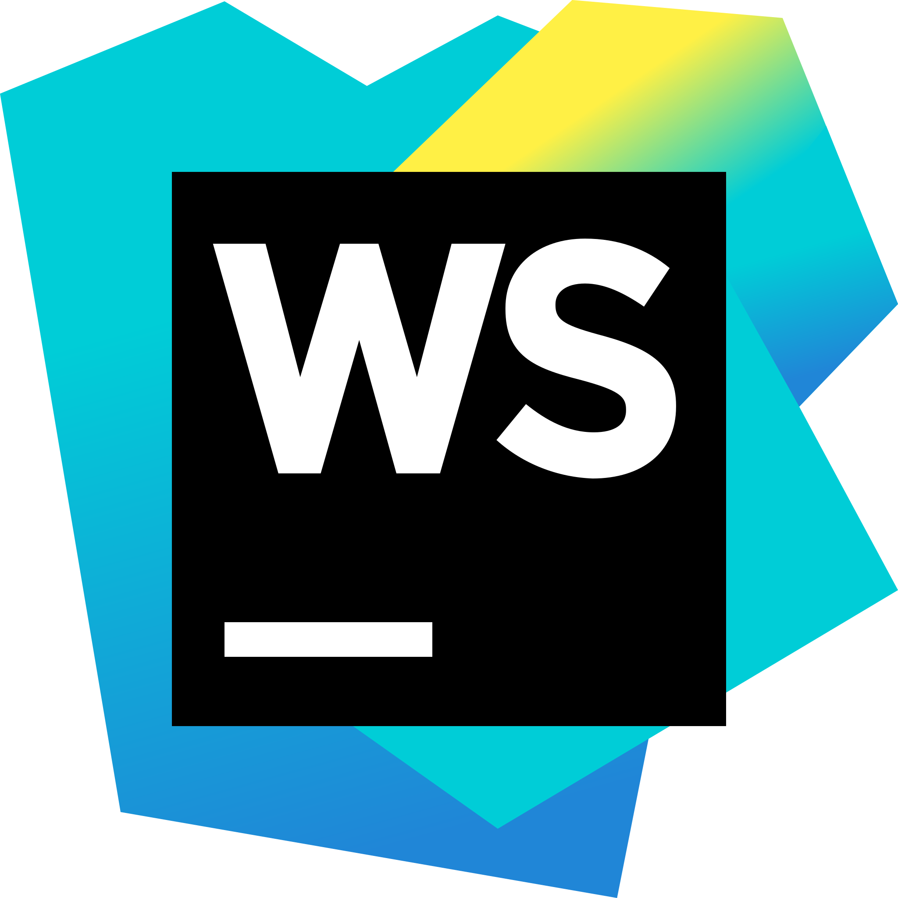
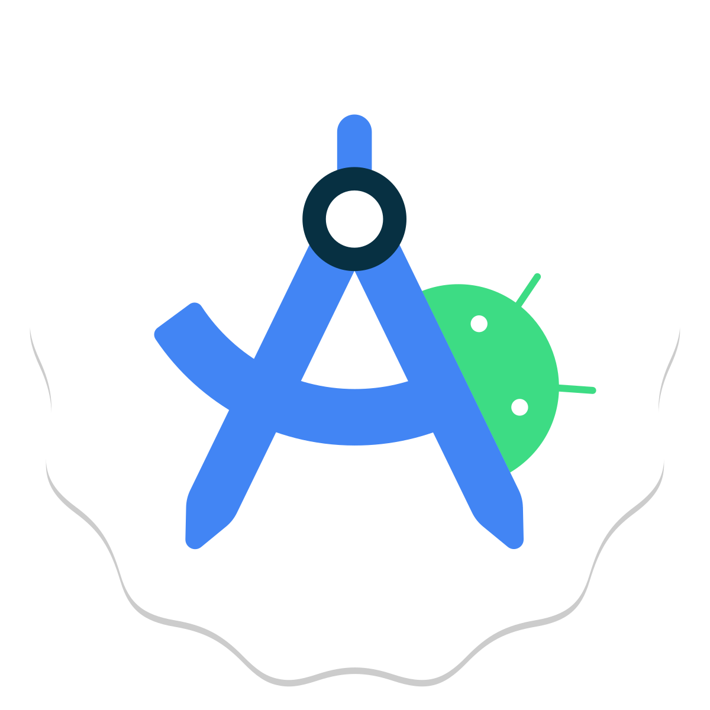

# COURSE PROJECT

---

<p align="center">
    <strong>Universidad Peruana de Ciencias Aplicadas (UPC)</strong><br>    
    </img><br>
    <strong>Carrera de Ingeniería de Software - Ciclo V</strong><br><br>
    <strong>DISEÑO - 4370</strong><br>
    <br><strong>Profesor: </strong><br>
    <br><strong>INFORME DEL TRABAJO FINAL</strong><br>
</p>

<p align="center">
    <strong>Startup del Proyecto:ClinicCode </strong><br>
    <strong>Producto:Dentify </strong><br>
</p>

<div>
    <h3 align="center">Team Members:</h3>
</div>

<div>
    <table align="center">
        <tr>
            <th style="text-align:center;">Member</th>
            <th style="text-align:center;">Code</th>
        </tr>
        <tr>
            <td>Aponte Cruzado, Andrea Marielena</td>
            <td>U202224135</td>
        </tr>
        <tr>
            <td>Belahonia Miranda, Fabrisio  </td>
            <td>U202220219</td>
        </tr>
        <tr>
            <td>Bohorquez Lerzundi	Gerardo Sebastian</td>
            <td>U202224149</td>
        </tr>
        <tr>
            <td>Cutiri Agüero	Fabrizio Alexander</td>
            <td>U201914181</td>
        </tr>
        <tr>
            <td>Berrocal Ramirez	Omar Christian</td>
            <td>U20201B529</td>
        </tr>
    </table>
    </div>

<p align="center">
<br><strong>2025-02</strong></p>
<br>

---

# Registro de Versiones del Informe

El objetivo de esta sección es resumir las modificaciones relevantes que se realizan al informe durante el ciclo de vida del proyecto. Esta sección inicia en una página nueva y se incluye un cuadro con la siguiente estructura:

| Versión | Fecha | Autor | Descripción de modificación |
|---------|-------|-------|-----------------------------|
| TB1 | 24/04/2025 | Belahonia Miranda, Fabrisio  | Realización de:<br>- Capítulo I: Presentación<br>- Capítulo II: Requirements Elicitation & Analysis<br>- Capítulo III: Requirements Specification<br>- Capítulo IV: Solution Software Design |

# Project Report Collaboration Insights
---

URL del repositorio para el reporte del proyecto:asdasdasd


TB1:

Para el desarrollo del informe perteneciente a la entrega TB1, se dividió la implementación de secciones de la siguiente forma para cada integrante del equipo:

| Integrante | Tareas Asignadas |
|------------|-----------------|
| Aponte Cruzado, Andrea Marielena | Analisis Competitivo y User Stories |
| Belahonia Miranda, Fabrisio | Entrevistas, Análisis de entrevistas y Needfinding, As to Be escenario, Elaboración de PPT |
| Bohorquez Lerzundi, Gerardo Sebastian | Lean UX, Entrevistas, Análisis de entrevistas y Needfinding, Impact Map |
| Cutiri Agüero, Fabrizio Alexander | Lean UX, User Stories, NeedFinding, Elaboración de PPT |
| Berrocal Ramirez, Omar Christian | Antecedentes y problemática, User and Technical Stories, Product Backlog, Capítulo IV: Solution Software Design, Elaboración de primera versión del BackEnd |

# GitHub Collaboration Insights

GitHub también presenta un timeline de las ramas principales y los procesos de merge a los que se han sometido. Todas las ramas se crearon tomando en cuenta el diseño de GitFlow para una buena organización cuando se usa un software de control de versiones.

Los integrantes son:

- Aponte Cruzado, Andrea Marielena
- Belahonia Miranda, Fabrisio
- Bohorquez Lerzundi, Gerardo Sebastian
- Cutiri Agüero, Fabrizio Alexander
- Berrocal Ramirez, Omar Christian

# Contenido
## Tabla de contenidos
- [**Registro de Versiones del Informe**](#registro-de-versiones-del-informe)
- [**Project Report Collaboration Insights**](#project-report-collaboration-insights)
- [**Contenido**](#contenido)
    - [Tabla de contenidos](#tabla-de-contenidos)
- [**Student Outcome**](#student-outcome)

- [**Capítulo I: Introducción**](#capítulo-i-introducción)
  - [**1.1. Startup Profile**](#11-startup-profile)
    - [**1.1.1. Descripción de la Startup**](#111-descripción-de-la-startup)
    - [**1.1.2. Perfiles de integrantes del equipo**](#112-perfiles-de-integrantes-del-equipo)
  - [**1.2. Solution Profile**](#12-solution-profile)
    - [**1.2.1 Antecedentes y problemática**](#121-antecedentes-y-problemática)
    - [**1.2.2 Lean UX Process**](#122-lean-ux-process)
      - [**1.2.2.1. Lean UX Problem Statements**](#1221-lean-ux-problem-statements)
      - [**1.2.2.2. Lean UX Assumptions**](#1222-lean-ux-assumptions)
      - [**1.2.2.3. Lean UX Hypothesis Statements**](#1223-lean-ux-hypothesis-statements)
      - [**1.2.2.4. Lean UX Canvas**](#1224-lean-ux-canvas)
  - [**1.3. Segmentos objetivo**](#13-segmentos-objetivo)

- [**Capítulo II: Requirements Elicitation & Analysis**](#capítulo-ii-requirements-elicitation--analysis)
  - [**2.1. Competidores**](#21-competidores)
    - [**2.1.1. Análisis competitivo**](#211-análisis-competitivo)
    - [**2.1.2. Estrategias y tácticas frente a competidores**](#212-estrategias-y-tácticas-frente-a-competidores)
  - [**2.2. Entrevistas**](#22-entrevistas)
    - [**2.2.1. Diseño de entrevistas**](#221-diseño-de-entrevistas)
    - [**2.2.2. Registro de entrevistas**](#222-registro-de-entrevistas)
    - [**2.2.3. Análisis de entrevistas**](#223-análisis-de-entrevistas)
  - [**2.3. Needfinding**](#23-needfinding)
    - [**2.3.1. User Personas**](#231-user-personas)
    - [**2.3.2. User Task Matrix**](#232-user-task-matrix)
    - [**2.3.3. User Journey Mapping**](#233-user-journey-mapping)
    - [**2.3.4. Empathy Mapping**](#234-empathy-mapping)
    - [**2.3.5. As-is Scenario Mapping**](#235-as-is-scenario-mapping)
  - [**2.4. Ubiquitous Language**](#24-ubiquitous-language)

- [**Capítulo III: Requirements Specification**](#capítulo-iii-requirements-specification)
  - [**3.1. To-Be Scenario Mapping**](#31-to-be-scenario-mapping)
  - [**3.2. User Stories**](#32-user-stories)
  - [**3.3. Product Backlog**](#33-product-backlog)
  - [**3.4. Impact Mapping**](#34-impact-mapping)
  - [Avance de Conclusiones, Bibliografía y Anexos](#avance-de-conclusiones-bibliografía-y-anexos)

- [**Capítulo IV: Product Design**](#capítulo-iv-product-design)
  - [**4.1. Style Guidelines**](#41-style-guidelines)
    - [**4.1.1. General Style Guidelines**](#411-general-style-guidelines)
    - [**4.1.2. Web Style Guidelines**](#412-web-style-guidelines)
    - [**4.1.3. Mobile Style Guidelines**](#413-mobile-style-guidelines)
      - [**4.1.3.1. iOS Mobile Style Guidelines**](#4131-ios-mobile-style-guidelines)
      - [**4.1.3.2. Android Mobile Style Guidelines**](#4132-android-mobile-style-guidelines)
  - [**4.2. Information Architecture**](#42-information-architecture)
    - [**4.2.1. Organization Systems**](#421-organization-systems)
    - [**4.2.2. Labeling Systems**](#422-labeling-systems)
    - [**4.2.3. SEO Tags and Meta Tags**](#423-seo-tags-and-meta-tags)
    - [**4.2.4. Searching Systems**](#424-searching-systems)
    - [**4.2.5. Navigation Systems**](#425-navigation-systems)
  - [**4.3. Landing Page UI Design**](#43-landing-page-ui-design)
    - [**4.3.1. Landing Page Wireframe**](#431-landing-page-wireframe)
    - [**4.3.2. Landing Page Mock-up**](#432-landing-page-mock-up)
  - [**4.4. Mobile Applications UX/UI Design**](#44-mobile-applications-uxui-design)
    - [**4.4.1. Mobile Applications Wireframes**](#441-mobile-applications-wireframes)
    - [**4.4.2. Mobile Applications Wireflow Diagrams**](#442-mobile-applications-wireflow-diagrams)
    - [**4.4.3. Mobile Applications Mock-ups**](#443-mobile-applications-mock-ups)
    - [**4.4.4. Mobile Applications User Flow Diagrams**](#444-mobile-applications-user-flow-diagrams)
  - [**4.5. Mobile Applications Prototyping**](#45-mobile-applications-prototyping)
    - [**4.5.1. Android Mobile Applications Prototyping**](#451-android-mobile-applications-prototyping)
    - [**4.5.2. iOS Mobile Applications Prototyping**](#452-ios-mobile-applications-prototyping)
  - [**4.6. Web Applications UX/UI Design**](#46-web-applications-uxui-design)
    - [**4.6.1. Web Applications Wireframes**](#461-web-applications-wireframes)
    - [**4.6.2. Web Applications Wireflow Diagrams**](#462-web-applications-wireflow-diagrams)
    - [**4.6.3. Web Applications Mock-ups**](#463-web-applications-mock-ups)
    - [**4.6.4. Web Applications User Flow Diagrams**](#464-web-applications-user-flow-diagrams)
  - [**4.7. Web Applications Prototyping**](#47-web-applications-prototyping)
  - [**4.8. Domain-Driven Software Architecture**](#48-domain-driven-software-architecture)
    - [**4.8.1. Software Architecture Context Diagram**](#481-software-architecture-context-diagram)
    - [**4.8.2. Software Architecture Container Diagrams**](#482-software-architecture-container-diagrams)
    - [**4.8.3. Software Architecture Components Diagrams**](#483-software-architecture-components-diagrams)
  - [**4.9. Software Object-Oriented Design**](#49-software-object-oriented-design)
    - [**4.9.1. Class Diagrams**](#491-class-diagrams)
    - [**4.9.2. Class Dictionary**](#492-class-dictionary)
  - [**4.10. Database Design**](#410-database-design)
    - [**4.10.1. Relational/Non-Relational Database Diagram**](#4101-relationalnon-relational-database-diagram)

- [**Capítulo V: Product Implementation**](#capítulo-v-product-implementation)
  - [**5.1. Software Configuration Management**](#51-software-configuration-management)
    - [**5.1.1. Software Development Environment Configuration**](#511-software-development-environment-configuration)
    - [**5.1.2. Source Code Management**](#512-source-code-management)
    - [**5.1.3. Source Code Style Guide & Conventions**](#513-source-code-style-guide--conventions)
    - [**5.1.4. Software Deployment Configuration**](#514-software-deployment-configuration)
  - [**5.2. Product Implementation & Deployment**](#52-product-implementation--deployment)
    - [**5.2.1. Sprint Backlogs**](#521-sprint-backlogs)
    - [**5.2.2. Implemented Landing Page Evidence**](#522-implemented-landing-page-evidence)
    - [**5.2.3. Implemented Frontend-Web Application Evidence**](#523-implemented-frontend-web-application-evidence)
    - [**5.2.4. Implemented Native-Mobile Application Evidence**](#524-implemented-native-mobile-application-evidence)
    - [**5.2.5. Implemented RESTful API and/or Serverless Backend Evidence**](#525-implemented-restful-api-andor-serverless-backend-evidence)
    - [**5.2.6. RESTful API documentation**](#526-restful-api-documentation)
    - [**5.2.7. Team Collaboration Insights**](#527-team-collaboration-insights)
  - [**5.3. Video About-the-Product**](#53-video-about-the-product)
  - [**Conclusiones**](#conclusiones)
  - [**Bibliografía**](#bibliografía)
  - [**Anexos**](#anexos)


    
# Student Outcome

| Criterio específico | Acciones realizadas | Conclusiones |
|----|----|----|
|Trabaja en equipo para proporcionar liderazgo en forma conjunta.| **Aponte Cruzado, Andrea Marielena**<br>**Belahonia Miranda, Fabrisio**<br>**Bohorquez Lerzundi, Gerardo Sebastian**<br>**Cutiri Agüero, Fabrizio Alexander**<br>**Berrocal Ramirez, Omar Christian**| |
|Crea un entorno colaborativo e inclusivo, establece metas, planifica tareas y cumple objetivos| **Aponte Cruzado, Andrea Marielena**<br>**Belahonia Miranda, Fabrisio**<br>**Bohorquez Lerzundi, Gerardo Sebastian**<br>**Cutiri Agüero, Fabrizio Alexander**<br>**Berrocal Ramirez, Omar Christian**| |

# Capítulo I: Introducción

## 1.1. Startup Profile

### 1.1.1. Descripción de la Startup

### 1.1.2. Perfiles de integrantes del equipo

## 1.2. Solution Profile

### 1.2.1. Antecedentes y problemática

### 1.2.2. Lean UX Process

#### 1.2.2.1. Lean UX Problem Statements

#### 1.2.2.2. Lean UX Assumptions

#### 1.2.2.3. Lean UX Hypothesis Statements

#### 1.2.2.4. Lean UX Canvas

## 1.3. Segmentos objetivo

# Capítulo II: Requirements Elicitation & Analysis

## 2.1. Competidores

### 2.1.1. Análisis competitivo

### 2.1.2. Estrategias y tácticas frente a competidores

## 2.2. Entrevistas

### 2.2.1. Diseño de entrevistas

### 2.2.2. Registro de entrevistas

### 2.2.3. Análisis de entrevistas

## 2.3. Needfinding

### 2.3.1. User Personas

### 2.3.2. User Task Matrix

### 2.3.3. User Journey Mapping

### 2.3.4. Empathy Mapping

### 2.3.5. As-is Scenario Mapping

## 2.4. Ubiquitous Language

# Capítulo III: Requirements Specification

## 3.1. To-Be Scenario Mapping

## 3.2. User Stories

## 3.3. Product Backlog

## 3.4. Impact Mapping

# Capítulo IV: Product Design

## 4.1. Style Guidelines

### 4.1.1. General Style Guidelines

### 4.1.2. Web Style Guidelines

### 4.1.3. Mobile Style Guidelines

#### 4.1.3.1. iOS Mobile Style Guidelines

#### 4.1.3.2. Android Mobile Style Guidelines

## 4.2. Information Architecture

### 4.2.1. Organization Systems

### 4.2.2. Labeling Systems

### 4.2.3. SEO Tags and Meta Tags

### 4.2.4. Searching Systems

### 4.2.5. Navigation Systems

## 4.3. Landing Page UI Design

### 4.3.1. Landing Page Wireframe

### 4.3.2. Landing Page Mock-up

## 4.4. Mobile Applications UX/UI Design

### 4.4.1. Mobile Applications Wireframes

### 4.4.2. Mobile Applications Wireflow Diagrams

### 4.4.3. Mobile Applications Mock-ups

### 4.4.4. Mobile Applications User Flow Diagrams

## 4.5. Mobile Applications Prototyping

### 4.5.1. Android Mobile Applications Prototyping

### 4.5.2. iOS Mobile Applications Prototyping

## 4.6. Web Applications UX/UI Design

### 4.6.1. Web Applications Wireframes

### 4.6.2. Web Applications Wireflow Diagrams

### 4.6.3. Web Applications Mock-ups

### 4.6.4. Web Applications User Flow Diagrams

## 4.7. Web Applications Prototyping

## 4.8. Domain-Driven Software Architecture

### 4.8.1. Software Architecture Context Diagram

### 4.8.2. Software Architecture Container Diagrams

### 4.8.3. Software Architecture Components Diagrams

## 4.9. Software Object-Oriented Design

### 4.9.1. Class Diagrams

### 4.9.2. Class Dictionary

## 4.10. Database Design

### 4.10.1. Relational/Non-Relational Database Diagram

# Capítulo V: Product Implementation

## 5.1. Software Configuration Management

Con el fin de garantizar la consistencia, trazabilidad y calidad a lo largo del ciclo de vida de Dentify, en todos sus productos software, el equipo ha definido un conjunto de decisiones y convenciones orientadas a la gestión de configuraciones. Esta sección describe los mecanismos adoptados para controlar el código fuente, configurar los entornos de desarrollo y definir el proceso de despliegue de la aplicación web.

Estas prácticas permiten asegurar que las versiones del software se mantengan estables, que el trabajo colaborativo sea eficiente y que las implementaciones sean controladas y reproducibles.

### 5.1.1. Software Development Environment Configuration

Para asegurar una colaboración eficiente y mantener la calidad en el desarrollo de Eventify, se ha definido un entorno de desarrollo común para todos los miembros del equipo. A continuación, se listan los productos de software utilizados en las distintas etapas del ciclo de vida del producto digital, indicando su propósito y su enlace de referencia o descarga correspondiente.

**Requirements Management:**

**UxPressia:** Utilizamos esta herramienta para elaborar los distintos artefactos de Needfinding como son el User persona, Journey Map, Empathy Map e Impact Maps. 

Referencia: [https://uxpressia.com](https://uxpressia.com)


**Miro:** Esta plataforma en línea nos ayudó a desarrollar los cuadros de As-Is y To-Be Scenary Map 

Referencia: [https://miro.com/es/](https://miro.com/es/)


**Product UX/UI Design**

**Figma:** Se empleó para la creación de wireframes, mock-ups y prototipos de la aplicación web.

Referencia: [https://www.figma.com/es-es/](https://www.figma.com/es-es/)


**Software Development**

**WebStorm:** (Instalación local): Utilizado como entorno de desarrollo para trabajar con HTML, CSS y JavaScript. 

Referencia: [https://www.jetbrains.com/es-es/webstorm/](https://www.jetbrains.com/es-es/webstorm/)



**IntelliJ:** Este es un IDE de Jetbrains para desarrollar aplicaciones con Java. Para este proyecto lo utilizamos para desarrollar el backend de la aplicación

Referencia: [https://www.jetbrains.com/idea](https://www.jetbrains.com/idea)


**Android Studio:** Es un IDE oficial para el desarrollo de aplicaciones Android. Dicho software es gratuito y está basado en IntelliJ IDEA. Esta herramienta nos permite desarrollar la aplicación móvil planteada.

Referencia: [https://developer.android.com](https://developer.android.com)



**Visual Studio Code:** Este es un editor de código usado para desarrollo de software, ya sea con HTML, CSS y Javascript, asi como con frameworks (Vue, Angular, React, etc.)

Referencia: [https://code.visualstudio.com](https://code.visualstudio.com)


**Project Management and Collaboration**

En la gestión de proyectos y colaboración del equipo se utilizaron:

**Jira:** Esta es una plataforma especializada en la gestión de proyecto, la cual utilizamos para asignar tareas a realizar por cada integrante del equipo. 

Referencia: [https://www.atlassian.com/es/software/jira](https://www.atlassian.com/es/software/jira)


**GitHub:** Plataforma de repositorio remoto para la gestión de versiones del código, implementando el flujo GitFlow para garantizar un desarrollo organizado.

Referencia: [https://github.com/](https://github.com/)


**Git (Instalación local):** Empleado para gestionar los cambios de código de manera local mediante commits y ramas.

Referencia: [https://git-scm.com/](https://git-scm.com/)


**Software Documentation**

**GitHub:** Esta plataforma tambien fue utilizada para el desarrollo del informe mediante archivos MarkDown(.md) 

Referencia: [https://github.com/](https://github.com/)


**Vertabelo:** Herramienta utilizada para el diseño, creación y documentación colaborativa de bases de datos. 

Referencia: [https://vertabelo.com/](https://vertabelo.com/)


**Structurizr:** Herramienta usada para modelar la arquitectura de software mediante diagramas C4.

Referencia: [https://structurizr.com/](https://structurizr.com/)


**Software Deployment**

**Firebase:** Esta es una plataforma de Google para desarrollo de aplicaciones. Para este caso lo utilizamos para desplegar la aplicación móvil

Referencia: [https://firebase.google.com/?hl=es-419](https://firebase.google.com/?hl=es-419)


**Azure:** Este es un servicio en la nube de Microsoft, el cual usamos para desplegar el backend junto con la documentación en Swagger 

Referencia: [https://azure.microsoft.com/es-es](https://azure.microsoft.com/es-es)


**GithubPages:** Esta es una herramienta de GitHub para alojar sitios web estáticos. Lo utilizamos para desplegar el landing page. 

Referencia: [https://docs.github.com/es/pages](https://docs.github.com/es/pages)


### 5.1.2. Source Code Management

La gestión del código fuente es una parte fundamental en el desarrollo colaborativo de software, ya que permite un control eficiente sobre las modificaciones realizadas en el proyecto a lo largo de su ciclo de vida. En esta sección, se describe el sistema de control de versiones implementado en el proyecto Dentify, utilizando GitHub como plataforma principal. Además, se detallan las convenciones de trabajo adoptadas por el equipo, como el modelo GitFlow, el versionado semántico (Semantic Versioning) y las convenciones de commit mediante Conventional Commits. Estas prácticas aseguran un desarrollo ordenado y una integración continua efectiva entre los miembros del equipo.

**URL de los Repositorios:**
- Organización: [https://github.com/ClinicCode](https://github.com/ClinicCode)
- Reporte: [https://github.com/ClinicCode/Informe](https://github.com/ClinicCode/Informe)
- Landing Page: [https://github.com/ClinicCode/dentify-landing-page](https://github.com/ClinicCode/dentify-landing-page)
- FrontEnd: [https://github.com/ClinicCode/dentify-app-web](https://github.com/ClinicCode/dentify-app-web)
- Backend: [https://github.com/ClinicCode/dentify-backend](https://github.com/ClinicCode/dentify-backend)
- Mobile App: [https://github.com/ClinicCode/dentify-app-mobile](https://github.com/ClinicCode/dentify-app-mobile)

**Estructura de Ramas:**

Para mantener un flujo organizado en el desarrollo y facilitar la colaboración, se ha implementado el modelo GitFlow, creando las siguientes ramas:

- Master Branch: Rama principal (main) que contiene las versiones estables del proyecto. Todas las demás ramas derivan de esta.
- Develop: Rama secundaria donde se integran todas las características nuevas antes de fusionarse a la rama main.
- Feature Branches: Se crean a partir de develop para trabajar en nuevas funcionalidades específicas
- Release Branches: Se crean desde develop para preparar una nueva versión.
- Hotfix Branches: Se crean desde main para solucionar errores críticos detectados en producción.

**Convenciones de commits:**

Para la escritura de commits, se sigue la convención 'Conventional Commits', el cual cuenta con un formato estándar para facilitar la lectura y entendimiento del historial de cambios dentro del proyecto.
```
    <type>[optional scope]: <description>
    
    [optional body]
    
    [optional footer(s)]
```
- Type:
  - feat: Añadir una nueva característica.
  - fix: Correción de errores.
  - docs: Modificaciones en la documentación.
  - style: Cambios que no afectan la lógica del código.
  - refactor: Modificaciones que no añaden características y/o errores.
  - test: Adición/Modificación de pruebas.


- Scope: Brinda información extra acerca del área del código afectado.
```
   feat(auth): add register functionality.
```
**Ejemplos básicos de commits:**
```
   feat(login): add organizer authentication module.
```
```
   fix(payment): resolve payment security issue.
```
```
   docs(README): update index instructions.
```

### 5.1.3. Source Code Style Guide & Conventions

Para el desarrollo de Dentify se emplearon distintos lenguajes y frameworks, aplicando convenciones de codificación y buenas prácticas en cada caso:

**HTML**

En la implementación de HTML se siguieron las Convenciones de Codificación correspondientes. Los aspectos más relevantes fueron:

Uso de etiquetas semánticas: Se incorporaron elementos como header, nav, main y footer para mejorar tanto la accesibilidad como la interpretación del documento.

Indentación y consistencia: Aunque HTML admite mayúsculas y minúsculas en elementos y atributos, se optó exclusivamente por el uso de minúsculas con la convención kebab-case, priorizando la legibilidad y el orden.

**CSS**

El código CSS se desarrolló bajo la convención BEM y lineamientos de estilo para mantener claridad y organización. Algunos puntos destacados:

* Clases descriptivas y en inglés, siempre en formato kebab-case, lo que facilita su comprensión.

* Transiciones en botones, añadiendo efectos suaves que enriquecen la experiencia del usuario.

* Fuentes personalizadas, integradas mediante @font-face siguiendo las recomendaciones para la gestión tipográfica en CSS.

**JavaScript**

Para la interactividad y los componentes dinámicos de la interfaz se utilizó Bootstrap, incluyendo únicamente sus archivos oficiales. Esto permitió aprovechar sus funcionalidades avanzadas sin necesidad de programar desde cero.

**Bootstrap**

En el uso de Bootstrap se respetaron las buenas prácticas, empleando clases predefinidas para garantizar un diseño responsive. Además, se realizaron personalizaciones sin modificar directamente el código base, asegurando compatibilidad y facilidad de actualización.

**Java (Spring Boot)**

En la construcción de la API Restful se siguió la convención Google Java Style Guide.

**Nomenclatura:** Se aplicó PascalCase en clases y métodos, y lowerCamelCase en atributos.

**Estructura del proyecto:** Se adoptaron los principios de Clean Architecture y Domain Driven Design, organizando el sistema por Bounded Contexts y capas (Aplicación, Infraestructura, Dominio e Interfaces).

**Kotlin (Android Studio)**

Para la aplicación móvil se empleó la guía de estilo oficial de Kotlin (Google Kotlin Style Guide).

**Nomenclatura:** Clases y métodos en PascalCase, atributos en lowerCamelCase.

**Arquitectura:** Se aplicaron Clean Architecture y Domain Driven Design, estructurando el proyecto en Repositorios, UI, Casos de Uso y Dominios.

### 5.1.4. Software Deployment Configuration

## 5.2. Product Implementation & Deployment

### 5.2.1. Sprint Backlogs

### 5.2.2. Implemented Landing Page Evidence

### 5.2.3. Implemented Frontend-Web Application Evidence

### 5.2.4. Implemented Native-Mobile Application Evidence

### 5.2.5. Implemented RESTful API and/or Serverless Backend Evidence

### 5.2.6. RESTful API documentation

### 5.2.7. Team Collaboration Insights

## 5.3. Video About-the-Product

# Conclusiones

# Bibliografía

# Anexos

| Sección                    | Caracteristicas del video                                                                                                                                          | Enlace                     |
|----------------------------|--------------------------------------------------------------------------------------------------------------------------------------------------------------------|----------------------------|
| **Needfinding Interviews** | **Cantidad de videos:** 1 <br> **Nomenclatura:** <br> upc-pre-202520-1asi0732-14651-ClinicCode-needfinding-sprint-1 <br> **Formato:** mp4 <br> **Duración:** 34:28 | https://shorturl.at/P0n32  |